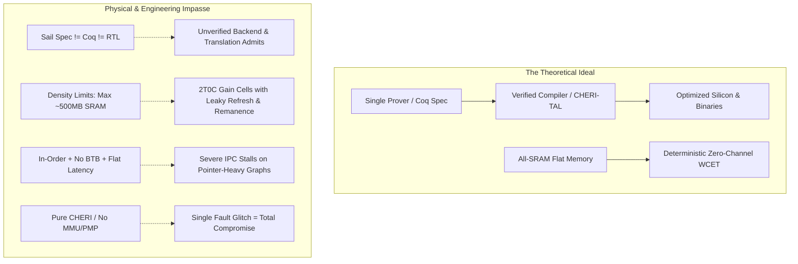

# Comprehensive Critique of VerifiedOS: Architectural Tensions, Implementation Impasses, and Unknown-Unknowns

---

## 1. Executive Summary: The Pure-Assurance Paradox

[README.md](README.md) and [docs/spec.md](docs/spec.md) define VerifiedOS around an uncompromising thesis: **engineering effort is treated as free, trust is the scarce resource, and performance and compatibility are subordinated to mathematical proof**. 

To eliminate entire classes of vulnerabilities by construction, the architecture systematically excises conventional computing primitives:
- Virtual memory, MMUs, page tables, TLBs, and ASIDs.
- Privilege rings (Supervisor/User modes) and PMP/IOMMU hardware.
- Dynamic hardware caches, cache-coherence protocols, and hardware prefetchers.
- Speculative execution, out-of-order pipelines, dynamic branch predictors, and return address stacks.
- Asynchronous hardware interrupts, priority-based schedulers, and preemption.
- Dynamic heap allocators and runtime garbage collection.
- POSIX APIs, ELF dynamic linking, and ambient capability namespaces.

In their place, VerifiedOS introduces pure 64+1-bit CHERI capability enforcement, static time-division multiplexing (cyclic executive), flat two-tier on-die memory, and proof-carrying typed assembly (CHERI-TAL).

As documented in the repository's internal gap ledger in [docs/critique.md](docs/critique.md), the system's assurance argument rests on a foundational paradox:
**Every classical defense-in-depth hedge has been deleted on the premise of a formally verified primary, yet virtually none of the primary specifications or proofs exist.**

The inventory in [docs/crown-jewels.md](docs/crown-jewels.md) defines over two dozen crown-jewel specifications; only two are authored. Ten theorem targets are scheduled; none have started because their formal premises do not yet exist. The system currently exists as an immaculate, self-consistent mathematical blueprint whose real-world physical and software execution faces profound structural tensions.



---

## 2. Deconstructing the Core Dislikes

### 2.1 The Two-Tier Memory Hierarchy vs. The Physical Density Wall

```
┌────────────────────────────────────────────────────────────────────────┐
│                        VerifiedOS On-Die Memory                        │
├───────────────────────────────────┬────────────────────────────────────┤
│       Fast SRAM Tier (6T/8T)      │      Dense Gain-Cell Tier (2T0C)   │
│   • Single-cycle, deterministic   │   • ~3-5× SRAM density             │
│   • Working sets, stacks, TCB     │   • Bulk buffers, LLM weights      │
│   • Zero refresh, zero disturb    │   • Destructive reads / refresh    │
│   • Low density (~0.02 µm²/bit)   │   • Unproven at Gbit macro scale   │
└───────────────────────────────────┴────────────────────────────────────┘
```

#### The Aesthetic Ideal vs. Physical Lithography Limits
A single-tier, all-SRAM memory hierarchy composed of high-transistor-count cells (such as 8T or 10T dual-port SRAM with separated read/write bitlines) is the theoretical optimum for formal verification:
- Access latency is strictly uniform and deterministic ($1\text{–}2\text{ cycles}$).
- Destructive reads, refresh cycles, row-hammer disturbances, and background scrub controllers are eliminated.
- Microarchitectural timing side-channels disappear because access time is completely decoupled from access history.

However, semiconductor physics imposes an intractable density wall:
- In leading-edge lithography ($3\text{nm}/2\text{nm}$ nodes), a high-density 6T SRAM bitcell measures $\sim 0.021\ \mu\text{m}^2$. A high-reliability 8T/10T dual-port cell consumes $0.035\text{–}0.045\ \mu\text{m}^2$.
- Dedicating $200\ \text{mm}^2$ of a massive $300\ \text{mm}^2$ reticle-limit monolithic die exclusively to 8T SRAM yields at most $\sim 500\text{–}700\ \text{MB}$ of raw storage (before subtracting the $\sim 8\text{–}12\%$ overhead for DECTED capability tags, parity, and ECC).
- Modern practical workloads (specifically quantized local Large Language Models, e.g., a 4-bit 8B parameter model requiring $4.5\text{–}6\ \text{GB}$ for weights and KV context cache) are mathematically impossible to fit into an all-SRAM on-die budget.

#### The Gain-Cell Compromise and Its Latent Failures
To circumvent off-die DRAM without forfeiting bulk capacity, [docs/spec.md](docs/spec.md#r-15-247) adopts a two-tier on-die architecture: fast SRAM alongside high-density BEOL oxide-channel (2T0C or 3T1C) gain cells. While structurally motivated in [docs/architectural-alternatives.md](docs/architectural-alternatives.md), this hybrid introduces critical vulnerabilities:

1. **The Recurring Power/EM Side-Channel**: Gain cells store charge dynamically on parasitic gate capacitance and must undergo continuous periodic refresh sweeps. As documented in [docs/critique.md](docs/critique.md), this periodic whole-array read-and-rewrite emits a recurring, full-memory Hamming-weight signature across the power rails and near-field EM spectrum, enabling passive cryptographic key and plaintext leakage without requiring the adversary to execute any instructions.
2. **Cold-Boot Plaintext Remanence**: Oxide-channel FETs exhibit near-zero subthreshold leakage at room temperature. Consequently, unpowered gain cells retain state for hours, directly breaking the architectural premise that on-die volatile storage requires no memory encryption or cryptographic wipe-on-shutdown.
3. **Severe Manufacturing and Feasibility Risk**: Gigabit-scale 2T0C gain-cell macros with integrated row repair, DECTED capability-tag planes, and per-access load filters do not exist in commercial silicon foundries. The largest published academic demonstration chips remain small kilobit-scale test arrays.

---

### 2.2 The Golden Model & The Production Binary/Silicon Impasse

```
┌─────────────────┐       Extracts to       ┌────────────────────────┐
│  Sail / Coq /   │ ──────────────────────> │  Emulators / Coq ASTs  │
│  Rocq Spec     │                         │ (Non-performant / Host)│
└─────────────────┘                         └────────────────────────┘
         │                                               │
         │ Semantic Gap / Semantic Lowering              │ Translation
         │ (Manual translation / Unverified toolchain)   │ Validation
         ▼                                               ▼
┌─────────────────┐      CompCert / CHERI   ┌────────────────────────┐
│ Hand-Tuned RTL  │ <---------------------- │ Optimized Bare-Metal   │
│ (SystemVerilog) │     (Unproved Admits)   │ Binaries (RV64+CHERI)  │
└─────────────────┘                         └────────────────────────┘
```

#### The Gap Between Machine-Checked Models and Bare-Metal Execution
No existing programming or verification language simultaneously functions as a machine-checked mathematical specification, an interactive theorem proving environment, an optimizing compiler IR, and a high-frequency hardware description language:
- **Sail**: Compiles effectively to C and OCaml for architectural simulators and golden reference models, but cannot directly emit pipelined, cycle-accurate SystemVerilog without producing un-pipelined, combinational netlists with poor timing closure.
- **Kami / Kôika**: Provide formal hardware refinement within Coq/Rocq, but their rule-scheduling synthesis engines introduce severe area and clock-frequency degradation ($2\times\text{–}3\times$) compared to industrial, hand-crafted RTL.
- **Proof-Carrying Code (FPCC) & CompCert**: Formally verified compilers achieve mathematical proof of semantic preservation by omitting aggressive, complex optimization passes (such as polyhedral loop transformations, auto-vectorization, and cross-block instruction scheduling). Furthermore, the CHERI-CompCert backend remains a prototype with unproved `admit` clauses and placeholder instruction emissions.

Consequently, production binaries and synthesizable silicon cannot be directly generated from the high-level formal specification; they depend on intermediate unverified lowering passes, translation validators, and commercial formal equivalence tools (FEV).

---

### 2.3 The "Bespoke Island" Syndrome: Rejection of Standards

```
Standard Software World                    VerifiedOS Clean-Slate
┌────────────────────────────────┐         ┌────────────────────────────────┐
│ POSIX / libc / C++20 / Rust-std│         │ CHERI-TAL Type Derivations     │
│ ELF Dynamic Linker / dlopen    │  <---X  │ Static Manifest Wiring Table   │
│ MMU Page Tables / Virtual Mem  │         │ Single Flat Physical Address   │
│ PCIe / NVMe / AXI4 / TileLink  │         │ Bespoke SPSC Hardware Rings    │
│ Standard OpenSSL / mbedTLS     │         │ Narcissus Verified Decoders    │
└────────────────────────────────┘         └────────────────────────────────┘
```

By discarding POSIX interfaces, the System V ABI, ELF dynamic loading, standard AXI/TileLink buses, and standard C/C++ runtimes, VerifiedOS achieves internal purity at the cost of complete isolation:
- **Exorbitant Re-Authoring Cost**: Every software component (from basic string manipulation and tensor kernels to network protocols and device drivers) must be written in or compiled to CHERI-TAL with custom Narcissus parsers and pre-allocated SPSC communication rings.
- **Ecosystem Incompatibility**: Mainstream high-performance software libraries (e.g., OpenBLAS, PyTorch/GGML runtimes, SQLite, embedded WebAssembly runtimes) cannot be ported without completely redesigning their memory allocation, I/O dispatch, and threading architectures.

---

## 3. Unknown-Unknowns: Hidden Sub-optimalities, Inefficiencies, and Insecurities

### 3.1 The 64+1-bit CHERI Representability Mantissa Tax: Outward Rounding & Spatial Leaks

To maintain a 64-bit merged register file over a 36-bit physical address space, [docs/isa-profile.md](docs/isa-profile.md#41-the-capability-format) compresses capabilities into **64 data bits + 1 tag bit**:

```
                  VerifiedOS 64+1-bit Capability Format
┌─────┬───────────┬─────────────┬──────────┬──────────────┬──────────────┬───────────────────────────────┐
│ Tag │ ObjectType│ Permissions │ Exponent │ BaseMantissa │ TopMantissa  │   Uncompressed Address Bits   │
│1 bit│  (4 bits) │   (5 bits)  │ (5 bits) │   (8 bits)   │   (6 bits)   │           (36 bits)           │
└─────┴───────────┴─────────────┴──────────┴──────────────┴──────────────┴───────────────────────────────┘
```

#### The Representability Trade-off
Because the base mantissa is constrained to 8 bits and the top mantissa to 6 bits:
- **Byte-Exact Bound Limits**: Capability bounds are byte-exact **only for objects $\le 128\text{ bytes}$**.
- **Outward Rounding for Larger Objects**: For any buffer or object exceeding 128 bytes, bounds calculation floating against the 5-bit exponent must be rounded outward by up to $2^{-6}$ ($1/64^{\text{th}}$) of the object's length on each boundary.
- **The Padding Dilemma**:
  - If a $64\text{ KB}$ buffer is allocated, outward rounding expands the representable top bound by up to $1\text{ KB}$ beyond the intended sub-object boundary.
  - To prevent spatial capability leaks into neighboring secrets, the compiler and static memory planner must insert significant **alignment and representability padding** ($15\%\text{–}30\%$ across fine-grained sub-objects).
  - This padding bloat directly consumes the scarce, highly constrained on-die SRAM capacity.

---

### 3.2 The Static Allocation Fallacy: "Zero Waste" Induces Structural Waste (Fragmentation by Another Name)

[docs/spec.md](docs/spec.md) claims that eliminating dynamic runtime allocation guarantees zero wasted memory:

$$\text{Total Memory} = \sum_{i} \text{PeakStack}(C_i) + \sum_{j} \text{StaticBuffer}(B_j)$$

While this completely prevents runtime heap fragmentation and runtime out-of-memory (OOM) faults, it induces severe **structural over-allocation and physical memory stranding**:

```
Virtual Memory (Fungible Global Free Pool / "Slush Fund")
┌────────────────────────────────────────────────────────────────────────┐
│ [Comp A: 4MB] [Comp B: 2MB] [     Global Shared Free Pool: 58MB      ] │
│ • Unused capacity is fluid; dynamically backs whichever task surges.   │
└────────────────────────────────────────────────────────────────────────┘

VerifiedOS Static Partitioning (Inelastic Reservations / Stranded Memory)
┌────────────────────┬────────────────────┬──────────────────────────────┐
│ Compartment A (16M)│ Compartment B (16M)│ Compartment C (32M)          │
│ [4MB Use | 12MB IDLE] [2MB Use | 14MB IDLE] [8MB Use | 24MB IDLE]          │
│ • 50MB sits completely idle, but cannot be pooled or lent to peers.    │
│ • If Compartment A needs 17MB, it FAILS CLOSED despite 50MB free RAM.  │
└────────────────────┴────────────────────┴──────────────────────────────┘
```

1. **Peak-Worst-Case Over-Provisioning**: Workloads exhibit modal, bursty memory profiles. A network processing compartment that requires a $32\ \text{MB}$ decompression buffer once every $10\text{ minutes}$ must hold that $32\ \text{MB}$ permanently locked in fast memory. Across 50 compartments, the average memory utilization ($\text{Memory}_{\text{used}} / \text{Memory}_{\text{allocated}}$) often drops below $10\text{–}15\%$.
2. **Compartment Memory Stranding (Fragmentation by Another Name)**: In traditional architectures with virtual memory and demand paging, all unallocated physical pages form a fungible, system-wide "slush fund." Memory unused by idle compartments automatically remains available in a shared pool to back whichever workload experiences a surge in demand. Under VerifiedOS's static physical partitioning, physical address space is rigidly carved into non-fungible, isolated reservations at composition time. Unused memory inside one compartment cannot be recycled, borrowed, or coalesced by another. Even if $80\%$ of total on-die memory sits completely unwritten, an active compartment that exhausts its static allocation will crash or fail closed, unable to claim a single byte of neighboring idle capacity. By abolishing dynamic heap allocation to eliminate internal fragmentation, VerifiedOS merely exchanges it for an un-compactable, system-wide macro-fragmentation.
3. **Combinatorial Allocation Sclerosis**: Modifying a single buffer size or patching one compartment requires re-solving an NP-hard global bin-packing and multi-bank layout problem across both memory tiers, necessitating a complete firmware rebuild, re-signing, and re-certification.

#### Historical Precedent: The Transputer and Occam Parallel
The structural tension between formal static predictability and physical memory utilization has a direct historical precedent: the INMOS Transputer and its native language Occam (analyzed in [docs/inspirations.md](docs/inspirations.md#occam-and-the-transputer-and-xmos-xcore-static-channels-in-silicon-and-the-boundary-every-rendezvous-machine-stops-at)):

- **The "Ideal" Static Model**: Occam eliminated dynamic heap allocation (`malloc`), recursion, and pointers, forcing all process workspaces and channel buffers to be bounded and fixed at compile time. Under pure Occam, runtime external fragmentation was mathematically $0\%$, but at the cost of extreme software rigidity and peak-case over-provisioning.
- **The Compaction Impasse**: Transputer tasks were bound to hardware workspace pointers in microcode queues, preventing dynamic runtime compaction. Similarly, VerifiedOS binds physical addresses directly into 64+1-bit CHERI capabilities without an MMU page-table indirection layer, making dynamic relocation or defragmentation impossible without halting partitions and sweeping/re-authenticating all capabilities.
- **The "Helios" Dilemma in Modern Porting**: When mainstream languages (C, Fortran) and operating systems (Helios) were ported to the Transputer, they reintroduced dynamic heaps onto flat physical memory, resulting in severe "Swiss-cheese" physical fragmentation. When VerifiedOS ports real-world software libraries ([docs/userspace-porting.md](docs/userspace-porting.md)), workloads requiring variable context must either be completely rewritten to worst-case static bounds or face unrecoverable fail-closed crashes when local partition arenas exhaust their pre-allocated bounds.

---

### 3.3 Single-Point-of-Failure Fragility: The Loss of Defense-in-Depth

By deleting virtual memory, MMUs, PMPs, and privilege rings ([docs/absence-contract.md](docs/absence-contract.md)), VerifiedOS concentrates **100% of its security enforcement into CHERI capability tags and hardware bounds checks**.

```
Standard System (Defense in Depth)         VerifiedOS (Single Point of Failure)
┌───────────────────────────────────┐      ┌───────────────────────────────────┐
│ User/Supervisor Privilege Rings   │      │                                   │
├───────────────────────────────────┤      │                                   │
│ MMU Page Table Permissions (R/W/X)│      │  CHERI Capability Tag & Bounds    │
├───────────────────────────────────┤      │  (Sole hardware arbiter)          │
│ PMP Physical Memory Protection    │      │                                   │
├───────────────────────────────────┤      │                                   │
│ CHERI Capability Checks           │      │                                   │
└───────────────────────────────────┘      └───────────────────────────────────┘
```

- If a physical fault (e.g., clock/voltage glitching, targeted laser fault injection, or an undetected synthesis bug in the ALU bounds comparator) alters a single capability register's bounds or sets an invalid tag bit, **the attacker immediately gains unrestricted, raw read/write authority across the entire physical address space**.
- Without an independent MMU or PMP backstop, an initial hardware-level breach cannot be contained within an address translation boundary.

---

### 3.4 In-Order Pipeline Performance Collapse on Pointer-Heavy Graphs

The design rejects out-of-order execution, branch prediction tables (BTB/BHT), and return address stacks (RAS) in [docs/isa-profile.md](docs/isa-profile.md) to eliminate transient-execution side channels (Spectre, Meltdown, MDS).

```
Cycle:      0     1     2     3     4     5     6     7
Load:    [ LDR Cap ] ──> (SRAM 3-cycle latency)
Dependent:             [ STALL ] [ STALL ] [ STALL ] [ USE Cap ]
Branch:                                              [ BEQ (Static Pred) ] ──> [ BUBBLE ]
```

1. **Dependent Pointer-Chasing Latency**: Even in a flat SRAM architecture, load-to-use latency spans $2\text{–}4\text{ cycles}$. In modern software dominated by pointer traversals (e.g., vtables, closure contexts, hash tables, capability table indirection), back-to-back dependent loads repeatedly stall the in-order pipeline.
2. **Static Branch Penalty**: Without dynamic branch prediction and return-address stacks, conditional branches and indirect calls (sentry invocations) incur frequent pipeline flushes and pipeline bubbles.
3. **Severe IPC Degradation**: Real-world compiled instruction streams running on an in-order, non-speculative scalar pipeline typically achieve an IPC (Instructions Per Cycle) of only $0.25\text{–}0.50$, nullifying the clock-frequency advantages of flat memory.

---

### 3.5 The Static Cyclic Executive & Polled I/O Latency Inversion

VerifiedOS eliminates all asynchronous hardware interrupts (except the slot timer). Peripheral events (MSIs) are latched into memory-mapped pending bits and polled only when the owning compartment's static slot arrives ([docs/spec.md](docs/spec.md#r-07-042)).

```
Event Arrives                Slot Timer Fires             Owning Slot Begins
     │                              │                             │
     ▼                              ▼                             ▼
─────●──────────────────────────────┼─────────────────────────────●────────────► Time
     └── Latched in Pending Bit ───►│ (Other compartments run)   │ (Polls MSI)
     ◄────────────── Worst-Case Latency = Major Frame (10-50ms) ──────────────►
```

- **High-Speed Bursty I/O Stalls**: High-throughput peripherals (e.g., 10GbE network interfaces, PCIe/NVMe SSD controllers) cannot signal immediate attention. A packet burst arriving just after a compartment's slot closes must wait for the entire major frame ($10\text{–}50\text{ ms}$) before being serviced.
- **Buffer Bloat or Idle Polling**: To avoid hardware ring overflow during bursty arrivals, either SPSC ring buffers must be massively oversized (consuming on-die SRAM), or the scheduler must allocate frequent, short polling slots, causing cores to spin in useless polling loops and wasting battery power.

---

### 3.6 The Vector/Matrix Eager-Zeroize Tax on Context Switches

In [docs/spec.md](docs/spec.md#r-07-014), the multikernel rejects lazy context switching of vector/matrix state to eliminate timing channels and state-restoration proof complexity. On every partition switch between domains, the kernel executes `vmclear` to eagerly zeroize the entire vector register file ($4\text{ KB}\text{--}16\text{ KB}$) and matrix scratchpad.

- **Bandwidth & Energy Depletion**: If tasks are scheduled in fine-grained cyclic executive slots (e.g., $100\ \mu\text{s}$ or $1\text{ ms}$ slots for real-time audio/sensor/network processing), zeroizing $16\text{ KB}$ of state on *every single slot boundary* burns substantial on-die memory bandwidth and dynamic energy purely on redundant zero-fills.

---

### 3.7 Thermal Hotspotting under Banned Reactive DVFS

VerifiedOS places general-purpose vector and matrix execution units directly adjacent to on-die memory arrays.
- **Thermal Throttling Conflict**: Sustained matrix multiplication and AI tensor kernels generate intense localized thermal hotspots ($>85^\circ\text{C}$).
- **Absence of Reactive DVFS**: Because dynamic voltage and frequency scaling (DVFS) introduces variable execution latencies and timing channels, [docs/absence-contract.md](docs/absence-contract.md) **bans reactive DVFS and reactive cooling loops**.
- **The Performance Consequence**: The system must either permanently run at an ultra-conservative baseline clock frequency (e.g., $400\text{–}600\text{ MHz}$) to prevent thermal runaway under worst-case ambient conditions, or risk structural silicon damage during peak workloads.

---

### 3.8 Fail-Closed Denial-of-Service via Environmental Faults

The architecture strictly enforces a "detect and fail-stop" policy across all hardware detectors:
- DECTED capability tag error $\rightarrow$ Immediate core halt / fail-stop.
- Sentinel lockstep core divergence $\rightarrow$ Immediate hardware latch to reset.
- True Random Number Generator entropy health test failure $\rightarrow$ Immediate fail-stop.
- Control-flow signature check mismatch $\rightarrow$ Core reset.

**The Blind Spot**: An adversary with basic physical proximity (e.g., an RF spark-gap device or near-field electromagnetic probe) does not need to extract keys or bypass cryptographic proofs. By injecting minor environmental noise, they can reliably trigger fail-stop conditions, permanently disrupting critical functions (such as navigation, emergency communications, or control loops).

---

### 3.9 The Powerbox Verification Fallacy: The Unmodeled Human Factor

[docs/spec.md](docs/spec.md#r-06-018) formally verifies the Powerbox and declassification engine to ensure that capability grants strictly follow user consent.

**The Semantic Blind Spot**:
- The mathematical proof establishes that *if* the user authorizes an action, the granted capability is bounded to the intended object.
- The proof cannot model human cognitive fatigue, deceptive UI contexts, clickjacking through physical display manipulation, or ambient social engineering.
- Users conditioned to continuous consent dialogs routinely approve requests without review, rendering mathematical confinement at the human-computer boundary ineffective in practice.

---

### 3.10 The Verification Debt Wall & Super-Linear Proof Maintenance

[docs/crown-jewels.md](docs/crown-jewels.md) records 26 crown-jewel specifications (only 2 authored) and 10 major theorem targets (0 started).
- **Proof Maintenance Scaling**: Proof maintenance costs scale super-linearly with specification updates. When a microarchitectural parameter moves (such as block size in [docs/block-geometry-constraint.md](docs/block-geometry-constraint.md) or bank counts in [docs/bank-count-dse-contract.md](docs/bank-count-dse-contract.md)), all downstream interactive Coq proofs must be manually refactored.
- **Human Labor Bottleneck**: In the history of formal software verification (seL4, CompCert, CertiKOS), human verification throughput averages $\sim 1\text{–}2\text{ verified lines of code per day}$. Delivering the full VerifiedOS proof stack requires hundreds of person-years of specialized formal-methods engineering.

---

## 4. Comprehensive Comparison Matrix: Stated Intent vs. Latent Reality

| Architectural Vector | Stated Design Rationale | Latent Failure / Unknown-Unknown |
| :--- | :--- | :--- |
| **Memory Hierarchy** | Two-tier on-die memory (SRAM + Gain Cells) eliminates cache timing channels. | Gain-cell refresh sweeps leak whole-memory Hamming weight over power rails; insufficient density for practical local AI. |
| **Capability Format** | 64+1-bit purecap encoding fits merged 64-bit register file. | Mantissa constraints (8-bit base, 6-bit top) force outward rounding for all objects $>128\text{ B}$, adding $15\%\text{–}30\%$ padding overhead. |
| **Golden Model & Toolchain** | Continuous proof from Sail/Coq specification down to binary and silicon. | No verification framework directly generates high-performance RTL or binaries; toolchain depends on unproved admits and FEV tools. |
| **Ecosystem & Standards** | Clean-slate architecture eliminates legacy vulnerabilities and ambient authority. | Complete isolation from open-source libraries and standard runtimes; exorbitant re-engineering cost. |
| **Static Memory Planning** | Offline static allocation prevents heap fragmentation and runtime OOM. | Peak-worst-case provisioning leaves average memory utilization below $15\%$; non-fungible reservations create structural macro-fragmentation (stranded memory) with no shared slush fund. |
| **Hardware Protection** | Verified CHERI tags replace redundant MMUs, PMPs, and privilege rings. | Single point of failure: one physical glitch bypassing a tag check compromises the entire system. |
| **I/O & Scheduling** | Polled MSIs and static cyclic executive eliminate preemption terms in WCET. | Bursty I/O suffers latency delays up to a full major frame ($10\text{–}50\text{ ms}$); causes buffer bloat or idle spinning. |
| **Context Switching** | Eager zeroize of vector/matrix state avoids lazy save/restore proof complexity. | Burns massive on-die memory bandwidth zeroing $16\text{ KB}$ state on every fine-grained slot switch. |
| **Thermal & Power** | Banning reactive DVFS ensures deterministic execution timing. | Silicon must be clocked at an ultra-conservative frequency to avoid overheating during sustained tensor workloads. |
| **Fault Handling** | Comprehensive fail-closed policy guarantees safety under fault detection. | Vulnerable to physical denial-of-service via low-cost RF/EM glitching. |
| **Microarchitecture** | In-order, non-speculative execution eliminates Spectre/Meltdown. | IPC collapses to $0.25\text{–}0.50$ on pointer-heavy workloads due to load-use stalls and static branch penalties. |

---

## 5. Constructive Paths Forward

To transition VerifiedOS from an idealized formal exercise into a resilient, high-assurance computing platform:

1. **Reintroduce Defense-in-Depth**: Retain coarse-grained PMP or physical memory segmentation alongside CHERI to ensure physical fault injection at the tag layer cannot escalate to full system compromise.
2. **Adopt Standard Interconnects with Capability Wrappers**: Encapsulate standard protocols (e.g., AXI4, PCIe, NVMe) within verified capability translators rather than reinventing all physical and wire protocols from scratch.
3. **Incorporate Coarse Dynamic Allocation within Static Enclaves**: Support bounded, verified runtime heaps within statically bounded partition boundaries or inter-compartment lending pools to mitigate peak-worst-case memory waste and recover stranded memory.
4. **Develop Verified Microarchitecture Synthesis**: Focus formal methods research on verified rule-scheduling and pipeline-compilation frameworks capable of emitting competitive, pipelined RTL directly from functional specifications.
5. **Implement Adaptive Asynchronous Polling**: Allow hardware event latches to selectively wake dormant event-handling slots within bounded latency windows without breaking worst-case frame determinism.

---

## 6. Checked against the corpus and not carried

*Added by the project after the review, on a read of [docs/requirements-register.md](docs/requirements-register.md) and the derived views. Nothing above is deleted. What is recorded here is which claims a reader may not cite back at the project as findings: a figure this document asserts that no artifact in the repository supports, or a residual it presents as unnoticed that the register already books. The claims not listed here stand, and five of them are answered by the edits this note accompanies.*

### Figures with no source

| Asserted here | What the corpus fixes |
| --- | --- |
| representability padding of 15% to 30% across fine-grained sub-objects | R-15-007c fixes the encoding's cost exactly and books it as a cost: bounds are byte-exact for objects up to 128 bytes at any base, and above that the representable region rounds outward at a granularity of at worst the length over 2^6, one part in 64 on each side. The rounding is absorbed by the composition-time memory plan (R-08-011), so no allocator pays it at run time and no whole-image padding percentage is derivable from the format. |
| IPC of 0.25 to 0.50 on pointer-heavy work | No measurement supports the number, here or in the corpus, and a single scalar IPC figure is not the quantity [docs/performance-estimates.md](docs/performance-estimates.md) carries. That table prices the cacheless in-order cost per row against a named baseline, scores the pointer-chasing case, names the owners of each end of each range, and states which levers move which end. The direction of the criticism is the corpus's own; the number is not. |
| an all-SRAM budget of 500 to 700 MB on a reticle-limited die | R-15-170 budgets the first class at roughly 4 to 8 GB phone-class across 8 to 16 memory tiers and 16 to 32 GB laptop-class, and R-15-173a states the single-planar-tier outcome at order 1 to 2 GB. The density wall is real, is the reason the second class exists, and is not at this figure. |
| a bespoke capability format, presented as one | The field widths are right and the framing is not: R-15-007 re-parameterizes CHERI Concentrate, keeping the bounds algorithm, the capability algebra, and the sentry and instruction semantics and changing only the widths, which is what leaves the Cambridge results reusable and owes a representation-correctness proof rather than a re-proof. |

### Already booked, and cited rather than re-argued

- **The refresh side channel and the power-off remanence** (2.1) are R-17-058e and R-17-058f, both open, both stated as accepted costs of the capacity rather than as mitigated.
- **The gain-cell evidence gap** (2.1) is work item 30 of [docs/critique.md](docs/critique.md), which holds the same numbers and books the adoption as a judgment call.
- **Fail-closed denial by radiated EMI** (3.8) is in scope by name in the threat model and carried as a residual in [docs/critique.md](docs/critique.md); the emergency-call case is named there.
- **The powerbox's human factor** (3.9) is two entries rather than none: R-17-013 is the comprehension half, irreducible, and R-17-013e is the abuse-resistance half, open, which is habituation and prompt shaping stated as this document states it, together with why the candidate mechanisms are refused. R-17-013c carries the machine-rate form.
- **The Transputer and Occam precedent** (3.2) is disposed of in [docs/inspirations.md](docs/inspirations.md) and cited from [docs/critique.md](docs/critique.md), which also names what the precedent does not transfer: the planner deletes classic allocator external fragmentation, so the Swiss-cheese failure has no referent here and what remains is reservation fragmentation.
- **Reintroducing a PMP backstop** (5.1) is not an unconsidered option but a rejected one, and R-03-005's criterion is written so that a defence-in-depth layer beneath the package boundary falsifies it rather than repairing it. R-17-059 states the exposure the rejection buys, in stronger terms than this document does, and R-17-039a sorts which hedges are hostage to the unbuilt arrow and which are not.

