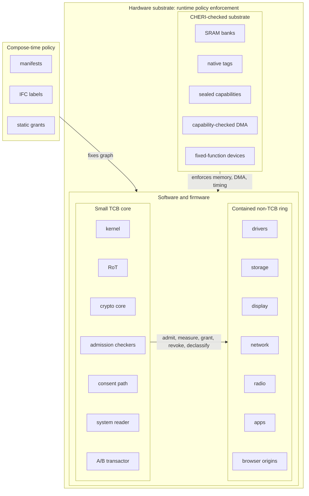
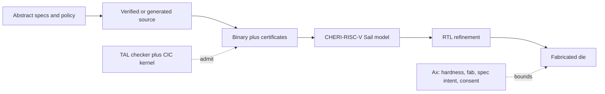
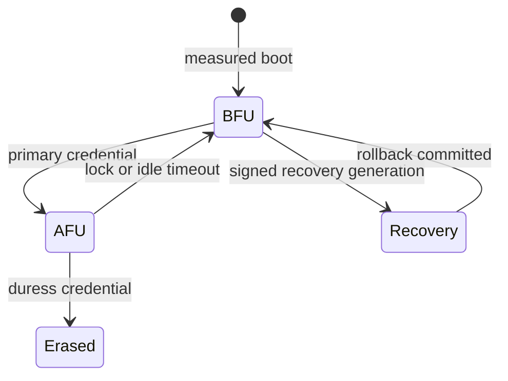
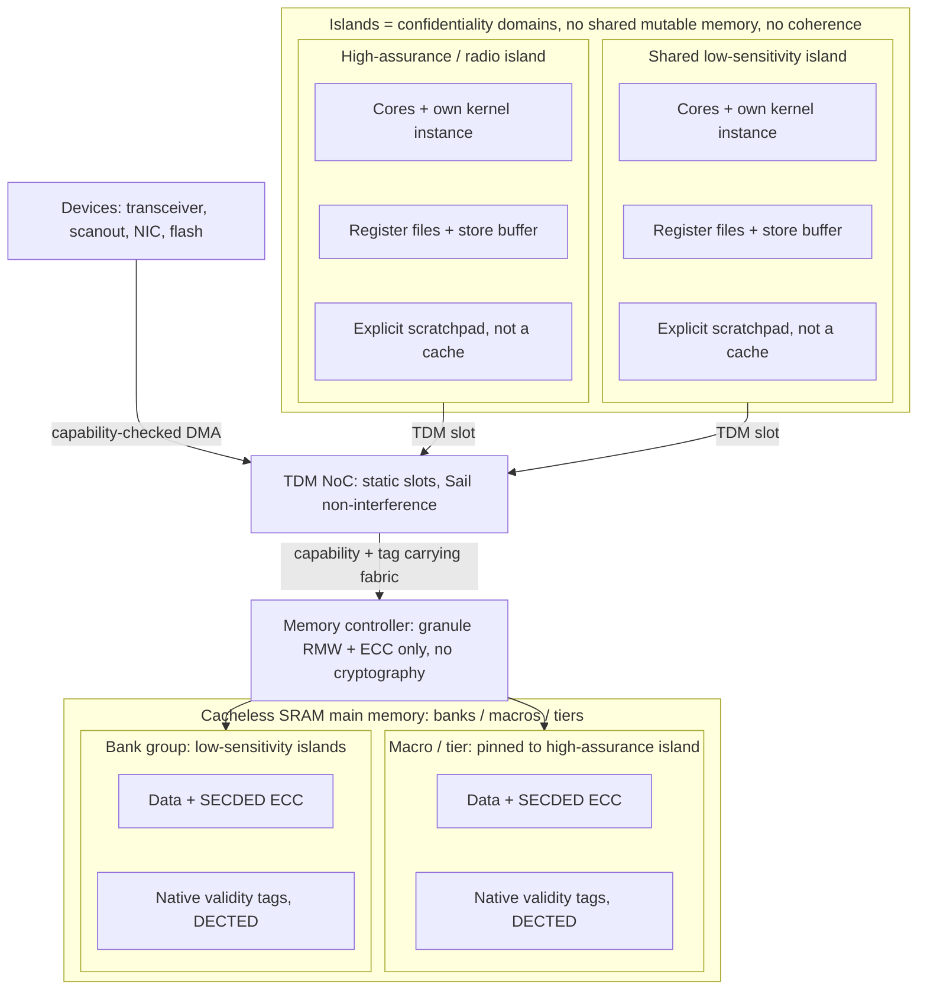

# Verification-Maximal Capability OS: Specification

**Goal:** a hyper-secure, extensively formally verified, transactional/stateless, reliable capability OS.
Compatibility is narrow by design, and performance is subordinate to security.
Engineering effort is treated as free; **trust is the scarce resource**.

The rule is simple: *minimize what must be trusted, then prove it as deeply as possible*.
Two corollaries keep the rule from becoming self-contradictory:

- **End state:** the shipped trust base is Coq-native wherever the system depends on the proof.
  Permanent second checkers are rejected: inheriting seL4's Isabelle proof, or accepting EverParse's F\*/Z3 checker, would widen the final TCB.
  That is why seL4's design, VeriBetrFS's design, and the crypto reductions are re-proved or re-homed in Coq (§5).
- **Delivery path:** temporary foreign-prover or analysis scaffolds may speed construction only when they are explicitly retirable.
  F\*/Z3 via libcrux/HACL\*, EasyCrypt's Why3/SMT, aiT, and Binsec/Rel are admissible as interim evidence or bring-up gates only with named Coq-native destinations and booked §17 retirement debt where load-bearing.
  They spend calendar time, not trust: the axiom underwrites their removal rather than suspending itself.

> **Inspirations & prior art.**
> The systems and research artifacts this design descends from are cataloged in [inspirations.md](inspirations.md); the architectural *alternatives* it evaluated and rejected live in [architectural-alternatives.md](architectural-alternatives.md).

## 1. Goals

- **G1** Minimal attack surface. 
- **G2** Defense in depth: compromising any non-TCB component yields only its explicitly granted authority. 
- **G3** End-to-end formal verification: abstract spec → source → binary → ISA → modeled hardware (Sail) → RTL. 
  The bottom arrow (**RTL ⊑ Sail** (the RTL refines the Sail model)) is a named, in-scope mechanization workstream (the RTL of record **authored in** Kami/Kôika, with riscv-formal/rvfi the bring-up gate and Isla the obligation bridge; §15, §18), not a bare trust assumption; below it, fabricated silicon vs. verified RTL stays the irreducible fab residual (§17).
- **G4** Stateless, atomic, transactional, rollback-friendly. 
- **G5** Reliability: fault isolation, crash-only components, health-gated recovery. 

### Reader Map

Read the document through two views: a **compose-time policy graph** that builds the machine, and a **concentric runtime hierarchy** that separates hardware substrate, TCB software and firmware, and contained non-TCB software.
The later diagrams show the verification tower and the boot/key-state machine.
The dense sections below preserve the exact obligations; the diagrams here are navigation aids only.

---

## 2. Non-Goals (deliberate)

- No POSIX/Linux compatibility in any form: no `fork()`, no uid/gid, no ambient authority, **no Linux-personality shim, and no legacy VM**. 
  Software runs natively against the capability substrate (§14) or it does not run: there is no ambient-authority pocket universe anywhere on the machine.
- No broad hardware support: curated allowlist only. 
- No fixed form factor: laptop, phone, IoT, workstation, and server instantiations share the principles; only the physical particulars vary. 
  The reference instantiation is a mobile/laptop device (hence the cellular radio, page-reachable standby (§9, §15), and the lid-close or face-down away-gesture), and a form factor that lacks a peripheral simply omits it (a workstation or server typically carries no camera, microphone, or radio, and locks only its USB data lanes, if any); the privacy cutoffs (§15) are driven by lockout on every form factor and additionally by the away-gesture where one exists.
- No performance parity: in-order cores, no SMT, no JIT, no dynamic speculation, **no dynamic branch prediction (§15)**. 
  **Rendering, AI, and radio signal processing run on general-purpose vector/matrix cores under the same ISA and proofs (§15)**: no fixed-function GPU, no discrete accelerators, no opaque coprocessors.
  Throughput lands in 2010s-iGPU / early-NPU / LTE-class-modem territory by design; that is the accepted price.
  **Instruction-level parallelism is bought only from static, exposed mechanisms (wide in-order issue, decoder-stage macro-op fusion, RVV), never from mechanisms that create hidden speculative microarchitectural state (§15 profile).** 
- No legacy: no BIOS/MBR, UEFI, ACPI, IPv4, 32-bit modes, or compressed-instruction ambiguity (no C extension, §15). 
- No proprietary firmware black boxes (named exhaustively in the §12 topology table) excluded by platform mandate, not mitigated. 

---

## 3. Threat Model

**Defended:** remote network attackers, including hostile radio infrastructure (rogue base stations and access points attacking the cellular/Wi-Fi stacks, with downgrade to the broken-crypto legacy generations physically impossible since 2G/3G/4G are absent from the silicon, §15, and emergency calling over a separate zero-authority 5G/6G mode, never a legacy or unauthenticated-attach fallback, §12); hostile web content; malicious or compromised apps, servers, and drivers; malicious DMA peripherals and counterfeit or spoofed wired peripherals and cables (capability-checked DMA plus a mandatory post-quantum device- and cable-authentication floor, no USB tunnel admitting a PCIe or DMA path into memory, §12, §15); evil-maid physical access (measured boot + attestation + FDE + volatile SRAM main memory holding no at-rest plaintext across power-down, §15; the memory path carries no encryption or integrity construction at all, because main memory is on the same die as the cores and the adversary who could use one must first get inside the package, which is invasive attack and out of scope below); **forensic extraction of a seized device unlocked at least once** (the *After First Unlock* state, whose per-profile volume keys are evicted on lock or idle timeout to return the device to the keys-not-resident *Before First Unlock* state through an attested transition, §9, §10, §15, with the USB data path closed while locked so it offers no wired extraction channel, §12); **coerced unlock (duress)**, countered by a duress credential whose entry crypto-erases the key material rather than unlocking (§9, §12); and software supply-chain attack in both forms, **tampering** (corrupted artifacts or a trusting-trust compiler injecting behavior absent from source: every installed binary is checked against its exact included source closure, §13) and **subversion** (a malicious-but-memory-safe upstream dependency present in that source, xz/liblzma-shaped: confined at runtime by intra-app library compartmentalization, §13/§14). 
**Covert activation** of the microphone, camera, or radios by compromised software or firmware, and use of the wired port in a deliberately-hostile environment, are additionally countered by **user-controlled cutoffs**: sealed, gasketed Hall-effect kill switches for the microphone, the radios, and the USB data lanes, independent of all software and firmware and **driven together by lockout and the form-factor away-gesture** (lid close, or face-down on a phone) as well as individually, plus a **mechanical camera shutter** over the lens, all beneath capability-gated per-app access that keeps each device off unless something holds a live grant to it (so a mobile phone stays ringable under the away-gesture while its other radios go dark, §8, §15). 

**Electromagnetic environment:** radiated and conducted **electromagnetic interference** and **electromagnetic fault injection** (EM *glitching*) are countered by the **shielded (Faraday) enclosure** (§15), with any fault that still lands caught by the fixed-latency ECC and the fail-stop reliability path (§15, §16); **single-event upsets** (cosmic-ray secondaries and other sources of bit flips) are *not* shielded, mass shielding being both ineffective and counterproductive against them, but are detected and corrected or contained in the same logic, with their rate reduced at the source by a radiation-hardened silicon realization where the deployment's environment warrants it (§15, §16). 

**Residual (§17):** timing channels beyond the transient-execution and DVFS classes; specification errors; the proof-tool trust base; **protocol-level security above the scheme level** (the §5 crypto assurance reaches IND-CCA/EUF-CMA for the primitives, and the composed session security of TLS 1.3, WireGuard, and the cellular AKA is a further layer no theorem here reaches, §5, §17: the largest scope boundary the word *hyper-secure* crosses); **invasive physical attack, which is the only way to reach main memory at all** (main memory being on-die, delidding and probing is the entry price, where a conventional design leaves an external bus or a removable module in reach: the line matters because it is what scopes the memory path in §15, and drawing it anywhere else would make every on-die interface a defended one); malicious silicon fabrication; carrier/certification-body acceptance of an open cellular stack (a commercial risk, not a technical or (post-January-2026) legal one). 

---

## 4. Organizing Principle

Minimize and fully verify the TCB; run everything else as unprivileged, capability-confined, restartable components. 
Every element of this spec must shrink the TCB, deepen its proof, or contain the non-TCB.

**Two orthogonal security properties, both required.** 
Capabilities control *access*: who holds authority to invoke a resource.
Information-flow control (IFC) controls *propagation*: once accessed, where data may travel.
Each is blind to the other: a correct capability topology permits a high-confidentiality value to flow into an unconfined compartment if the manifest allows that channel; a correct flow policy without capabilities still leaves authority ungoverned.
The design needs both, and the static composition mandate (§7) is the structural prerequisite for proving both: a fixed component graph has a fixed capability topology *and* a fixed information-flow policy, over which a single non-interference theorem can be stated.

**Compartments: the universal unit of isolation and least authority (CHERIoT-lineage).** 
A **compartment** is a bounded set of code and data holding exactly the capabilities its manifest grants and no others, isolated from every peer by CHERI capabilities alone: it can name only what it was handed, and no ambient authority reaches across its edge.
Isolation needs no ring, no MMU, and no separate address space (§7, §15): compartments share the one physical address space and are fenced by CHERI bounds, so a boundary costs neither a page table nor a mode switch.
The only path between two compartments is a **sealed entry point through the CHERIoT-lineage switcher** (the seal/switch primitives, §7), which saves and restores the caller and (through the local/global capability discipline, §15) bounds a delegated buffer to the call so authority cannot be captured past it. 
**The structure is universal and layered.** 
The kernel is the sole privileged resident, holding the system-register permission (§7); *every other thing on the machine is a compartment*: every server, driver, and filesystem, the network and radio stacks, every app, and every browser origin (§12, §14), each pre-composed at build time.
Even the userland-resident TCB exceptions, the powerbox and trusted-path agent (§6), are confined like a server, and the verified HAL is contained as a non-TCB compartment (§6) like any other: the kernel apart, compartmentalization is the whole machine.
**Apps define their own compartments, and they nest.** 
An app is *one* least-authority compartment at its edge, but its manifest may declare an **internal compartment graph** whose library sub-compartments each carry their own least-authority **sub-manifest** (§8, §14), so an attacker-facing codec or a third-party dependency runs boxed inside the app and reaches only the capabilities it was passed.
Nesting is not a second mechanism: a sub-compartment is one more node in the same flat, machine-checked component graph (§7), *more of the same fixed graph* rather than a new kind of thing.
**Compartmentalization is required where the authority gap bites, structural everywhere else.** 
Every app must be at least one memory-safe, capability-confined compartment (§13, §14); internal sub-compartmentalization is *mandatory* for any dependency that parses attacker-controlled input or is handed authority beyond pure compute (§14), and is available otherwise as ordinary compose-time authority minimization.
**Every compartment is fixed at composition.** 
The compartment graph and its capability distribution are machine-checked at build time and installed by proof (§7): no compartment is created and no privilege minted at runtime, the one sanctioned runtime authority transfer being a powerbox declassification (§8) that extends the live edge set at a single verified point without adding a compartment or a privilege class.
Sandboxes, containers, enclaves, and permission subsystems are therefore *obviated by construction* (§8), not reimplemented: one isolation primitive spans the intra-app library boundary, the whole-app boundary, and the whole-server boundary alike.

**Heterogeneity discipline:** heterogeneity lives in the *datapath*, never in the trust structure. 
Every core class shares the base ISA, the purecap capability model, the kernel binary, and one parameterized formal model; classes differ only in datapath execution resources (vector length, matrix geometry).
Anything that cannot be expressed as an ISA-visible, Sail-modeled, capability-checked extension of a core is not admitted as compute.

**No foreign computers.** 
The platform contains exactly one computer: the multikernel die.
Every function conventionally delegated to a firmware-running coprocessor is either (a) **dissolved** into software on disciplined cores under the kernel, capabilities, and admission proofs; (b) reduced to a **fixed-geometry arithmetic unit** under the §15 coprocessor line (core-issued, capability-operand data movement; no instruction fetch, no firmware, no grammar); (c) reduced to **firmware-free device RTL** behind capability-checked DMA (§15); or (d) reduced to a **transducer or register slave** with no instruction fetch at all.
A component that fetches and executes instructions outside this discipline does not go on the die or the board.
The single tolerated exception is the eUICC (§12) (a carrier-mandated foreign trust domain) contained as a register-slave crypto oracle with zero platform authority. 
Consequences: the device allowlist collapses toward transducers; N vendor firmware-update channels collapse into the one proof-checked generation mechanism (§11); attestation coverage becomes total, radio included. 

---

## 5. Languages & Verification

- **Trusted code is verified C; contained code is Rust by default.**
  The trust, language, and compilation-verification boundaries coincide: the whole TCB (the admission checker (§6) **included, not exempted**) rides machine-checked compilation under a single prover (Coq), CompCert for the verified C. 
  The crypto core is included **without exception**: its constant-time is verified **on the artifact** against the §15 leakage model, no verified-compiler CT route (crypto bullet below), and its field-arithmetic kernels are **verified C through CHERI-CompCert like the rest of it**, not checker-admitted superoptimized assembly (the CryptOpt route, deleted by the standing rule in the crypto bullet below), so **no** TCB component enters as a checker-admitted artifact. 
  Contained code rides the certifying userspace toolchain (below): unverified but evidence-producing, never touching the TCB. 
  Contained code is Rust for the data planes and **Coq-verified Lustre (Vélus) for the control planes** (§12), the latter riding verified compilation like the TCB rather than the certifying toolchain (Vélus bullet below). 
  **Rust is the *reference* contained language, not an architectural mandate.**
  Nothing in the interfaces forces it (the kernel ABI is the capability primitives (§7), the §12 IDL is language-neutral (marshalling generated from types), and admission reads source only as a hash-bound proof subject, never as a language allowlist or producer credential (§13)) so any memory-safe or formally-verified language yielding a well-typed binary and a kernel-checked elaboration to an existing semantic anchor (or shipping manual proofs, §13) is admissible on equal terms. 
  A **formally-verified non-Rust component may therefore be lifted in whole**, Project Everest (miTLS, HACL\*/EverCrypt) in the F\*/Low\* lineage the archetype: it reaches native code by the Low\*→C→CHERI-CompCert path the crypto core already uses (§6) and carries its binary-level memory safety as the §13 certificate like any contained binary, while its foreign-prover (F\*/Z3) verification rides as *bonus* assurance that **never enters the trust base**, because containment re-establishes memory safety at the binary level and the system depends only on that: the lifted artifact merely *exceeds* the property the platform checks. 
  This is distinct from the checker rule (below) and the **EverParse-as-generator** rejection (below), which govern the *checked, load-bearing* properties an F\*/Z3 *checker* would widen the trust base to certify; a contained component's own verification is neither re-checked on-device nor relied upon, so it widens nothing: *artifact-not-pedigree* (§13) carried to its conclusion, verified imports welcome and their pedigree immaterial.
- **One prover, Coq: over seL4's design.** 
  The kernel is **seL4's design re-proved end-to-end in Coq** and compiled through CompCert/SECOMP; CompCert, Fiat-Crypto, and Perennial-lineage storage ride the same single prover. 
  The spec already specifies seL4's **capability model** in every particular (untyped memory, endpoints + notifications, derivation-tree revocation and non-interference (§8), with its VSpace/paging and MCS scheduling deliberately simplified away and its S/U privilege structure collapsed to a single Machine mode (§7)) so *CertiKOS* names only the **proof method** (deep specifications, certified abstraction layers, CompCertX-style verified compilation), not the kernel; the shared-memory concurrency it uniquely proves is unused by the share-nothing multikernel (§7).
  What is proved is therefore more precisely a **CHERIoT-class static separation kernel that borrows seL4's object vocabulary** than mainline seL4 re-proved: with VSpace, MCS, the S/U rings, and separate address spaces deleted, seL4's untyped/endpoint/CDT *design* is re-homed onto a single-address-space purecap machine, which is both the accurate claim and the materially cheaper one (§7).
  For non-interference specifically it is the *model and method* that carry over, not the proof's maturity: seL4's own NI proof is the least-maintained layer of l4v and covers only a single-core, statically-partitioned kernel, so the theorem here is a *fresh* re-proof (§8, §17). 
  *Adopting* seL4's existing **Isabelle** proof is the rejected alternative (a two-prover trust base); re-proving the design in Coq dissolves that cost. 
  Full evaluation in [Evaluated Architectural Alternatives](architectural-alternatives.md).
- **The single-prover rule binds the *checker*, not the *producer*.**
  Coq being the one kernel constrains what may *check* a proof (an F\*/Z3 or EasyCrypt/Why3 *checker* widens the trust base) but not what may *find* one: any prover, solver, or search that emits a term the Coq kernel then re-checks widens nothing, exactly as *a compromised compiler cannot mint a valid certificate* (§6). 
  So the fresh proof mass this design commits to (seL4's design in Coq, VeriBetrFS's B^ε-tree in Coq/Iris, RefFS, SFSCQ/DiskSec, the SSProve/FCF reductions, the Narcissus grammars, the CHERI-TAL soundness metatheorem, the Kami/Kôika refinement) is discharged with the full modern automation stack *as untrusted oracles*: **SMTCoq** (imports Z3/CVC5/veriT proof witnesses and re-checks them *in the kernel* (the constructive answer to the F\*/Z3 tension for the proof-*discharge*, not the specification, half of the crypto work), **CoqHammer / Sniper / itauto** (premise selection + external ATP + in-kernel reconstruction), and **Coq-Elpi / Hierarchy Builder / Equations / MetaCoq** (the metaprogramming superset for the reductions' algebraic hierarchies, the parser and filesystem dependent-pattern proofs, and the per-key-type index boilerplate, §10)) supersets *of* Coq, checked by the same kernel. 
  The two additions that attack the *largest* surface directly are named deliberately: **Iris / separation-logic proof automation** (**Diaframe**-lineage) mechanizes the separation-logic, fine-grained-concurrency, and linearizability goals that dominate the kernel re-proof (§7), the RefFS and storage stack (§10), and the one Iris-over-Sail logic (§13); and **learned tactic synthesis** (**Tactician**, **Graph2Tac**, and the retrieval- and LLM-guided **Rango** / **CoqPilot**), Coq-native proof search with in-kernel reconstruction, is the *pure* case of the rule, an untrusted *finder* whose term the kernel re-checks, so it accelerates the deferred proof mass at zero trust cost: an accelerator, not a guarantee. 
  The rule is therefore *use any tool as oracle, never as second checker, and prefer SMTCoq to pull even an SMT solver's output back under the one kernel*: sharpening the F\*/Z3-versus-Coq framing from "avoid the tool" to "avoid the tool *as checker*, spend it freely *as oracle*." 
  This is proof-*production* automation the engineering-free axiom spends freely; wiring it (the proof-automation stack) is an in-scope workstream (§18), not a new trust base.
- **The semantic-anchor budget: §15's admission test, hoisted onto the verification toolchain itself.**
  The single-prover rule unifies what *checks* a proof but not the **semantic anchors** the proofs relate, and every *pair* of anchors that must agree is a crown-jewel seam (§17), so much of the re-proof mass is the cost of *relating* semantics, not of proving properties.
  The load-bearing anchors are therefore budgeted and frozen like the ISA profile (§15): the ISA semantics (**Sail**), the verified-C memory model (**CHERI-C / CompCert**, already Coq-mechanized, §7), the Gallina/CIC metatheory, the Rust-fragment semantics (RefinedRust's **Radium**, §18), the synchronous-dataflow semantics (**Lustre / Vélus**), the hardware-refinement semantics (**Kôika / Kami**, §15), and the **one Iris-over-Sail program logic** with its four theories (§13). 
  A new semantics, program logic, or translator is admitted only if it (1) is **Coq-native or mechanically bridged** (re-checked in the kernel, SMTCoq-style, never a second checker), (2) **does not duplicate an existing anchor** (a fresh semantics for a domain an anchor already covers is rejected, as EverParse's F\*/Z3 parser semantics and a second CHERI dialect already are), and (3) **retires an interim** it replaces rather than standing beside it. 
  A *verified compiler is not an anchor but proof transport* between two existing ones (CompCert, Vélus, the Fiat/Bedrock lowering, CertiCoq host-side, the certifying Rust→CHERI compiler): it *reduces* work and is admitted freely, so the budget counts anchors and logics, never compilations. 
  The interims on the books (F\*/Z3 for libcrux/HACL\*, EasyCrypt's Why3/SMT, aiT, Binsec/Rel, Cranelift/Crocus's SMT) each carry a Coq-native destination and a retirement (§17), never a permanent second anchor. 
  **The retirement is a stated condition rather than an intention, and one rule governs every entry:** an interim retires when its named Coq-native destination has **passed admission for every consumer that currently rides the interim**, and it is struck from the trust-base inventory in that same generation, so *retired* is decided by inspecting two lists (the interim's consumers and the destination's admitted artifacts) rather than by judgment. 
  Until then the interim is carried in the inventory with its destination named, and an interim whose consumer set grows without its destination advancing is a **review-gate finding**, not a silent extension: the *shrinking-interim* claim (§17) becomes measurable rather than asserted, at the cost of nothing but writing the consumer lists down.
  This is *verify rather than hedge* (§15) applied to the prover stack: the design already runs a proof-aware design-space exploration on the silicon (§15), and this clause runs it on the toolchain.
- CompCert compiles all trusted C; translation validation against the RISC-V Sail model covers the assembly/link/image steps outside CompCert's theorem. 
- **The CHERI-RISC-V CompCert backend (§6) must satisfy a secure-compilation (robust-preservation) criterion, not merely functional correctness.** 
  The compilation of trusted C must *preserve compartment isolation against an adversarial linked context* (robust preservation), not only refine well-defined whole-program behavior: this is the **SECOMP** project's criterion, whose **SECOMP2CHERI** backend (Coq/Rocq) already carries CompCert from CompCert C down to CHERI-RISC-V assembly for exactly that goal, so the §6 backend *completes* it and re-homes it to the §15 purecap profile rather than devising either the criterion or a capability backend from scratch.
  This unifies the compiler's guarantee with the Cerise universal contract used for unknown code (§13): it closes the seam between "the TCB is correctly compiled" and "the hardware bounds everything else," which is otherwise an unproven join at exactly the point where verified C coexists with a fully adversarial userspace.
  On a purecap platform the Cerise contract is already the CHERI-native robust-safety statement for unknown code; adopting the secure-compilation *criterion* here is the corresponding statement for the verified-compilation path, so the two compose under one robust-safety framework rather than sitting as disconnected guarantees.
  (This is a strengthening of the compiler's *theorem*, not a new trusted mechanism: the compiler remains untrusted evidence-producing machinery under FPCC.) 
- **Foundational proof-carrying code (FPCC) is the delivery discipline.**
  Every binary ships a machine-checkable proof of its assurance tier (§13), stated at binary level against the CHERI-RISC-V Sail model, checked at admission by the on-device checker (§6); the proof also binds the final binary to the exact content-addressed source closure it claims, with a source-correspondence theorem that every binary behavior refines behavior permitted by that source through assembly, linking, and image construction. 
  No trusted VC generator: on this path the axioms are the proof kernel, the machine model, and the spec statements. 
  **The platform's axiom set is larger than that and is enumerated once, in §6**, which adds the on-device TAL type-checker and its soundness metatheorem (the admitters no certificate covers) and names the bootstrap root beneath them; this bullet states what proof-*carrying* code rests on, never the whole set.
  **Delivery is *stratified* along the same functional ⋈ hyperproperty line the profile draws for RTL ⊑ Sail, WCET, and CT.**
  **This list is the canonical statement of the type-level obligations, and every other section cites it rather than restating it** (§6's checker table and §13's Tier-2 row are citations, not independent enumerations, so the four-copies-that-drift failure mode has one place to be fixed). 
  These eleven type-level obligations (memory safety, **definite initialization**, **data-race freedom**, control-flow integrity **(both halves: the runtime *legal-here* the sentries enforce, and its compose-time *callee-set enumeration*, which is the static shadow of the same fact and not a twelfth obligation, callee-set bullet below)**, no-runtime-codegen, ABI/type conformance, examined verdicts, absent ambient state, representation-and-provenance conformance, constant-time, and WCET) are not eleven mechanisms but **one primitive seen from three sides** (shadow bullet below): they ride a CHERI **typed assembly language** (a TAL for RV64+CHERI) as a *typing derivation* the on-device checker (§6) re-checks, so any producer of a well-typed binary is admissible, the artifact-not-pedigree rule holds *literally* on this tier (§13), and constant-time and worst-case timing become **per-install checkable** rather than release-time proof terms wherever the code is structured (as the crypto kernels and Tier-1 secret paths are).
  The deep obligations no type system states (Tier-0 refinement, non-interference (§8), crypto reduction security, and only the *residual, unstructured* constant-time and WCET cases) stay proof terms for the CIC proof kernel. 
  CHERI keeps the type system small: it discharges *spatial* safety in hardware, so the TAL carries only the temporal-safety, exclusive-access, and typed-control-flow residual, and its **soundness metatheorem** (well-typed ⇒ safe and data-race-free over the Sail model; foundational-TAL / RustBelt / WasmCert-Coq lineage) is one Coq proof: a crown-jewel spec (below) but a smaller admission axiom than a hand-built term checker. 
  The verified compiler runs in *certifying* mode (each Tier-0 build ships the composed theorem "binary refines abstract spec **and robustly preserves compartment isolation**") and Islaris-style Iris-over-Sail logic covers binaries with no verified compiler in the loop: a *functional*/safety logic that does not by itself carry **constant-time** (a 2-safety hyperproperty), so secret-touching binaries on this path incur the separate binary-level CT obligation of the crypto bullet below. 
  The theorem refers to source through an existing reviewed semantic anchor (CHERI-C, Radium, Lustre, or Gallina); a producer for another language must supply a kernel-checked elaboration into one of those anchors, so admission stays language-neutral without making an arbitrary source parser or frontend trusted.
  Consequence: compiler, extraction tooling, and build farm drop out of the consumer-side TCB. 
  Verification is a property of the artifact, not its pedigree.
  **The absence of the C extension (§15) removes instruction-decode ambiguity from these binary-level proofs: every instruction has one 4-byte-aligned decoding, with no overlapping-stream interpretation to discharge.** 
- **The type-level tier collapses to one primitive seen from three sides: the type is a *faithful static shadow* of the running capability machine, and *well-typed means the shadow stays faithful*.**
  The eleven obligations above are one shadow seen from many sides.
  The checker handles them by exactly **three moves**: 

  | Move | What the TAL checker does | Obligations carried here | Why this stays small |
  | --- | --- | --- | --- |
  | **I. Cite a runtime invariant** | Confirms that the derivation records an invariant CHERI already enforces in hardware. | Spatial memory safety, no-runtime-codegen, and CFI-runtime through sentry reachability. | The checker does not re-prove the hardware fact; it inspects that the artifact relies on the named invariant.  |
  | **II. Evaluate a Knuth-style attribute** | Runs a local attribute-grammar pass over the already-typed control-flow graph and joins the linear contexts at manifest edges. | Temporal memory safety, definite initialization, data-race freedom, examined verdicts, constant-time, WCET, callee-set enumeration, and type/ABI conformance. | Each attribute has a finite domain and syntax-directed rule: type, affine-authority and relevant-verdict grades, the initialization flag, secret taint, WCET cost, and callee set.  |
  | **III. Confirm a deletion** | Checks that constructs which would make the static shadow lie are absent from the binary. | Representation-and-provenance conformance and no ambient mutable state. | These are one-pass inspections of absences: no integer-as-capability, no type punning, no variadics, no unbounded recursive data, no implicit conversion, and no hidden tagged static capability.  |

  Each certificate is a *typing derivation* the on-device checker (§6) re-checks by evaluating the (II) attributes and confirming the (I) citations and (III) deletions, so any producer of a well-typed binary is admissible, *artifact-not-pedigree* holds literally on this tier (§13), and constant-time and worst-case timing are **per-install checkable** wherever code is structured.
  The **soundness metatheorem** (FPCC bullet above) accordingly reads as *attribute evaluation is sound against the four unary invariants* (§5 apex): the same one Coq proof, stated over the three moves rather than over a flat list of eleven obligations. 
- **Data-race freedom is an exclusive-access theorem carried by the existing linear capability grade, not a convention and not a byte-atomic-copy primitive.** 
  For every non-atomic byte range, a writable capability is **exclusive**: the CHERI-TAL context-splitting rule denies any overlapping load or store authority in another thread, compartment, or device state while that capability is live; duplicable aliases are read-only, and concurrently shared synchronization cells are explicitly atomic types accessed only by the Sail-modeled atomic operations. 
  This is checked on the composed artifact, not trusted to source ownership: the per-binary derivation proves each local split, and the §13 manifest join rejects overlapping cross-compartment grants, so a compromised but admitted component has no well-typed load or store instruction path that can race a peer.
  Publication is a typestate transition over the same capability type: consuming exclusive writable ownership produces immutable published ownership; reclamation consumes every published reader before writable ownership can return.
  Consequently a sequence-counter pattern that copies a concurrently writable non-atomic payload is **inexpressible**, rather than made less dangerous by retry: no execution reaches the racing copy, so neither an atomic `memcpy` nor a byte-wise-atomic wrapper exists in the platform.
  Generated copy-once parsers write declared fields into definitely-initialized destinations (§5) and never transmute or inspect representation padding, keeping the separate uninitialized-padding hazard outside the admitted binary as well.
- **Verified copy-once parsers (Narcissus (Fiat), Coq-native) on every attacker-facing wire format**, explicitly including the ASN.1 UPER/aligned-PER grammars of cellular RRC/NAS and the 802.11 MLME element grammars (§12), the most-attacked remote parse surfaces in consumer computing. 
  Narcissus derives encoder/decoder pairs correct-by-construction *inside Coq*, keeping the parser toolchain on the single prover this section mandates rather than re-importing an F\*/Z3 axiom base.
  The Coq decoder **reaches metal by Fiat/Bedrock correct-by-construction synthesis to imperative Clight** (the Rupicola/Bedrock2 route Fiat-Crypto already uses, GC-free and Coq-native), so it is neither extracted onto a managed runtime (banned, §14) nor hand-refined per grammar: the descriptor is compiled *to the binary*, not merely to a Gallina function, and the semantic-anchor budget (§5) counts that synthesis as proof transport, not a new anchor, so there is no separate parser-lowering artifact to book. 
  **EverParse is the rejected alternative**: not on capability but on trust-base uniformity: it would widen the trust base to F\*/Z3 for precisely the remote, attacker-facing subsystem where minimizing axioms matters most (the same two-prover cost the §5 seL4/Isabelle choice refuses to pay). 
  The crypto bullet below tolerates exactly that F\*/Z3 widening (libcrux/HACL\*) *only* as an explicitly temporary measure pending Coq-native ports; for parsing there is no equivalent justification to incur it, because the Coq-native generator already exists.
  **The residual is transcription, booked as a crown-jewel spec rather than carried by the parser proof.** 
  Narcissus proves the encoder/decoder pair correct-by-construction *against its Coq format descriptor*, not against the 3GPP text, so a mis-transcribed grammar yields a perfectly verified parser for the *wrong* format; memory safety is unconditional regardless (copy-once, `#![forbid(unsafe_code)]`, CHERI bounds, compartment containment (§12/§13), so the error cannot reach the zero-click baseband-RCE class, only the semantic one) a parsing differential against the network or a peer layer, or an over-accept feeding the §12 state machine. 
  That makes the **format descriptor the crown-jewel spec** in exactly the sense the crypto functional specification (below) is (a correct proof over a wrong spec proves nothing) and it is discharged the same way: **compile the descriptor, do not hand-write it.**
  NR RRC (3GPP TS 38.331) is published as machine-readable **ASN.1**, so a small **verified ASN.1 (X.691 UPER) → Narcissus front end** consumes the vendor's own modules and collapses thousands of pages into *one* reusable, ITU-standardized codec proved once and instantiated per message; 5G-core NAS (TS 24.501) is **IEI/TLV, not ASN.1**, so it keeps a smaller hand-written grammar: the surface that most needs the oracle. 
  **Differential oracles retire the residual empirically and enter no trust base:** asn1scc (ESA's UPER compiler), asn1c, the Wireshark dissectors, and the srsRAN/OpenAirInterface reference decoders cross-check the derived parser on captured and fuzzed corpora (§18): the only trusted artifact is the small ASN.1→Narcissus compiler, its output Coq-checked, the same asymmetric-trust pattern as the §6 checkers and the empirical complement to the copy-once proof. 
  **EverParse is admissible here as an untrusted differential oracle (never the shipped checker**) the *tool-as-oracle* reading of the same rule that rejects it as a second prover. 
- **Verified synchronous control planes (Lustre via Vélus, Coq-native) for server sequencing (§12).** 
  The control-plane logic of §12 servers (supervision trees, protocol state machines, mode/timing sequencing) is written in **Lustre** and compiled by **Vélus**, a compiler **verified in Coq** that emits **CompCert Clight** and whose correctness theorem *composes with CompCert's*. 
  This is the same trust-base-uniformity move as **Narcissus over EverParse** (above): a Coq-native domain-specific generator on the single prover, emitting Clight into the CHERI-CompCert backend (§6) already mandated: not a third language and not a new axiom.
  Synchronous dataflow makes three obligations *structural* rather than per-server proofs: **WCET** (a Lustre node is a loop-free, statically-sized reaction, so the control tier's timing falls out of compilation, not the §11 syntax-directed WCET cost annotation the data planes carry (§5)), **determinism and causality** (Vélus's clock calculus rejects instantaneous cycles and fixes evaluation order, feeding §8 non-interference a control tier with no schedule-dependent behavior and discharging admission-test-3's *no hidden state survives a partition switch* by construction, §15), and **memory safety** (static allocation makes the §13 temporal-safety certificate trivial for this tier). 
  Data-plane logic (bulk I/O, vector/matrix math, wire parsing) stays `#![forbid(unsafe_code)]` Rust. 
  Full evaluation in [Evaluated Architectural Alternatives](architectural-alternatives.md).
- **Crypto: verified to the reduction, not only the implementation; post-quantum by default** (ML-KEM/ML-DSA). 
  Implementation correctness is not security, so assurance is stated as **three composed layers**: 
  - **(1) Functional correctness**: the implementation refines the abstract scheme.
    **Fiat-Crypto** (Coq-native) for classical field arithmetic; **libcrux/HACL\*** for PQ primitives: the explicit, *interim* F\*/Z3 widening, with a named Coq-native destination (below), not an open-ended "until ports land." 
  - **(2) Constant-time** (data-independent leakage against the `Zkt`/`Zvkt` model (§15)).
    Constant-time is a **2-safety hyperproperty verified directly on the binary** for *every* secret-touching artifact, the crypto core included: CT is *a property of the artifact, not its pedigree* (the move already made for memory safety, here for timing), stated against the same §15 `Zkt`/`Zvkt` leakage model (itself an RTL-against-Sail obligation), so **no verified-compiler constant-time route exists** and a single verified compiler (CHERI-CompCert) carries the whole toolchain. 
    The performance-critical **field-arithmetic kernels** (ECC / big-integer modular arithmetic) are **verified C through CHERI-CompCert like every other part of the core**, and the **CryptOpt-style verified-translation-validation route is deleted, not deferred**: an untrusted randomized-search superoptimizer admitted by a net-new **Coq-verified assembly↔Fiat-Crypto equivalence checker** over the Sail model would buy nothing but speed, the field arithmetic being *already* functionally correct through the verified compiler and, being straight-line, *already* constant-time on that compiler's stock output as verified on the artifact (below). 
    That is the **standing §5 rule read at its general strength**: *any net-new verified artifact whose only yield is performance on a path already correct and already leak-free is inadmissible: take the slower sound artifact* (the WCET bullet's *take the trivial sound bound* is the same rule read on **bounds** rather than **artifacts**; pessimism and slowness are free by axiom, trust is not, §1). 
    The rule is aimed at *minting a checker*, not at the asymmetric-trust pattern itself: an untrusted optimizer whose output the **already-existing** checkers re-validate (the CHERI-TAL derivation, the CT taint-typing, §6) costs nothing and stays free to be arbitrarily aggressive, but functional equivalence to a Fiat-Crypto specification is **not** a TAL judgment, so admitting superoptimized field arithmetic *requires* the net-new checker: which is precisely why that route falls where re-checked off-device optimization stands. 
    What the deletion gives up is named rather than hidden: hand-assembly-grade throughput on ECC and big-integer modular arithmetic, so the classical-crypto hot path runs at verified-C codegen speed: spent in the free currency (§1) to retire a net-new Coq development, an entire TCB category (checker-admitted artifacts, §6), and a §18 workstream.
    On **straight-line** code (Fiat-Crypto's field arithmetic, now the whole of it) constant-time is **structural**, no secret-dependent branch or memory address, so the stock CHERI-CompCert output is constant-time incidentally and the CT taint-type check (below) decides it near-syntactically: the fact that makes the deletion above free of assurance cost.
    The **control-flow-heavy** primitives (Keccak, AES, ChaCha, the ML-KEM/ML-DSA NTT and samplers) are written branchless on secrets (`Zicond` selects, §15); because a stock C compiler does **not** *preserve* constant-time in general, their binaries are **constant-time-hardened and then verified on the artifact** rather than trusted by construction, and where a lowering resists hardening the fix is **in the source, never in an admitted assembly leaf**: the checker-admitted-assembly escape hatch is deleted along with CryptOpt (a hand-written leaf carries no functional-refinement certificate any checker re-validates, so it would trade a *correctness* guarantee for a *timing* one), so the primitive is restructured until the artifact-level check passes: fail-closed, on the free axis. 
    Constant-time is carried **where a type discipline suffices and proved where it does not**, the same functional ⋈ hyperproperty stratification the CHERI-TAL draws for memory safety (§5 FPCC, §13). 
    The common case is the move-(II) **secret-taint attribute** (a two-point lattice, shadow bullet above): a **constant-time taint-type discipline in the CHERI-TAL**, *structural* wherever the secret-touching compartment is confined to the constant-time (`Zkt`-only, branchless-on-secrets) sublanguage and a lattice join otherwise, so that secret-labeled values are taint-typed and the type system rejects any that reach a branch condition, a memory address, or a variable-latency operation off the `Zkt`/`Zvkt` list, so CT becomes a **decidable, per-install** check the on-device type-checker (§6) runs on the typing derivation, its soundness the **constant-time type-soundness metatheorem** (the **CT-Wasm** lineage (Watt et al.), mechanized in Isabelle and restated in Coq over the §15 leakage model, joining the CHERI-TAL soundness proof). 
    This fits the population the obligation actually covers: the field-arithmetic kernels are **straight-line** (a near-syntactic check) and the Tier-1 secret paths (key schedule, PIN, session keys, §13) are **structured**, so both type-check.
    The **residual corner** (unstructured secret-dependent code that does not type-check) is either branchless-hardened (`Zicond` selects, §15) and re-typed, or discharged by a **relational (self-composition) program logic over the leakage-annotated Sail semantics** (the 2-safety theory of the one §13 Iris-over-Sail base) emitting a proof term the CIC kernel validates. 
    So the standalone binary-level CT verifier collapses into the certifying-compiler / TAL workstream (§18) and the relational logic shrinks from *the* vehicle to the **corner case**; the certifying userspace toolchain (below) preserves memory safety, not timing, so it is this CT taint-typing that carries the property to the binary.
    **Binsec/Rel** (relational symbolic execution for constant-time and secret-erasure, directly on the binary) is the mature, better-fit complement and the bring-up gate, but (like riscv-formal BMC and aiT) it is **bounded symbolic-execution evidence**, never the axiom; **ct-verif** is the LLVM-IR-level sibling, not binary-level for the on-the-artifact statement. 
    The obligation is **scoped to secret-touching compartments, and the scope is defined by the *label on the material*, never by its channel of arrival**: a compartment is secret-touching if it holds secret-labeled material however it obtained it, whether over an IDL confidentiality channel (§12), through a capability-bounded DMA window or an RoT-latched front end re-delegated to it (the credential path's PIN and biometric frames, §12, §15), or drawn locally from the entropy root (§15). 
  Stating it by channel would exclude exactly the paths §13 names first (the PIN and key-schedule paths of Tier 1), and the soundness of replay's entropy substitution (§16) is only as broad as this population, so the label-not-channel reading is load-bearing twice over rather than a wording preference; it remains narrower than the whole app population, and the binary-level CT verifier is an in-scope workstream (§18).
  - **(3) Reduction-level security: the deepest layer.**
    Functional correctness and constant-time establish that the code computes ML-KEM correctly and leaks nothing through timing; they say **nothing** about whether the scheme is **IND-CCA** (KEM) or **EUF-CMA** (signatures), which are *game-based* properties proved by **reduction** to a hardness assumption. 
    **SSProve/FCF** supply these reductions **Coq-native** (the identical trust-base-uniformity choice this section makes picking Narcissus over EverParse) so the security proof rides the one Coq kernel (§6) at **zero new trust base**. 
    **EasyCrypt** is the mature complement (the formosa-crypto ML-KEM/ML-DSA reductions are written in it), but its Why3/SMT backend is a *distinct* trust base, so it is treated exactly like the libcrux/HACL\* F\*/Z3 widening: adopted where it accelerates delivery, with the SSProve/FCF Coq-native statement as the destination.
  The three layers **compose at the abstract scheme** ((implementation ⊑ scheme, layers 1–2) ⋈ (scheme is IND-CCA/EUF-CMA, layer 3)) joined at the primitive's functional specification, which thereby becomes a **crown-jewel spec** (a reduction over a mis-stated game, or over a scheme the binary does not actually refine, verifies perfectly and proves nothing). 
  The reduction *isolates and names* the residual hardness assumptions (MLWE/MSIS; ECDLP/CDH) but cannot discharge them (§17); protocol-level composition (TLS/AKA, §12) is a further layer above this and is not claimed here. 
  The CryptOpt-style field-arithmetic translation-validation toolchain (an untrusted superoptimizer plus a Coq-verified equivalence checker retargeted to the CHERI-RISC-V Sail model) is **not** a workstream: it is deleted by the rule above, so §18 carries no crypto-codegen deliverable at all, only the reductions, their composition at the functional specification, and constant-time verification.
- **Contained Rust: `#![forbid(unsafe_code)]` with no exception in all Rust-authored app and server logic.** 
  The sole residual `unsafe` lives in a minimal, **formally verified** (not merely audited) hardware-abstraction layer (the DMA/MMIO/descriptor primitives) which is irreducible because raw device access is inexpressible in safe Rust. 
  That HAL's `unsafe` carries machine-checked memory-safety and hardware-contract proofs (Verus/Prusti/Aeneas-class, or the same FPCC discipline), and those hardware contracts carry one obligation the rest of the system's initialization discipline rests on: **a DMA or descriptor primitive that returns a device-filled buffer must establish that buffer's *initialized* postcondition** (definite-initialization bullet below), device stores being the one initializing writes no compartment's own derivation contains; **its register field layout is data, not hand-written bit-twiddling**: the sub-word fields of each MMIO register are declared once in a register-description language (OpenTitan-`reggen`/SVD-shaped), static hardware-description data in the same spirit as the attested devicetree (§9), and the **shift/mask field accessors are generated correct-by-construction and Coq-checked against that declaration**, the same Narcissus/Fiat-family trust-base-uniformity move (a single-prover DSL emitting a verified artifact, above) rather than C-style implementation-defined bit-fields or an unverified template/macro layer; the CHERI backstop is then defense-in-depth, not the primary guarantee for that code. 
  **DMA submission transfers ownership rather than lending an alias:** the verified HAL consumes the caller's exclusive buffer capability and returns an opaque in-flight token, so no CPU load or store of that range type-checks until completion consumes the token and returns initialized ownership; a device-read transfer likewise excludes CPU stores until completion. 
  The direction and permissions are part of the buffer typestate, descriptors cannot retain authority after completion, and the §15 completion rule closes the hardware half, so concurrent CPU/device payload access is absent rather than treated as a volatile or atomic-copy problem.
  All contained Rust is compiled by the certifying userspace toolchain (below) straight to native RV64+CHERI: a mandatory build path, not bare rustc/LLVM (§18); Wasm/WASI is not an execution target anywhere in the system (§14). 
  A contained component in another memory-safe or formally-verified language (the Project Everest lift of the first bullet) meets the same **binary-level** memory-safety floor through the §13 certificate rather than through this source rule: `#![forbid(unsafe_code)]` is Rust's way of discharging that floor, not the floor itself.
- **Ambient *state* is deleted alongside ambient *authority*: the object-capability discipline is a *language* rule, and safe Rust does not supply it.**
  §8 deletes ambient authority at the OS layer (no global namespaces, uid/gid, setuid, `fork()`) and CHERI deletes it in hardware (no execution reaches authority outside the capabilities it holds: the Cerise universal contract, §13), but neither layer stops a *language* from re-manufacturing a global above them, and safe Rust in particular does not: a module-level `static` of an interior-mutable type (`AtomicU64`, `OnceLock`, `Mutex`, a `RefCell` behind `thread_local!`) is ordinary safe code that passes `#![forbid(unsafe_code)]` untouched, yet is ambient mutable state by any definition, reachable by name from anywhere in the compartment, owned by no one and passed to nothing.
  The rule is therefore stated where the hole actually is: **no module-level mutable state, no lazily-initialized statics, no thread-locals, no hidden singletons**, every capability and every piece of mutable state a component uses being either a construction-time parameter or reachable only from a reference it was explicitly handed. 
  Immutable statics are untouched (`const` data, and `static` of a type with no interior mutability, are data in the read-only image rather than authority, already covered by W^X and the immutable instruction stream, §13). 
  **Three properties this design already claims are only as good as this rule.**
  (1) **Grade tracking is otherwise partly fiction:** the linear/affine capability discipline and the relevance grading above both reason about a *typing context*, and a global is a channel around the context, so a capability reachable from a static carries unrestricted multiplicity whatever the derivation says, and a verdict stashed in a static satisfies the letter of must-examine while defeating its point.
  (2) **The static memory plan degrades back toward sum-of-allocations:** whole-program slot coloring (§7) shares one slot among objects whose live ranges provably never overlap, and a global has whole-program live range by construction, so every global is an object that can share with nothing (reintroducing exactly the over-reservation the plan deletes) while a *lazily*-initialized static reintroduces the runtime initialization step the plan deleted along with the allocator.
  (3) **Determinism and restart:** hidden state that survives a call is state outside the component's declared state, so it escapes both the §16 crash-only restart (a supervisor restart that does not restore it restarts into a different machine than the one it proved) and the §10 deterministic replay that off-device crash diagnosis rests on.
  **The rule is carried to the artifact, not left as a source lint** (the move the must-examine bullet makes above, for the same *artifact-not-pedigree* reason, §13): the binary-level statement is that a compartment's **initial capability set is its whole authority**, its static data section carrying no tagged capability and no writable object being reachable except from a capability the code was given. 
  That is the **Cerise universal contract restricted to the initial register file**, so it *tightens* a contract already in the trust story rather than adding theory, and it rides the CHERI-TAL derivation the §6 type-checker re-checks: a static datum with its tag set is a type error, the move-(III) exhaustiveness deletion (shadow bullet above) whose confirmation is a one-pass scan of the image, not a per-node rule.
  **Language-neutral, like the memory-safety floor:** `#![forbid(unsafe_code)]` plus a deny on interior-mutable statics and `thread_local!` is Rust's way of discharging it, not the floor itself (contained-Rust bullet above); the Lustre/Vélus control planes discharge it by construction (a synchronous node's state is declared, §12), and the §12 IDL already passes authority explicitly. 
  **The cost is ergonomic, and it is the §13 tradeoff again:** constructor-injected capabilities and explicit parameterization are the object-capability-*language* discipline (the E / Joe-E / Newspeak lineage) and they narrow the admissible library set, a large share of ecosystem Rust reaching for a lazy static: containment is unchanged and only the admitted set narrows, exactly as the mandatory memory-safety certificate already decided.
  Its boundary (the rule forbids *re-manufacturing* a global, never *over-injecting* one) is booked in §17. 
- **Certifying userspace compilation: memory-safety PCC for all contained code.**
  The certifying-compilation discipline the TCB uses in the large (Tier 0, §13) is generalized to *every* app and server: the userspace Rust→RV64+CHERI toolchain runs in certifying mode, emitting with each binary a machine-checkable **memory-safety certificate** (a *typing derivation* in the CHERI typed assembly language (the §5 FPCC bullet) covering temporal safety (no use-after-free), control-flow integrity, no-runtime-codegen, and ABI/type conformance) stated at binary level against the CHERI-RISC-V Sail model and discharged by the §6 on-device **type-checker**. 
  This is *not* full functional correctness (that stays Tier-0/1, §13); it is the Verus/Prusti/Aeneas-class obligation the HAL already carries, generalized from the `unsafe` primitive layer to all contained logic.
  Two properties make it cheap: safe Rust's type system already establishes the source-level fact, so the compiler *preserves and certifies* rather than re-discovers it (the memory-safety analog of the binary-level constant-time certificate, §5) (the TAL is exactly the vehicle carrying those source ownership types down to the binary as the checkable derivation, so *target the TAL* is the whole of the certifying step; and CHERI discharges *spatial* safety in hardware at runtime, so the certificate need only carry the temporal-safety and typed-control-flow residual. Consequence: for admitted code, rustc/LLVM leave the intra-compartment memory-safety trust base) the property becomes evidence carried by the artifact, not trust in its producer. 
  The toolchain itself remains untrusted evidence-producing machinery under FPCC (§6); building it is an in-scope workstream (§18).
- **Fallible results are *relevance*-graded: the CHERI-TAL denies weakening exactly where it already denies contraction, so every error verdict must be *examined*, not merely produced.**
  The TAL's substructural discipline is one-sided as a capability calculus.
  Capabilities are **linear/affine** (contraction denied, so authority cannot be duplicated; weakening allowed, so it may be dropped), which is the correct law for *authority* and the wrong one for *verdicts*: dropping a capability forfeits power and is safe, whereas dropping a verdict forfeits knowledge and is not. 
  The dual quadrant is **relevance** (weakening denied, contraction allowed: a value must be consumed *at least* once and may be freely duplicated), and it is the law that fits every fallible operation's result. 
  Both are points on the one lattice the structural rules generate ({exchange, weakening, contraction}), so this is a *grading* added to the discipline the TAL already carries (the linear/affine capability and stack tokens of §13), not a second type system and not a second metatheorem: the move-(II) **relevant-verdict attribute** (shadow bullet above), the same context-splitting side condition the affine-authority grade already runs, with the opposite polarity.
  **The rule is forced by the absence of the mechanisms that would otherwise catch a dropped verdict, and is therefore a typing rule here where it is a lint elsewhere.**
  There are no exceptions, no stack unwinding, and no `longjmp`: a **typed absence** in the TAL rather than a convention, with a failing compartment taking the §16 crash-only fail-stop and supervisor restart instead of unwinding; and asynchronous trap delivery does not exist (§7). 
  So an unexamined error result is not deferred to a handler, because there is no handler and no later: it is silently discarded, and a proved fail-closed property becomes an unproved fail-open one at exactly that instruction.
  `#[must_use]` is Rust's answer to the same hazard and it is a **lint**: warn-level, locally defeatable, and erased long before the binary, so it carries nothing to admission and is worth nothing under *artifact-not-pedigree* (§13).
  Here the obligation is a typing rule the derivation carries to the artifact and the §6 on-device **type-checker** re-checks, like every other type-level obligation (FPCC bullet above).
  **Scope is every result encoding whether an authority-, integrity-, or freshness-bearing action actually succeeded**: attestation and appraisal verdicts (§9), ECC and memory-authentication status (§10, §15, §16), capability-derivation and revocation results (§8), IDL call outcomes (§12), admission-check verdicts (§6, §13), and storage-transaction commit results (§10). 
  These are precisely the values whose silent drop defeats a fail-closed design, and **not one of them is reached by memory safety, CFI, or constant-time**: the existing certificate covers what the code may *touch* and how long it may *take*, never whether it *looked*.
  **The typed discard is part of the rule, not an escape from it:** a wildcard bind is itself weakening, so it is denied on a relevance-graded type and discarding a verdict requires an explicit elimination that names the outcome, which is auditable where a dropped value is not. 
  **Cost is a side condition, not a mechanism:** no runtime check, no silicon, no new semantic anchor (§5), and no new crown jewel, relevance-grading strengthening the *statement* of the CHERI-TAL soundness metatheorem rather than standing beside it; its boundary (relevance bounds the *drop*, never the *response*) is booked in §17. 
- **Sound WCET is *derived syntax-directed*, not asserted and not tightened: a max-path sum over the typed control-flow graph.** 
  The per-(class, operating-point) bounds §11 temporal admission, the OPP/mode-schedule selection, and the watchdog windows consume are **derived, not taken on trust**, but the machine the profile builds (in-order, fixed-latency functional units, static-only prediction, no pipeline overlap or timing anomalies, §15) makes the derivation elementary: structured-code WCET is **Shaw's timing schema**, a *syntax-directed* max-path sum over the control-flow graph with loop bounds, and that CFG is **already typed** by the CHERI-TAL (§5 FPCC), so the bound rides as the move-(II) **cost attribute** (ℕ under max-and-plus, shadow bullet above), cost annotations on the typing derivation the on-device checker already validates, not a separate analysis.
  The low-level half is unchanged: the **timing-annotated Sail model** supplies per-instruction latency (the §15 fixed-latency DIV/FPU/AMO mandates and static-fetch statement *are* the table), sound to the metal by RTL ⊑ Sail; the high-level half **collapses from an ILP to a tree sum**, because an overlap-free non-speculative pipeline has no path interference for IPET to resolve. 
  So **the Implicit Path Enumeration Technique and its LP solver are deleted, not retargeted**: IPET exists to squeeze pessimism out of pipelines with overlap, anomalies, and predictors, all of which the profile deleted, so here it would only tighten a bound the design has already agreed to take loose. 
  This is a **standing §5 rule**: *any verified tool that exists only to tighten an already-sound bound is inadmissible, take the trivial sound bound* (performance is subordinate (§1) and pessimism is free by axiom), so the ILP machinery is deleted like the dynamic predictor it would otherwise model. 
  The rule generalizes past bounds to **artifacts**: the crypto bullet above reads it on a *tool* rather than an *estimate* and deletes the CryptOpt equivalence checker on the same grounds (already-correct, already-constant-time field arithmetic), so the two deletions are one rule applied twice, not two judgment calls. 
  Loop bounds that resist syntactic inference are annotations discharged as Coq obligations against the source (cheap: `#![forbid(unsafe_code)]`, no-runtime-codegen, static composition (§7), and the bounded IDL (§12) make most bounds structural); and where code is produced by **correct-by-construction relational compilation** (the Lustre/Vélus control planes, and the Fiat/Bedrock/Rupicola-synthesized components (the Narcissus parsers, the field arithmetic)) the per-node cost falls out of the compilation derivation *as a byproduct*, so the standalone max-path pass is needed only for hand-written imperative data-plane code. 
  **aiT (AbsInt)** stays an unverified out-of-band cross-check only, and **MBPTA/EVT stays inadmissible as the bound** (a statistic, not a theorem, the MTE-93% disposition, §15). 
  Folding WCET into the TAL cost annotation **retires the standalone Coq-verified estimator** from the workstream list (§18): a net-new artifact deleted by taking the trivial bound. 
- **Indirect control transfer is *legal here* at runtime by sentry reachability, and *enumerable* at compose time by a typed callee set: the same fact, once for the machine (move I) and once for the static analyses (move II).**
  The received reading is that forward/backward-edge sentries decide only that a jump lands on *something* sealed as an entry point, not on one of the entries **this call site** may reach; but that conflates the sentry mechanism with the capabilities a site can present to it.
  A call site reaches an indirect target only through a **sentry capability it holds** (§15), domain entry being *a jump through the sentry the manifest handed over, its target unforgeable* (§7/§15), and under no-ambient-state (bullet above) the sentries a site can name are exactly those wired to it or loaded from vtables it was given. 
  So *target is legal here*, not merely *sealed as some entry*, is **already enforced by capability reachability** at zero silicon and zero new rule (move I hardware + move III provisioning, shadow bullet above), which is why the profile could exclude `Zicfilp` landing pads (§15) without loss.
  What reachability does **not** hand the compiler is a *static enumeration*, and §7's peak-memory plan and the §11 WCET need one; so the **typed callee set** is the move-(II) attribute (shadow bullet above) that records the same provisioning statically: every indirect transfer's code type carries the **finite set of labels its reachable sentries target**, the typing rule confirms the jump stays within it, and control-flow integrity is *legal here* on both paths: the machine's and the analysis's. 
  **Enumeration is sound by *sealing*, not by analysis.** 
  With the on-device loader deleted and no dynamic linking (§13), the set of functions whose address is ever taken, and the set of impls behind any vtable, are fixed at compose time, so the callee set is *read off* a sealed image rather than over-approximated by a points-to analysis.
  Closures, function pointers, and `dyn Trait` therefore survive unrestricted: a **first-order source-language mandate is rejected**, and defunctionalization with it, because the transform does not remove dispatch but relocates it into a decision tree costing log₂*N* mispredict-equivalent penalties where the indirect jump cost one, on a machine whose deleted predictors (§15) were the only reason indirect jumps were ever the expensive case. 
  **The load-bearing consumer is bound *existence*, not tightness.** 
  §7's static peak-memory plan and the §11 WCET bound are read off the same static facts, **recursion depth** among them, and an unknown callee set makes call-graph acyclicity unprovable, so neither the max-path sum (bullet above) nor the live-range coloring (§7) yields a bound *at all* rather than yielding a loose one.
  The tighter per-site cost the set also permits is a **byproduct and never a reason**: the standing no-tightening rule (bullet above) governs it exactly as it governs IPET.
  **Scope is per compartment, joined at the manifest:** cross-compartment sentry edges stay outside the typed set and are governed where they already are, by the manifest's import/export tables and the §12 IDL (§13), so a whole-system call graph is the composition of per-compartment graphs *with* those edges, never a whole-program typing obligation. 
  Cost is one subset check per indirect transfer and one case in the CHERI-TAL soundness metatheorem; the completeness residual (a compiler that cannot enumerate a site **refuses** the binary rather than under-declaring it) is booked in §17. 
  Full evaluation in [Evaluated Architectural Alternatives](architectural-alternatives.md).
- **Definite initialization is a move-(II) attribute over §7's static slot plan, not a second tag plane in silicon: *no load reads a slot before a store to it*, decided at admission rather than trapped at runtime.** 
  The one memory-safety class CHERI does not close (*use of uninitialized memory*) is closed where the platform closes every other residual CHERI leaves: in the type system, beside temporal safety and typed control flow (FPCC bullet above; §13), and **not** in a hardware Write-before-Read metadata plane (declined in §15 under the defense-in-depth clause; the Mon CHÉRI entry in [Evaluated Architectural Alternatives](architectural-alternatives.md)). 
  The obligation is the classical **definite-initialization** analysis, and it is the *founding* move-(II) attribute rather than a novel one: Morrisett's TAL already types the allocate-then-fill sequence with per-field **initialization flags** (`⟨τ₁^φ₁, …, τₙ^φₙ⟩`, φ ∈ {0,1}), and this CHERI-TAL descends from exactly that foundational-TAL lineage (FPCC bullet above), so what is added is a *re-instantiation of the tuple-initialization flag over capability-bounded slots*, not a new grade axis. 
  It passes the frozen-theory budget's admission rule (bullet below) on all three counts: the domain is the **two-point lattice** *uninitialized* ⊑ *initialized*, met at control-flow merges (finite, no reduction of open terms, syntactic type equality untouched); it duplicates no existing axis (the affine grade counts *uses*, relevance counts *examinations*, taint tracks *secrecy*, and this tracks *stores*); and its rule is local: a store sets its slot's flag, a load's typing premise is that the flag is set, and a merge takes the meet.
  **§7's static memory plan is what makes it nearly free.**
  The heap is already compiled into a slot assignment with compile-time live ranges carried in this same derivation (§7), so *which slot* and *while live* are static facts the checker already holds and re-checks; **initialization is exactly as static as the plan**, one more attribute over the same interference structure, with each slot's *uninitialized* point being the plan's own allocation point rather than a runtime event. 
  **Precision improves rather than degrades.**
  The attribute is exact at the granularity of the *type*, so the two cases a granule-indexed hardware plane misses at its default granularity, **sub-object partial initialization** and **stack-frame-local** initialization, are decided at no extra cost, where the plane could buy them back only with a per-byte plane (proportional silicon) and an optional compiler frame-entry tag-clear; and staged, `MaybeUninit`-shaped initialization becomes a typed sequence rather than an unobservable one.
  **The outcome moves from fail-stop to fail-closed:** a plane traps a bad load at runtime, which in a live system is an availability outcome; the attribute makes the same program a **type error refused at admission**, the disposition §7's slot-disjointness side condition already takes for the plan itself (*a bad plan fails to type-check and is rejected, never admitted unsafe*). 
  **Two edges sit outside the per-compartment derivation, and are governed where the callee set's already are.**
  (1) **Device-written memory:** a DMA fill is a store the checker cannot see, so *initialized* is a **postcondition of the verified HAL's DMA and descriptor primitives** (contained-Rust bullet above), discharged by the machine-checked hardware-contract proofs that code already carries rather than by a tag the fabric sets: the obligation moves from silicon to a proof that already exists, and does not disappear. 
  (2) **Delegated buffers:** initialization state crossing a compartment edge rides the **§12 IDL message type and the manifest's import/export tables** (§13), exactly as cross-compartment sentry edges stay outside the typed callee set (bullet above), with the copy-once Narcissus parsers writing their fixed destination buffers whole (parser bullet above). 
  **The verified lineage is kept and re-homed, not lost:** Georges et al.'s *uninitialized capabilities* (POPL '21) is an **Iris/Cerise** result, so it lands as a soundness case in the CHERI-TAL metatheorem over the same Iris-over-Sail logic (§13) rather than as a fresh Sail invariant over an extended machine: the standing *adopt the property, re-home the proof* move, here at zero silicon.
  Cost is one flag on slot and code types plus one case in the soundness metatheorem, and what it *deletes* is a hardware plane and its whole train: **one bit per granule of reticle-limited SRAM, its DECTED coverage, a Sail invariant, an RTL ⊑ Sail obligation, and a design-space-exploration parameter** (§15).
  Its boundary (the two edges above, and that an attribute binds only the code the checker admits, so a checker or metatheorem error is not hedged beneath it) is booked in §17.
  Full evaluation in [Evaluated Architectural Alternatives](architectural-alternatives.md).
- **The on-device checker is an *attribute-grammar evaluator*, not a term checker: the order-of-10³-line claim is a category fact about *what it decides*, budgeted and frozen like the semantic anchors.** 
  The §6 stratification splits admission into a small per-install checker and a large release-time **CIC proof kernel**, and rests the whole *checking is cheap and local* claim on the first being order-of-10³ lines: but a line budget over an unspecified theory is not a constraint, because what makes a checker large is **what it must decide**, not how it is written.
  What this one decides is exactly an **attribute grammar** (Knuth): evaluate a fixed set of attributes bottom-up over the already-typed control-flow graph (the type under structural equality, the threaded linear context, the taint lattice, the cost semiring, the callee set, shadow bullet above) and confirm each *local* constraint, with no fixpoint over open terms anywhere: tens of *lines* of evaluator per attribute, not the tens of kLoC a CIC term checker spends on its four hard structures (universe constraints, conversion, positivity, the guard condition).
  The frozen theory below is precisely the deletion of those four, so what remains is not a small dependent-type checker but *not a dependent-type checker at all*, and the line budget is a **consequence** of that, in the same normative register the ISA profile (§15) and the semantic-anchor budget (above) use.
  **What the figure counts is stated, so the budget is auditable rather than rhetorical:** the attribute evaluator, the derivation reader, and the image scan, together, in the shipped source of the §6 type-checker: it excludes the frozen type-constructor vocabulary and the attribute tables (data fixed by this specification, whose size is bounded by amendment rather than by implementation), the CIC proof kernel (a separate checker with its own budget), and the Coq metatheory. A checker that met the figure by moving decisions into a generated table would fail the claim, the category fact above being what the budget actually asserts.
  **The four absences that make the checker an attribute grammar rather than a prover:**
  (1) **Predicative, rank-1 prenex polymorphism:** type variables are quantified only at the outermost position of a code type and instantiated only at monotypes, the classical TALx86 use (polymorphism over callee-saved registers and stack tails) and no more, so instantiation is first-order substitution with no impredicative self-instantiation to justify and no rank-*n* inference to decide. 
  (2) **No type-level computation:** type equality is **syntactic** (α-equivalence over first-order terms), decided by structural comparison and *not* by conversion: no βδιζη-reduction, no normalizer, no evaluation of open terms, and therefore no strong-normalization premise living inside the checker. 
  This is the single largest deletion, and it is what makes the checker's termination **syntactic** (§6) rather than a metatheoretic side condition the admission axiom would have to carry.
  (3) **No universes and no universe polymorphism:** one sort of types, no `Type_i : Type_{i+1}` hierarchy, no cumulativity, and no universe-constraint graph with its acyclicity solver. 
  (4) **No user-extensible inductive definitions:** the type constructors are a **fixed, closed vocabulary** fixed by this specification (capability types with bounds, permissions, revocation colour, and the initialization flag (bullet above); code types as register-file preconditions, carrying the callee set at indirect transfers (bullet above); the aggregate and existential formers the ABI needs; the linear/affine and relevance grades; the CT taint labels; the WCET cost annotations), so there is no positivity check, no guard condition, and no eliminator generation: the vocabulary grows by **amendment to this document**, never at install time. 
  **The existing riders were checked against the theory rather than assumed to fit, which is the point of stating it:** memory safety and CFI are register-file preconditions over capability types (first-order); the linear/affine capability discipline and the relevance grading (must-examine bullet above) are context-splitting side conditions decided structurally; no-ambient-state (bullet above) is decided by inspecting the image's static data for a set tag; the **callee set** (bullet above) is a finite collection of first-order code labels whose membership test is structural set comparison, so it refines an existing former by amendment to this document (absence (4)'s own reserved mechanism) rather than adding a grade axis; the **initialization flag** (bullet above) is a two-point meet-semilattice riding the capability-type former over the slots §7's plan already fixes, the oldest attribute in the TAL lineage and structurally the same table lookup; CT taint is a join in a two-point lattice, a table lookup; and the **representation-and-provenance rules** (bullet below) add no former and no grade at all, four of the five being *absences* the checker confirms by inspecting a derivation it already builds (no integer inhabits a capability type, no load's type differs from its store's, no code type has non-fixed arity, no recursive former lacks its bound).
  **Two riders sit on the boundary and stay inside on one shared ground:** the **WCET cost annotations** (bullet above) require the checker to add and compare *literal* naturals along the max-path sum, and the **overflow range side conditions** (representation bullet below) require it to compare literal bounds at each arithmetic rule; both are bounded-width arithmetic over *closed numerals* decided in constant time per node, which is computation but not the *reduction of open terms* that absence (2) actually forbids. 
  Anything needing the latter is not a type-level obligation on this platform, which is why overflow-freedom over a runtime-dependent bound descends to the proof kernel rather than widening the theory to hold it (§17).
  **The budget's admission rule mirrors the semantic-anchor budget's, one level down.**
  A proposed **attribute** is admitted only if it (1) has a finite semilattice/monoid domain decided with no open-term reduction and preserves syntactic type equality, (2) does not duplicate an existing grade or label axis, and (3) has a *local* (syntax-directed) rule, *shown* rather than asserted. 
  A feature that fails is not thereby lost: it **descends to the CIC proof kernel** as a release-time proof term, which is the stratification's whole purpose, at the price of ceasing to be per-install checkable. 
  **This binds the *checker*, not the *producer*** (the single-prover rule above, applied one level down): full CIC stays at Tier-0 where release-time cost is affordable (§6), and the certifying compiler that emits a derivation may be written in, and reason with, whatever theory it likes, since only the shipped derivation must be checkable in this one. 
  The **soundness metatheorem** (well-typed ⇒ safe over the Sail model, FPCC bullet above) is correspondingly a proof over a *small closed* theory rather than an open-ended one, so freezing the theory bounds the crown jewel's size as well as the checker's: the two admission axioms shrink together.
  Its boundary (a frozen theory fixes now what may ever be per-install checkable) is booked in §17.
- **Representation is a typing *premise*, not a convention: five move-(III) deletions (shadow bullet above) that keep *the type determines the representation* true: made by the source language, confirmed at the binary, none of them costing silicon.**
  The CHERI-TAL soundness metatheorem (FPCC bullet above) has an unstated premise every rule above leans on: that a value's type fixes how its bits may be read, written, and combined.
  Five ordinary systems-programming constructs falsify it, each by a different route, and all five are **deleted rather than modeled**, so what would otherwise appear as case analysis *inside* the crown-jewel metatheorem becomes an absence the §6 checker confirms by inspection.
  **(1) No integer→capability provenance: authority is *derived*, never *constructed*.** 
  There is no integer-to-pointer cast, no address literal that becomes a capability, and no reconstruction of a capability from its bit pattern: the only capability-producing operations are the monotone derivations (bounds and permission restriction, sealing, revocation-colour assignment) applied to a capability the code already holds.
  Purecap already makes this true at *runtime*, an integer carrying no tag (§15), so the source rule buys nothing in safety; what it buys is the **deletion of the provenance disjunct from the verified-C memory model** (the CHERI-C/CompCert semantic anchor, above), because ISO C's PNVI-style provenance semantics and their LLVM analogue exist precisely to give meaning to the round-trip this rule deletes, and a model with only derivation left is monotone with no exposed-address state to carry. 
  The one place the temptation is real is the verified HAL's MMIO access (contained-Rust bullet above), and it is answered by the rule already stated beside it: a device register is reached from a **root device capability handed in at construction** (no-ambient-state bullet above), never from a hard-coded physical address, so the RoT-attested devicetree (§9) is the sole origin of device authority and the HAL *derives* rather than *fabricates*. 
  **(2) No unions and no type punning: reinterpretation is a declared, generated codec, never a load at a foreign type.** 
  This is where type preservation actually breaks: a union read returns a value at a type it was not stored at, so the load rule cannot be type-preserving without a case analysis over representations, which is exactly the theory the frozen checker (bullet above) does not have and will not acquire.
  Safe Rust already forbids it (union field access is `unsafe`), so the rule bites on the **verified C of the TCB and the HAL**, where a union or a cast through a `char*` is idiomatic and unchecked.
  The substitute is not invented here but **generalized from two places that already specify it**: the **register-description language** whose shift/mask accessors are generated and Coq-checked against the declaration (contained-Rust bullet above) covers MMIO, and **Narcissus** covers every wire format (parser bullet above), so the only admitted reinterpretation of bytes at a second type is a proved encode/decode pair derived from a declaration. 
  The rule is therefore not *you may not say it* but *you must declare what you mean and take the generated accessor*, the same single-prover-DSL move those two bullets make, and its effect on the metatheorem is that the load rule keeps exactly one case.
  **(3) No variadic functions: inexpressible in the frozen theory, and the format-string class goes with them.** 
  A TAL code type *is* a register-file precondition (frozen-theory absence (1)) and a variadic has no fixed precondition, so this is not a discouraged construct but an untypable one: admitting it would need arity-indexed types, dependent computation over open terms, exactly what absence (2) forbids.
  It is also what makes the **typed callee set** (bullet above) well-formed, a set of code labels being a meaningful constraint only if its members share a code type, which variadic dispatch denies.
  The consequence worth naming is that **format-string interpretation dies structurally rather than by a lint**: runtime format interpretation is a variadic mechanism, so the *class* is deleted and not merely diagnosed, and the §16 bounded labeled crash record and the §12 diagnostics carry structured typed fields where an interpreted string would otherwise sit. 
  **(4) Recursive data carries a static bound: the data-side mirror of call-graph acyclicity.** 
  Every recursive type former declares a length or depth bound (bounded vectors and bounded trees; no list of unknown length, no arbitrarily deep tree), for exactly the reason and with exactly the consumer the callee-set bullet gives for *recursion depth*: **§7's static memory plan** (whole-program live-range slot colouring) and the **§11 WCET** max-path sum are both read off static facts, and an unbounded recursive type yields **no bound at all** rather than a loose one.
  The standing **no-tightening rule** governs it as it governs IPET (WCET bullet above): the declared bound is a sound *existence* condition and never an invitation to sharpen it, so the natural bound is taken and the pessimism is free by axiom.
  This **removes an inconsistency rather than adding a constraint**, generalizing to the type vocabulary a discipline already local to two subsystems (the §12 IDL's bounded messages and the copy-once parsers' fixed destination buffers, parser bullet above): the interfaces were already bounded and the data types behind them were not.
  **(5) No implicit integer conversion, and arithmetic is *total by typing*: neither trapping nor wrapping.** 
  Every width and signedness change is an explicit named operation, so sign extension and truncation appear in the derivation rather than in a compiler's promotion rules, deleting the C integer-promotion bug class and making the checker's arithmetic rules width-exact.
  Overflow is the harder half, and the two ordinary answers are both rejected: **wrapping is defined-but-wrong** (it satisfies the type system while producing a value no specification asked for), and **trapping is rejected on a structural ground**, that it converts a static error into a runtime fault with nowhere to go, there being no exceptions and no unwinding (a typed absence, must-examine bullet above), so its only honest destination is the §16 crash-only fail-stop: an arithmetic bug promoted to an availability failure of the entire compartment.
  Overflow-freedom is therefore a **typing obligation and specifically not a new grade axis**: it rides as **range side conditions on the existing arithmetic rules**, decided in the §6 checker wherever the operands' bounds are closed numerals (bounded-width arithmetic over closed numerals: the *same* boundary case the WCET cost annotations already occupy, and the one absence (2) explicitly permits), and **descending to the CIC proof kernel** as a release-time obligation wherever a bound depends on a runtime value. 
  That is the frozen-theory budget's own admission rule applied, not an exception carved out of it.
  Modular and saturating arithmetic survive as **explicitly named operations**: a component that wants wrap-around writes it and it type-checks; what is deleted is the *implicit* wrap that nobody wrote. 
  **All five are carried to the artifact rather than left as source lints** (*artifact-not-pedigree*, §13, the move the must-examine and no-ambient-state bullets already make): a capability type inhabited by an untagged integer, a load at a type other than its store's, a code type of non-fixed arity, and a recursive former lacking its bound are each decidable by inspection of the derivation, and (5)'s decidable half rides the arithmetic rules themselves. 
  **Cost is one further narrowing of the admitted library set and nothing else:** no runtime check, no silicon, no new semantic anchor (above), no new grade axis, and no new crown jewel, the five *shrinking* the type-preservation proof by deleting its representation case analysis rather than standing beside it. 
  Its boundary ((5) is per-install decidable only where bounds are closed, and totality bounds the *operation*, never the value's meaning) is booked in §17.
- **Specifications and policy statements are the crown jewels.**
  Independent spec review is a release gate: a proof against a wrong spec verifies perfectly. 
  That gate is only real if the specifications are *reviewable*, so the normative content is itself an engineering-free deliverable (§18): the review artifact is a **companion atomic-requirements register** (each normative obligation a numbered, individually-reviewable requirement with its acceptance criterion, traced to the crown-jewel spec it constrains and to the prose here as rationale) which the gate audits, this dense prose serving as commentary rather than as the thing reviewed. 
  A normative claim that cannot be restated as an atomic, testable requirement is treated as a spec defect, not prose to be admired; maintaining the register and its traceability to the Coq specifications and the Sail model is the review-gate workstream (§18).  
  Review is complemented by **executable spec-testing** wherever the specification admits it: the foundational-C separation-logic specifications (kernel, storage, HAL) are made **runtime-testable in concrete execution** (the **Fulminate** discipline for CN, §10), so a mis-transcribed specification is caught by running it against the implementation and not by review alone: the crown-jewel-spec analog of the deterministic simulation testing that guards behavior, closing the one de-risking channel a purely-reviewed spec lacks. 
- **The crown jewels compose into one end-to-end theorem: stated here, its proof the standing obligation (§17, §18).**
  Every bullet above states a property in isolation; the system's security is their *conjunction*, and a chain of individually-sound proofs can still fail to compose, so the apex obligation is a single top-level theorem, written down now even though its proof is the deepest outstanding workstream (§18).
  **The property, T: whole-system robust non-interference modulo declassification, on silicon.** 
  For the composed system image on the fabricated die, under the compose-time policy *P* (the capability topology and information-flow labeling over the static component graph, §7/§8), for *every* adversary controlling *any* set *C* of non-TCB compartments the graph permits: two whole-system inputs indistinguishable to *C* under *P* (agreeing on everything *P* lets *C* observe, declassified values included) produce attacker-observations equal across value, timing, *and* the in-scope architectural channels: **modulo** the powerbox declassification set *D* (§8) and **relative to** the axiom set *Ax*.
  This is the formal reading of *hyper-secure* (§1) and of G2: the quantifier over *C* is defense in depth, the value-and-timing observation is the whole channel, and *on the fabricated die* is what makes T a statement about the machine and not merely the model. 
  **T is discharged by transporting it down the refinement tower (G3) and closing the property seams across it, in the one Iris-over-Sail program logic (§13).** 
  The tower is source ⊑ spec (functional and policy refinement, §7/§10) ⋈ binary ⊑ source *robustly* (secure compilation preserves refinement *and* compartment isolation against an active linked adversary, §5) ⋈ binary-against-Sail (an admitted binary behaves exactly as the model, gated by the two checkers, §6/§13) ⋈ RTL ⊑ Sail (functional *and* the timing/ordering hyperproperties, §15/§18) ⋈ die-matches-RTL (the fabrication evidence-axiom, IRIS, §17): the last an axiom, the rest theorems.
  Beneath the tower sits the **capability-safety substrate** every seam assumes: spatial safety (the Cerise universal contract, no execution derives authority outside its capabilities), temporal safety (revocation ⋈ the CHERI-TAL linear-capability discipline, no use-after-free), W^X (the derivation forest holds no write-and-execute capability, the instruction stream is immutable), and write-before-read (the CHERI-TAL definite-initialization attribute, §5, over memory eager-zeroized at allocation, §7): the four unary invariants that make per-compartment, per-partition reasoning sound, the first three carried by the substrate and the fourth by the admission type-check above it. 
  Over that substrate the **seam lemmas** join the properties where one's guarantee is the next's premise, each already carried as a §17 residual: NI ⋈ timing (explicit-flow non-interference, §8, ⋈ the §15 isolation semantics ⇒ one partition-level guarantee with no channel above partition granularity); WCET ⋈ isolation (temporal isolation ⇒ per-partition WCET composes with no interference term, §11); CT ⋈ RTL ⊑ Sail (constant-time over the leakage-annotated model is sound on silicon once the bottom arrow closes, §15); CHERI-TAL ⋈ Sail (well-typed ⇒ safe, so a type-check stands in for a proof at admission, §5/§6); AE ⋈ non-interference (the AEAD reduction ⋈ the filesystem's data-noninterference ⇒ cross-domain confidentiality at rest, §10); liveness ⋈ schedulability (RefFS progress under the fairness the §11 static schedule supplies ⇒ a hard-real-time task may safely call storage, §10/§11); consent ⋈ declassification (every powerbox release is *delimited* and *robust*, discharging T's *modulo D* clause, §8); crypto ⋈ hardness (the reduction is a theorem, the MLWE/MSIS and ECDLP hardness an axiom in *Ax*, §5); and attestation ⋈ capability safety (Cerisier extends the universal contract to attestation, binding a remote appraisal to the running image, §9). 
  **The composition meta-lemma** is then: the four invariants and the seam lemmas, transported through the refinement tower, entail T; its own obligation is *coverage*, that no attacker-observable channel, authorized flow, timing leak, liveness stall, or admitted binary escapes their union, and that each seam's conclusion is stated in the vocabulary of the next's premise so the interfaces meet. 
  The single-prover discipline is what makes *compose* literal (kernel-level proof composition, not cross-tool glue), and several of these seams already inhabit *one* Iris-over-Sail logic with four theories (unary safety, relational 2-safety, refinement, and the reduction theory, §13), so the target is one linked development, not a federation of provers.
  **The boundary is stated, not hidden:** T holds *modulo* the enumerated declassifications *D* and *relative to* Ax, the hardness conjectures, the die-matches-RTL fabrication gap, specification faithfulness (spec ⋈ intent), human consent correctness, and invasive physical attack, each already a §17 residual and together the exact set no proof reaches; everything outside *D* and *Ax* is inside T. 

---

## 6. Trusted Computing Base (exhaustive)

1. Capability microkernel (~10k LoC verified C) 
2. Verified crypto core (boot verification, attestation, sealing): **verified C compiled through CHERI-CompCert**, constant-time **verified on the artifact** against the §15 leakage model (no verified-compiler CT route, §5), the **field-arithmetic kernels** (Fiat-Crypto) compiled that same way rather than admitted as superoptimized assembly (the CryptOpt route deleted by §5's rule against a net-new verified artifact bought for speed alone); security reductions **Coq-native in SSProve/FCF** with EasyCrypt as mature complement (§5). 
   So the core is verified C **end to end**, and the TCB carries **no *checker-admitted artifacts* category at all**: that category existed only for those kernels, so it is deleted with them rather than left unused, and every TCB component is now compiler-borne under the single Coq prover. 
3. **System-integrity reader + A/B update transactor** (the system-integrity path) (a small verified component that runtime-**verifies every read of the content-addressed base image against the signed, boot-attested root** (Merkle read-verify) and commits an update as an **atomic two-slot root flip past the anti-rollback floor** (§9, §10), on the order of 10× smaller than a filesystem; the **entire four-layer storage stack (§10)) the read-only system image and the mutable user subvolumes alike: is non-TCB**, its journal and CoW B-tree serving bytes the reader re-verifies, so a corrupt or hostile filesystem is caught by the signed root and never trusted for integrity 
4. Minimal verified M-mode firmware 
5. Open silicon RoT (OpenTitan-class, integrated on-die per §15) and its firmware
6. Admission: **two checkers, stratified (§5, §13).** 

  | Checker | Runs | Input | What it checks | Why it is the right size |
  | --- | --- | --- | --- | --- |
  | **CHERI-TAL type-checker** | On every install. | Type-level certificates as typing derivations. | **The eleven type-level obligations of §5** (that list is canonical; this row cites it rather than restating it), which is to say every move-(I) citation, move-(II) attribute, and move-(III) deletion: including definite initialization, data-race freedom, the constant-time taint attribute, and the WCET cost annotation wherever the code is structured, plus closed-numeral overflow side conditions and the memory/ABI half of Tier 1. | It is an attribute-grammar evaluator over the frozen TAL theory (§5): predicative rank-1 polymorphism, syntactic equality, no type-level computation, no universes, no user-extensible inductives. That makes the ~10³-line claim a consequence of what it decides.  |
  | **CIC proof kernel** | On every install for source correspondence; predominantly at release time for the deeper system proofs, whose result is bound into the measured-boot root (§9). | Source-correspondence and deep proof terms. | For every binary, refinement from its exact source-closure commitment through the final image; additionally Tier-0 functional refinement, the non-interference theorem (§8), crypto reductions, filesystem certificates, and residual unstructured constant-time and WCET cases. | It is intentionally larger: a CIC term checker carries universes, inductives, guard, and conversion. Source correspondence is local to one artifact and install-time; seL4-scale composition proofs remain release-time work.  |

  The admission axioms are these two checkers, the spec/policy statements, the CHERI-TAL **soundness metatheorem** (well-typed ⇒ safe and data-race-free over the model, §5), and the Sail model they check against. 
   **Each is built like the rest of the TCB (verified C under verified compilation (§5), not an exception to it:** the CIC kernel's MetaCoq-style Gallina checker and the TAL type-checker alike are refined to CompCert-C (VST/Iris) and compiled through CHERI-CompCert, *not* extracted via the unverified MetaCoq→Rust backend onto the untrusted userspace toolchain) that toolchain is admissible only for contained code whose emitted binary a checker re-validates, and the checkers' own binaries are re-validated by nothing, so they may not ride unverified machinery. 
   Their compilation is therefore **not a fresh axiom**: it rides the same CompCert (verified, already in this trust base) as the kernel and storage. 
   **The one irreducible residual is the bootstrap:** the checkers are the admitters no admission certificate can cover, and they co-bootstrap with the CompCert that compiles them, so their binaries' trust rests on reproducible build + DDC (diverse double-compiling) + the on-die RoT measuring them into the boot chain (§9): the De Bruijn root, named here as an axiom rather than hidden. 
   The toolchain is untrusted evidence-producing machinery: a compromised compiler cannot mint a valid proof of a property its output lacks: at worst it emits a binary genuinely satisfying the spec, confining trojans to spec slack (hence Tier-0 specs are full refinements). 
7. Powerbox and trusted consent path: the sole runtime **declassifier** (§8) and the small **trusted-path agent** that owns its consent UI (§12), driving the RoT secure-attention indicator (item 5). 
   These are the authority-minting components the §8 non-interference theorem relies on for *user-authorized* flows: the powerbox mints the one class of capability edge not fixed at compose time, and the trusted-path agent is what makes a consent act unspoofable by the untrusted compositor: so their correctness (mint only on witnessed consent; bound the mint to the named object) is load-bearing and *cannot* be contained by CHERI the way an in-model memory fault can, a wrongful declassification being a legitimate capability operation. 
   Both are small, verified, and confined like a server, their blast radius minimized by attenuation (the powerbox holds only the authority from which grants are attenuated), but they are trusted for the declassification property and are named here rather than hidden in userland: the *consent TCB*, booked in §17.
   **The touch driver stays outside this set:** the consent path takes RoT-latched ownership of the input front-end for the prompt's duration rather than trusting the compartment that normally holds it (§12, §15), so what the trusted set gains at the input edge is a fixed threshold-and-centroid reducer, not a programmable touch DSP. 

The verified HAL (§5) (the minimal formally verified `unsafe` primitive layer) is a **contained, non-TCB** artifact: it is proven, but verification ≠ TCB membership, and its failure is bounded by CHERI + capability-checked DMA + capability confinement like any other compartment. 
It is listed here only to state explicitly that it does **not** join the TCB.
The same holds for the entire radio stack (§12): PHY, L2/L3, and key management are contained compartments: none of it is TCB. 
The **rollback-manager UI** (§12, the user-facing rollback and update-history tool) is named here for the same reason in the opposite direction: it *drives* the trusted rollback path but is not part of it: the system-integrity reader + A/B transactor (item 3) and the RoT enforce the signed-root check and the anti-rollback floor whatever the UI requests (§9), so it stays outside the TCB, a compromised manager able to mislead its own display but never to enact a rollback the transactor would refuse. 

Everything else (drivers, filesystems, network, display, radio, userland) is outside the TCB, secured by containment; the sole userland-resident exception is the powerbox and trusted-path agent (item 7), the consent TCB the non-interference theorem trusts for user-authorized declassification. 

Required but untrusted build artifacts (all hard prerequisites: (1) **CompCert with a CHERI-RISC-V backend** (memory model widened to capabilities and provenance) **satisfying the secure-compilation criterion of §5** (robust preservation of compartment isolation), not only functional correctness) it does not exist yet, and the platform is purecap-only (§15), so nothing boots without it; and (2) a **certifying Rust→RV64+CHERI compiler that emits per-binary memory-safety certificates** (§5) for the raised Tier-2 admission floor (§13), likewise nonexistent off the shelf and adopted as an in-scope workstream (§18); and (3) a **WCET cost-annotation pass in the certifying toolchain** (§5, §11) (a syntax-directed max-path sum over the typed control-flow graph, Shaw's timing schema, consuming the timing-annotated Sail model (§15) as its per-instruction latency table and riding as annotations on the CHERI-TAL derivation; no IPET/ILP, the standalone estimator retired by taking the trivial sound bound, §5); and (4) **constant-time verification** for *every* secret-touching binary (there being no verified-compiler CT route, §5, §13): a **constant-time taint-type discipline in the CHERI-TAL** for the structured common case (decidable, per-install, CT-Wasm lineage, §5) with a Coq-native relational (2-safety) program logic over the leakage-annotated Sail model for the unstructured residual and **Binsec/Rel** the unverified binary-level bring-up complement, folded into the certifying-compiler / TAL workstream rather than a net-new artifact (§18); it degrades gracefully (bounded Binsec/Rel evidence carries bring-up, the taint-typing and residual certificate close it). 
**A fifth entry is deleted rather than deferred, and is named here so its absence is legible:** a **CryptOpt-style verified translation-validation toolchain** for the crypto core's field arithmetic (an untrusted randomized-search superoptimizer plus a net-new Coq-verified assembly↔Fiat-Crypto equivalence checker retargeted from x86-64 to the CHERI-RISC-V Sail model) bought *only* speed on a path already functionally correct through the verified compiler and already constant-time on its stock output (§5), so the standing rule makes it **inadmissible, not deferrable**: the field arithmetic is verified C like the rest of the core (item 2), and with it go a net-new Coq development, the *checker-admitted artifacts* TCB category, and a §18 workstream. 
All four are untrusted evidence-producing machinery: a compromised compiler or analyzer cannot mint a valid certificate for a property its output lacks, so each drops out of the consumer-side TCB, leaving only the two admission checkers (§6 item 6), the CHERI-TAL soundness metatheorem, the Sail model, and the spec statements as axioms: with the single named exception that the checkers' *own* binaries, being the admitters no certificate covers, keep their verified-compilation bootstrap (CompCert + reproducible build + DDC + RoT measurement, item 6) in the root.

---

## 7. Kernel

- Verified capability microkernel (**seL4's design, re-proved end-to-end in Coq** (CompCert/SECOMP; CertiKOS supplies the proof *method*, not the kernel) §5), target ≤10k lines. 
- **Untyped memory:** zero kernel allocation after boot; all kernel-object memory is delegated from userland via capabilities. 
  Kills allocator bug classes; makes whole-kernel proof tractable.
- **Multikernel:** the microkernel is one verified artifact instantiated once per core: identical text (verified once; duplicated per core for NUMA locality and bit-flip blast-radius containment), strictly disjoint state (each instance owns its capability tables, scheduler, and untyped pool). 
  No shared mutable kernel data, no kernel locks: each instance's proof is the *sequential* proof, parametric over its resource assignment: sidestepping verified fine-grained SMP, the field's hardest artifact. 
  Physical memory and devices are statically partitioned among instances at composition, where disjointness is machine-checked. 
  That composition-time disjointness is enforced at runtime by **CHERI capability bounds** (§15): each core's kernel instance is delegated a root capability bounded to its own physical partition, and capability monotonicity lets it derive nothing outside that partition plus the statically declared cross-core shared windows named next. 
  Exactly three things cross cores: hardware IPIs signaling *local* notification objects; user-level rings (§12) over designated shared windows; and capability transfer along statically declared cross-core grant edges. 
  A uniprocessor build remains the minimal-proof variant. 
  **What the multikernel contributes to security: and what it does not.** 
  It is not the confidentiality-isolation boundary: CHERI carries spatial isolation byte-granularly and system-wide, capability-checked DMA included (§15); the islands delete the cross-domain timing channels, and no coherence protocol exists to leak (there are no caches, §15); and the microarchitecture deletes the transient and co-residency channel classes by construction: no SMT, in-order issue, static-only prediction.
  What the share-nothing structure adds is orthogonal to those.
  **Fault containment:** a fault that corrupts one instance's live kernel state (the SEU/glitch class of §16, which CHERI and the pervasive ECC narrow but do not close) is confined to that instance's partition instead of subverting a single machine-wide kernel.
  **Authority containment:** a subverted or faulted instance holds only its partition-bounded root capability, so the unit of compromise is one partition rather than the die and total compromise must defeat every instance independently: kernel-level least privilege, structural here and CHERI-enforced (§15).
  **A non-speculative side-channel deletion:** with no shared mutable kernel data and no kernel locks there is no cross-core lock-contention or shared-structure timing channel: the kernel-state analog of what the islands delete in the fabric, and what separates two low-sensitivity domains that share an island.
  The share-nothing kernel is in fact *entailed*, not merely permitted, by the island memory partition (§15): across islands there is no shared mutable memory at all (separate banks), only message-passing rings, so a shared-mutable-state kernel across islands is not implementable. 
  As a backstop against a gap in the proof it is real but scoped: the shared-state-concurrency class of non-interference violations is *architecturally absent* (no shared mutable state exists for such a channel to use, so a gap in that reasoning is unreachable) and the blast radius of any single-instance flaw is bounded to one partition by its CHERI root capability, yet it is common-mode against a flaw in the shared Sail model, the CHERI semantics, the per-instance sequential proof, or the capability-distribution spec, each of which defeats every instance identically. 
- **Heterogeneous multikernel.** 
  The kernel is scalar-only code: one binary runs unmodified on every core class of §15, because classes differ only in datapath (VLEN, matrix geometry) below the ISA waterline the kernel occupies.
  The per-instance proof is parametric over resource assignment *and datapath class*; the only class-visible kernel obligation is gating vector/matrix state (`mstatus.VS/XS`) at partition setup.
  Scheduling-context capabilities are gone (see "static cyclic executive" below); the static schedule pins each task to a core (hence a class); **there is no dynamic migration between classes**: big.LITTLE-style HMP migration is rejected outright (it would drag VLEN-scale register state across the die, break per-core uniprocessor schedulability analysis, and open a migration-timing channel). 
  Assignment is a composition-time decision like every other resource.
- **Vector/matrix state discipline: no lazy switching, ever.** 
  Lazy unit-ownership trapping (the classic lazy-FPU idiom) is a cross-domain timing channel: it leaks whether another domain touched the unit.
  Either a V/M-class core is statically pinned to a single domain (preferred: the multi-KB vector register file and matrix scratchpad simply never move), or partition switches perform **eager zeroize** of vector RF, vector CSRs, and scratchpad (made cheap by `cbo.zero` (§15)) WCET-accounted in the partition-switch budget alongside the fence.t flush.
- **The switch zeroizes vector and matrix state; it does not save it, because nothing on this machine resumes a partition mid-computation.** 
  The two halves of a conventional eager save-and-zeroize do different jobs and only one of them is isolation: the **zeroize** is what stops residue crossing the boundary, while **save-and-restore** is availability machinery whose sole consumer is a partition cut mid-computation and later resumed.
  This machine has no such partition, and the ground is mechanism rather than convention: asynchronous interrupt delivery does not exist (below), the **slot-boundary timer is the core's only asynchronous trap**, so no path carries a preemption term at all (below), and §11 admits a task set only on the interval-arithmetic proof that each slot's WCET fits its slot.
  An admitted task therefore reaches the boundary having completed, with no live vector or matrix value to carry; where the boundary timer does cut a partition the bound it was admitted under is broken, and that is a fault the crash-only posture restarts (G5, §16) rather than a schedule event to resume from.
  The save thus has **no consumer**, the same parsimony that excluded `Zacas` and `Zifencei` (§15), and the restore it feeds is *verify rather than hedge* (§15) one level up from the total-restore clause above: machinery retained against a case a verified primary already excludes.
  It is taken rather than merely permitted because it pays on three axes at once: the switch loses its largest term (a multi-KB register file and scratchpad written out to SRAM at memory bandwidth, WCET-padded to the worst case, on every switch, against a zeroize `cbo.zero` makes nearly free), the state inventory loses a per-partition save area and the kernel loses its V/M save and restore paths with their proof obligations, and §8 loses a resident copy of one domain's vector state that used to sit in memory between switches.
  **The residual obligation is named, and it is not the kernel's:** a computation that genuinely spans slots sinks its own working state to its own memory, in its own code, under the compiler's sink-before-yield transformation, and only where it is needed, in place of a kernel paying the full worst-case save for every partition at every switch. That is the standing move of placing an obligation where a proof can discharge it, not a cost relocated. 
  It also strengthens *no lazy switching, ever* rather than qualifying it: with nothing carried across, there is no unit state left for an ownership trap to be lazy about.
- **The scalar and capability register restore is *total*, and that totality is a kernel proof obligation rather than a hardware flush.** 
  Every general-purpose register, capability register, and CSR a partition can name is written by the switch before the successor partition's first instruction, so no architectural register can carry a value across a partition boundary: residue is impossible rather than cleared.
  This is the obligation that **replaces** register-file membership in the `fence.t` flush set, which §15 declines under *verify rather than hedge*: a hardware clear over a formally-verified switch is a hedge on a verified primary, so the guarantee is stated once, where the kernel proof can discharge it, instead of twice. 
  The register set is therefore **enumerated and argued closed** like every other state inventory on this machine (§15's architectural / partition-owned / flushed trichotomy), and a register outside the restore set is a proof failure, not a silent reliance on a fence.
- **Power states are schedule artifacts (mechanism in §15).** 
  Within its own schedule slot a partition (or the idle context) may clock/power-gate its core, permitted only when the remaining slot ≥ the gate's entry+exit WCET, with exit latency a data-independent, Sail-modeled constant.
  Operating-point (frequency/voltage) changes occur **only at partition switches**, are drawn from the composition-time OPP assignment (§11), and their relock cost is folded into the partition-switch budget with fence.t and eager state zeroize.
  The kernel never selects power states from load: there is no governor, in the kernel or anywhere else.
- **One privilege mode (Machine) with privilege as a capability, not a ring (CHERIoT-lineage).** 
  The platform runs **Machine mode only**: there is no S-mode and no U-mode.
  Privileged authority (access to control/status registers, interrupt-enable, and the context-switch and sealing primitives) is gated by a **CHERI permission on the executing program-counter capability** (the access-system-registers permission, CHERIoT-style), not by a hardware privilege ring.
  The boot/M-mode firmware runs first (power handoff, and it establishes the initial capability distribution: deriving each core's partition-bounded root capability, §15), then goes quiescent with no SMM-analog resident handler. 
  The **microkernel** is the resident code holding the system-register permission and the switch/seal authority: the sole kernel, event-driven, no kernel threads, executing on the caller's budget and entered for exactly two reasons: a **synchronous** exception or syscall on the running instruction, and the **slot-boundary timer** (asynchronous interrupt delivery does not exist, below), so the kernel proof carries no *device-MSI-lands-mid-syscall* interleaving case at any entry point. 
  Because the platform is purecap, taking a trap installs the **capability** trap vector (`MTCC`) as the executing PCC and saves the interrupted PCC as a capability (`MEPCC`), with a trap-data capability (`MTDC`) bootstrapping the handler's authority (§15): the trap path carries capabilities, not integer addresses. 
  Every compartment (servers, drivers, apps, radio origins) runs in the same Machine mode **without** that permission, isolated by CHERI capabilities alone (the compartment model, §4). 
  Privilege escalation has no ring to target: a compartment cannot execute a privileged CSR access because its PCC lacks the permission (an unforgeable condition), not because a mode check fires.
  Nothing else is resident beside the kernel: no hypervisor tenant (the platform hosts no guests), no privileged daemon, no power-management firmware. 
  Collapsing S/U into the single Machine mode deletes the mode-transition machinery, the S-mode CSR bank, and trap delegation from both the microarchitecture and the kernel proof; rationale and the trade in [Evaluated Architectural Alternatives](architectural-alternatives.md).
- **Static composition:** the component graph and capability distribution are fixed and machine-checked at build time; no dynamic privilege creation in the base. 
  What is fixed is the *composed topology and the confidentiality-label lattice* (§8); the one sanctioned runtime authority transfer (the powerbox declassification (§8)) extends the *live* edge set at a single verified point without minting a new privilege class or a new label, so *no dynamic privilege creation in the base* is precise rather than in tension with it, and the §12 supervision tree's restart re-grant likewise only re-instantiates edges the manifest already fixed (§12). 
  The §12 IDL worlds/interfaces lower to a **capDL-class capability-distribution spec**: a precise, kernel-object-granular description of the cap graph (endpoints, notifications, untyped, CNodes, TCBs), re-homed to Coq (§5), extended so its cap edges carry the CHERI-bounds grants that are the sole in-core spatial mechanism (§15), and stripped of the VSpace/page-table/frame-mapping object classes the single-address-space design deletes (below). 
  That spec carries an **initialisation-refinement obligation:** the M-mode firmware that installs the distribution (privilege bullet above) is proved to instantiate exactly the composed cap graph as running kernel state (the Coq analog of seL4's capDL system-initialisation proof) so *machine-checked at build time* is joined by *machine-checked as installed*, closing the gap between the composed graph and the booted machine. 
- IPC: synchronous endpoints + notifications; all capability transfer explicit. 
  The kernel carries *control*, never bulk data: high-throughput I/O rides user-level rings (§12), and no io_uring-style opcode surface re-enters privileged code. 
  The kernel ABI is the capability primitives alone: on the order of a dozen invocations, formally specified, frozen with the proof; kernel messages are registers plus capability slots, never typed structured data. 
  Rich interfaces live one layer up (§12).
- **Scheduling is a static cyclic executive, not MCS.** 
  Each core runs a **table-driven cyclic executive**: a composition-time schedule of fixed, time-triggered slots, with no priorities, no scheduling-context capabilities, no budget donation, and no runtime scheduling decision.
  Temporal isolation *is* the slot: a partition runs only in its assigned slots and cannot overrun them (the timer switches at the boundary), so a spinning compartment wastes only its own time; aperiodic events (radio HARQ/DRX, device I/O, §11) get dedicated polling or sporadic slots sized into the frame, **unless the cadence a deadline demands would make the partition-switch constant itself a dominant budget term, in which case the server leaves the slot wheel entirely and is pinned to its own core** (§11): the radio PHY pair and the sentinel are the standing instances of a general rule, not two exceptions to this one. 
  This **deletes seL4's MCS machinery** (scheduling contexts, budget/period capabilities, passive-server donation, and timeout faults, the least-verified layer of l4v) and collapses §11 schedulability from response-time analysis to an **interval-arithmetic check** (the slot WCETs fit the major frame; each task's period is harmonic with it). 
  Kernel paths still carry sound WCET bounds: tractable precisely because §15 mandates in-order cores **with static-only control-flow prediction (no predictor-state variance in the fetch path)**, and because the only asynchronous trap is the boundary timer (below), so no path carries a preemption term to bound.
  Across confidentiality boundaries the schedule is **non-work-conserving**: an idle slot stays idle rather than yielding, because donated time is a timing channel, so no slack ever crosses a partition boundary (there is no donation mechanism to leak through). 
  **The frame therefore divides rather than shares, and that makes compartment population a first-class schedule parameter:** a partition's capacity *is* its slot width, nothing recovers an idle slot, and the number of compartments resident on one core's wheel is consequently a composition constant with a hard ceiling rather than a soft degradation curve. 
  §11 makes that population its own schedule axis (a proved rung ladder, distinct from the global mode transition and deliberately not rare), because the alternative is that opening a browser tab is an attested global reconfiguration; §17 books what the division costs and what the rung index leaks.
  Temporal authority is fixed at composition, not a runtime capability.
- **Asynchronous interrupt delivery does not exist: arrival is latched state read by ordinary loads, and the slot-boundary timer is the machine's sole asynchronous trap.** 
  Under the AIA/IMSIC model (§8, §15) an interrupt *is* a store to an interrupt file, so an MSI sets a pending bit (architectural state) and does nothing else: no fetch is disturbed, no slot boundary moves, and no runtime scheduling decision is created, the schedule having none to make.
  **No pending bit ever vectors the core to `MTCC`.**
  A partition consumes its pending bits by *reading* them, with ordinary loads at poll sites inside its own slots, so the trap path is entered only synchronously or by the boundary timer (§7 above). 
  That timer is **irreducible and unmaskable**: irreducible because it is what makes *a partition cannot overrun its slot* a mechanism rather than a convention (a cooperative-poll boundary would rest temporal isolation on the compartment's own good behavior), and unmaskable because it needs no enable bit to protect it, the switch completing at the padded constant of §15 and the timer not re-arming until the handler reprograms `mtimecmp`. 
  **Interrupt masking therefore has nothing left to govern**, and the interrupt-state sentry types with the statically-auditable bounded interrupt-disabled-window allow-list they carried are **deleted rather than audited** (§8, §15): the *delete rather than defend* shape the profile applies to the branch predictor and the LR/SC reservation (§15), applied to interrupt delivery, trading a bounded obligation (*is the mask window short enough?*) for an absence checked structurally. 
  Worst-case device service latency is thus a *schedule corollary, not an interrupt property*, and without exception: latched-until-slot means an event waits at most its owning server's slot period plus its in-slot handling WCET, so §11 sizes each device's poll cadence or sporadic slot to its deadline (the DRX paging occasion, the HARQ feedback window, a NIC ring refill). 
  **No WCET carries a preemption term at all**, rather than carrying a bounded one: with no trap point at every instruction boundary, the remaining trap points are *syntactic* (poll sites, already nodes in the typed control-flow graph the §5 syntax-directed cost annotation walks), so the derivation **loses** a term instead of bounding it: the rare subtraction that tightens the bound rather than costing it. 
  Per-partition interrupt state is context like any other: the interrupt-file pending bits a partition owns are statically identity-partitioned or swapped at the switch, in the switch budget (there being no enable bits left to swap), so no interrupt state is hidden or shared across a partition boundary (§15 admission test 3). 
  **All interrupts are MSIs; wired level interrupts do not exist.** 
  The die carries no PLIC and no level-interrupt wires: every admitted device (§4, §12) signals by an IMSIC store through the capability-checked fabric (§8, §15), the machine timer is core-local (`mtimecmp`, §15), the RoT watchdog's *bark* is an ordinary MSI into the sentinel's interrupt file, and only the watchdog *bite* and the RoT's reset and power-sequencing lines are non-MSI signals: resets, not interrupts, outside the interrupt model and unmaskable by construction (§15, §16), so nothing the watchdog or the boot chain depends on rides an interrupt-enable bit.
  **The bark is consequently read, not delivered, and is checked in the boundary-timer handler.** 
  Its purpose is to reach a core that is *alive but wedged*, which polling by definition cannot; the boundary trap fires regardless of what the running compartment is doing, so folding the bark check into that handler bounds notice at one slot period rather than trap latency, and if even the boundary path is dead the **bite** is the sub-slot backstop it was always specified to be (§16).
  This is the one place the delivery deletion genuinely costs response time, and it is booked as such (§17), not absorbed. 
- **Purecap kernel.** 
  The kernel compiles to pure-capability code: its own pointers are hardware capabilities.
  Beyond the functional proof this backstops out-of-model pointer corruption at runtime: a flipped bit clears the capability's validity tag or lands outside its bounds, so it faults rather than resolving to a live address (the guarantee is the tag and bounds check itself, the memory path carrying no encryption whose avalanche could be credited instead, §15).
  Cost: the proof runs over CHERI-C semantics, whose *language* mechanization now exists in Coq (Zaliva et al., *Formal Mechanised Semantics of CHERI C*, ASPLOS 2024, adapting the Cerberus C semantics), so the residual is the capability-widened CompCert memory model and this kernel's refinement over it rather than the CHERI-C semantics itself (a narrower spec-gap surface than a from-scratch mechanization, still booked §17); kernel pointers double in width (SRAM-traffic/WCET constants); and it depends on the §6 CHERI compiler backend. 
- **The privilege-critical fast path is proved at binary level over Sail, off the CHERI-C/CompCert seam.** 
  The trap, context-switch, and IPC fast path (a few hundred instructions, the most privilege-critical and most-executed kernel code) is verified **directly at binary level against the Sail model** using the one Iris-over-Sail program logic (Islaris-style, §13), *not* through the CHERI-C → CompCert-memory-model refinement the rest of the kernel rides.
  This **removes that seam from the code where a memory-model mismatch would be most catastrophic**: the fast path's proof mentions only the Sail operational semantics and the capability invariants, so the capability-widened CompCert memory model (the residual just booked) is off its trust path entirely.
  The **cold paths** (setup, rare object operations) stay verified C through CHERI-CompCert, where the CHERI-C convenience is worth the seam; only the hot, tiny, most-critical path pays for a direct binary-level proof, which its small size makes tractable. 
- **Single address space: no MMU, no VSpace objects.** 
  The platform deletes the MMU (§15): `satp` is Bare, there is no Sv39 translation, and the kernel drops seL4's **VSpace / page-table / frame-mapping object classes** entirely.
  There is one physical address space and **CHERI bounds are the sole in-core spatial isolation** (with no PMP either (§15), CHERI is the one spatial mechanism and capability-checked DMA (§15) confines device access) so the map/unmap invocations, the page-table walk, `satp` switching, and TLB-shootdown paths, and their proofs, are gone rather than verified.
  This is the **CheriOS/CHERIoT-lineage single-address-space realization** of seL4's capability design; it shrinks the kernel below the ≤ 10k-line target rather than adding to it, and frames become capability-bounded physical ranges delegated from untyped memory.
  Rationale and the defense-in-depth trade are in [Evaluated Architectural Alternatives](architectural-alternatives.md).

---

## 8. Authority Model

- **Capabilities are the sole authority.** 
  No ambient authority anywhere: no global namespaces, uid/gid, setuid, or `fork()`.
  This is a *layer* rule and it is completed by a *language* rule: §5 deletes ambient **state** as well (no module-level mutable statics, no lazy singletons, no thread-locals), because a language free to re-manufacture a global above the OS and hardware layers reintroduces precisely the unaccounted authority path both of them deleted, and the grading disciplines that reason over a typing context cannot see it. 
- Hardware layer: CHERI capabilities (spatial safety, unforgeable references, compartments) backstopping `unsafe` Rust (the verified HAL, §5) and residual C. 
  This extends unchanged to V/M-class cores: vector and matrix memory operations are checked against explicit capability operands of the issuing context (per-element for indexed/gather-scatter access), so accelerator-class compute inherits the full spatial-safety story rather than a device-side approximation of it.
- Kernel layer: object capabilities with first-class revocation (derivation-tree revoke + CHERI sweep). 
  Revocation runs within a guaranteed time bound, so **time-to-containment is a bounded constant**: including the distributed case: capabilities delegated over cross-core grant edges revoke via a verified bounded-round protocol (local derivation-tree sweep + proxy notification along the same static edges).
  The *freed ⇒ unreachable* property holds at *access* time, not only at sweep completion: a **per-load revocation check** (a load filter or load barrier, deterministic and architectural, fixed-latency and riding the load with no added memory traffic, so it passes the §15 admission test) invalidates a stale capability the moment it is loaded, while the sweep itself stays **budgeted kernel software** whose worst case enters the §11 schedule. 
  **The bounded constant is the epoch flip; the sweep is sized, not merely budgeted.** 
  Containment and reclamation split: *containment* is the revocation-epoch advance the load filter checks against (a register-write-class constant, microseconds), after which every stale capability is dead at its next load; the *sweep* is **reclamation** (clearing stale capabilities so tags and memory can be reused), and against gigabytes of capability-bearing SRAM at memory bandwidth its completion is milliseconds to seconds of memory traffic that no security property waits on.
  It therefore runs as an incremental, preemptible kernel task in its own §11-admitted background slot class (per core, sized at composition), never in another partition's time (the schedule is non-work-conserving, §7), and its completion latency is a derived per-domain constant: the domain's capability-bearing footprint over the per-frame sweep quantum. 
  **Forced-sweep denial-of-service is priced out structurally:** revocation is triggered only by kernel-mediated teardown (grant expiry, session close, restart), so a compartment that churns grants forces sweeps only of *its own* footprint, paid from its own and the sweeper's fixed slots; the cost of a queue of pending sweeps is delayed reclamation of the *requester's* quarantined memory (an availability cost to the aggressor, bounded by the composition-sized quarantine pool), never schedule perturbation of any hard task. 
  The autonomous background engines a CHERI microcontroller ships for exactly this (the CHERIoT-Ibex TBRE revocation-sweep and STKZ stack-zeroing engines, which share the load-store unit and walk memory on their own) are **declined as autonomous memory-touching walkers (admission test 5, §15)**: only the deterministic load filter is imported, the sweep kept in software. 
- **The heap is compiled, not allocated at runtime: a whole-program static memory plan makes fragmentation a compile-time interference property, deletes the online allocator, and folds the space bound into the §11 time bound.** 
  Fine-grained runtime allocation is the last dynamic subsystem, dissolved the way the MMU and the dynamic predictor were: resolved statically, verified, its runtime mechanism deleted: the move Lustre/Vélus already make for the synchronous core (§5).
  The insight is that **allocation is register allocation over a larger register file** (objects are nodes, an edge joins two whose live ranges overlap, physical SRAM slots are the colors), and the certifying compiler (§5, §13) already holds what the coloring needs: **linear/affine ownership** fixes each object's live range at compile time and **region inference** (Tofte/Talpin, *dangling-pointer-freedom a theorem, no GC*) fixes its allocation and free points, expressed against the capability substrate as the **calculus-of-capabilities** region discipline (Walker/Crary/Morrisett), whose capabilities are *static* compile-time tokens (checked, then erased) that this design gives a **runtime** realization as CHERI capabilities: the re-homing is the platform's own step, not one WCM makes. 
  The compiler therefore emits a **static slot assignment carried in the CHERI-TAL derivation**: at runtime there is *no allocator*, allocation is the read of a pre-assigned slot, and no online packing exists for Robson's worst case to act upon.
  **Fragmentation collapses at three points at once:** external fragmentation is *deleted* rather than bounded (placement fixed at compile time strands no holes); **over-reservation collapses to the proven simultaneous peak** (coloring shares one slot among objects whose live ranges provably never overlap: static coalescing: so the footprint is peak-liveness, the minimum any non-moving scheme can use, not the sum of allocations: the rigorous form of *reserve well*); and size-class **internal fragmentation is deleted** (size classes bin the unbounded size set an *online* allocator cannot track; a compile-time plan gives each object an exact-size slot). 
  **Offline is the whole game.** 
  Online allocation is stuck with Robson's logarithmic worst case (any non-relocating online allocator forced to a **Θ(log n)** blowup over peak-live memory, where *n* is the ratio of the largest to the smallest block size; Robson 1974 and 1977); the *offline* dynamic-storage-allocation problem is **NP-hard** in general (Garey–Johnson) but **constant-factor approximable** (Gergov's 3-approximation, Buchsbaum et al.'s 2 + ε) and **exactly optimal in polynomial time for the nested, region-structured lifetimes** a region discipline produces (a laminar family, where stack allocation is optimal), and every part of it is solved in **build-time compute, the platform's cheapest currency** (§15, the same search that shrinks the microarchitecture): static composition is precisely what buys the move from the Robson-hard online setting to the near-optimal offline one.
  The technique is deployed, not speculative: ML compilers statically plan gigabyte tensor graphs by liveness-driven buffer assignment (XLA, TVM's static memory planner) down to **heap-free microcontroller inference** (TensorFlow Lite Micro).
  **The plan is checked, not trusted: nothing joins the TCB and nothing runs at allocation time.** 
  Slot disjointness over disjoint live ranges is a **decidable interference side-condition of the on-device TAL type-check** (§6): a bad plan fails to type-check (an overlap is a type error) and is *rejected* (an availability outcome), never admitted unsafe, so the non-overlap invariant a runtime allocator would carry as trusted bookkeeping becomes a checked property of a static artifact: no allocator component to contain, no free-set proof to ship.
  Temporal safety at a slot's reuse points is unchanged and composes with it: the plan schedules *placement*, while the load filter and revocation epoch above (§8) invalidate any capability to a slot's prior tenant before the next is installed: placement ⋈ temporal-safety, the escape bounded by the same region/ownership discipline that fixed the live ranges. 
  **Initialization rides the plan as a third checked property, at no additional static machinery**: each slot enters its live range *uninitialized* (eager-zeroize, §7 above, makes that state a deterministic zero rather than the prior tenant's residue, which is why the *disclosure* half of the property is already closed without any per-load check), and the CHERI-TAL's definite-initialization attribute (§5) decides that no load precedes a store within the range: **placement, disjointness, and initialization are three attributes over one interference structure**, all three checked in the same on-device pass and all three rejecting a bad artifact rather than trapping a bad execution. 
  **One static-boundedness certificate, two resources.** 
  The peak-memory bound and the WCET bound (§11) are read off the *same* static facts (loop bounds, recursion depth, bounded allocation counts), so the memory admission test is the **space projection of the §11 schedulability certificate**, not a second test: *memory-admissible ⟺ time-admissible*.
  **The runtime-count-dependent case folds in as the degenerate plan:** a bounded fan-out (one buffer per connection, up to the §11-bounded N) is N pre-colored equal-size slots whose occupancy is 0..N at runtime: the dynamism is *which* slots are live, never *where* an object lands: a zero-fragmentation pool, the degenerate interference graph of N mutually-live cells. 
  **The honest ceiling** is a footprint statically bounded yet astronomically above its average (0 or gigabytes on an input bit): coloring reserves the maximum, the one shape where a runtime heap would win on *average* occupancy, met by the standing capacity-versus-determinism posture (bend capacity, §15; restructure to a streamed bound; or refuse), the same ceiling every other subsystem meets, not a new one. 
  Compaction and relocation never arise: there is nothing to move at runtime because the packing already happened at compile time: the deletion the MMU, the GC, and the branch predictor each received, reaching the heap. 
- **Non-interference as a formal theorem over the component graph.** 
  The static capability topology (§7) defines the *flow policy*: a component at confidentiality level H may not influence a component at level L unless an explicit inter-level channel capability exists.
  The kernel's Coq proof is extended to a non-interference theorem over that fixed graph (**seL4-NI in method, not maturity**: seL4's own non-interference proof covers only a single-core, statically-partitioned kernel and is the *least-maintained layer of l4v*, so what carries over is the way to state and discharge NI over a capability graph, while the theorem shipped here) over the multikernel composition, the purecap CHERI-C semantics, and the powerbox's robust declassification (below): is a *fresh* proof, booked as such (§17). 
  This is a *theorem about the existing structure*, not a new mechanism. 
- **The theorem is non-interference *modulo robust, delimited declassification*: the form that reconciles it with runtime user grants.** 
  The fixed graph fixes the *label lattice* and the *set of declassification points*, not a frozen edge set for all time: the one point at which the live flow relation may extend past the compose-time manifest is the powerbox (below), a single component statically present in the graph and trusted for exactly this (§6).
  A user grant is therefore modeled not as a mutation of the proven policy but as a **delimited release** (Sabelfeld/Myers) the theorem quantifies over, and the theorem's content is **robust declassification** (Zdancewic/Myers): over *all* strategies of a compromised component, none can influence *whether*, *what*, or *to whom* the powerbox declassifies: that decision depends only on the unforgeable consent act and the powerbox's verified logic. 
  This is the third option the *quantify-over-all-edges* (near-vacuous) versus *user-edges-outside-the-policy* (unproven leak path) dilemma omits: the only permitted extension is a powerbox grant CHERI-bounded to the user-named object, so the granted channel carries *that object alone* and is no general H→L conduit, and the attacker provably cannot drive the grant: user-authorized flow is *inside* the theorem, neither near-vacuously admitted nor left outside it. 
  This covers explicit information flow; the *timing* side is closed separately by the formal isolation semantics of the §15 partitioning hardware (SRAM bank/macro/tier binding, NoC, and island mechanisms; there are no caches to partition, §15) the two designed to compose into one partition-level guarantee (§17). 
  The security policy model (now including the delimited-release bound and the robust-declassification statement) joins the crown-jewel list (§17). 
- **Declassification = explicit capability use, of one of two kinds.** 
  Information crossing a confidentiality boundary requires a capability authorizing that channel; capability use *is* declassification: already gated and auditable.
  The **compose-time** kind is manifest-declared: every inter-level channel wired at build time is an edge in the capDL-class spec (§7), covered by the base non-interference theorem directly.
  The **runtime** kind is the powerbox grant (below): the *sole* source of an inter-level edge not in the manifest, and exactly the delimited, robust declassification the theorem quantifies over (above): so it is no less gated, auditable, and inside the policy than a compose-time channel, only witnessed by a consent act instead of a manifest line.
  No additional primitive is needed for either.
- **Dynamic IFC, if ever needed, is a Tier-1 server: not a kernel extension.** 
  A kernel that tracks labels is a kernel that has grown its trusted state, reversing the minimization mandate.
- **Clock read-out is authority:** timer/cycle-counter resolution is a separately gated capability. 
  With a single Machine mode the `mcounteren`/`scounteren` ring-gating is gone; counter access is instead gated by a **CHERI permission** (the CHERIoT-style access-to-system-registers permission on the PCC, §15): a compartment reads the cycle/time counters only if its program-counter capability carries that permission. 
  The monitor gets nanoseconds.
  **A compartment without that permission gets no clock mechanism at all, and its time resolution is a schedule artifact rather than a value some component degrades: the fuzz is deleted, not specified.**
  An earlier revision handed such compartments *coarsened, fuzzed* time, which is a **statistical** mitigation of exactly the kind this design refuses elsewhere: jitter added to a counter is recoverable by averaging over repeated reads, the same way a 15-in-16 tag check is defeated by repeated trials (the ground MTE is excluded on, §15) and the same way a measured distribution is refused as a WCET bound (MBPTA/EVT, §11, §15), so specifying a distribution would have made a statistic normative in a document that admits none.
  What replaces it is an absence already implied by the schedule: with the counters unreadable, a compartment's only time source is the time service over a ring (§12), serviced in its own slot, so **the finest interval it can observe is its own slot period, a composition-time constant** (§7, §11) rather than a runtime-degraded value.
  Nothing is applied to a value and nothing is drawn, so there is no distribution to state, no component that owns the degradation, no crown-jewel statement about how much jitter suffices, and (§16) **no clock-fuzz entry in the deterministic-replay nondeterminism record**, that enumeration losing a member rather than gaining a parameter.
  The residual is exactly the one already booked: a compartment can count its own slots and read its own slot width, which is the §11 population-rung channel (§17), not a new exposure.
  This is *delete rather than defend* reaching the last place a mitigation had been left standing in place of a structure.
- **Interrupt-send is authority (§15):** under the adopted AIA/IMSIC model an interrupt is a *store to an interrupt file*, so "who may interrupt whom" is a write capability to a page and joins the static capability topology rather than living in a separate routing table. 
  **There is no authority to *disable* interrupts, because there is no asynchronous delivery to disable (§7).** 
  The **interrupt-state sentry** (CHERIoT-lineage, typed `enabled` / `disabled` / `inherit`, with the caller's state captured in the return capability and restored on return) is **excluded from the profile** (§15), and with it the statically-auditable allow-list of interrupt-disabled entry points with bounded worst-case durations that §11 priced into the partition-switch budget.
  The attack that discipline existed to stop (one compartment masking interrupts and causing another to miss a real-time deadline, §11, whose only cross-partition reach was ever delaying the slot-boundary timer) is therefore **absent rather than bounded**: the boundary timer is unmaskable by construction (§7), so the overhang it could have suffered is not capped, it is zero, and the two lemmas the sentry discipline existed to prove (*no compartment leaves interrupts masked past a return*; *cross-compartment calls force interrupts enabled*) are vacuous rather than discharged.
  Interrupt-*send* remains authority, as above; interrupt-*receive* is a load from state the partition already owns, so it needs no separate authority at all.
- Every app ships a **capability manifest** (least authority, wired at compose time); an app's manifest may declare an **internal compartment graph** with per-library **sub-manifests** (the compartment model of §4; §14 intra-app compartmentalization), so least authority binds *within* an app and not only at its edge. 
- **The powerbox is the verified declassifier, in the TCB: dynamic grants flow through it, not permission dialogs.** 
  It is a small verified component (§6) holding only the authority from which grants are attenuated and nothing broader; an app never holds that authority and never renders its own consent UI.
  A grant is an authenticated user act over the **trusted consent path** (§12): a fresh selection of a specific object, on which the powerbox mints a capability **CHERI-bounded to that object alone** and hands it to the app. 
  The grant also carries a **temporal scope** (one-shot, valid for a single use; while-active, bounded by a trusted-expiring lease (below); or persistent) enforced by the same first-class revocation (above), so *only this time* and *while using the app* for a sensitive resource (camera, microphone, location) are the capability model expressing itself, not a separate permission subsystem. 
  **While-active is a lease on a trusted clock, not a focus predicate with an untrusted evaluator.** 
  Specified as a predicate (*revoked when the app is no longer in use*) the scope would have **no trusted evaluator at all**: *in use* is a focus judgment (z-order, occlusion, minimize, workspace) owned by the **compositor**, which is Tier-1 untrusted (§12), so a compositor that simply never reports loss of focus holds a camera or microphone grant open indefinitely, and the scope that reads as the tightest of the three would rest on one of the least-trusted components in the system.
  Neither obvious repair is taken: moving focus into the trusted-path agent would migrate a whole window-management policy into the consent TCB to decide a question consent never asks, and collapsing to one-shot would delete the scope carrying most of the model's real usability.
  The scope is instead re-founded so that **the untrusted judgment can only ever subtract**, on three mechanisms that already exist.
  (1) **The compositor's focus signal is wired revoke-only.** It may assert *no longer active*, which kills the lease at once; there is **no channel by which it can assert *still active***. 
  This is the §17 containment asymmetry applied at the authority edge: *removing* authority needs no trust, because it only takes authority away, whereas *retaining* it does, so focus policy stays wholly in the untrusted compositor with exactly the load-bearing half stripped out.
  A compromised compositor's best play becomes premature revocation: denial of service, an availability fault (§16), the same bound it already holds over the consent path (§12), never silent extension.
  (2) **A trusted ceiling bounds the lease, and the app cannot push it out.** The grant carries a maximum continued duration per resource class, measured on the kernel's trusted timebase (§7, §11) and enforced by the powerbox through kernel-mediated **grant expiry**, already one of the named revocation triggers (above); past it the authority lapses and only a **fresh consent act over the trusted path** (§12) restores it. 
  So the worst case against a compromised compositor colluding with a compromised app is *bounded* continued access rather than unbounded, while the honest long session (a video call) pays one re-affirmation rather than a prompt per use.
  (3) **The unconditional cuts dominate the lease.** The attested lock state and idle-lock, the away-gesture, the physical cutoffs, and the camera's mechanical shutter (§9, §15) end a while-active grant whatever any software claims about focus, and because a peripheral is electrically enabled only while a live grant holds it (§15), a held-open grant is **physically legible** rather than silent. 
  **The consent TCB does not grow to buy this.** Expiry is enforced by the powerbox and the kernel's revocation machinery, both already trusted (§6); the compositor keeps its focus policy and stays outside; nothing joins the trusted set, and a scope that had no trusted evaluator acquires one that is merely the clock. 
  What is honestly given up is booked (§17): while-active remains strictly weaker than one-shot, because the ceiling is a bound on exposure, not its absence. 
  Because it mints authority the app could not otherwise obtain, its correctness is load-bearing for the §8 non-interference theorem (the delimited-release bound above) and *cannot* be contained by CHERI the way an in-model memory fault can (a wrongful declassification is a legitimate capability operation) so the powerbox is named in the exhaustive TCB (§6) rather than hidden in userland, and the residual is booked (§17).
- Sandboxing, portals, and container isolation are **obviated by construction**, not reimplemented. 

---

## 9. Boot & Root of Trust

- OpenTitan-class RoT (integrated on-die, §15): measured boot, key storage, TRNG, monotonic counters, boot-attempt counting. 
- Chain: RoT → verified M-mode firmware → per-core kernels (all classes) → static image. 
  Every stage measured; all signatures post-quantum (ML-DSA).
- **Stage zero is named: the first instruction, its storage, and the pre-kernel NAND path are specified, not assumed.** 
  The first instruction executes from the RoT's on-die **metal-mask boot ROM** (immutable silicon, in the attested mask set like any other logic (§17), the OpenTitan ROM-stage lineage), with keys, lifecycle state, and the anti-rollback counters in on-die **OTP**: there is no BIOS, no discrete SPI flash, and no socketed boot device.
  The mutable boot payload (the RoT's own runtime firmware, the M-mode firmware, the kernel, and the base-image signed root) lives in a **fixed-physical-address boot region of the raw NAND**: reserved blocks at known addresses, A/B duplicated, written only by the A/B transactor (§6) at update commit, so no FTL, no wear leveling, and no filesystem stands under boot (at one write per update, wear is a non-issue), and the ROM reads it through the same firmware-free ONFI PHY and fixed-function LDPC ECC engine the storage path uses (§12): fixed page addresses in, corrected pages out, no translation and no software in the loop. 
  **The pre-kernel reader is not a parser:** the boot payload is a flat measured image behind a fixed-layout, length-bounded header (offset, length, hash: no interpreted container grammar, no followed offsets, a corrupt field failing the hash or signature check rather than steering a reader), verified by ML-DSA signature, checked against the monotonic anti-rollback floor, and measured before any byte of it executes; the content-addressed store, the pack format, and the §13 verified reader come up only after the kernel and the FTL server do, and stage zero never touches them. 
  The ROM's sequence is fixed: verify and enter the RoT runtime firmware (the only code besides the ROM that runs before measurement exists, itself the first measured payload, loaded into RoT-internal SRAM), walk the reset table (§15), bring up the memory controller (which needs no key material, §15), pull both A/B headers, select per the boot-target latch and boot counting (above), place the verified M-mode image in main SRAM, and release the boot core into the measured chain; cold boot, deep-sleep wake, and the recovery generation (below) all take this one path, so no second loader exists. 
- No UEFI, no SMM, no ACPI (static devicetree, which also declares core classes, islands, the NoC schedule, OPP tables, and radio calibration/limit values), no option ROMs. 
- **The RoT is the TPM's function without the TPM's trust base.** 
  Measured boot, seal/unseal, attestation quotes, and the monotonic anti-rollback counters *are* the TPM 2.0 functional surface (PCR-style measurements, policy-sealed keys, EK/AK-style quotes, NV monotonic counters): realized on the on-die RoT and the verified crypto core (§5, §6), **not** a standardized TPM.
  A discrete TPM is declined on grounds already load-bearing here: it is an unverified vendor black box (a foreign trust base outside the single-prover TCB (§6)) reached over an external bus, the interposer/sniffing surface §15 deletes by integrating the RoT on-die; a firmware TPM would need a foreign TEE the die does not have (§4, *no foreign computers*). 
  **The objection generalizes past the *package* to the *interface*:** OpenTitan can itself be configured to speak the TCG TPM 2.0 protocol, so the reason not to run our own on-die RoT in that mode is neither the bus nor a foreign TEE but the command surface: TPM 2.0 is a large, grammar-heavy, register-slave command stream run by a TPM firmware stack on the RoT core, which would bloat the one minimal RoT/firmware TCB component (§6) with exactly the attacker-facing wire grammar §5 exists to minimize; it is an ambient send-commands-to-a-device interface, not the capability-scoped typed IDL of §12; and its algorithm-agility menu (RSA/ECDSA/SHA-1, non-PQ EK/AK quotes) readmits primitives the post-quantum ML-DSA posture (§9) deliberately shed.
  Running no stock TPM software (§14, no Linux personality), the platform gains no compatibility dividend to weigh against any of that.
  The functions are kept and the black box superseded: the eUICC (§12) stays the only tolerated foreign trust domain.
  The seal/unseal/quote surface is exposed to userspace as a capability-gated **sealing & attestation IPC service (§12)**: a TPM's *operations* (seal/unseal/quote/counter), never its command *protocol*, with attestation in the platform's richer PQ format rather than a TPM quote.
- **Deep sleep is a boot-chain variant, not a resume path.** 
  Suspend = seal-and-power-off of enumerated state; wake re-executes the measured chain.
  The S3-trampoline/SMM-resume attack class has no analog because no resume path exists outside the measured chain; statelessness (§10) plus SRAM's volatility makes this cheap.
  **Cellular standby does not weaken this:** the always-page-reachable state keeps the radio island *continuously* live at low duty cycle (the partial-power mode of §15) rather than resuming it from unmeasured state, so it adds no resume trampoline: the islands that do power off still wake only through the measured chain. 
- **Timekeeping needs no persistent real-time clock, and nothing security-critical depends on wall-clock time.** 
  The platform carries no battery-backed clock: no coin cell, no always-powered RTC, no CMOS-style non-volatile settings store, since a small always-powered stateful part with its own battery is precisely the foreign always-on component the design refuses (§4) and its reset-on-battery-removal is a liability, not a feature.
  While powered, interval and scheduling time come from the machine timer (`mtime`/`mtimecmp`, §15) on the running cores and the RoT's always-on slow timer (§16) spanning sleep, driving the watchdog and the paging duty cycle; none of it needs a calendar. 
  A full shutdown or a dead battery loses all volatile time, but the state that must survive does: the RoT's **monotonic counters** (the anti-rollback floor and the key and credential versions, §9, §10) are counters, not clocks, so a cold boot with unknown wall-clock time is safe (anti-rollback still holds, sealed keys stay sealed), and the security core leans on those counters and on attestation nonces, never on the time of day.
  Wall-clock time is therefore a value re-established after boot, not a trusted persistent one: the device boots into an explicit *time-unknown* state and re-acquires calendar time from the network, trusting it only once authenticated. 
  The bootstrap source is **Roughtime** (the roughenough client, §12), chosen over bare NTP (unauthenticated, trivially spoofed) and over NTS (which authenticates NTP but bootstraps from TLS certificate-validity checks that themselves need a roughly-correct clock, the cold-start circularity Roughtime sidesteps by signing over a client nonce rather than against certificate time): it cross-checks independent servers and turns a lying server into signed, publishable proof of the lie, establishing coarse (about one second) trusted time from cold with no prior clock, the precision that certificate validity and freshness actually need.
  Precision beyond that is an optional refinement on the same substrate, not a second clock: one time service (§12) disciplines a single wall-clock from authenticated sources graded by scope (NTS then secure PTP, specified with the network time-service compartment, §12), all cross-checked so a single lying source is caught by disagreement rather than trusted; that wall-clock is a disciplined view over the scheduler's monotonic `mtime` (§15), which stays a separate free-running counter, so time-sync steering never perturbs scheduling or WCET. 
  To bound backward drift without a coin cell, a coarse **monotonic time floor** (a last-known-good high-water mark) is persisted to non-volatile storage at controlled shutdown at a write rate too low to wear the flash, so after a reboot wall-clock time is known to be at least that floor before any network is reached and cannot be rolled back beneath it, with Roughtime refining it upward to the true value. 
- **Lock state is attested key custody: Before First Unlock evicts the user-data keys, After First Unlock is credential-gated.** 
  The at-rest state (*Before First Unlock*, BFU) holds no per-profile user-data volume key resident (user data stays encrypted at rest) while the standby radio island keeps the device page-reachable (§15).
  The unlock credential (a PIN or passphrase, with biometric as a bounded secondary factor) drives a credential-gated transition to *After First Unlock* (AFU): a dedicated credential/unlock compartment (§12) matches it, the RoT rate-limits attempts through its existing boot-attempt-counting duty, and only a correct match authorizes the crypto core to derive and hold the per-profile volume key (§10) and wake the application islands through the measured chain. 
  On explicit lock or after a policy idle interval the reverse runs as a scheduled **RoT-attested global-mode transition** (§15 power architecture, mechanism 3): the per-profile volume keys are zeroized in the crypto core and the application islands re-sealed, returning the device to BFU with the radio island still live: GrapheneOS's *auto-reboot-to-BFU*, realized as the deep-sleep/re-measure variant (above) applied to the application islands rather than a whole-machine reboot, so a device seized after unlock reverts to keys-not-resident at rest. 
  Biometric match authority never survives a BFU transition (a cold or idle-locked device requires the primary credential) so biometrics are strictly the AFU convenience factor, never the at-rest key-release root. 
  The same attested state gates non-key authority too: **lockout cuts the peripheral inputs** (§15) (the microphone and camera drop, and the **USB data path goes charging-only**, so a locked or seized device exposes no wired data channel while its fixed-function power-delivery path keeps it charging) while the radio island stays page-reachable in standby (above) because the paging task still holds its capability; in the mobile form factor the phone stays **ringable even under the away-gesture** while its other radios go dark, the graded radio-cutoff behavior specified with the physical cutoffs (§15). 
- **Duress crypto-erase: a coerced-unlock countermeasure that destroys the key, not the data.** 
  A distinct **duress credential** (a second PIN or passphrase), presented to the credential/unlock compartment (§12) in place of the ordinary one, commands the RoT to **crypto-erase** rather than unlock: it destroys the sealing root that wraps the per-profile volume keys and the device-identity secret (§10), so (because data-at-rest is AEAD-sealed under those keys and main-memory SRAM is volatile, retaining nothing across the power-down the erase forces, §15) every user-data domain becomes permanently unrecoverable in the time it takes to zeroize a key, a key destruction rather than a bulk overwrite (*lose the key = erase memory*).
  The erase is one-way and **non-rollbackable**, rooted in the RoT's monotonic-counter and sealing machinery (§9, §10), and is followed by an RoT reset (§16); to an observer it is indistinguishable from an ordinary failed attempt until it completes. 
  **The erase is scoped to user-data key custody, not the system image, so the device is left clean rather than bricked:** it destroys only the per-profile volume keys and the device-identity secret, while the read-only, content-addressed base image (§10) is deliberately out of scope, and boot integrity rests on the signed root and RoT measurement rather than on any destroyed secret. 
  So after the reset the device re-derives a fresh identity from the RoT (the same substrate as factory reset, §10) and boots the untouched signed generation into a clean first-run *Before First Unlock* state, presenting as a functional, essentially factory-fresh device rather than an obvious brick: erasing the reproducible system image would buy no confidentiality (any party regenerates it from source, §10) and would only signal resistance, the escalation the clean presentation exists to avoid.
  It is the coercion answer the threat model books (§3): the holder can be compelled to enter *a* credential, never the *right* one.
- Attestation covers the chain **and the admission discipline**: checker version plus the spec/policy-set every resident proof was checked against, **plus the frozen ISA-profile version and the frozen radio-generation identity (§12, §15).** 
- **The build also publishes the *expected* values, not only the device's evidence: a reproducible reference integrity manifest.** 
  The attestation above is *evidence*: the device is the attester and the quote is its measured values, which a remote relying party can appraise only against the expected values.
  Each signed generation therefore also emits a **reference integrity manifest**: the reference-value dual of the quote, covering the same vector (the coverage bullet above: boot-chain stage measurements, checker and spec/policy-set versions, frozen ISA-profile version, frozen radio-generation identity).
  This is the **reference-value-provider** role of remote attestation (RATS): a signed manifest of reference values a remote verifier appraises evidence against, whose standard encodings are the TCG **RIM** and IETF **CoRIM**: either can be emitted for interop, a manifest of reference values being inert data rather than the attacker-facing command surface the RoT rejects in the TPM (above).
  What differs from a vendor RIM is the *source of trust*: because the base image is bit-for-bit reproducible from source (§10), the reference values are **reproduced, not asserted**: any party regenerates the golden set from source and DDC bounds trusting-trust (§6), so the manifest is trusted by reconstruction rather than by a manufacturer's signature over opaque golden blobs. 
  Per-generation and ML-DSA-signed, it rides the A/B signed-generation machinery (§10, §11); the sealing & attestation service (§12) serves it to relying parties beside the quote.
- A/B images, RoT boot counting with automatic revert, monotonic anti-rollback floor for security updates. 
- **User-selectable generation boot: a signed recovery generation, not a pre-kernel menu.** 
  Rollback is a first-class, user-driven operation, not only the automatic health-gated revert (§11, §16): a boot-time signal (a reserved key latched by the RoT into a one-bit *boot-target* register, measured into the chain like every other input) selects a **recovery generation**, a minimal *signed* image whose sole role is to run the rollback-manager UI (§12) and the credential/unlock compartment (§12).
  This is a full measured boot into an attested image (the separate-signed-recovery-image model of Android/ChromeOS), **not** a GRUB-class pre-kernel menu: no unverified bootloader scripting, filesystem driver, or interactive environment runs before the kernel: the boot firmware only latches a target and the measured chain selects the corresponding signed root, so the recovery path adds no pre-kernel TCB surface.
  Which generations are *bootable* is bounded by the monotonic **anti-rollback floor** (above): any retained generation at or above the security-version floor may be selected, while generations below it stay visible in history and fully diffable (§10) but are not bootable, since booting one would un-fix a shipped security update. 
  Selection is enacted by the system-integrity reader + A/B transactor (§6), which stages the chosen signed root and commits it as the atomic two-slot flip (the same trusted path an update takes) and authorizing it is credential-gated and consent-witnessed (§12, §6), so a rollback cannot be triggered silently. 

---

## 10. Storage & State

- **Immutable base:** content-addressed Merkle-DAG image; signed root; every read runtime-verified against the boot-attested root by the small **system-integrity reader** (§6, the only storage component in the TCB); bit-for-bit reproducible from source. 
- **Verified storage stack: four layers, one prover (Coq).** 
  The storage path is a composition of four verified layers, each taking the best-in-class artifact for its layer and homing every proof on the single Coq prover (§5):
  - **L0 (journal (crash-safety substrate):** the **Perennial/GoJournal**-lineage concurrent, crash-safe write-ahead log, proven in **Iris/Coq**) atomic multi-block transactional commit and rollback, the trunk every layer above hangs off.
  - **L1 (index (write-optimized CoW tree):** a **unified copy-on-write B-tree with buffered updates**) the **VeriBetrFS** B^ε-tree *design*, its Dafny/Z3 proof shed and **re-proved in Coq/Iris** (the trust-base-uniformity move of §5, identical to seL4-design-in-Coq and SSProve-over-EasyCrypt).
    One parametric index, generic over key type, verified *once* and instantiated per object class: the shrink-the-proof dividend of bcachefs's "everything is a b-tree" elegance. 
    The **B^ε buffered-update refinement is kept deliberately** (not simplified to a plain CoW B+ tree): its message-log batching cuts NAND write amplification and therefore device wear, an *endurance* gain rather than merely a throughput one, and because the design is re-proved in Coq/Iris it is not a non-Coq anchor (§5); a plain CoW B+ over the L0 journal (small writes absorbed by the journal, endurance bought with overprovisioning) stands as the strictly-smaller-proof fallback should the B^ε refinement prove too costly. 
  - **L2: filesystem semantics:** inodes, dirents, extents, xattrs as typed keys in the one keyspace; snapshots are a version field *in* the key (O(1) writable snapshots, bcachefs-subvolume style). 
    **Typed object metadata and queries are views of this keyspace, not a second database.** 
    An object is identified by its **content address** (the per-domain keyed plaintext digest for user-data extents, the store's content hash for system-image objects, both below) or, where mutable, by its filesystem object identity; a typed metadata record beside it carries a fork-and-frozen content-type identifier plus schema-bounded attributes, with names in a compartment's manifest-derived namespace resolving only to these object handles.
    Metadata identity forms no bare cross-domain content hash of user data, so it inherits the domain confinement the dedup address is built for (below) rather than reopening the confirmation-of-file oracle that mechanism closes.
    Secondary indexes are further instantiations of the same parametric L1 key type, keyed by *(confidentiality domain, namespace identifier, attribute type, attribute value, object identity)*, and update in the same L0 transaction as the object and metadata, so no separate indexer, crawler, eventually-consistent catalog, or global search database exists. 
    **The key names the namespace by a stable identifier, never by a capability:** a key is a persisted typed value, while the namespace capability is runtime authority the querier *presents* and the filesystem checks against that identifier, so no authority is ever written into an index.
    A query presents a namespace capability and a typed, bounded predicate; the filesystem returns only object capabilities derivable from that namespace, and no index spans confidentiality domains, so search cannot become a cross-profile filename, type, existence, or content-membership oracle.
    A **live query** is a bounded subscription to the matching set: after an L0 commit the filesystem derives an ordered add/remove delta from that transaction's typed-key changes and writes it to the subscriber's bounded SPSC ring (§12); overflow collapses to one *rescan required* marker, never unbounded buffering or backpressure into commit. 
    Concurrency, crash, **and liveness** specifications follow **RefFS** (concurrent **linearizability + crash safety *and* machine-checked deadlock- and livelock-freedom** (Coq), the safety-**plus-progress** successor to this group's safety-only **AtomFS**, and faster than it) with **(S)FSCQ** (POSIX-shaped crash refinement).
    RefFS's **MoLi** *dynamically layered definite releases* discipline rules out circular blocking in the directory-locking / cross-directory-rename path; its bounded-blocking guarantee is a **precondition for §11 temporal admission** of any task that calls a shared storage server: a deadlocked or livelocked server is unbounded blocking no WCET bound survives, and system-wide deadlock-freedom is the concurrent complement to §13's per-handler *handler-termination* obligation. 
  - **L3 (confidentiality:** the **SFSCQ/DiskSec** data-noninterference method (Coq)) one domain's data provably cannot influence another's: composed with the §5 crypto core (AEAD bullet below).
  **Language, bifurcated by the integrity line.** 
  The four verified layers are **verified C compiled by CompCert and proved in Coq** (Iris in the large), running with **no managed runtime**: GoJournal's *design and specification* transfer, its Go and its Goose/GooseLang proofs do not (the GC runtime is banned; Dafny/Z3 and Yggdrasil's Z3/Rosette are declined as *bases* on the same ground, retained only as unverified cross-checks).
  L0 is re-expressed from that design **directly in Gallina** and lowered GC-free through the **CompCert-C + VST/Iris** path the kernel and the rest of the TCB already take (the **frozen foundational-C vehicle** by the semantic-anchor budget (§5), not a menu of four, with **CN + Fulminate** the CHERI-C reference that de-risks it: CN builds on the Cerberus ISO-C semantics and has verified production systems code (a pKVM component), and Fulminate makes its separation-logic specs runtime-testable (§5); its SMT automation is an untrusted oracle, never a second checker, so the load-bearing obligations close foundationally through the CN-to-Coq fallback or VST/RefinedC): no bespoke *Goose-to-C* translator is built, so what is rebuilt for L0 is the refinement proof against the C, not an extraction tool (§18). 
  **The four-layer stack is wholly non-TCB; a small reader carries system integrity.** 
  The stack is *verified*, but verification ≠ TCB membership: it holds the **read-only, content-addressed system image** and the **mutable per-profile user subvolumes** alike (the *Stateless* bullet below), and **neither those bytes nor the filesystem storing them is in the TCB**: the only storage component in the TCB is the **system-integrity reader + A/B transactor** (§6), which Merkle read-verifies the system image against the signed, boot-attested root and commits an update as an atomic two-slot root flip past the anti-rollback floor.
  Because the image is content-addressed, that reader catches any corruption a faulty or hostile stack could introduce (the hash chain to the signed root fails), so the crash-safe journal and the write-optimized CoW B-tree (mutable-filesystem machinery the read-mostly, atomically-swapped system image never needs) leave the trust base entirely; the transactor commits by flipping the signed root past the anti-rollback floor (§11), not by trusting the filesystem's journal.
- **Mutable FS = the L1–L2 versioned CoW B-tree: bcachefs's featureset (aside from compression) made verifiable.** 
  Bcachefs-class semantics fall out of the unified CoW B-tree by construction: **reflinks are refcounted CoW extent sharing; snapshots are retained roots keyed by snapshot-version; dedup is content-addressed extent sharing, addressed by a per-domain keyed plaintext digest: *not* the AEAD tag (resolved below); checksums are the per-extent AEAD tags (below), serving integrity alone.**
  (The immutable *base image* stays a content-addressed Merkle DAG per the first bullet: content addressing shares identical subtrees, so it is a directed acyclic graph, not a strict tree; this CoW B-tree is the mutable *user-data* structure.)
  **Anti-rollback is split by asset class, and bulk user data is left out of it.** 
  Sealing the *mutable* user-data root to the RoT monotonic counter would advance that counter at copy-on-write-commit frequency (which no OTP or hardware monotonic counter sustains, and which a flash-backed counter only pushes the freshness problem down a level) so the mutable volume is deliberately *not* freshness-protected by a hardware counter.
  It carries confidentiality and tamper-*detection* from the per-extent AEAD (below), volume keys resident only in the crypto core (§6), so offline forgery or corruption is still caught on the authenticate-then-return read path; only *freshness* is surrendered, and (the mutable volume being the user-data instance the storage stack places outside the TCB (§6, above)) a whole-volume rollback to an authenticated-but-stale state is a restore-from-old-backup in the same below-the-line availability/consistency class as a lost block (§17), not an integrity breach, since a physical adversary who can rewrite the disk can equally destroy it. 
  The RoT monotonic counter is spent only on the low-rate security-critical state it *can* keep fresh (the base-image **security-version floor** (§9, §11) and the **key-wrapping / sealing-root and credential attempt-counter versions** (§9, §12), advancing on signed updates, key rotation, or authentication attempts and never on a data commit) which is what blocks the rollback attacks that actually matter: downgrading to a vulnerable generation, un-revoking a key, resurrecting an old password, or replaying the lockout counter. 
  Secure erase is therefore **crypto-erase**: the volume keys being RoT-sealed and core-resident, destroying the sealing root (the duress path, §9, or a factory reset, §10) renders the encrypted user data unrecoverable in the time to zeroize a key: so rolling the disk back yields only stale ciphertext an attacker cannot read and cannot pair with a resurrected key. 
  **Dedup content-addresses without the filesystem holding keys or hashing plaintext.** 
  The tension is real (a per-extent-random AEAD nonce makes equal plaintexts encrypt to *different* ciphertexts under *different* tags, so the AEAD tag cannot double as a content address, and a ciphertext-only FS cannot hash plaintext) and it is resolved by a *separate* address: a **per-domain keyed digest**, a PRF/MAC of the plaintext under a dedup key domain-separated (KDF) from the volume key, computed inside the crypto core (§6) and handed to the FS as an opaque tag beside the ciphertext and its integrity tag.
  Keys never leave the core, and the FS still sees only ciphertext and tags.
  Because the digest is keyed *per domain* it is deterministic within a domain (equal plaintexts share an extent) yet incomparable across domains and uncomputable without the domain key: **dedup never crosses a key/confidentiality domain**: cross-domain content-equality, a confirmation-of-file oracle, is made impossible by construction, not merely forbidden by convention. 
  Convergent encryption (key = plaintext hash) is rejected *within* a domain for the same reason it is rejected across them: it would leak plaintext equality to anyone, not only holders of the domain key. 
  **Compression is out of scope, and its removal is a *security gain*, not merely a scope cut:** it deletes the compress-then-encrypt ratio oracle (CRIME/BREACH-class) and removes a decompressor from the read data path (a proof-surface shrink in the "no C / no LR/SC" spirit): the read path is authenticate-then-return. 
  **The exclusion is scoped to *filesystem* compression and does not generalize to a build-time artifact:** both grounds are user-data grounds (attacker-chosen plaintext sharing a compression unit with a secret, on shared multi-writer data, decompressed on every read) and neither reaches a single-owner, build-time-compressed signed image expanded *once* on the install/load path (a bounded §11 task, never per read), which is admitted on the terms the §15 capacity entry sets: one compressor, one trust domain, no runtime state, the decompressor below the integrity line with the availability-trusted block services below, its expanded bytes hash-verified against the signed root like any other content-addressed object. 
  **What that buys is *stored* bytes, never *resident* ones**, so it is not a capacity lever and not a recovery of the C extension's code size (§15): every live byte is a capability-delegated SRAM byte with no swap, no overcommit, and no demand paging, so whatever is expanded at install is the form that occupies main memory ([Evaluated Architectural Alternatives](architectural-alternatives.md)). 
  Replication, erasure coding, tiering, and the bucket allocator + copying garbage collector (copygc) sit *below the integrity line* as contained block services, trusted only for availability: a mis-placed or lost block is caught by the AEAD/Merkle-DAG layer above, never an undetected corruption. 
  **The flash translation layer joins this below-the-line class (§12): a host-side FTL server over raw NAND, availability-trusted only.**
  Costs accepted: authenticate-on-write and CoW churn; hot keys buffer in the L1 node message-log and the L0 journal before flushing.
- **Verified authenticated encryption: the checksum *is* the MAC (bcachefs's move, made a theorem).** 
  Confidentiality and integrity of data-at-rest are one pass: **per-extent AEAD** with a per-extent nonce, the **Poly1305/GHASH tag serving as the stored checksum**: bcachefs's unification, keyed **per confidentiality domain** (§10 per-profile volume keys) rather than one fs-wide key, with **keys resident only in the crypto core** (§6): the FS compartment handles ciphertext extents and tags and invokes seal/open, never raw key material, so the constant-time obligation lands on the already-constant-time crypto core (§5), not the filesystem.
  **The tag is the integrity checksum only, never the dedup address:** content-addressed dedup (the bullet above) addresses on a *separate per-domain keyed digest* the same crypto core computes (a keyed-digest call joining seal/open on the filesystem's interface to the core) so the AEAD nonce stays per-extent-random (semantic security intact) while the dedup address stays deterministic within a domain, the two properties never conflated. 
  Cipher is **frozen to AES-GCM** via `Zvkned`/`Zvkg` (table-free, constant-time by the `Zkt`/`Zvkt` contract), one cipher not a menu: **ChaCha20/Poly1305** (`Zvbb`/`Zvbc`) would give bcachefs parity but carrying both doubles the constant-time crown jewel and the filesystem-cipher Sail surface for no security gain, so it is the frozen-out alternative (`Zvbb`/`Zvbc` stay in the profile for Keccak/PQ (§15), not for a second filesystem cipher). 
  The **"verifiable encryption"** claim is a *composition that exceeds bcachefs*: the §5 three-layer crypto proof (functional (impl ⊑ AEAD scheme) ⋈ constant-time (verified on the artifact, §5) ⋈ reduction (IND-CPA + INT-CTXT ⇒ IND-CCA authenticated encryption, SSProve/FCF Coq-native)) joined with the **L3 SFSCQ/DiskSec data-noninterference** theorem of the filesystem: *(the AE scheme is IND-CCA/INT-CTXT) ⋈ (the filesystem leaks nothing across domains)*. 
  Bcachefs has the mechanism; this has the mechanism **and** the machine-checked proof, joined at the primitive's functional spec: itself a crown-jewel spec (§5, §17).
- **Stateless, and split by subvolume and confidentiality domain: not by partition.** 
  The running system is an **immutable, signed, content-addressed image** (OS, apps, and the compiled declarative config generation: read-only, verified by the system-integrity reader of §6) plus **enumerated mutable volumes**, everything else tmpfs, gone at reboot.
  System and user data are separated **by subvolume and confidentiality domain, not by partition or separate filesystem**: the immutable **system** image is the read-only, content-addressed store above (the Merkle DAG, verified against the signed root by the §6 reader (the sole storage TCB), and each user's mutable data is its own **subvolume** in the CoW filesystem (the bcachefs-subvolume model above) a version field in the key), its own **confidentiality domain** with a per-domain key (§10 AEAD) reached only through its own capability. 
  Subvolumes share one free-space pool, snapshot and reflink in O(1), and ride the single verified codebase, where partitions would carve capacity rigidly and separate filesystems would duplicate the proof.
  This gives the immutable-OS shape directly: the read-only signed image is the locked-down base; system configuration is **declarative and compiled into the generation**: stronger than a mutable `/etc` overlay, because it is reproducible and attested (§9) rather than editable at runtime; and each user's mutable data is a **per-profile subvolume unlocked by that user's own credential** into its own key domain (§9, §12), *systemd-homed*-style per-user encryption but with the keys RoT-sealed and crypto-core-resident, never on disk at rest. 
  Factory reset = discard volumes; device identity re-derives from the RoT. 
- **One durable class, declared rather than hand-rolled: applications author no persistence code.** 
  Within the enumerated mutable volumes above (this names a way to use state that already exists, it does not add a new statefulness), a compartment declares its **durable state** as typed regions in its manifest (§13), and the platform checkpoints them into the owning confidentiality domain's subvolume under that domain's key (§10 AEAD).
  An application that wants work to survive a restart therefore writes a *type*, not an autosave loop, a serializer, and a recovery path: the KeyKOS/EROS transparent-checkpoint idea reduced to the half that survives this design's other commitments ([Inspirations & Prior Art](inspirations.md), [Evaluated Architectural Alternatives](architectural-alternatives.md)).
  The saving is a *proof* saving before it is a convenience: the durable path is the already-verified L0/L1/L2 stack above, so per-application persistence inherits its crash-refinement theorem instead of every application's ad-hoc recovery being an unproved crash surface, the same one-verified-implementation deletion the platform already makes for the runtime allocator (§7) and for runtime configuration parsing (§10).
- **A checkpoint is a transaction at a quiescent point, and a restore is never a resume.** 
  The platform checkpoints only at a **declared quiescent point** (a major-frame boundary or a completed handler, §7), so the cost is an admitted slot rather than a preemption and no partially updated region is ever committed, and the write is a **single L0 journal transaction**, atomic and versioned like any other state the stack carries.
  Restoring is **not** a resume (§7, §9): the machine boots measured, the compartment is reconstructed from the signed image and its manifest, it runs its ordinary initialization, and only then does it read its durable regions, exactly as it would read a file.
  Durable state is bound to its **schema and image generation**, so an update either supplies a checked migration or discards the state, and it is never reinterpreted under a new type (§11).
- **What a checkpoint never contains is enumerated, not left to judgment.** 
  No execution state (registers, stacks, program counters, vector or matrix state, in-flight calls), no capabilities or tags, no keys, DRBG state, or nonces (§5, §9), no leases, consent grants, or powerbox decisions (§8), and no connection, session, or device state (§12).
  Authority is re-derived at restart from the manifest and the current revocation epoch (§8, §13), never rehydrated from storage: so no restore can resurrect an authority a revocation retired, and the disk never becomes a second origin of authority beside composition.
- No trusted component parses text configuration at runtime: config compiles to typed, signed objects per generation. 
- **The generation history is a signed, diffable log: git-log-with-diffs, made verifiable.** 
  Each generation is a **content-addressed Merkle-DAG image** (above) plus a **compiled declarative config** (typed signed objects, above) plus a signed **reference integrity manifest** (§9), so the platform retains the last *N* signed generation roots (a retain-K-plus-pinned policy over the same retained-root machinery snapshots use) and presents the update history the way a version-control log does: each point named by its signed root, and the change between any two computed as a structured diff of three signed inputs: the **image** (changed content-addressed objects, by hash), the **config** (typed to/from value changes, not a text diff, config being compiled objects rather than an `/etc` overlay), and the **reference manifest** (component versions and hashes, §9).
  Every historical point and every diff is therefore **signed and reproducible from source** (§9, DDC §6): the history cannot be forged and a diff is *verifiable*, not merely reported: stronger than a package-manager changelog.
  The diff is *structured data*, surfaced through the rollback-manager service (§12); rolling back is selecting a prior root (§11), bounded by the anti-rollback floor (§9). 
- FDE keys sealed to RoT + measured state; **per-profile volume keys are resident only After First Unlock: released into the crypto core by the credential-gated unlock transition and zeroized on lock or idle timeout, so the at-rest Before-First-Unlock state holds no user-data key (§9, §12)**; memory zeroized at shutdown. 
- **Deterministic layout as a proof input.** 
  Because control-flow prediction is static (§15), hot-path fall-through layout (profile-guided) is a reproducible property of the signed image, not a runtime-learned predictor state: it feeds WCET and reproducibility without introducing per-core learned history.

---

## 11. Updates

- Image-based, atomic, A/B; health-gated auto-rollback; deltas fall out of content addressing; the running base is never mutated. 
  Rollback = pin a prior signed root, subject to the anti-rollback floor: either **automatically**, health-gated after a failed update (§16), or **user-driven**, selecting any retained generation at or above the floor from the signed, diffable history (§10) through the rollback-manager UI (§12) or a boot-selected recovery generation (§9). 
  Both paths commit through the one trusted transactor (§6): the UI is untrusted and only *stages* a target, while the transactor and RoT enforce the signed-root check and the floor, and authorizing a user-driven rollback is credential-gated and consent-witnessed (§9, §12): so neither a compromised manager nor a malicious app can silently downgrade the device, and a below-floor or unsigned target is refused however the UI is compromised.
  Because no foreign computers exist (§4), this is the update mechanism for the entire machine: radio, storage, display, everything: there are no vendor firmware side-channels to update, and nothing updates outside a proof-checked generation. 
  **The radio generation is a separately versioned, attested artifact (§12): patchable for security within the certified envelope, re-certified as a delta when its protocol behavior changes.** 
- **Proof-checked admission:** the transactor commits a generation only after the on-device checker validates every new binary's proof against the current spec-set and Sail-model versions. 
  Proofs are generation-scoped (revving either forces re-admission) and static composition is preserved.
- **Temporal admission:** the task set admits only with a machine-checked schedulability proof: for the static cyclic executive (§7) an **interval-arithmetic check** (Coq, same checker): the slot WCETs fit the major frame and each task's period is harmonic with it, not Prosa-style response-time analysis. 
  Monitor availability and watchdog-before-deadline ship as theorems; radio deadlines (HARQ feedback, ACK windows, idle-mode DRX paging reception, link-layer connection-event anchoring) are §11-admitted hard tasks; the same proof yields the hardware watchdog's window parameters. 
  Two standing reservations are part of every admitted schedule, not implied: **display scanout** (its static TDM NoC slice, framebuffer bank binding, and line-period deadline, §15) is admitted beside the radio and storage reservations as the permanent DMA consumer it is, and the **§8 revocation sweep's background slot class** is in the frame, so neither the always-on display nor the containment machinery is an unbudgeted interference term; device service latency is a schedule corollary without exception (interrupts latch until the owner's slot and are *read*, never delivered, §7), so each device's poll cadence or sporadic slot is sized here to its deadline. 
  **Poll cadence is budgeted against the partition-switch cost, and a server whose cadence approaches it is pinned rather than slotted.** 
  Sizing a poll cadence to a deadline is only half a budget: every visit costs a partition switch (the three §15 terms: the fence.t padded constant, eager vector/matrix zeroize, and OPP relock where operating points differ), so a task's real cost is its in-slot WCET *plus* that constant times its visit rate, and admission counts the **switch-duty ratio** σ = C_switch / T_poll explicitly instead of absorbing it into slack.
  The ratio bites fast: a 1 Gb/s wired link at 1500-byte frames presents ~12 µs inter-arrival, so polling at that cadence against a ~3 µs switch spends **σ ≈ 25% of a core on switching before a single frame is examined**.
  Two levers answer it, applied in order.
  (1) **Raise the cadence bound by buffering, not by relaxing the deadline.** A device with a descriptor ring or sample FIFO of depth *D* need only be visited before *D* arrivals accumulate, so its overflow-driven cadence is *D* × inter-arrival rather than inter-arrival, and that same 1 Gb/s link behind a 256-descriptor ring becomes a ~3 ms poll at σ ≈ 0.1%: comfortably slotted. 
  **Buffer depth is therefore a scheduling parameter fixed at composition beside the slot widths**, and what it trades away is latency, since a frame waits up to one poll period: which is precisely what the deadline half of the sizing rule already bounds, so the two halves constrain each other rather than one overriding the other.
  (2) **Where the deadline rather than the buffer sets the cadence, the server takes a dedicated core.** A device server whose admissible T_poll drives σ past the composition threshold is **inadmissible as a slotted task** and is statically pinned to a core of its class (§7, §15), which does not reduce its switching cost but **deletes** it: a core running one partition performs no partition switch, so fence.t, zeroize, and OPP relock all leave its budget together, and polling collapses to an in-loop read of latched pending bits at whatever cadence the loop runs. 
  **This is the general rule the radio PHY and the sentinel were already instances of, now derived rather than assumed:** the two radio-pinned V-class cores and the S-class sentinel (§15) are pinned because a continuous symbol-rate DSP load and an always-resident monitor each fail σ by construction, and any other device server failing it the same way is treated the same way instead of special-cased. 
  **The complementary half is that everything else gets long slots.** With the high-rate servers off the slot wheel, the remaining partitions are visited at their own periods rather than at any device's, so the major frame carries few switches and the same ~3 µs constant amortizes to a negligible fraction: the pinning rule and the long-slot property are one decision taken once, not two, both falling out of the inequality the admission check now records per task. 
  Static core assignment reduces the heterogeneous-multiprocessor problem to independent per-core uniprocessor analyses, each against its class's WCET table. 
  **Those WCET tables are *derived*, not asserted:** each per-(class, operating-point) entry is a **syntax-directed max-path sum** over the binary's typed control-flow graph (Shaw's timing schema, §5) with the **timing-annotated Sail model (§15) as its per-instruction latency table** (the fixed-latency mandates *are* its entries), riding as **cost annotations on the CHERI-TAL typing derivation** the on-device checker already validates (no IPET or LP solver: the overlap-free non-speculative pipeline leaves no path interference to enumerate, §5), so a wrong table cannot silently pass admission; only a wrong timing-annotation *statement* can (a crown-jewel spec, §17). 
  **The control tier's WCET is structural, not estimated:** Lustre/Vélus control planes (§5, §12) compile to loop-free, statically-sized reactions, so their per-activation bound falls out of compilation and the verified estimator's loop-bound and path analysis concentrate on the Rust data planes. 
  **WCET tables are per (class, operating point):** the admission proof selects each partition's OPP (slowest point meeting deadlines) and emits the OPP assignment, the TDM NoC schedule, and the watchdog windows as one artifact. 
  **Global mode schedules ("performance," "battery," "docked") are each independently admission-proved complete schedules;** switching between them is a rare, RoT-attested global transition on explicit authority (§15): never load-following. 
  **Compartment population is a second schedule axis and is deliberately not that one.** 
  A global mode change re-assigns operating points, the TDM NoC schedule, and the watchdog windows, which is exactly why it is rare and RoT-attested; *opening a browser tab* (§14) changes none of the three, and folding the two into one transition class would make the honest mechanism unusable at the rate ordinary interaction demands.
  Population therefore gets its own dimension, built from the same admission artifact and carrying none of the attestation weight.
  (1) **The major frame on every app-hosting core splits at composition into a reserved band and a discretionary band.** The reserved band holds the hard tasks this section already admits (radio deadlines, the display-scanout reservation, the §8 sweep's background class, system servers) and is **identical across every rung**, so the hard-deadline half of the schedulability proof is discharged once and re-used, and no population change can move a deadline or perturb a hard task. 
  (2) **The discretionary band is subdivided by population rungs:** a short geometric ladder (4 / 8 / 16 / 32 discretionary slots per C-class core in the reference instantiation, §15), each rung an independently admission-proved complete schedule in the sense the mode bullet already requires, every rung bound into the same signed generation (proof-checked admission, above) and measured at boot (§9). 
  (3) **Within a rung the discretionary band is shaped one focus slot plus (n−1) background slots**, the focus slot taking a composition-fixed majority of the band, so interactive latency does not divide by *n* even though aggregate share does. 
  (4) **Which compartment occupies which slot is a permutation, not a schedule.** Slot widths and offsets are fixed by the rung; the compositor requests a focus rebinding at a major-frame boundary and the kernel permutes the slot→compartment map, an operation every admission property is invariant under (the interval arithmetic quantifies over widths and offsets, never occupants). The untrusted compositor thus steers *responsiveness* without touching the admitted schedule: the same shape §8 gives its focus judgment, which may shorten within a ceiling and never raise one. 
  (5) **A rung change is a table swap at a major-frame boundary, not an admission event.** It selects among schedules the generation already proved rather than admitting a new one, so it is neither RoT-attested nor rare: its cost is one partition-switch constant plus the table load, and it may fire every time the user opens or closes a tab. 
  (6) **It is still not load-following.** The rung index is a function of the *count of live discretionary compartments*, which moves only on an explicit user-originated lifecycle event (open, launch, close), never on utilization, queue depth, or any compartment's computation. The property "never load-following" was protecting is preserved exactly; what is given up is the *rarity*, not the *non-reactivity*, and the residual channel that buys is booked in §17 rather than waved past. 
  (7) **The top rung is the ceiling, and the ceiling is hard.** The ladder is finite because each rung is a proved artifact in a signed image, so the maximum number of simultaneously-scheduled discretionary compartments per core is a composition constant. Past it, a new compartment does not receive a thinner slot: it receives none, and the owning population manager (the browser for origins, §14) suspends a live one to retained state to make room. Suspension keeps a compartment's state and removes its slot; it is not termination, and it is the mechanism, not a heuristic. 
  Tasks using vector/matrix instructions carry those units' bounded worst-case latencies (deterministic dataflow, in-order, non-speculative, **statically-predicted control flow (no predictor-state variance)**, schedule-fixed frequency, **fixed-latency divide/FPU and fixed-latency atomic RMW (`Zaamo` and `Zabha`, no CAS or LR/SC retry loop) per the §15 timing mandates**) into the WCET inputs; eager vector/matrix zeroize costs (§7) enter the partition-switch terms, zeroize only (the switch saves nothing, §7), with a slot-spanning task's own state sink counted as in-slot WCET rather than as a switch term. 

---

## 12. System Servers (contained, outside the TCB)

Each server: its own compartment (the compartment model, §4), capability manifest, crash-only design, supervised restart. 
**Server logic splits by plane. 
The *data plane* (bulk I/O, ring processing, vector/matrix math, wire parsing) is `#![forbid(unsafe_code)]` safe Rust; the *control plane* (sequencing, supervision, protocol state machines, mode/timing control) is Lustre compiled by the Coq-verified Vélus compiler (§5), synchronous dataflow whose determinism, causality, and WCET are structural. Any `unsafe` is confined to the verified HAL (§5), never inlined into server logic.**
This plane split names the *default* languages, not a mandate: a server may instead be a formally-verified non-Rust lift (Project Everest and the F\*/Low\* lineage, §5) (memory-safe at the binary level like any contained binary (§13), its own verification bonus assurance) the network stack's TLS compartment the standing example (below). 

Every function on the machine falls into one of four classes (§4): software on cores (trusted, then contained non-TCB) drives the fixed-function *matter* tier through capability-checked MMIO/DMA, and every function a conventional platform would delegate to a firmware-running coprocessor is dissolved, reduced, or banned into the excluded set. 

| Class | Realization | Members |
| --- | --- | --- |
| **Software on cores: TCB** | Trusted, proven, minimal | Kernel (sole system-register holder) Crypto core Integrity reader + A/B transactor M-mode firmware + RoT Admission checkers (TAL + CIC) Powerbox + trusted-path agent |
| **Software on cores: non-TCB** | Contained: capability-confined, restartable | Servers / drivers / filesystems Network + radio PHY / L2 / L3 Display / ISP / inference Apps + browser origins Verified HAL |
| **Matter** | Fixed-function + register slaves: no instruction fetch, no firmware | Link-layer turnaround timer USB-PD + DisplayPort sequencers Sensor scan / sample sequencers FEC (LDPC / polar), flash ECC Transceiver + sensor AFEs Scanout controller eUICC (tolerated foreign oracle) |
| **Excluded foreign computers** | Banned by platform mandate, not mitigated; not on die or board | Baseband processor Wi-Fi / BT controller firmware SSD controller firmware Embedded controller, PMU microcontrollers (Pcode/SCP/AOP-class) ME / PSP / SMM management cores ISP firmware Discrete GPU / accelerator firmware Processing-in-memory (autonomous in-array compute) |

- **Ring data plane (the secure io_uring):** all bulk I/O rides bounded SPSC shared-memory rings with notification wakeups (the sDDF/virtio idiom). 
  The **Microkit / LionsOS / sDDF** stack (Trustworthy Systems) is the nearest living whole-system relative of this static-composition-plus-rings structure and the harvestable start-from for the composition tooling (§7, §18).
  The peer is a server, never the kernel: a ring bug costs one compartment.
  Descriptors name only indices into a per-session table of pre-delegated capabilities, plus offset/length; no paths or ambient references; new authority arrives via control-plane IPC only. 
  Ring pages are mapped without capability-store permission: **authority physically cannot cross the data plane.** 
  Both sides parse with verified copy-once parsers, using one canonical verified ring library proven against a Byzantine peer **under Ztso (§15), fences included**: and, for rings that cross islands (§15), proven over the shared SRAM window they occupy, made visible by Ztso-ordered stores and fences, there being no cache to manage and no coherence protocol on those paths (§15). 
  **Each payload slot is an ownership state machine checked by CHERI-TAL, not memory both peers may touch concurrently:** *free/writable* gives only the producer exclusive non-atomic access; release-publication consumes that capability and advances the single-writer atomic index; acquire yields the consumer immutable access; completion consumes the reader before writable ownership returns. 
  Head, tail, and notification words are the only concurrently shared bytes and are explicitly typed atomics; descriptor and payload bytes are non-atomic but race-free by construction, so even a Byzantine peer is confined to transitions its admitted binary can type and cannot mutate a published slot or read one still being filled.
  Service is metered on the session's schedule slot (§7). 
  Zero-copy = a delegated memory capability the DMA engine presents and the fabric checks, torn down with the session.
  Absent by design: cross-service linked ops and any credential/personality registration.
- **Interface layer:** all server protocols and capability manifests are expressed in one typed IDL profile (WIT-derived, **fork-and-frozen**). 
  Resources map to capabilities, worlds map to manifests (§13); marshalling and the verified parsers are generated from the types; Coq interface skeletons are generated from the same source, and the admission checker verifies each Tier-1 proof is stated against the matching skeleton.
  **Flow annotations are a first-class IDL concern for every cross-domain channel:** each type carries confidentiality and integrity labels; the IDL-to-Coq generator emits the matching flow predicates; Tier-1 proofs for cross-domain servers must include flow theorems against them. 
  The profile is restricted: closed variants only, no recursion, explicit bounds on every list and string. 
  Two standing rules: IDL types are documentation of the contract, never the contract (enforcement remains kernel capabilities + CHERI + the Coq specs); and the profile's wire-format mapping is itself a crown-jewel specification (§17). 
  The kernel is not an IDL endpoint.
  **Objects, intents, and transformations use this IDL rather than inventing a desktop protocol.** 
  An object reference is an out-of-band capability plus its §10 typed metadata identity; an intent is a closed variant naming a requested interface such as *view*, *edit*, *render*, *play*, *convert-to(type)*, or *share*, never an executable name or command string; and a transformation edge declares bounded input/output content types, resource limits, and the interface world its compartment implements.
- **Sealing & attestation service.** 
  The userspace-facing face of the crypto core (§5, §6) and the RoT (§9): a crypto-core-backed compartment exposing **seal/unseal, attestation quotes, reference-manifest retrieval, and monotonic-counter** operations over rings (the interface layer above), binding secrets to RoT + measured state (§9, §10).
  This is the platform's **TPM-equivalent IPC target** (the seal/attest service the safe-Rust client crates of the SDK wrap for **password managers, biometric credential vaults, and per-app secret storage**) with **keys never leaving the crypto core**: apps hold only sealed blobs and capability handles, so the constant-time obligation (§5, §13) stays on the crypto core, not the app. FDE and per-profile volume-key sealing (§10) and the boot/attestation chain (§9) are the same service's system-side clients.
  A **relying party** retrieves the running generation's **reference integrity manifest (§9)** through this same service and appraises a quote against it (evidence ⋈ reference-values) so remote verification needs no vendor-side golden database: the reference set is reproducible from source (§10). 
  **Its credential-agent face follows Plan 9 Factotum's separation of protocol code from key custody, but removes the generic signing oracle.** 
  Key generation or import returns a non-exportable credential capability bound at creation to a typed protocol role, principal, peer or origin scope, permitted operation, transcript/domain separator, use count, and expiry; TLS, WireGuard, WebAuthn, device/cable authentication, and signing clients send the corresponding schema-bounded IDL request and receive only that protocol result, while raw key bytes and unconstrained *sign*, *decrypt*, or *derive* operations are absent.
  The service is therefore the platform's **protocol-credential broker** (distinct from the credential & unlock service below, which authenticates the *user*) while the crypto core remains the one key store: an app can delegate a narrower credential capability, never widen it, and an operation requiring fresh user approval reaches the existing powerbox and trusted consent path (§8, below) rather than trusting a client-rendered prompt. 
- **Credential & unlock service.** 
  The lock-screen authentication compartment that gates the Before-First-Unlock → After-First-Unlock transition (§9): it matches the primary credential (PIN/passphrase) and runs **biometric matching** (the compartment assignment the biometric credential-vault language (above) otherwise lacked) with the biometric sensor (the fingerprint front-end placed by form factor: an **under-display ultrasonic** sensor on a phone or tablet, a **capacitive sensor in the power button** on a laptop, plus the camera for face where fitted) a register-slave streaming raw samples over a capability-bounded DMA interface block (§15) and the matcher ordinary contained safe Rust confined to its own sub-manifest (§14).
  A correct match authorizes the crypto core (§5) and RoT (§9) to derive and hold the per-profile volume key (§10); attempt rate-limiting and a monotonic attempt counter are RoT duties (§9), so a stolen device cannot brute-force the credential offline. 
  The same compartment also recognizes a distinct **duress credential** that, on match, commands an RoT crypto-erase (§9) instead of an unlock: the coerced-unlock countermeasure, indistinguishable from a normal attempt until it completes. 
  Biometric authority is a **secondary factor only** (it unlocks a live After-First-Unlock session but never releases keys from a cold or idle-locked Before-First-Unlock device, which always requires the primary credential) so a spoofed or coerced biometric cannot substitute for the at-rest key-release root. 
  This on-die path (this compartment, the crypto core, and the RoT) is the platform's **own authenticator** (the WebAuthn platform-authenticator role, backed by the sealing and attestation service above): an **external roaming hardware security key** (a FIDO2/CTAP key of the YubiKey class) is *declined*, its unverified firmware being a foreign computer (§4) and its function already discharged on-die and verified, at the cost of cross-device credential portability ([Evaluated Architectural Alternatives](architectural-alternatives.md)). 
  Keys never leave the crypto core; the service holds only capability handles and match verdicts.
- **Rollback-manager service: the user-driven generation-history and diff UI, untrusted.** 
  A contained, **non-TCB** compartment that presents the signed generation history (§10) as a browsable, version-control-style log: each generation, and the structured diff between any two: changed image objects by hash, typed config to/from changes, and reference-manifest version/hash changes (§9, §10).
  It **drives** but does not *constitute* the trusted rollback path: selecting a generation asks the system-integrity reader + A/B transactor (§6) to stage that signed root, and the transactor (with the RoT) enforces the signed-root check and the **anti-rollback floor** (§9) independently of the request, so a below-floor or unsigned target is refused however this UI is compromised.
  **Authorizing** a rollback is a security action, not a mere selection: it is gated by the credential/unlock service (§9, primary credential, RoT-rate-limited) and witnessed through the trusted consent path (§6 item 7), so neither this UI nor any other app can enact a rollback without the user's unspoofable consent. 
  It rolls the **system generation** (image + compiled config); a user-data subvolume restore is the separate, non-TCB snapshot operation of §10, carrying that path's surrendered-freshness caveat (§17), and is offered as a distinct, clearly-labeled action rather than folded into a system rollback.
  It runs either as an ordinary service in the live system (staging a switch for the next boot) or as the payload of the boot-selected recovery generation (§9); its history and diffs are structured data, not scraped text.
- **Filesystem and block servers.** 
  The filesystem is the §10 four-layer verified stack (L0 journal ⋈ L1 CoW B-tree ⋈ L2 semantics ⋈ L3 confidentiality): verified, but **wholly non-TCB** and contained like any server, serving both the system-image and user-data subvolumes; system integrity rides the small separate reader + A/B transactor (§6), which re-verifies the content-addressed image against the signed root, so a filesystem fault costs availability or a caught corruption, never a silent integrity breach.
  Below the §10 integrity line the availability-only block services (replication, erasure coding, tiering/writeback cache, bucket allocator + copygc, and the FTL (next)) are ordinary `#![forbid(unsafe_code)]` Rust Tier-1 compartments; a bug or compromise costs availability, never integrity or confidentiality (the AEAD/Merkle-DAG layer catches corruption). 
- **Storage lower half:** raw NAND is exposed through a firmware-free on-die flash-interface block (ONFI PHY + the mandatory fixed-function ECC engine below (fixed-geometry arithmetic, no grammar, no sequencer firmware); the **FTL is a host-side Tier-1 server**) wear leveling, mapping, garbage collection in safe Rust: trusted for availability only, sitting below the §10 integrity line. 
  This deletes SSD-controller firmware.
  NVMe/eMMC devices with vendor firmware are not on the allowlist.
- **Nonvolatile storage carries extremely robust ECC, mandatory, and it stays firmware-free.** 
  The primary per-page code is a **soft-decision LDPC code** (not bare BCH), its correction strength dimensioned for the **worst-case cell type at its end-of-retention, end-of-endurance bit-error rate** (TLC or QLC at rated program/erase cycles) and decoded with **read-retry across multiple reference voltages**, so the correction margin is largest exactly where the raw error rate is highest.
  Above the per-page code sits a **die- and plane-level parity layer (a RAISE / chipkill-class redundant array over the NAND elements)** so that a whole failed die, plane, or block is reconstructed rather than merely detected: the extremely-robust step past per-page correction, the nonvolatile counterpart of the whole-device ECC coverage volatile memory carries (§15). 
  Note that the asymmetry is deliberate and now sharper: **storage keeps a full integrity-and-rollback story** (the signed Merkle-DAG root, the AEAD per-extent tags, and the anti-rollback floor of §9/§10), because persistent media genuinely leave the die and genuinely survive power-down, whereas volatile main memory keeps none, because it does neither (§15). 
  Retention and read-disturb are **scrubbed, not merely tolerated**: the availability-layer FTL runs background patrol reads informed by the ECC engine's soft-decision error-rate telemetry and rewrites any page whose error rate drifts toward the correction limit before it crosses it, the nonvolatile analog of the SRAM scrubbing (§15). 
  All of this stays **fixed-function hardware and safe-Rust management, never controller firmware**: the LDPC and die-parity arithmetic is the same firmware-free fixed-geometry category as the flash-interface block (no grammar, no sequencer), and the scrubbing and wear policy is the host-side Tier-1 FTL, so extremely-robust ECC is mandated without reintroducing the SSD-controller firmware this design deletes (above). 
  The device ECC is the raw-media reliability floor and **composes with, rather than replaces, the §10 integrity layer above it**: the per-extent AEAD tag and the Merkle DAG catch any residual the ECC misses (a mis-correction, or an uncorrectable page surviving die-parity reconstruction), so a NAND failure is always a caught corruption or an availability event, never a silent integrity breach (§10), with corrected-error rates and uncorrectable events feeding the sentinel (§16) as the volatile-tier ECC does.
  The ECC mandate is thereby end to end across the whole memory hierarchy: on-die and main-memory SRAM (§15) and nonvolatile storage alike.
- **The object fabric: Plan 9's private namespace and plumber joined to BeOS's typed attributes and translators, without their ambient interfaces.** 
  This is a contained, non-TCB control-plane service over the existing filesystem, object store, IDL, and rings, not a VFS, registry, metadata database, or launcher: the caller **delegates its own §14 manifest-derived namespace capability for the duration of a session**, and the service submits §10 typed queries and bounded live subscriptions to the filesystem under that capability alone, returning object capabilities derived from it plus commit-ordered deltas.
  Its **handler and translator graph is a signed composition-time object** compiled from installed packages' §13 interface descriptors and rebuilt and re-signed at package install, not only at a system-generation flip: nodes are already-admitted compartments, an edge is the §12 IDL transformation type above, and routing is deterministic graph selection over a finite closed graph under the caller's requested intent and resource bound; no runtime handler registration, executable lookup, shell command, plugin load, or content-sniffing heuristic exists. 
  **Routing grants no authority, and its two faces are distinct.** 
  *Resolution* derives an object capability only from the namespace capability the caller delegated for that session, so the service mints nothing (CHERI monotonicity, §8) and holds no standing cross-caller authority, each delegation dying with its session at the revocation epoch; *handoff* passes the selected handler only that object capability plus the local buffer capabilities the caller supplied, attenuated to the selected edge's declared bounds.
  A compromised router can therefore choose a wrong compatible handler or deny service, but cannot reach a namespace no live session delegated to it, read an object it holds no read capability for, or launch a handler with authority absent from that handler's manifest.
  **Translation and media processing are one static typed graph at two granularities.** 
  A one-shot conversion binds a finite translator chain (image/media/font/archive decoders and encoders, document import/export) whose attacker-facing nodes are separate required compartments (§14); a streaming session binds a composition-time media template (demux/decode, color or sample conversion, resample/mix, render or audio output) from pre-composed node and ring pools, with each edge a bounded SPSC ring carrying local buffer capabilities and each node's WCET, memory, confidentiality labels, and device reservation admitted under §11 before it may be bound: at release time for base-image nodes, at install time for package-supplied ones.
  Every content format such a node parses is **attacker-facing wire** and carries the §5 discipline exactly as the radio and USB grammars do: a Narcissus copy-once verified parser, enumerated in the wire-format inventory (§5). 
  Runtime activity binds objects and preallocated session slots to that proven template, never creates code, a compartment, an edge type, or an unbounded queue; unsupported types fail closed, and conversion outputs re-enter the §10 store as ordinary typed objects in the caller's confidentiality domain, atomically acquiring metadata and indexes through the same L0 transaction.
  A deterministic conversion may reuse an output only under the same confidentiality domain and a cache identity over *(the input's §10 content address, admitted translator package identity and version, declared parameters, output content type)*; mutable input identity, undeclared process state, filename, and caller-controlled handler naming cannot enter either the result or its cache selection. 
- **Network:** IPv6-only single stack; verified parsers at every boundary; TLS 1.3 with hybrid PQ key exchange; WireGuard-style tunnels; DNS-over-TLS in its own compartment; Roughtime-authenticated time, with NTS and secure PTP layered on for precision (below). 
  These compartments are assembled from safe-Rust start-froms (**smoltcp** (the TCP/IP stack), **hickory-dns** (the resolver), and **roughenough** (the Roughtime client)) retargeted as Tier-1/2 servers onto the rings (§18), their attacker-facing wire parsing held to the §5 Narcissus discipline and their memory safety to the binary-level certificate (§13) like any contained binary.
  For TLS 1.3 the two formally-verified options rank by the project's own criteria: the trust-base-uniform target is a Rust-native, **hax**-verified TLS (the **Bertie** lineage, Cryspen) (staying in the default Rust lane (§5) with **hax**-extracted proofs that can ride the single Coq prover (SSProve, already the §5 crypto-reduction base) rather than a separate checker, and crypto that is **libcrux**, already the §5 PQ interim) while **miTLS** (Project Everest, F\*/Low\*) is the more mature option but rides F\*/Z3 and needs the Low\*→C lift; either way the protocol proof is *bonus* over the memory-safety floor, never trust base, and the crypto binds to the §5 verified core rather than a bundled provider. 
  Where no Coq-native verified peer exists (the DNS resolver and the TCP stack) mature verified artifacts in *other* provers serve as **differential-test oracles that enter no trust base**, exactly as §5's radio parsers cross-check against asn1scc and the Wireshark dissectors: **IRONSIDES** (SPARK/Ada verified DNS) for the resolver, and **AdaCore's** SPARK-verified TCP stack with Cambridge's **Huginn-TCP** conformance suite (the Netsem-lineage rigorous TCP model) for smoltcp: cross-checking parse-correctness and protocol conformance on captured and fuzzed corpora (§18). 
  NIC reachable only by capability; its DMA capability-checked by the fabric. 
  **The NIC itself is dissolved like the modem** (§15, wired link): no Ethernet controller firmware and no PHY-management processor, the MAC and PCS being host software on the same V-class datapath and FEC units the radio PHY uses, with only the line front end, the frozen-coefficient 1000BASE-T datapath, and the 1588 timestamp unit left as fixed-function matter.
  Its service is slotted like any other device server, its poll cadence sized by **ring depth** rather than frame inter-arrival under the §11 switch-duty rule, and pinned to its own core only where a latency target defeats that amortization.
  **Time synchronization is one capability-scoped service over three scope-graded sources on a hardware-timestamped clock.** 
  A single time-service compartment disciplines the platform wall-clock from **Roughtime** (the trustless cold bootstrap, above), **NTS** (RFC 8915 authenticated NTP, for internet-wide precision), and **secure PTP** (IEEE 1588-2019, for local-network nanoseconds), cross-checking them so a lying or stalled source is caught by disagreement (the redundancy the standard's own security model calls for) and handing time to apps as a capability, coarse by default and high-precision only where the *clock read-out is authority* rule grants it (§8).
  The precision substrate is a fixed-function **IEEE-1588 hardware timestamp unit and adjustable clock at the NIC** (a §15 register-slave device addition, deterministic and firmware-free, admitted like the radio link-layer timing sequencer, and a NIC feature rather than a CPU-ISA one): it timestamps packets at the wire so the software servo in the time service computes offset without interrupt jitter, while the scheduler's monotonic `mtime` (§15) stays a separate free-running counter. 
  Secure PTP runs in the most defensive profile the standard allows: the **authentication TLV** on every message (integrity, origin, and replay protection), its key established not by manual pre-shared secrets (the historically weakest link of PTP security) but through the platform's own **NTS key establishment** (the RFC 8915 NTS-KE it already runs, extended to PTP, the NTS-for-PTP direction) so the post-quantum-authenticated handshake (§5, §12) seeds the symmetric authentication MAC the §5 crypto core computes; **time-receiver-only** (never a grandmaster, accepting no management or reconfiguration messages, the PTP analog of the TPM command surface the RoT rejects, §9); optionally carried inside a transport-secured channel where one exists; and its Sync/Follow_Up/Delay/Announce framing held to the §5 Narcissus discipline like any wire format; no verified PTP peer existing, it rides that parser-plus-crypto discipline alone as roughenough does. 
  Nanosecond precision is a wired-LAN or TSN property, so PTP's payoff is form-factor-scoped (a server, industrial, automotive, or telecom node on a PTP-capable network) and largely dormant on the mobile reference, which leans on NTS and Roughtime; the residual delay and path-asymmetry surface is booked (§17).
  Link-layer addresses (this NIC's, and the Wi-Fi and Bluetooth addresses) are hardware-random draws from the RNG root with no persistent factory MAC (§15); the compartment sets only the rotation scope, never the value.
- **Radio stack (the dissolved modem):** software-defined radio as ordinary contained compartments, no baseband processor anywhere. 
  - **PHY servers** run statically pinned on the radio V-class cores (§15) with the FEC units: OFDM (de)modulation, channel estimation, MIMO math as long-vector code; HARQ/subframe deadlines are §11-admitted hard tasks.
    Cellular and Wi-Fi PHYs are separate compartments; GNSS (receive-only) is a third.
  - **Link-layer turnaround timing is fixed-function, not a foreign computer.** 
    One radio deadline is too tight for software under interrupt jitter: the sub-slot *turnaround*, where the device must flip the RX/TX path and be transmitting within a fixed inter-frame gap of the previous packet: BLE `T_IFS` (150 µs), 802.11 SIFS (10/16 µs), the 802.15.4 turnaround (~192 µs).
    It is met by a **fixed-function timing sequencer in the register-slave transceiver datapath (§15)** (a hardware timer plus a small finite state machine that, on a hardware packet-end event, flips the RX/TX path and gates a software-prepared buffer out at the exact deadline) which fetches no instructions and runs no firmware (the FEC/digital-front-end category, not a processor), so it stays inside "no foreign computers" (§4) and makes no protocol decision.
    Everything with protocol semantics stays in software: connection-event and slot scheduling (a §11 hard task on the pinned V-cores), channel selection, framing/whitening/CRC, link-layer encryption via the crypto core (§5), and the link-layer state machine as a Lustre control plane (below).
    This is the **split-MAC / SoftMAC** discipline (time-critical turnaround in fixed hardware, protocol in host software) realized firmware-free (openwifi's open-RTL low-MAC meets the 10 µs SIFS ACK this way, §18), the same "hardness at the boundary, patchable software above it" rule the regulatory layering (below) applies to emission.
  - **L2/L3 servers** (MAC/RLC/PDCP/RRC/NAS; 802.11 MLME; BT L2CAP/GATT) are Tier-1 compartments behind **verified ASN.1 UPER/PER and MLME element parsers**: the single highest-value application of the §5 parser mandate: the zero-click baseband class (malformed RRC/NAS from a rogue base station) lands in a verified parser inside a compartment instead of a proprietary RTOS with DMA. 
    The cellular stack implements only **NR RRC and 5G-core NAS** (and their 6G successors) (no 2G/3G/4G protocol state machine exists in it, matching the hardware generation floor (§15)) so legacy attach, fallback, and silent downgrade are not merely refused but **unexpressible**, and within 5G/6G a null or broken cipher is rejected and mutual authentication (5G-AKA) is required; *no downgrade, no null cipher, mutual authentication* is thus a verified property of the L2/L3 servers **for all non-emergency service**, not a user toggle (§3), with emergency calling (E911/E112) handled as a separate zero-authority mode (below) rather than an exception carved into it. 
    The **data/control split (§5) runs through the stack:** the wire parsers are the data plane (Narcissus, above), while the protocol **state machines** (RRC/NAS/RLC sequencing, MLME, L2CAP/GATT and their T3xx-class timers) are Lustre control planes compiled by Vélus, so causality and per-reaction WCET are structural on the most-attacked remote surface. 
    Flow theorems (§13 Tier 1) govern what crosses from radio to platform.
  - **Key hierarchy:** cellular/Wi-Fi session keys live in crypto-core-backed compartments; the air-interface stack sees only the handles it needs. 
  - **eUICC:** the one tolerated foreign computer (§4): contained as a register-slave crypto oracle for network authentication (AKA) with zero platform authority: no DMA, no interrupt beyond its mailbox, nothing to grant. 
    Its compromise costs cellular authentication and nothing else.
    **Its physical interface is drawn, not waved at:** the eUICC attaches over ISO7816 through a fixed-function **interface block**: host-generated card clock divided from the platform clock (the link is synchronous to the die, adding no clock domain past the block's own pacing, §15 clocking), bit-level framing and parity in hardware, a small bounded FIFO, and a mailbox MSI on completion: a block that moves bytes and interprets nothing, with no DMA and no APDU semantics in silicon. 
    The APDU/TPDU traffic itself is a grammar from a foreign trust domain and is treated as exactly that: parsed only in software, by a §5 Narcissus-derived verified copy-once reader in the AKA client compartment (a small fixed-layout, length-prefixed format), so the one tolerated foreign computer speaks to the platform only through a verified parser inside a zero-authority compartment, the same discipline the air-interface grammars get. 
  - **Emergency calling is a separate zero-authority mode, not a hole in the no-downgrade property.** 
    Emergency service (E911/E112) is legally required to connect with no SIM and no valid credential, over an *unauthenticated* emergency-registration path that by construction carries no mutual authentication and may use a null cipher, so the *no downgrade, no null cipher, mutual authentication* property (above) is scoped to **non-emergency service** and emergency calling is a distinct, separately-verified mode rather than a relaxation of it.
    The posture is preserved by *moving* the guarantee, not lowering it: emergency service runs in a **zero-authority emergency compartment** that holds no volume keys, no user data, and no persistent identity beyond the regulation-mandated `IMEI` and location, so its unauthenticated (possibly null-ciphered) bearer can carry only what the regulation already compels the device to disclose and can reach nothing else.
    That containment is the eUICC's own zero-platform-authority discipline (above) applied to the *session* instead of the credential, and the **non-interference** between the emergency compartment and every other domain (§8) is exactly what lets a credential-less session exist without lowering platform security: the weaker network-facing crypto is compensated by stronger isolation, not by relaxing what the crypto protected (user data and identity, which stay unreachable from the compartment).
    Entry is an **unspoofable, deliberate local act** (the user placing an emergency call over the trusted consent path (§8), or a regulatory trigger), never network-initiated: a rogue base station cannot bid the device into an unauthenticated emergency mode to strip its crypto, because entry is gated on local invocation, RoT-attested (§9), and surfaced through the secure-attention indicator (§12 display), so the downgrade-attack class the generation floor (§15) deletes stays deleted. 
    Because emergency registration attaches on the `IMEI` with no subscription secret, the mode needs no eUICC (above) and works identically at *Before First Unlock*, after a duress crypto-erase (§9), or with no eUICC provisioned, so the lock screen can always place the call; on call end the compartment is torn down and eager-zeroized (§7), carrying no state into normal operation, and the coverage limit it inherits (5G/6G only) is a stated decision booked in §15 and §17. 
    **The audio path is a consequence of the lock-state cut, not an exception to it.** 
    Placing that call needs a microphone which lockout is otherwise specified to drop (§15), and the two reconcile the way the standby radio already does: the attested lock state **does not cut peripherals by a special rule, it revokes grants**, and a peripheral no live grant holds falls dark (§15).
    So the same unspoofable local act that enters the mode (above) is the consent act on which the powerbox (§8) mints a **microphone capability bounded to the emergency compartment alone**, precisely as the paging task's surviving capability is what keeps the standby radio page-reachable through the same lockout: no new minter, no ambient authority, and no relaxation of the cut, only a live holder where lockout otherwise leaves none (audio *out* needs no such grant, the lock-state cut naming the microphone, camera, and USB data lanes and not the speaker).
    It is **the one authority a compartment defined by having none is given**, and the containment above is what makes that safe: it reaches the microphone and the emergency bearer and nothing else, attenuates but never widens under CHERI monotonicity (§8), and dies with the compartment on call end, revoked and swept under the eager zeroization already specified (§7, §8).
    It is also **deliberately exempt from the while-active ceiling** (§8): that ceiling exists to force re-affirmation of a grant the user may have forgotten, and interrupting an emergency call to re-prompt would turn a safety mechanism into a hazard, so the bound here is the call's own lifetime, which the teardown already enforces. 
    Nor can the mode serve as a covert microphone: entry lights the secure-attention indicator (above), and a live grant is what drives the peripheral's hardware enable and its in-use indication (§15), so the microphone is never live without both being visible. 
    **The sealed physical cutoffs still dominate and are not overridden** (§15): a user who has thrown the microphone switch places a *connected but mute* emergency call, and one who has thrown the radio switch places none at all. 
    That is the correct direction and is booked (§17), because a software path able to re-enable a sealed cutoff for emergencies is a software path able to re-enable it, which is exactly the guarantee the switch exists to provide.
  - **Regulatory guarantee: three immutability layers, defense-in-depth.** 
    Compliance is enforced primarily by *passive matter*, not software:
    1. **Primary: passive analog envelope.**
       A band-limited PA, fixed filters (SAW/BAW/duplexers), fixed-gain final stage, and narrowband antenna physically cannot radiate meaningful power outside the passband or above a ceiling EIRP, regardless of any software state.
       This is the highest-assurance layer precisely because it is un-programmable.
       **Multi-band is a switched bank of pre-certified fixed paths:** software selects among certified filter/PA paths but cannot synthesize a new one, so every reachable RF configuration is one that passed certification.
    2. **Secondary: OTP/RoT-latched limit registers.**
       Frequency/power/mask limits fused at manufacture or latched at boot from RoT-verified signed calibration (§9), unwritable until reset.
       A fully compromised radio stack cannot exceed the envelope.
    3. **Tertiary: the attested frozen radio generation** (the protocol/parser stack), pinned per certified build and attested, yet **patchable per generation** so security fixes to the RRC/NAS parsers remain possible; behavior changes go through delta re-certification. 
    The design rule: the *emission envelope* is physically/OTP-immutable; the *protocol stack* stays patchable. Immutability belongs at the RF envelope, not the whole radio: a fully fused radio could never patch its most-attacked surface. 
- **Drivers:** one compartment per device; register and DMA access go through the verified HAL primitives (§5), so driver *logic* is fully safe Rust: device registers are reached through a **typed register interface** (named, bounds-checked fields in the `tock-registers` idiom) that is the safe-Rust face of the same register-description-language layout the HAL is generated and verified against (§5), so driver code never open-codes a shift or mask; DMA only through explicit capability grants the fabric checks; restartable without reboot. 
  USB fully in userland with per-device authorization; the **USB data path is gated on the attested lock state (§9)**: a Before-First-Unlock or idle-locked device is **charging-only**, its USB data lanes' capability-bounded DMA window (§15) left unopened and any new-peripheral authorization deferred to post-unlock powerbox consent (§8), so juice-jacking and lock-screen wired extraction have no data path (the charging path stays live through the fixed-function power-delivery sequencer below). 
  A user may also force this charging-only state **directly, independent of the lock state**, through a physical restricted-mode control (the form-factor away-gesture of **lid close or face-down**, or a dedicated control: the wired analog of the §15 peripheral cutoffs, ganged with the microphone and radio cutoffs): it drives a **fixed-function data-lane mux** that cuts the D+/D-, SuperSpeed, and SBU pairs at the connector while VBUS, CC, and the fixed-function power-delivery sequencer (below) keep charging alive, so a user at a public charger or an untrusted host reaches no data lane. 
  Because the cut is at the mux rather than the withheld DMA-window grant, the attacker device never reaches the USB stack's enumeration and descriptor-parse path at all, so that surface is removed for the known-hostile-port case.
- **USB is profiled by capability, not by specification version.** 
  The subsystem is deliberately version-agnostic: its security, reliability, and integrity come from the architecture of this section (the verified userland stack, capability-checked DMA, fixed-function power delivery, and the physical data-lane mux) and from two rules, neither of which turns on which USB generation a port negotiates.
  **The floor is cryptographic device and cable authentication:** a peripheral or cable authenticates before its data role is granted, re-grounded on the platform's post-quantum core (ML-DSA identities, not the ECDSA of the stock USB Type-C Authentication profile, §5) and carried by the verified stack's Narcissus-checked parsers (§5), so an unauthenticated device is held charging-only exactly as a locked one is, its data lanes' capability-bounded DMA window (§15) left unopened until a post-unlock powerbox consent (§8) admits it. 
  **The ceiling is no tunneling:** the USB4 fabric's PCIe, DisplayPort, and USB tunnels, its connection manager, its Thunderbolt alternate mode, and its general vendor-defined-message extensions are declined together, so no foreign PCIe topology, no DMA-over-USB endpoint, and no tunneling-protocol grammar is ever admitted (§4): a peripheral is a data device behind the capability-bounded DMA window, never a tunneled bus into memory. 
  The one alternate mode admitted is **DisplayPort output** (§15): unlike DisplayPort *tunneling* over USB4, it carries native DisplayPort lanes off the connector as an output-only display signal with no memory path, so it is display, not a bus, and reopens no tunneling surface.
  This inverts the "newest specification is hardest" reasoning that holds for the radio generation floor (§15): the newest USB specification carries the *most* attack surface, not the least, and its extra security machinery exists mainly to contain the tunnel this profile refuses, so *verify rather than hedge* (§15) declines the layer rather than hardening it.
  A newer generation's physical layer and forward error correction are admitted freely where throughput warrants (faster, better-coded wires cost nothing in security), and lower-generation devices stay supported as data devices on the same terms (a USB 2.0 or 3.x device behind the verified stack is strictly less surface than a tunnel), so backward compatibility here subtracts exposure rather than adding it.
- **Input is USB HID and register-slave sensors; there is no legacy input or interrupt controller.** 
  An **external** input device (keyboard, mouse, trackpad, game controller) attaches as a **USB HID-class device** through the verified userland USB stack (above) under per-device authorization (§9): its HID report descriptor is attacker-facing wire, parsed copy-once by Narcissus (§5), so a HID-injection or BadUSB device is confined by that authorization plus capability containment rather than trusted as an ambient input path, and it **cannot answer a consent prompt at all** (display & render, below): a consent response is taken only from a front-end whose ownership the RoT can latch, which no device behind the USB stack is.
  **On-device** input (the touchscreen, the buttons, the fingerprint sensor) is a register-slave sensor front-end (§15), not a scan matrix behind a firmware controller, and there is no PS/2, i8042, or other legacy input controller. 
  Device **interrupts** are **AIA/IMSIC message-signaled and capability-gated** (§8, §15): interrupt-send is a write capability, so there is no legacy wired-IRQ line, 8259-PIC, or ambient PLIC routing; and there is **no asynchronous delivery at all** (§7), so *all* device servicing is **time-triggered polling of latched pending bits** in scheduled slots (§7, §11) rather than most of it, with no residual class of interrupt-driven bounded-latency events.
  The old-school ambient device-interrupt interface is thus absent twice over: no routing surface, and no delivery path for a routing surface to route into.
- **Embedded-controller functions, dissolved:** power sequencing and reset control are RoT duties (§15); battery gauging is on-die coulomb-counting analog read by a contained server; thermal sensing feeds the sentinel; keyboard and touch are register-slave scan interfaces behind ordinary drivers (the touch panel a **raw-capacitance analog front-end (AFE)** (a charge-transfer / sigma-delta capacitance-to-digital scan sequenced at a fixed cadence, streaming raw frames), with all *programmable* touch DSP) adaptive baselining, noise/water/palm rejection, and touch and gesture detection: dissolved onto the host under the sensor-front-end doctrine (below), not a tuned-firmware touch controller. 
  Pure-analog pack protection (over-current/over-voltage cutoffs) remains off-die as non-programmable hardware.
  **USB-PD contract negotiation is a fixed-function sequencer, not a firmware controller:** a bounded state machine over the CC-line power-delivery messages (register-slave, no instruction fetch, the fixed-function-sequencer pattern of the radio link-layer timing block (above, §15)) with negotiated voltage and current bounded by that analog pack protection (primary) and RoT-latched PD limit registers (secondary), the defense-in-depth shape of the radio emission envelope (above); the Thunderbolt alternate mode and general vendor-defined-message extensions are excluded, so no bus and no arbitrary negotiation rides the power channel, the one admitted alternate mode being the fixed-function DisplayPort alt-mode entry, which routes an output-only display signal (§15) and no data. 
  There is no EC firmware because there is no EC: USB-PD negotiation included.
- **Camera/ISP:** sensors are register slaves streaming raw Bayer over a capability-bounded DMA interface block; the ISP pipeline (demosaic, 3A, tone mapping) is software on V-class cores in the app's or camera server's compartment (no ISP firmware) the image-sensor instance of the sensor-front-end doctrine (below). 
  A **mechanical shutter** (an opaque occluder over the lens, §15) provides the software-independent camera-off state whose truth the user reads at a glance and no compromise can revoke; beneath it, app access to the sensor is never ambient but a powerbox-mediated per-app consent grant, scoped this-once, while-in-use, or persistently (§8), the while-in-use scope being a ceiling-bounded lease on the kernel's timebase (§8) rather than a focus predicate this compositor would otherwise be trusted to evaluate.
- **Sensor and transducer front-ends: register-slave AFEs, DSP on the host, the split-MAC discipline generalized.** 
  The radio transceiver (I/Q samples → the software PHY, above), the camera (raw Bayer → the software ISP, above), and the fingerprint/biometric sensor (raw frames → the host matcher of the credential & unlock service, above) are one rule: the **analog front-end plus its scan, sample, or event sequencer is matter** (a register slave streaming raw samples over a capability-bounded DMA window, with no per-sensor DSP core and no firmware) while every stage that carries signal semantics is verified host software on the V-class cores, inside the device's driver or server compartment.
  Applied across the class: **capacitive touch** (a raw-capacitance AFE → host touch DSP, above); the **audio front-end** (microphone and speaker ADC/DAC converters (the "codec" in the converter sense, never a banned media codec) streaming raw PCM/PDM → host filtering, echo cancellation, and beamforming, with any Opus/AAC coding equally host software); **IMU and motion sensors** (raw accelerometer/gyroscope/magnetometer reads → host sensor fusion); and the image and biometric front-ends named above.
  The line is **fixed-function versus programmable**, not *raw* versus processed: an AFE may carry fixed-function analog and mixed-signal conditioning (synchronous demodulation, baseline subtraction, correlated double sampling, a center-surround spatial high-pass) the sensor-side counterpart of the digital front end (filtering, decimation) the radio transceiver datapath already carries (§15), which lowers both the sample rate crossing the boundary and the host DSP load behind it, while the programmable, adaptive, policy-laden stage (adaptive baselining, water/palm rejection, feature and gesture recognition) stays host software; because that conditioning is a fixed transfer function and not a writable state machine, it buys the host-load reduction without adding programmable state to the Sail model (§17): performance at no proof cost. 
  **Readout may be event-driven, not only fixed-cadence: the sensor reads on change and the host sleeps between changes.** 
  A front-end need not stream at a fixed rate: a fixed-function comparator can trigger readout only when the sensed value crosses a threshold (a wake event (touch, motion, sound above a floor) escalating through the same measured-chain island wake the standby mode already uses (§15)) or, at the fine grain, the pixels themselves are analog temporal-contrast cells that emit sparse address-and-timestamp events on change and stay silent otherwise (the neuromorphic / dynamic-vision-sensor form: microsecond latency, very high dynamic range, no redundant frames), the comparator and the event pixel being matter, not firmware: so the host DSP idles between events and only changes cross the boundary, cutting both bandwidth and the standing host-cycle budget.
  Event timing is *data-dependent*, so the no-timing-channel property is kept not by a fixed cadence but by **confining the event and wake traffic to the owning island's statically-partitioned NoC and memory budget** (the island isolation and bank/macro pin of §15): a cross-island observer sees a fixed partition regardless of event rate, the owning compartment (entitled to the data) sees the events, and an event-streaming DMA holds a bounded capability that honours the §8 revocation sweep like any other transfer. 
  On the confidentiality ledger the change is **neutral-to-positive, not secrecy traded for power**: the fixed cadence reveals nothing to a contention observer only because these sensors are dumb and uncompressed (a constant-size stream) and the island partition above restores exactly that constant-from-outside property for the event stream (a sensor that compressed on-chip would bulge and leak either way, one more reason the AFE stays matter); meanwhile, against any observer able to read the datapath at all, emitting only the changes rather than the whole frame stream **shrinks the exposed data**, so the sole residual is a worst-case-bandwidth reservation: a power-margin cost (§11, §15), not a confidentiality one.
  Each front-end clears the five-part §15 admission test the way the link-layer timing sequencer does: its readout carries no *cross-domain* timing channel: a fixed cadence independent of the sensed value, or, for event-driven readout (above), event timing confined to the owning island's static partition (test 2); it is a register slave with no authority beyond its capability-bounded DMA window (test 4); its state is bounded and reset per frame (test 3); and its autonomy is the scheduled-DMA kind, not an address-dependent walker (test 5).
  This spends engineering, not trust: unlike the radio turnaround there is no off-the-shelf firmware-free part (commodity touch, audio, and image controllers co-design the AFE with tuned DSP firmware) so the raw-AFE silicon and its host-side DSP are a **net-new co-design** (§17), and the continuous host-cycle and report-latency budget each consumes is a §11 scheduled task: the honest cost of dissolving the firmware the doctrine deletes. 
- **Service manager:** static supervision tree, declarative units, no ambient authority; restarts with backoff and capability re-grant. 
  This is the canonical **control plane**: a synchronous Lustre state machine (§5) whose start-order, crash detection, restart-with-backoff, and capability re-grant have deterministic, bounded, hidden-state-free reactions by construction.
  **Restart re-grant mints no new authority:** it re-instantiates exactly the edges the capDL-class manifest already fixed (§7), under the same initialisation-refinement obligation, so the supervisor holds only manifest authority (CHERI monotonicity lets it hand out nothing it was not itself granted) and its own root authority is manifest-bounded. 
  A *compromised* supervisor is therefore contained to its subtree's already-declared authority (G2), not an init that "re-grants everything": the supervision tree is an authority *re-instantiator*, never a *minter*: the powerbox (§8) is the only minter, and it alone joins the TCB (§6), while the supervision tree stays a contained, restartable server.
- **Display & render:** per-surface and per-input capabilities; no ambient observation of input or output: keylogging and screen-scraping are unexpressible. 
  **The trusted consent path is a small verified agent, not the compositor.** 
  "Secure-path UI" is a mechanism, not an assertion: the compositor is untrusted (Tier-1), so consent for a powerbox grant (§8) is owned by a **separate, small, verified trusted-path agent** in the consent TCB (§6), which (a) renders the consent surface into a region it holds by capability, (b) is attested by an **RoT-driven hardware secure-attention indicator** (§9) (a reserved indicator the compositor cannot draw, the unforgeable "this prompt is genuine" signal) and (c) takes the user's response over the **input front-end itself, whose ownership is re-delegated to the agent for the duration of the prompt** (below), so the compositor can neither inject the response nor observe it.
  The compositor therefore stays outside the consent TCB: it can *deny* service (refuse to composite, obscure the screen) (an availability fault (§16)) but it cannot spoof a grant or capture a response; capture requires per-window capabilities.
  **The input source is named too, and the touch driver does not join the consent TCB: the front-end is re-delegated, not trusted.** 
  Naming the compositor untrusted settles only the output half of the path: on-device input is a raw-capacitance AFE (§15) whose frames land in the **touch driver's** compartment, where the programmable touch DSP (adaptive baselining, water/palm rejection, gesture detection) runs as ordinary Tier-1 host software (drivers, above), so a compromised driver sitting between the AFE and the agent could fabricate the response or read it, and the compositor argument proves nothing about it.
  The driver is nonetheless **not** admitted to the consent TCB: enlarging the trusted set by a policy-laden DSP compartment, to protect a decision that needs none of that DSP, inverts the minimization mandate (§4).
  Instead, for the prompt's duration the **touch front-end is re-delegated to the trusted-path agent**: the AFE's capability-bounded DMA window *and its configuration MMIO* leave the driver and are held by the agent alone, so raw frames stream into the consent TCB while the driver can neither observe the response nor write anything into it.
  **Both move, not just the window:** a driver left holding the scan configuration could blind the agent, coarsen or remap the scan so a touch outside the rendered button reads as inside it, or drive the gain so no press registers, which is injection by another route: front-end ownership is therefore indivisible (§15).
  **The switch is RoT-latched, so it does not depend on the driver yielding.** 
  Re-delegation is not a hand-back the driver performs (a compromised driver would simply refuse, and a software revocation of its window races the prompt boundary): the touch front-end carries an **ownership register latched by the RoT** (§15), unwritable by any software while the latch holds, the pattern the RoT-latched radio emission-envelope and USB-PD limit registers already use, and **the same RoT signal that lights the secure-attention indicator drives it**.
  The property is thus a hardware bi-implication rather than a protocol: the indicator cannot be lit while the driver owns the front-end, and the agent cannot own the front-end without the indicator being lit, so *this prompt is genuine* and *your touches reach only it* are one signal that the compositor, the driver, and a compromised kernel alike cannot separate.
  A driver that fights the transition achieves **denial of service** (no prompt, so no grant): an availability fault (§16), exactly the bound the untrusted compositor already has, and never a spoofed or captured consent. 
  **What joins the consent TCB is a consent-grade reducer, not the touch DSP.** 
  Holding raw frames would buy nothing if the agent had to re-implement the driver's DSP to read them: that relocates the code rather than deleting it from the trusted set.
  It does not have to: a consent decision is *was there a press inside this bounded region, held for a minimum dwell*, not multi-touch tracking, gesture recognition, or typing-grade palm rejection, so the agent carries a **fixed threshold-and-centroid reduction over the region it rendered**, with **no adaptive state**: the baseline is snapshotted by the agent from its own first frames at prompt entry and held fixed for the seconds the prompt lasts.
  Refusing an externally-supplied baseline is a security property, not merely an economy: a baseline calibrated by the driver would be precisely the injection vector the re-delegation exists to close, a chosen baseline being what turns an untouched panel into a press.
  The costs are two, both small and both real: touch is unavailable to applications while a prompt is up (correct, since no app should see the taps that constitute the consent act), and the driver's adaptive baseline goes stale across the prompt and re-converges on return, a latency artifact rather than a correctness one. 
  **A consent response is accepted only from a front-end whose ownership the RoT can latch.** 
  This bounds which input devices may answer a prompt at all: the on-device register-slave front-ends (the touchscreen and the buttons, §15) qualify; an **external USB HID keyboard or pointer does not**, because it reaches the system through the userland USB stack's enumeration and descriptor-parse path (above) with no latchable ownership beneath it, so re-delegating "the HID input" would re-admit exactly the untrusted intermediary the touch case deletes.
  A BadUSB or HID-injection device is therefore not merely *confined* with respect to consent but **unable to express a response**, and a prompt that additionally requires a credential is gated by the credential & unlock service over the fingerprint AFE on the same ownership terms (§9).
  Rendering is software on V-class cores (§15): **graphics acceleration is the general-purpose RVV vector datapath** under the same ISA and proofs (§2), so these render and compositor servers are the whole of the "graphics driver," with no GPU and no separate driver stack beneath them. 
  The 2D and text substrate has safe-Rust start-froms (**tiny-skia** for vector rasterization, **cosmic-text/swash** for shaping and glyph rendering, with Linebender's maturing CPU-renderer work as it lands) but there is **no viable no-JIT software 3D** (llvmpipe JITs, which W^X forbids, §14), so the RVV software rasterizer for 3D is genuinely net-new engineering. 
  Surfaces are plain memory under CHERI (single-address-space, no MMU (§15); the only display *device* is the scanout controller, which drives the panel over a dedicated fixed-function link, §15) a firmware-free open-RTL DMA block behind a static capability-bounded DMA window over the framebuffer (§15). 
  There is no GPU driver, no command-stream validator, and no shader-IR compiler in the display path.
- **Inference server (optional):** the typical owner of M-class cores: a Tier-1 compartment exposing quantized-inference sessions over rings (weights de-quantized, and any microscaling block-scale applied, in software on the M-class vector unit, §15); models are content-addressed store objects; per-session memory is capability-delegated and zeroized on teardown. 
- **Telemetry monitor:** permanently resident on the dedicated S-class sentinel core (§15). 
  Consumes the native sensor grid: CHERI validity-tag traps (§15), slot-overrun faults, DMA capability-check denials, health heartbeats, ECC and NoC error telemetry, thermal sensors, radio-limit-register violation traps.
  Detection latency is a proved bound under any load; responses (restart, revoke, roll back) run under the same guarantees.

---

## 13. Packaging & Supply Chain

- A package = content + exact content-addressed **source closure** + capability manifest + **proof object**. 
  Installation = proof check + store insertion + capability wiring.
  No maintainer scripts, no post-install execution, no runtime code fetching by system components. 
- **The admitted artifact is a content-addressed capability image, not an ELF-style executable container.** 
  A package is a set of content-addressed objects (§10) named by a small typed manifest, not an interpreted, offset-linked container grammar: the immutable **code-and-rodata image** (hash-verified against the signed root, the only region execute authority is ever wired over, §14), a separate **writable data-initializer** (a fresh allocation eager-zeroized at its plan-assigned slots (§7) and *uninitialized* in the CHERI-TAL derivation until stored to (§5), never conflated with the image), the exact **source closure** (source, generated inputs, dependency sources, configuration, and the semantic-anchor version, each named by hash), the **CHERI-TAL typing derivation** plus the CIC-checked **source-correspondence theorem** binding that closure to the final binary (the proof object, carried first-class rather than as a note bolted onto a container, §5), the **capability-wiring table** (this platform's relocation model: per capability slot the source object, offset, bounds, and permission set, deriving monotonically from the initial distribution, §7), and the capability manifest with its §12 interface descriptor. 
  **A single self-contained file and content addressing are not a tradeoff: they are the same objects in two containers.** 
  Those objects live loose and deduplicated in the on-device content-addressed store, and serialize to **one self-contained pack**: a hash-indexed archive carrying the manifest, the closure of objects needed to run, and the derivation, in the Fuchsia-archive / IPFS-CAR / `fs-verity` read-only-image lineage, an executable's convenience without its grammar.
  Installation verifies the pack and inserts its objects into the store, where any already present deduplicate (Git-packfile and OSTree behavior); a removable or portable image instead maps in place and executes from its hash-verified read-only region with no unpack step.
  Transfer between systems is the same set-difference: a plain byte copy moves the whole single file, but a content-aware copy or fetch (the reimplemented `cp` and the download client, §14) writes and moves only the objects the destination lacks, never re-writing or re-downloading one already in its store (the Git have/want, IPFS Bitswap, OSTree-pull, and casync lineage), each object verified by hash on arrival; that have/want exchange stays within a confidentiality domain, so it is not a cross-domain membership oracle, the transfer-time form of the §10 rule that dedup never crosses a domain. 
  Its on-device decoder is a **Narcissus copy-once verified reader** (§5) over a fixed-layout, schema-bounded format, a header plus a flat hash-indexed object table plus a blob region with every object independently hash-verified, so a corrupt index fails a hash check rather than driving a parser and the loader is never an attacker-facing grammar in the trust base; the format descriptor is a crown-jewel spec discharged by compiling it rather than hand-writing it (§5), the same treatment the wire-format descriptors get. 
  **ELF and any conventional executable container are off-device only:** the certifying toolchain (§5, §18) may emit ELF as build interchange (CHERI-LLVM already does) because off-device artifacts are re-checked and their parsers never enter the on-device TCB, and package build transforms it into the pack of content-addressed objects plus derivation at store-insertion time (§10), so the on-device loader is *deleted rather than hardened*, the same *verify rather than hedge* disposition the MMU, PMP, and IOMMU take (§15), one layer up at the format. 
  This is the capability-native loading structure CHERIoT realizes with compartment export and import tables and sealed entry points, re-grounded on RV64 128-bit capabilities and a verified reader rather than CHERIoT's compressed encoding and unverified loader (adopt the structure, reject the encoding, §15).
  Full evaluation in [Evaluated Architectural Alternatives](architectural-alternatives.md).
- **Assurance tiers:** 
  | Tier | Scope | Required assurance | Admission path |
  | --- | --- | --- | --- |
  | **Tier 0** | TCB components. | Full functional refinement at binary level, robust preservation of compartment isolation (secure compilation, §5), and the non-interference theorem over the full component graph (§8). | CIC proof terms, mostly checked at release time and bound into the measured boot root (§6, §9). |
  | **Tier 1** | Servers that cross confidentiality boundaries; radio L2/L3 servers and parsers are canonical. | Binary-level policy proofs: memory/ABI conformance, handler termination, information-flow theorems from the §12 IDL annotations, and constant-time for key-schedule, PIN, session-key, and radio-key paths that handle secret-labeled material. | CHERI-TAL taint typing where structured, with only unstructured residuals descending to proof terms (§5, §6). |
  | **Tier 2** | Apps and contained code. | Mandatory binary-level memory-safety and data-race-freedom certificate, carrying **the subset of §5's eleven type-level obligations this tier requires** (that list is canonical; this row cites and scopes it rather than restating it): ABI/type well-formedness, no runtime codegen, temporal safety, definite initialization, data-race freedom, and CFI, plus manifest consistency, which is a tier-local admission check and not one of the eleven. The obligations left out here (examined verdicts, absent ambient state, representation-and-provenance conformance, constant-time, and WCET) are scoped out by tier, never absent from the canonical list. Full functional PCC is deliberately not required because app intent is unspecified. | A CHERI-TAL typing derivation checked by the §6 on-device type-checker; admission is type-checking the artifact, not trusting the producer.  |

  Across all tiers, the source-correspondence theorem is narrower than full functional correctness: it proves that the installed bytes implement only behavior permitted by the included source closure, not that the source's intent is benign or correct; the tier-specific assurance above and least-authority confinement remain separate obligations.
  There is no `#![forbid(unsafe_code)]` shortcut and no uncertified-admission path: Rust source discipline is only one way to produce the Tier-2 derivation, and any producer of a well-typed binary is admitted identically (§5, §18). 
  The hardware universal contract (CHERI + caps + capability-checked DMA, §15, Cerise-style) remains beneath every tier as defense in depth against a certifier or spec error, but it is a **refuse-uncertified-code** policy (§17), not permission to run uncertified code. 
  **It bounds what the substrate enforces, and it is deliberately not extended to properties the substrate does not already carry:** initialization safety is *not* in that list, because a hardware Write-before-Read plane added to put it there would hedge the admission type-check itself (§5, §15), and the rows above admit no code that check has not passed. 
  That contract is stated over the CHERI-RISC-V Sail model: **Katamaran** discharges the per-instruction separation-logic obligations between **Isla** and **Islaris** (§1, §18), and **Cerisier** extends the Cerise universal contract to attestation (§9), so capability safety plus local attestation is Coq-native prior art rather than an unmodeled seam. 
  These are **one Iris-over-Sail program logic with four theories, not five frameworks**: unary safety, the Cerise/Cerisier universal contract, relational constant-time, and syntax-directed cost all instantiate the same leakage- and cost-annotated Sail semantics, with **StkTokens** supplying the linear/affine stack discipline. 
  Code targeting V/M-class cores is ordinary Tier-2 or Tier-1 native code: a "shader" or "kernel" is AOT-compiled and certified off-device, then admitted like any other binary; there is no on-device compiler and no shader-IR compiler in any datapath (§12). 
  Apps needing `unsafe` are inadmissible at Tier 2 unless the `unsafe` routes through the verified HAL (§5) or the app ships a manual memory-safety proof. 
  Any app receiving secret-labeled material (§12) additionally carries the binary-level constant-time obligation (§5); apps that touch no secrets carry no CT proof. 
- **Two trust boundaries, delineated.** 
  Inter-compartment containment is compiler-independent (universal contract, binary level).
  Intra-compartment memory safety is **proven at binary level** by the Tier-2 certificate (§5 certifying compiler) rather than trusted to the Rust toolchain: closing the one seam where a rustc/LLVM bug could otherwise introduce intra-compartment corruption.
  The compiler-independent containment boundary is retained beneath it as defense-in-depth; the certificate removes a trusted dependency, it does not weaken containment.
  There is **no trusted-toolchain fallback**: the certifying compiler (§18) is a hard prerequisite for *building* any contained code (it is today the only producer that emits both the CHERI-TAL typing derivation and the source-correspondence theorem) but the prerequisite is on the build, not on *admission*, which gates on those checked artifacts (§5); any other producer of equivalent evidence would be admitted identically, so mandating the toolchain is not pedigree enforcement. 
  No uncertified app is ever admitted.
- **Supply-chain defense is two mechanisms, not one: checked source correspondence for *tampering*, compose-time confinement for *subversion*.** 
  The source-correspondence theorem binds the final installed bytes, including assembly, linking, and image construction, to the exact included source closure and therefore rejects a corrupted build-farm artifact or trusting-trust injection not permitted by that source; it does nothing against a *subverted-but-memory-safe upstream*: a logic backdoor present in the reviewed source, compiling cleanly and carrying valid Tier-2 certificates (the xz/liblzma archetype).
  That residual is closed at runtime by **intra-app library compartmentalization (§14)**: the package manifest declares the app's internal compartment graph (§8), each attacker-facing or third-party dependency takes a least-authority sub-manifest, and the seal/switch boundary (§7) confines a malicious dependency to the capabilities it was explicitly granted rather than the app's whole authority. 
  The Tier-2 certificate handles the *corruption* dimension of a bad dependency; intra-app compartmentalization handles the *authority* dimension.
- **PCC gates admission; it never relaxes runtime enforcement.** 
- **Bit-for-bit reproducibility is not a blanket admission condition.** 
  It remains mandatory for the base image, whose exact regeneration underwrites the reference integrity manifest (§9, §10), and with DDC for the two checker binaries that no admission certificate can cover (§6); every other binary is admitted on its checked source-correspondence theorem, so nondeterministic but proved-equivalent producers do not fail on pedigree alone.
- Proof objects may ship oracle-compressed; **the on-device admission path type-checks the CHERI-TAL derivation and CIC-checks the local source-correspondence theorem before capability wiring**, while **compilation and proving both stay off-device**, the certifying toolchain being a build path (§5/§18), not an on-device service. 
  The **deep proofs are *not* cheap**: an seL4-scale refinement is machine-hours: the **Tier-0 functional refinement and non-interference** proofs are validated by the CIC proof kernel **at release time over the base-image TCB**, bound into the signed measured-boot root (§9) rather than re-checked on every device, while the lower-volume **hyperproperty certificates** an installed component carries (crypto reduction, constant-time, WCET) are CIC-kernel-checked when present, off the type-checking fast path. 
  So every install pays one artifact-local correspondence check; the large composed proofs remain release-time, and only the few packages carrying additional hyperproperty certificates add more CIC work.
- SBOM + proof artifacts ship with every release. 

---

## 14. Userland

- Capability-native core utilities: reimplemented, not ported. 
- **System-wide W^X: a proven invariant, not a convention.** 
  CHERI capability monotonicity plus a machine-checked absence of Store∧Execute in the static initial capability distribution (§7) makes W^X an invariant of the entire capability derivation forest: object- and capability-granular (there are no pages; the platform is single-address-space, §15), inside the Sail model.
  This is what a Harvard split would provide, obtained better. 
  It equally subsumes DEP and the per-page no-execute bit (the NX, XD, and XN attribute across vendors): those mark data pages non-executable so that injected stack or heap data cannot be fetched, but they are a coarse page-granular permission an MMU checks on translation, and here there is neither an MMU to carry one (§15) nor a page for it to attach to.
  Execute authority rides on the capability itself instead (a fetch runs through an executable Program Counter Capability that must carry execute permission), enforced at object and capability granularity with no page-table walk in the path.
  DEP and NX are moreover only the *necessary* half of W^X: they forbid executing a data page but not the writable-to-executable promotion that `mprotect(RWX)` and every JIT still perform, which is why injection defense on a paged machine must also police the page tables.
  CHERI supplies the *whole* of W^X, because monotone derivation cannot mint execute authority over a writable region (§7), so the promotion primitive an NX bit would have to be paired with never exists; the coarse page-granular hedge is declined on the same *verify rather than hedge* grounds as the MMU and PMP (§15).
  There is no separate PMP enforcement of this (§15): W^X over kernel and firmware text and the immutable content-addressed image rests on the same CHERI monotonicity (no writable capability to those crown-jewel regions is ever derived) and the hedge against a CHERI-monotonicity *implementation* fault is the formal verification of CHERI (RTL ⊑ Sail, §15/§18), not a disjoint in-band mechanism.
  **The invariant admits no runtime-codegen exception.** 
  The certifying toolchain is off-device (§13) and monotonic derivation only narrows authority, so no compartment can promote a written data region to an executable one; the sole way any executable region appears is install-time capability wiring (§13) deriving execute-only authority over read-only regions of the content-addressed image.
  Newly compiled code (apps, servers, and V/M-class "shaders" alike) travels that same admitted-image path, so execute authority is never derived over written memory.
  Nothing on the device JITs and interpreters run pure; there is thus no kernel-mediated re-derivation primitive to admit, and the derivation-forest invariant needs none.
- Apps: unverified *for functional correctness*, contained, each a least-authority **domain** wired at compose time; app logic is **memory-safe by construction** (safe Rust by default (no `unsafe` outside the verified HAL, §5), or any language whose binary carries the §13 memory-safety certificate (a formally-verified non-Rust lift such as Project Everest exceeding that floor with bonus assurance, §5)) though not, by default, functionally proven. 
  An app is *one* least-authority boundary against the rest of the system, but need not be a single compartment *internally* (next).
- **Intra-app library compartmentalization: the authority dimension the memory-safety certificate does not cover.** 
  The Tier-2 certificate (§13) proves an app **memory-safe**, deleting the memory-corruption bug class; it says nothing about a **memory-safe-but-malicious** dependency (the software-supply-chain archetype, a logic backdoor in an otherwise-safe upstream library (xz/liblzma-shaped)) which, linked flat, runs with the app's *whole* manifest.
  The platform therefore supports **statically-composed intra-app compartments** (the compartment model of §4 applied within an app): an app may partition itself into library compartments, each a node in the machine-checked component graph (§7 static composition) carrying its own least-authority **sub-manifest** (§8), cross-compartment calls mediated by the same **seal/switch primitives** (§7, CHERIoT-lineage switcher) that separate whole apps: no new mechanism, and the intra-app graph is *fixed at build time*, so it neither mints dynamic privilege nor escapes the §8 non-interference theorem (it is more of the same fixed graph).
  This is **required** where the authority gap bites: any dependency that parses **attacker-controlled input** (media/image/font/archive codecs, decompressors, wire-format parsers) and any **third-party** library handed capabilities beyond pure compute (so a compromised codec reaches only the buffer capabilities it was passed, never the app's network, storage, or credential capabilities) and because those buffers are handed over as **local capabilities** (§15) it cannot even retain them past the call to exfiltrate later: and available to every app otherwise as ordinary compose-time authority-minimization. 
  The blast radius of a subverted dependency shrinks from the app's full manifest to that library's sub-manifest: the per-origin browser discipline (next) generalized to the dependency graph.
- **Browser:** the largest attack surface in the system and unverifiable, so maximally contained: per-origin compartments, no JIT, software rendering on C/V-class cores under the §12 display model, powerbox-only file/clipboard access. 
  An origin RCE yields that origin's authority and nothing else.
  **Origins come from a composition-fixed pool, and the pool is the tab ceiling.** 
  Static composition (§7) admits no compartment minted at runtime, so the browser ships a pool of *P* identical origin compartments: one manifest, one static memory plan (§8), differing only in which origin is bound to them.
  Opening a tab **binds** a free pool member to an origin and raises the §11 population rung; closing one is an ordinary kernel-mediated session teardown, so the member's capabilities die at the revocation epoch flip and its footprint is reclaimed by the same sized background sweep every other session close already uses (§8), which is precisely what makes a member safe to rebind to a different origin.
  **Past the ceiling the browser evicts; the platform does not refuse.** The (*P*+1)-th tab suspends a live origin to retained state and takes its member, the victim chosen by the browser among its *own* origins with no authority crossing: so an unverifiable component decides which tab is slow and never decides how much time any tab gets, the §11 rung fixing the widths it may not touch. 
  **Deep tab sets are therefore retained state, not concurrent computation**, and the honest form of that sentence, with numbers, is §17's population wall. 
- **No Linux-personality shim, ever.** 
  Faithful syscall translation is an ambient-authority emulator.
  Foreign binaries simply do not run: there is no shim and no VM.
  The only on-ramp is source-level: recompile against a WASI-shaped capability libc whose "filesystem" is a private, manifest-backed namespace; such ports are ordinary Tier-2 citizens.
  **That namespace is the Plan 9 idea resolved at composition time:** a typed view derived mechanically from the app's capability manifest, in which a path is only an app-local alias for an object or service capability already present in the graph, never authority in its own right. 
  Build-time composition may join or shadow namespace fragments deterministically, but no runtime `mount`, `bind`, union-directory mutation, global service directory, path-based capability lookup, or namespace escape exists; object opening and conversion use the typed object-routing API (§12), while direct IDL resources remain the native interface.
  **"WASI-shaped" is API vocabulary, not substrate:** everything compiles to native RV64+CHERI. 
  Wasm is not a system execution target.
  An app may embed an interpreter-mode Wasm engine as its private plugin mechanism; that is an application-internal choice, invisible to the architecture.
- **Concrete porting targets (non-normative).**
  The first userspace applications slated for source-level re-targeting (COSMIC Desktop, Zed, the Rust uutils/findutils/diffutils utilities, Servo, and a new GGUF inference runtime) are enumerated, each mapped to the mechanism it lands on, in [Userspace Porting Targets](userspace-porting.md). 

---

## 15. Hardware Platform

- **ISA:** **RV64IMV + CHERI** (base = IM_Zicsr (**`Zifencei`/`fence.i` dropped**, no runtime consumer under W^X (§14), see the exclusions below) with the `A` atomics extension **narrowed to its unconditional AMOs (`Zaamo`, extended to byte and halfword width by `Zabha`); `Zacas` (CAS) and `Zalrsc` (LR/SC) both excluded, see the instruction-set profile below**; **no scalar `F`/`D` (floating point is vector-only, folded onto the RVV FPU every core already carries (see "Scalar floating-point entirely" below)**; V = vector, providing all floating-point; **no C/compressed**), **purecap-only** (no hybrid mode); the architectural **memory model is Ztso (RVTSO), adopted normatively** (see "Memory model" below); **no MMU) a single physical address space under CHERI (`satp` fixed to Bare, no Sv39 translation); a single privilege mode (Machine only, no S/U, privilege gated by a CHERI permission rather than a ring** (§7, and "Virtual memory entirely" and "Supervisor and User modes entirely" under the exclusions below); Sail-modeled, with the platform's open RTL **proven to refine the model** (**RTL ⊑ Sail**) the G3 bottom arrow; vehicles and residuals drawn normatively under "RTL-against-Sail refinement" below). 
  One Sail model, parameterized by core class (VLEN, matrix geometry); the matrix extension is **fork-and-frozen with full Sail semantics** (the single largest block of net-new Sail surface in the profile, admitted only because it clears the **order-of-magnitude dense-GEMM throughput threshold** over the RVV unit the M-class already carries, stated in the heterogeneous-topology subsection below (below that margin GEMM folds onto that vector unit, exactly as scalar FP folded onto the vector FPU)) until a ratified RISC-V matrix extension (AME/IME lineage) supersedes it. 
  No hypervisor extension: the platform hosts no guests. 
  **CHERI is version-pinned like every other extension, not treated as an unversioned monolith:** the 128-bit purecap encoding, the object-type and permission space, the sealed-entry (*sentry*) mechanism, and the capability instruction set are frozen with the profile and tracked to the RISC-V **'Y'** (CHERI) standardization line. 
  As that line ratifies, the frozen dialect **re-pins to the ratified RVY base** rather than a private CHERI snapshot, so the sentry, load-filter, and generational-revocation choices this profile makes become ratified ISA rather than a local fork (and the constant-time taint-typed TAL, §5, targets that same ratified surface).
  The base sealed-entry and forward/backward-edge sentry semantics are standard-track and are the **only** sentry semantics the profile carries: CHERIoT's interrupt-state sentry variants are excluded with asynchronous interrupt delivery itself (§7, instruction-set profile below), so the frozen dialect adds *no* sentry surface to the standard-track base and re-pins to RVY that much more cleanly. 
  One capability encoding and one parameterized Sail model: no second CHERI dialect (CHERIoT's compressed RV32 format included) forks it.

### Instruction-set profile (normative)

The ISA is curated, not inherited.
**Admission test** (an extension or feature is admissible iff it satisfies all five: (1) **deterministic architectural semantics**, a function of architectural state, Sail-expressible; (2) **data-independent timing**) either the feature runs in operand-value-independent latency (joining the `Zkt`/`Zvkt` constant-time list), or, where its latency is data-dependent, the information-flow discipline (§8/§13) discharges the obligation that no secret-labeled operand can reach it; or, third, where the data-dependence is real but **confined to the owning island's statically-partitioned NoC and memory budget** so that a cross-island observer sees a fixed partition regardless (the event-driven sensor readout below is the standing instance); bare self-exclusion from the constant-time list is *not* a pass (that exclusion is itself the proof obligation, and a feature neither constant-time, nor provably secret-unreachable, nor partition-confined is inadmissible; (3) **no new hidden shared microarchitectural state** that survives a partition switch un-flushed by fence.t: discharged by absence, by flushing, or by **being provably constant across the switch interval** (state written only in a bounded, traffic-free training phase and fixed thereafter, the 1000BASE-T canceller's per-link-epoch coefficients below the standing instance) and by no other route; (4) **no new authority path** outside capabilities; (5) **no autonomous behavior**) no hardware walkers, updaters, or feedback loops (the one hardware walker a RISC-V core would carry (the Sv39 page-table walker) is **deleted with the MMU** rather than granted an exemption; the platform is single-address-space, per the ISA line above and §7). 
Speculation fails (1)–(3); SMT fails (3) by construction; **dynamic branch prediction fails (3) (see "Control-flow prediction" below**; **LR/SC (`Zalrsc`) fails (3)) its reservation set is hidden inter-instruction state (and fails (1) besides, since SC may spuriously fail) see "Atomics" below**; the crypto suites pass all five and *delete* a channel (table-free primitives have no cache-timing substrate). 
The profile is **frozen with the proof like the IDL**; all reserved/custom/unused encodings **trap**, never silently execute. 

**Defense-in-depth admission: the standing companion clause (*verify rather than hedge*).** 
The five-part test governs what a feature must *satisfy* to be admitted; a redundant *defense-in-depth* mechanism (one whose function another mechanism already covers) faces a second standing test: it is admitted only if it is a **genuinely disjoint failure domain the primary's own verification does not reach**, and where that primary is **formally verified**, the hedge is **declined**, because a second modeled mechanism spends the scarce axis (proof and Sail surface) to buy down a risk the verification already retires.
This is the criterion behind every per-case disposition, hoisted from case law into statute: PMP, the IOMMU/IOPMP, MTE, shadow stacks, and a Harvard split are each declined as redundant against formally-verified CHERI (§7, §17), while a genuinely disjoint domain (the crypto core's own hardware boundary, on-die ECC, the RoT) is admitted.
It is *delete rather than defend* sharpened by verification into *verify rather than hedge*, so a proposed hedge is measured against this clause rather than re-litigated each time.

**Memory model: Ztso (RVTSO), normative.** 
The architectural memory model is **Ztso**, adopted as a normative platform property rather than the base RVWMO.
Justification is direct: in-order issue plus a FIFO store buffer *implements* TSO natively: the only reorderings TSO permits (store→later-load bypass through the store buffer) are exactly what an in-order core already does, so Ztso costs essentially nothing in microarchitecture. 
**That discharge is per-core, and Ztso is a system property, so the structural argument has three parts and not one.** 
The FIFO store buffer is the first, *per-core* part. Single-copy memory is the second, *per-location* part: a location has exactly one copy and its bank arbiter is the order-determining point ("Atomic RMW at fixed worst-case latency" below), so this machine is **multi-copy-atomic by construction** rather than by protocol, and the store-atomicity half of TSO needs no argument beyond the absence of caches. The third part is the fabric's, and it is the one a FIFO cannot supply: a hart's two stores to two *different* banks leave that one FIFO in program order and then travel **independent paths** through the TDM NoC and the memory controller to two different arbiters, so nothing about the buffer's shape constrains what happens after the drain. The **NoC and memory controller therefore MUST preserve each hart's program order of memory requests** across banks, macros, the shared cross-island ring windows (interconnect and islands below), **and device endpoints**: two stores from one hart reach their arbiters in issue order, and no later load returns a value the coherence order places before an earlier load's. Absent that, the buffer drains in order, the stores land out of order, and the machine is not TSO however the buffer is built — a hole not in the microarchitecture but in the *argument*, since the per-core claim above is true and simply does not reach this far.
Two discharge forms are admissible, in this profile's usual preference order: **structural**, where the TDM slot schedule and the controller's per-island arbitration are constrained at composition time so that per-hart request order is a static property of the schedule the §11 admission proof emits and reordering has no representation in the fabric; or by **proof**, as an ordering lemma over the NoC and memory-controller RTL. The first is preferred for the reason every absence here is preferred: it is checkable against a structure rather than provable about a behavior, and the schedule is an artifact composition time already emits. The choice is an instantiation question the microarchitectural DSE (below) settles, not a specification one — but it is a named obligation either way, not a property the store buffer confers.
**What the buffer holds is itself normative: SRAM-space stores only.** 
A store whose address decodes to device space **does not enter the store buffer** — it issues only once the buffer has drained, and completes at the endpoint's accept before it retires. Both halves are load-bearing, and they are forced by different things.
*Drained* here means **issued into the fabric**, not *arrived at its bank arbiter*. The distinction is not pedantry: what a core can confer by stalling is the order in which its own requests leave it, and nothing more. Where an edge's observer is the issuing hart, issue order is the whole of it; where the observer is a device, the arrival half is owed by the fabric and is R-15-015a's obligation, not this one. Defining the drain as *acknowledged at the arbiter* would close both halves at the core, but only by requiring a write-acknowledgment path the fabric does not otherwise need and by paying a second round-trip per device store — buying at runtime what the composition-time schedule supplies at none, which is the wrong currency here as it is everywhere else in this section.
The **exclusion** is forced by `fence.t` (temporal isolation, §15 below), whose padded constant is the buffer's drain latency *at the class's depth and memory bandwidth* — a statement about SRAM. A single buffered store bound for a slow endpoint would set that constant instead, and the eUICC's ISO7816 block, clocked off a divided card clock (§12), is an on-die existence proof that such an endpoint is reachable.
The mitigation an informed reading reaches for does not close this, though it does narrow it: every external interface terminates in its block's **bounded** FIFO with the fabric side on the island clock (asynchronous boundaries below), so a device write's *typical* accept is a fabric round-trip and not the link rate. **Bounded** is the operative word. A full FIFO backpressures, and the store then waits at the link's rate — the very case §11's ring-depth sizing exists to reason about — so a *worst-case* pad must price the full-FIFO crossing even though the common case never sees it. Pricing it in would set every partition-switch bound feeding §11 admission by a clock-domain crossing rather than by an SRAM write.
Excluding device stores from the *drain* while leaving them in the *buffer* is not an alternative, because the buffer is a FIFO and an SRAM drain waits behind whatever precedes it; splitting the queue in two would put a second structure back into a flush set whose singularity is a crown-jewel clause (§15 below) and would cost the per-core part of the discharge above, store→store no longer being conferred by a FIFO's shape.
The **drain-first** half is forced by the memory model rather than by the fence, and a bare non-bufferability rule would miss it. A device store leaving the core while an earlier SRAM store still sat in the buffer is a **store→store reordering**, which TSO does not permit and of which the claim above — *the only reordering the machine exhibits is store→later-load bypass* — would cease to be true. Draining first restores that claim structurally and at the core, with no clause added to the fabric obligation.
The consequence is that **every ordering edge into and out of device space becomes structural** — though not all of them at the core, and the split matters. Two device stores are serialized by the accept, and the MMIO read-back is a device-store→device-load edge that holds because the store completed before the load issued: both are edges between requests the core itself sequences, and the rule above closes them outright. **Descriptor-before-doorbell is not.** Its observer is the DMA engine, which reads the descriptor from SRAM *after* taking the doorbell, so what must hold is that the descriptor is visible at its bank arbiter before the endpoint can act on the doorbell — an arrival property across two independent fabric paths, and exactly the shape the fabric obligation above exists to carry. The drain supplies its issue-order half; **its arrival half is why the destination set of that obligation includes device endpoints**. So the `PI`/`PO` axis of a `fence`'s predecessor and successor sets separates nothing on this platform, but that conclusion rests on the core rule and the fabric clause together, not on the core rule alone.
What it costs is a buffer drain plus an endpoint round-trip per device store. MMIO configuration is cold-path by construction (§15, sensors below) and doorbells are per-batch under §11's ring-depth amortization, so the one class paying at rate is the MSI send — interrupt-send being a store to an interrupt file (§8) — where the batching-at-the-source the ring-window sizing already prescribes is the mitigation. It is a stall condition and is named as one, but not the kind ground (3) below rejects for SC: it is one statically-decoded condition on one instruction class, whose obligation is that condition's presence, not the *no load bypasses the drain, on any path* obligation that SC would impose on every load.
The endpoint's accept latency does not disappear when it leaves `fence.t`'s constant; it **moves to where the party that incurs it can be charged for it**. Accept-before-retire puts it in the device store's own per-instruction latency in the timing-annotated model (§5), full-FIFO crossing as the worst case, so it enters the WCET of the compartment doing the MMIO instead of every partition switch's padded bound. That is the whole of the gain: the same physical latency, priced once against one compartment's slot rather than unconditionally against every switch in the schedule.
RVWMO's additional weakness exists solely to license the speculative/out-of-order load-reordering this platform forbids by construction (no speculation, no OoO, static-only prediction), so the platform can never exhibit RVWMO-but-not-Ztso behaviors; keeping RVWMO would only impose its heavier reasoning burden on every proof for behaviors the hardware cannot produce.
Consequences: every ring proof (§12) and every cross-island ring over shared SRAM is restated **under Ztso**, collapsing the fence-and-reordering reasoning to the far smaller TSO envelope (store→load ordering is the only relaxation to reason about); `fence` instructions remain present and semantically modeled for cross-island ring ordering over shared SRAM (no cache management, §15), but the data-race-free application reasoning simplifies. **The I/O and device-ordering ground this instruction was also retained on is struck**: with device stores out of the buffer and the fabric obligation reaching device endpoints (memory model above), every edge into and out of device space is structural, so MMIO and DMA-descriptor visibility are no longer consumers of a fence. 
Full **sequential consistency was evaluated and rejected**, and *not* on the textbook store-stall figure, which is measured on out-of-order machines with cache hierarchies and does not transfer to this one: the reasons are specific to this platform and all four point the same way. 
(1) **SC is more expensive here than on the machines that figure comes from, not less.** SC requires that a load issue only once every prior store is globally visible; on a conventional core a store completes into L1 in a handful of cycles, so the drain a load waits on is short, whereas here a store completes to flat main-memory SRAM with no cache tier anywhere to absorb it (scalar cores run register-file-to-SRAM, flat and uniform, below), so the drain is the full memory-side latency. Deleting the cache does not shrink SC's cost: it is precisely what makes the store buffer load-bearing.
  The drain is nonetheless as short as this design can make it: the memory path carries no cryptographic stage at all (memory subsystem below), so a store waits on the bare SRAM write latency and nothing else, which is what keeps SC an open question here rather than a foreclosed one.
  It is not thereby adopted: **Ztso is the specified model**, and SC is named in §18 as a question the timing budget makes worth revisiting, not as a pending change.
(2) **The profile forbids the one microarchitecture that makes SC cheap.** Aggressive cores approximate SC at near-TSO cost by issuing loads speculatively and rolling back on a conflicting snoop; speculation fails admission tests (1)–(3) above, so SC on this platform admits only the naive realization: an unconditional stall of every load behind the store buffer.
(3) **SC's mechanism is the class this design deletes; TSO's is the class it keeps.** TSO on an in-order core is discharged **structurally**: the store buffer is a FIFO, and *a FIFO exposes no ordering weaker than TSO* is a property of the structure, the same shape as every other absence this profile books. SC instead needs a **drain-before-load interlock**: active, dynamic control on the load path whose correctness (no bypass, on any path) is an obligation about *behavior* rather than about absence, which the microarchitectural absence contract (below) cannot discharge and which must be proven present and complete rather than checked absent. Trading a structural obligation for an interlock-correctness obligation runs *delete rather than defend* backwards.
(4) **SC would not delete the memory model.** This is a multi-hart platform over shared island SRAM (interconnect and islands below), so SC is still a concurrency model: an interleaving semantics stated over the per-hart sequential Sail and proven of the RTL, with the Isla litmus set persisting (the same tests against a simpler oracle). What SC saves is stating a *relaxation* — and on single-copy memory that is exactly **one**: store atomicity is structural rather than protocol-borne (R-15-087), in-order issue gives load→load and load→store, and the FIFO gives store→store (R-15-015), leaving store→later-load bypass as the model's sole relaxed edge. SC therefore deletes one clause of the ordering relation, not the memory model, and the saving is smaller than "stating a relaxation" is apt to be read as.
**All four grounds are invariant under hart count and issue width.** 
The first challenge to the rejection is the natural one — *does this change with fewer harts, or with fewer and beefier ones?* — and it presumes SC's cost is coherence-borne, so that shrinking the hart count shrinks the traffic paying for it. Here it is not. Single-copy memory makes each location's bank arbiter the order-determining point (R-15-087), so the machine is multi-copy-atomic by construction and the *only* deviation from SC is each hart's own store buffer: a **local** structure, with no traffic term for a hart count to appear in. A single-hart core pays SC's per-load stall in full. Widening the core makes it **worse**, not better: more stores in flight is a deeper buffer for each load to wait out, and ground (2) forecloses the speculation by which wide machines otherwise hide that stall. No ground above has a term in either axis, which is why the rejection is stated over the platform rather than over a configuration of it.
The subordination of performance (§1) does not settle this the other way: it breaks ties on the subordinated axis, while a uniform inflation of every store-followed-by-load path raises every bound feeding the §11 interval-arithmetic schedulability check, landing the cost on an admission **gate** rather than on a preference.
Ztso is therefore the fixed point: the reasoning benefit of a strong model, bought with a FIFO the machine already has, at no microarchitectural cost and with the obligation kept structural.
The Ztso guarantee is itself an **RTL-against-Sail proof obligation**, and per the three-part discharge above it is stated over the **whole memory path** rather than the store buffer alone: the buffer provably exposes no ordering weaker than TSO *and* the fabric beneath it provably preserves per-hart request order, joining the `Zkt`/`Zvkt` timing obligation as a bring-up gate. 

**Control-flow prediction: static only, normative.**
All branch prediction is **static**: backward-taken / forward-not-taken, a fixed function of the instruction encoding and PC-relative displacement sign, with **zero mutable predictor state**. 
There is **no BHT, no BTB, no RAS, and no dynamic direction, target, or return predictor of any kind.**
Rationale by admission test: a dynamic predictor is hidden shared microarchitectural state that (a) survives a partition switch and (b) records execution history, so it fails test (3) and is a cross-domain history channel (the branch-predictor-state class, sibling to the transient-execution class).
Deleting the structures is **strictly stronger than flushing them**: there is nothing to add to the fence.t flush set, and no residual "did we flush the predictor completely" obligation. 
The deletion is discharged **structurally, not by refinement**: predictor state is not architectural state, so its absence is invisible to Sail and rides the **microarchitectural absence contract** (below) rather than the RTL ⊑ Sail arrow. 
Fetch still runs ahead of branch resolution, but only down the *statically determined* path, so wrong-path fetch is a deterministic function of the instruction stream, **not** of prior execution history; with no I-cache (memory subsystem, §15) it reads the flat SRAM main memory at fixed latency, so there is no cache footprint to leak, partition, or flush, only a small static-path fetch-buffer prefix that is itself a deterministic function of the instruction stream, never a cross-domain learned-history leak. 
**Costs, accepted:** forward conditional branches, indirect branches, and call/return dispatch pay full pipeline-latency mispredict-equivalent penalties (there is no return-address prediction: the RAS is excluded despite its real IPC value, because a RAS is precisely per-core mutable return-history; the CHERI-tagged, spiller-free return path provides the *safety* a RAS never did, and the latency is priced into WCET). 
Partial recovery comes from the compiler laying hot paths out as fall-through (profile-guided, deterministic, reproducible per §10) and from arranging loop back-edges to hit the backward-taken static rule. 
This makes fetch-path timing a function of architectural state alone: the enabling condition for the §11 WCET tables and the fence.t completeness argument.

**Atomics: unconditional AMOs only (`Zaamo`, extended to byte and halfword width by `Zabha`), no CAS, no LR/SC, normative.** 
The `A` extension is decomposed and only its **unconditional atomic-RMW** half is retained: **`Zaamo`** (single-instruction atomic RMW: swap/add/and/or/xor/min/max) at word and doubleword width, extended by **`Zabha`** to byte and halfword width (below); both **`Zacas`** (compare-and-swap, including the 128-bit `amocas.q`) and **`Zalrsc`** (load-reserved/store-conditional) are **excluded**.
Rationale by admission test (*LR/SC:* it is the one synchronization primitive that keeps hidden microarchitectural state *between* two instructions) the per-hart reservation register (address + valid bit) plus its coherence-granule monitor: so it fails test (3) exactly as a dynamic predictor does, and *deleting* it is strictly stronger than flushing it: nothing joins the fence.t set, and there is no residual "was the reservation cleared?" obligation. 
It also fails test (1): SC is architecturally permitted to **fail spuriously**, the base atomic ISA's one sanctioned nondeterminism, which `Zaamo` (a total function of architectural state) does not carry.
And the reservation-granule contention signal (a co-resident hart's store to the granule forcing another hart's SC to fail) is a genuine cross-hart channel that vanishes structurally rather than being partitioned.
*CAS:* `Zacas` is cut by profile parsimony: **it has no consumer**. 
General compare-and-swap earns its Sail surface only where lock-free multi-writer coordination over shared memory exists, and by construction none does: the multikernel is share-nothing with no kernel locks (§7); the bounded-SPSC ring data plane (§12) synchronizes head/tail through single-writer release/acquire load/store under Ztso, needing no CAS; reference counts and status flags (CoW-extent refcounts §10, run-state words) are single-instruction `Zaamo` add/or/swap, not conditional update; and **no capability ever resides in shared mutable memory** (rings carry indices, not caps ("authority physically cannot cross the data plane," §12), and capability loads and stores are already atomic with respect to the tag by CHERI construction) so the 128-bit `amocas.q` tagged-capability update and its versioned-pointer ABA answer guard a race that cannot arise.
An extension whose only consumer is one the architecture forbids is dead Sail surface; defending it would violate the "delete rather than defend" rule that excludes LR/SC beside it.
**WCET (§11):** the retained `Zaamo` is a single bounded memory transaction with no retry loop of any kind: neither an LR/SC spurious-failure retry nor a CAS compare-fail retry contributes to any task's bound. 
**Proof surface (§17):** excluding `Zalrsc` deletes the reservation set, the spurious-failure nondeterminism, and the constrained-LR/SC forward-progress ("eventuality") rules from the Sail model, and excluding `Zacas` additionally deletes the 128-bit CAS coherence-point (the widest single atomic transaction the memory model would otherwise have to define) extending the shrink-the-model dividend booked for "no C" and "no LR/SC" one step further.
**`Zabha` is adopted, as the width extension of that retained `Zaamo` set and nothing more.** 
It supplies the byte and halfword forms of the same unconditional AMOs (`amoadd.b`/`.h`, `amoswap`, `amoand`/`or`/`xor`, `amomax`/`min`), not sub-word compare-and-swap (`amocas.b`/`.h` needs `Zacas`, which stays excluded), so it makes the profile's AMO capability uniform across width rather than adding an operation class.
**The consumer is userspace, and it is stated against the consumers that survive §13, not the ones the ambient-state rule deletes.** §13 forbids module-level mutable state, lazily-initialized statics, and thread-locals (naming an interior-mutable `static` as exactly the hole it closes), which removes the idioms a sub-word atomic is *conventionally* reached for: a `static` spinlock, one-time initialization, and module-level flags are not consumers here and are not claimed as such. 
What survives the rule is atomic state that is **constructor-injected or reachable only from a handed reference**, which §13 explicitly permits and in fact pushes contained code toward: byte- and halfword-width fields inside heap objects and, most concretely, the cancellation, shutdown, and small state-machine words a compartment hands to the library sub-compartments of its internal compartment graph (§14), where the handle *is* the authority and the flag rides inside it.
That is a smaller consumer set than a conventional target's, and it is deliberately not the load-bearing argument: **the width extension is justified by lowering-admissibility, which does not depend on how much such traffic there is.** Precisely because this profile deleted both `Zalrsc` and `Zacas` it removed the two software fallbacks a sub-word atomic RMW would otherwise lower to (the masked LR/SC retry loop and the word-CAS retry loop); a wider aligned access cannot be silently substituted, since widening an atomic would race on the adjacent bytes the program accesses separately, so without `Zabha` these operations have no admissible lowering at all short of a lock-based `libatomic` call the lockless design forbids.
It is the cheapest way to supply that capability and degrades nothing: it passes all five admission tests exactly as `Zaamo` does (it carries **no reservation set**, so unlike LR/SC it does not fail test 3, and its AMO is a single fixed-latency bounded transaction (tests 1, 2) under the fixed-latency-AMO contract below, minting no authority (test 4) and running no walker (test 5)), and it is a width-parameterization of the existing AMO Sail semantics, not a new mechanism.
It is strictly cheaper on every axis than the alternatives that would supply the same sub-word capability: it reintroduces none of the reservation-set, spurious-failure, or forward-progress rules that excluding `Zalrsc` deleted, and adds no retry loop whose iteration count contention would make data-dependent, so it *tightens* WCET (§11) and constant-time (§5) rather than complicating them.
Net, it moves a would-be software emulation (a verified masked retry loop, or the reservation-state machinery of LR/SC) into a single hardware AMO whose correctness rides the existing AMO semantics and the RTL ⊑ Sail refinement: a small width addition to the model that deletes a software-proof burden.

**Macro-op fusion: decoder-stage, architecturally transparent, admitted.**
The decoder may fuse a **frozen set of common adjacent instruction pairs** into a single internal operation (address formation and load-effective-address (`lui`+`addi`, `auipc`+`addi`/load, `slli`+`add` indexed addressing), compare-and-branch, and the short dependent-ALU chains that the dropped C extension (below) and the absent dynamic predictor make relatively costlier) recovering issue efficiency on exactly the scalar-integer code the rest of the profile taxes. 
It is the one instruction-level-parallelism lever admitted purely for **in-model performance** (§2), and it passes all five admission tests: the fusion is a **combinational function of the static instruction encoding** (deterministic (test 1) and independent of operand values, so a fused pair carries a single fixed latency (data-independent timing, test 2)) it holds **no state that survives a partition switch** (test 3: the decode is stateless, so nothing joins the fence.t flush set), mints **no authority** (test 4), and runs **no autonomous walker or feedback loop** (test 5). 
It is moreover **architecturally transparent**: a fused and an unfused execution reach identical architectural state, so fusion rides the existing **RTL ⊑ Sail *functional* refinement** (below) and disturbs **no binary-level certificate, no constant-time proof, and no WCET table**: a fused pair is simply **one more fixed-latency entry** in the timing-annotated model (below), if anything *tightening* WCET by collapsing two bounded latencies into one. 
The **sole obligation** is therefore that the fused set is **frozen with the proof** (like the IDL and the rest of this profile) and **listed in the timing-annotated Sail model**; no certificate, WCET bound, or constant-time statement is re-derived. 
It recovers **issue efficiency, not code size** (code size stays lost with the C extension) and is precisely what a RISC-V ISA, designed from the outset for fusion, is meant to give a core that forgoes both compression and dynamic prediction.
This is the **in-model complement** to the off-device performance-recovery levers.

**Write-before-Read: the property is kept, the plane is not.** 
The one memory-safety class CHERI does not close (*use of uninitialized memory*) is closed **in the type system, at zero silicon**: the CHERI-TAL's move-(II) **definite-initialization attribute** (§5) over the compile-time slot plan (§7), not a second address-indexed metadata plane beside the validity tag.
The exclusion and its ground are stated below with the other declined hedges; the property's normative statement is §5's.

**Excluded (removed or never implemented):**
- **The initialization-tag plane (Mon CHÉRI-derived Write-before-Read as a second metadata plane beside the CHERI validity tag): declined under the defense-in-depth clause above, with the *property* taken as a CHERI-TAL attribute (§5) instead.**
  The plane would be architecturally clean (it passes all five parts of the five-part admission test, as the validity-tag plane does: architectural metadata reset by eager-zeroize rather than hidden state, a fixed-latency address-indexed check riding the tag already fetched with the SRAM word, minting no authority and running no walker) which is exactly why it must be measured against the **second** test rather than the first. 
  **Against that test it is a hedge on verified mechanisms.**
  Its marginal guarantee is fail-stop on uninitialized *data* use, and every population that use could come from is already covered by a proof: **§13 admits no uncertified code by any path**, the *pointer* case is the validity tag itself (an uninitialized granule bears no tag) under an address space with no ASLR to defeat (§7), *disclosure* is closed by eager-zeroize (§7: an unwritten slot reads a deterministic zero, never a prior tenant's residue), and uninitialized *use* is decided at admission by the definite-initialization attribute for contained code and by proof for the verified HAL and TCB (§5).
  What is left for the plane to catch is a program the type-check admitted wrongly: a **certifier or metatheorem error**, i.e. the failure of a formally-verified primary, which is the precise case the clause declines to hedge, and on which it already declined PMP, the IOMMU/IOPMP, MTE, shadow stacks, and a Harvard split. 
  **The cost the deletion recovers is not only area:** one bit per granule of reticle-limited SRAM and its DECTED coverage (memory subsystem below), a Sail invariant, an RTL ⊑ Sail obligation on the least-built arrow (§18), a per-byte-precision design-space-exploration parameter, and a §17 entry, none of which the typed form incurs, which instead *gains* the sub-granule and stack-frame precision the plane could only buy back with silicon.
  **The direction of the residual also inverts, in the design's usual direction:** the plane trapped a bad load at runtime (an availability outcome), the attribute refuses the binary at admission. 
  This is the **typed-callee-set disposition applied a second time** (§5: take the property into the type system, decline the silicon that would approximate it, as the profile did for `Zicfilp` landing pads below) and it retires the one place the profile formerly *added* a hardware mechanism rather than deleting one.
  Full evaluation in [Evaluated Architectural Alternatives](architectural-alternatives.md).
- **C (compressed).** 
  Overlapping 16-bit-aligned decodings create hidden gadgets for unproven code and a decode ambiguity the binary-level proofs must discharge; removal gives unique 4-byte-aligned decode, simpler fetch, cleaner WCET.
  Cost (~25–30% code size, so fetch bandwidth and memory-footprint pressure) is accepted.
- **`Zalrsc`** (LR/SC): the `A` extension is kept only as its `Zaamo` half (see "Atomics" above).
  LR/SC's reservation set is hidden inter-instruction microarchitectural state (fails admission-test-3, like a dynamic predictor), SC's spurious failure is a sanctioned nondeterminism (fails test-1), and its coherence-granule contention is a cross-hart channel; deleting it is strictly stronger than flushing it, removes the reservation-set / spurious-failure / forward-progress rules from the Sail model, and tightens WCET (a single fixed-latency AMO vs. an LR/SC retry loop).
  **`Zacas`** (general CAS, incl. the 128-bit `amocas.q`) is excluded on the same parsimony: the share-nothing kernel (§7) and single-writer SPSC rings (§12) present no lock-free multi-writer consumer, and no capability sits in shared memory to need atomic tagged update, so its 128-bit coherence-point would be dead Sail surface (see "Atomics" above).
- **`Zkr`** (entropy-source CSR): a second, ungoverned entropy root; the platform has exactly one, the RoT TRNG through the verified DRBG (the RDRAND cautionary history applies). 
- **Virtual memory entirely: `Sv39`/`Sv48`/`Sv57`, and the `Svadu`/`Svade` A/D-update extensions.** 
  The platform is **single-address-space** (the ISA line above, §7): CHERI supplies all in-core spatial isolation, so there is no MMU, no page tables, and no page-table walker: deleting the sole autonomous hardware walker admission test 5 bans (the ground the `Svadu` A/D updater is excluded on, generalized to the whole MMU) and with it the TLB/walk-cache state, `satp` translation, and A/D-bit machinery.
  `satp` is Bare.
  See the MMU-deletion entry in [Evaluated Architectural Alternatives](architectural-alternatives.md).
- **Supervisor and User modes entirely: the `S`/`U` privilege rings and their CSR banks.**
  The platform runs **Machine mode only** (the ISA line above, §7): privilege is a CHERI permission on the PCC (the access-system-registers permission, CHERIoT-lineage), not a ring.
  So the S-mode CSR bank (`sstatus`/`stvec`/`sepc`/`scause`/`stval`/`sie`/`sip`/`sscratch`/`senvcfg`/`scounteren`), trap delegation (`medeleg`/`mideleg`), `sret`, and `Sstc`'s `stimecmp` are all removed (there is no ring to delegate to, no mode to return to, and no S-mode timer to serve) deleting the mode-transition and delegation logic from the decode, the CSR bank, and the kernel proof.
  See the single-privilege-mode entry in [Evaluated Architectural Alternatives](architectural-alternatives.md).

- **The CSR bank that *survives* is enumerated, not emergent.**
  The deletions are exhaustive and by name — the S-bank register by register above, `frm`, `mstateen`, `srmcfg`, `Zkr`'s entropy CSR, `scounteren`, the PMP registers — and the residue is stated nowhere.
  That asymmetry is load-bearing rather than cosmetic, because two obligations quantify over the residue: the partition switch's restore is *total* over "every general-purpose register, capability register, and CSR a partition can name" (§7), and the flush-set argument below rests on that totality standing in for flush-set membership. Both are decidable only against a list of what a partition can name, and no artifact holds one. This is the same defect the extension set had before the profile view existed — an acceptance criterion naming an artifact a reviewer cannot open — in the one space the derived views do not cover, and a `Zicsr` surface nobody has enumerated is a surface nobody has minimized.
  So the surviving bank is enumerated in the same derived view as the extension set, register by register, each row citing the requirement that admits or excludes it. The enumeration **closes** the CSR address space: an address absent from the table is unallocated, and an unallocated CSR address traps exactly as an unallocated instruction encoding does, by the same rule and with no second mechanism. Rows the register does not yet decide are carried as **open** and booked as extraction defects — the review gate's agenda, never an implementer's discretion. The enumeration asserts no membership of its own; it is a view of decisions made here, and where it and this section disagree it is defective. 
- **Scalar floating-point entirely: the `F`/`D` extensions, the `f0`–`f31` register file, and the dynamic rounding-mode CSR.** 
  Every core class already carries the RVV floating-point unit (the core-class table below), so a *second*, scalar FP datapath is redundant mechanism the profile-parsimony rule indicts exactly as it did general CAS and the S/U ring.
  **All floating point is vector:** scalar floats are held in integer or vector registers and computed as single-element (VL=1) RVV operations on the one FPU (the `Zfinx`-adjacent idiom of sourcing FP operands outside a scalar-FP register file, with the arithmetic on the vector unit) so the fixed-latency-including-subnormals timing contract and the `FDIV`/`FSQRT` constant-time carve-out (below) are stated once, for the vector FPU, not for two units: **one of the two FP timing crown jewels is deleted, not merely re-stated.**
  The `f`-register file leaves the context-switch and fence.t flush set, and the dynamic rounding-mode state (`frm`) goes with it under the static-rounding mandate below.
  The costs the subordinated-performance goal (§1) absorbs are an ABI change (a soft-float-register calling convention, floats passed in integer/capability registers) and a per-operation vector-setup cost on scalar-float code; the FP *arithmetic* complexity itself does not vanish (it lives on the retained vector FPU), so this is a consolidation-and-deletion of the scalar wrapper, not an elimination of floating point.
  Standard RVV nominally requires scalar `F`/`D`; this is a deliberate, Sail-modeled fork (vector-FP-without-scalar-FP), admissible because the platform already curates its own profile and formal model. 
  See the scalar-floating-point-deletion entry in [Evaluated Architectural Alternatives](architectural-alternatives.md).
- **Scalar AES and SHA-2 round instructions: the `Zkne`/`Zknd`/`Zknh` extensions.** 
  Every vector-bearing core already carries the vector crypto suite (`Zvkned`/`Zvknhb`/`Zvkg`, adopted below), which computes AES, SHA-2, and GHASH table-free on the vector unit, so the *scalar* AES/SHA-2 round datapath is a second, redundant crypto datapath the profile-parsimony rule indicts exactly as it did scalar floating-point (above), general CAS, and the S/U ring.
  Single-block, latency-bound crypto folds onto that unit as single-element (VL=1) vector operations, at the per-operation vector-setup cost the scalar-floating-point fold already accepts (§1), so **the AES/SHA-2 fixed-latency constant-time contract (`Zvkt`) is stated once, for the vector unit, not a second time for a scalar suite**: a crown-jewel timing obligation deleted, not restated.
  The one *vectorless* core is no exception: the S-class sentinel / RoT (scalar RV64+CHERI, the core-class table below) does its measurement and attestation hashing as SHA-3/SHAKE (ML-DSA is Keccak-dominated, §9) in plain 64-bit integer with `Zbb` rotations rather than an AES/SHA-2 opcode, and delegates AEAD and sealing to the vector-bearing crypto core (§5, §6, §12), so no vectorless core needs a hardware AES or SHA-2 round unit (a SHA-256 measurement, were one ever required, is constant-time in plain integer software without `Zknh`, having no table or secret-dependent branch).
  Unlike the scalar-floating-point fold this needs no non-standard fork: the vector crypto extensions do not depend on the scalar ones, so it is a clean removal of a consumer-less datapath, as with general CAS, not a curated exception to a standard requirement.
  The scalar crypto **bit-manipulation** `Zbkb`/`Zbkc`/`Zbkx` (rotations, carry-less multiply, crossbar permute) is a distinct extension and is retained (adopted below): it accelerates software crypto (GHASH and CRC carry-less multiply, byte and bit permutation) on the scalar cores that carry no vector unit, and is not an AES/SHA-2 round datapath. 
- **Pointer masking (`Ssnpm`/`Smnpm`)**: obviated by CHERI. 
  **`Zicfiss`/`Zicfilp`** (shadow stacks / landing pads) (obviated: CFI is a theorem for verified code and CHERI-enforced for the rest) the latter concretely by the **forward/backward-edge sentries** adopted below (a return capability may target only a return site, giving backward-edge return-integrity and forward-edge call-integrity with no shadow stack); these retrofits add ISA/ABI complexity to approximate (weakly) what proof and CHERI already give, and fight reproducibility (§10). 
- **ARM MTE-class memory tagging (lock-and-key allocation colouring)**: obviated by CHERI on every axis this spec values, and independently inadmissible. 
  Detection is *probabilistic*: 4-bit tags on 16-byte granules yield a uniform ~93% (15-in-16) catch rate, blind to intra-granule overflow and (in the low-overhead asynchronous mode) imprecise as to the faulting address, whereas CHERI's unforgeable *byte-granular* bounds are deterministic and dominate it for spatial safety; the temporal (use-after-free) niche MTE is actually sold for is already closed deterministically here by budgeted CHERI revocation (§8) plus `#![forbid(unsafe_code)]` Rust ownership (§5).
  Its address-tag substrate is exactly the top-byte-ignore mechanism excluded just above as `Ssnpm`/`Smnpm` pointer masking, and a ~93% mitigation is a statistic, not a theorem: antithetical to the proof-based determinism (G3/G4) the profile enforces.
  MTE's one real advantage is orthogonal to safety (near-zero silicon cost and deployability on unmodified legacy C/C++ at fleet scale) precisely the compatibility/economics axis this platform deliberately declines (custom CHERI silicon, recompilation, purecap-only, §18); its exclusion therefore mirrors PMP's own domination by CHERI (dropped even as a backstop; see [Evaluated Architectural Alternatives](architectural-alternatives.md)).
- **`Zicbop`/`Zihintntl`** (prefetch / non-temporal hints), **`Zawrs`** (reservation-set stall): cache-state perturbation and reservation state that WCET analysis must model for no proof benefit; explicit loads and WFI+notifications suffice, and any reservation state must sit in the fence.t flush set. 
  With `Zalrsc` excluded (see "Atomics" above) the exclusion is reinforced: `Zawrs` would stall on a reservation set that does not exist.
- **`Zifencei` / `fence.i`** (instruction-fetch synchronization): **no runtime consumer.** 
  `fence.i` orders a hart's own stores to instruction memory ahead of its later fetches (it exists to support **self-modifying or freshly generated code**) but under W^X (§14) with no on-device code generation the instruction stream is immutable once the image is wired: execute-only capabilities are derived over the read-only, content-addressed image, never over written memory, so nothing on the device ever writes-then-executes.
  The one instruction-memory write that does occur (the measured-boot image load) is ordered once by the boot/reset sequence and a plain `fence` (there being no cache to manage, §15), not by an ISA-visible `fence.i` in any kernel or application stream.
  RISC-V carves `Zifencei` out of the base precisely so a system that synchronizes its instruction stream by other means may omit it (and `fence.i` is in any case insufficient for the cross-hart case the share-nothing kernel, §7, never creates); dropping it removes the instruction-fetch-ordering rule from the Sail model: the same dead-vocabulary parsimony that cut general CAS (`Zacas`) above.
- **ShangMi suites (`Zks*`/`Zvks*`)**, **`Zimop`/`Zcmop`** (may-be-operations / forward-compat NOP space): unused vocabulary is dead Sail surface on a frozen ISA. 
- **`Smstateen` (the `mstateen` state-enable CSRs)**: it lets a higher privilege mode gate a *less-privileged* mode's access to extension-introduced state, and this platform has no less-privileged mode (single Machine mode, S/U deleted above), so its bits gate nothing reachable and it is inert: `mstateen` never restricts Machine-mode access, and it cannot distinguish two Machine-mode compartments. 
  What it was meant to close (unknown extension state reachable or leaking across a compartment or partition switch) is already closed without it: the frozen profile admits no *unknown* extension (the admission test above), which compartment may reach a system CSR at all is a **CHERI access-system-registers permission** on the PCC (§7), and the vector/matrix state that does exist is gated by **`mstatus.VS/XS`** with eager zeroize at the switch (§7), which unlike `mstateen` gates the current hart including Machine mode.
  So it is dead Sail surface like the `Zimop`/`Zcmop` space just above, and a hedge the *verify rather than hedge* clause already declines against formally-verified CHERI.
- **`Ssqosid` / CBQRI-shaped memory-bandwidth partitioning (the `srmcfg` resource-control CSR, the RCID/MCID request tagging, and the capacity/bandwidth allocation and monitoring registers): a second mechanism for a resource the static composition already partitions.** 
  Bandwidth is not a quantity this platform allocates at runtime.
  Each island's ceiling is **already fixed by two static facts and read off them by the §11 admission proof**: the **TDM NoC slot schedule** fixes when that island's requests reach the memory controller, and the **bank/macro/tier binding** fixes what array they land in, so the ceiling *quantizes to the assigned banks or macros* ("Interconnect and islands" below) with the memory controller's per-island arbitration carrying TDM-NoC-class non-interference in the Sail model.
  An allocation register can therefore only restate a number the schedule already determines, or contradict it.
  **Its own admitted form was the tell:** the profile previously took the register shape while "hardening the semantics from best-effort QoS to static-proved isolation", but best-effort QoS is precisely what makes a QoS mechanism a mechanism (timing that depends on another domain's activity is inadmissible here, below), so hardening it to static leaves configuration state for a compose-time constant: the profile-parsimony indictment that already cut general CAS, the S/U ring, and `Smstateen` above.
  Deleting it removes runtime-writable configuration state from the isolation story (state whose write authority would need a §8 answer and whose settings would become a partition-switch concern), removes the **monitoring counters** with it (per-`MCID` bandwidth-usage counters are a cross-partition activity oracle, and counter read-out is gated authority here, §8), and removes the CSR bank, the request-tagging path, and their Sail surface. 
  What it was meant to buy (a domain's memory throughput provably independent of another's) is **structural rather than regulated**: high-assurance islands take whole-macro or whole-tier exclusivity, and the residual coupling where islands do share a macro is narrowed by the static arbitration above plus fence.t, never by throttling (below, §17).
- **`misa` read-only**: no runtime ISA morphing. 
- **All dynamic branch-prediction structures** (BHT/BTB/RAS/indirect predictors): per "Control-flow prediction" above; static prediction only.

**Adopted (added for security or in-model performance):**
- **`Zkt` + `Zvkt` (the keystone)**: the architectural contract that a listed instruction set runs in **data-independent latency**. 
  The profile makes the Zkt/Zvkt list (a) the single leakage model the **constant-time verification** is stated against (the CHERI-TAL constant-time taint-type discipline for structured secret code, with the relational-Sail-logic certificate and Binsec/Rel for the unstructured residual, covering *every* secret-touching binary, the crypto core and its straight-line field arithmetic among them (§5)) and (b) an **RTL-against-Sail proof obligation**: data-independent timing becomes a theorem, not microarchitectural folklore.
- **`Zicond`** (czero.eqz/nez): the branchless constant-time select. 
  **Doubly load-bearing:** with static-only prediction and no RAS, branchless selection avoids the forward-branch penalty on hot paths as well as closing the data-dependent-branch leak.
- **`Zaamo` + `Zabha` (unconditional atomic RMW, word to byte; CAS and LR/SC deleted)**: the retained half of `A` (see "Atomics" above).
  `Zaamo` gives single-instruction, fixed-latency atomic RMW (swap/add/and/or/xor/min/max) for the common case (best WCET, no retry loop) and covers the atomic traffic that remains above a share-nothing kernel (§7) and an SPSC data plane (§12): reference counts and status flags, of which the dominant one is not kernel-side at all but **`Arc`**, whose strong and weak counts are word-width atomic RMW in every contained Rust program that shares an object at all, and which is the very idiom §13's ambient-state rule steers contained code toward (an explicitly handed reference, not a static). 
  This is the standing answer to *the `A` extension has no consumer*: narrowing the profile to `Zaamo` is parsimony, but narrowing it to nothing would delete `Arc` (Rust gates it on `target_has_atomic = "ptr"`), and with it the shared-ownership vocabulary §14's porting story rests on, in exchange for a software lowering whose soundness would rest on a *non-preemption and single-hart-placement assumption* holding for arbitrary ported code forever: an assumption-based argument replacing a structural one, in a profile that everywhere trades the other way, and a worse WCET entry besides (a shim in place of one bounded transaction).
  `Zabha` extends that same AMO set to byte and halfword width for userspace sub-word atomics (Rust `AtomicU8`/`AtomicU16`/`AtomicBool` RMW), which the `Zalrsc`/`Zacas` deletions leave no other admissible lowering; it is width cases on the AMO model, with no reservation set and no new operation class (still no sub-word CAS).
  General CAS (`Zacas`, incl. 128-bit `amocas.q`) and LR/SC (`Zalrsc`) are both excluded (see "Atomics" and "Excluded" above): neither has a consumer once the kernel holds no locks, rings are single-writer, and no capability crosses shared memory.
- **Vector crypto `Zvkned`/`Zvknhb`/`Zvkg`/`Zvbb`/`Zvbc`; scalar crypto bit-manipulation `Zbkb`/`Zbkc`/`Zbkx`**: table-free AES/SHA-2/GHASH on the vector unit (side-channel deletion + throughput), with scalar carry-less multiply and crossbar permute retained for GCM/CRC and software crypto on the vectorless cores. 
  The scalar AES/SHA-2 *round* instructions (`Zkne`/`Zknd`/`Zknh`) are **not** adopted (excluded above): a second scalar crypto datapath behind the vector suite is folded onto it exactly as scalar floating-point folds onto the vector FPU, so the constant-time timing contract is stated once.
  The load-bearing pair is **`Zvbb`/`Zvbc`**: ML-KEM and ML-DSA are Keccak-dominated (the lattice ring arithmetic rides ordinary RVV, leaving the SHA-3 and SHAKE hashing the throughput bottleneck), so vector rotates and carry-less multiply carry the baseline Keccak while the NTT rides plain RVV.
  Beyond that baseline the profile adopts a **frozen Keccak-f[1600] permutation as a single vector instruction**, the SHA-3 sibling of the table-free `Zvkned`/`Zvknhb`/`Zvkg` units above: it moves the constant-time obligation for the dominant post-quantum hash primitive (Keccak underpins ML-KEM, ML-DSA, SHAKE, and attestation hashing, §5, §9) off software and onto a **fixed-latency hardware permutation**, so on any core that carries it the constant-time contract is discharged by the `Zvkt` data-independent-timing list rather than a software relational-CT proof, and the functional obligation becomes a clean Sail invariant (a fixed sequence of the theta/rho/pi/chi/iota bit-permutation-and-XOR rounds over the 1600-bit state, with no tables and no secret-dependent control flow) whose correctness rides RTL ⊑ Sail. 
  It clears all five admission tests as the other vector-crypto units do: a deterministic function of architectural state (test 1) running in operand-value-independent latency (the round circuit's tens-of-cycles cost is fixed, joining the `Zvkt` list, test 2), holding no state that survives a partition switch (the 1600-bit state lives in the vector registers already saved and zeroized at the switch, test 3), minting no authority (test 4), and running no autonomous walker (a bounded 24-round permutation, not a memory-walking engine, test 5).
  This tracks the **RISC-V PQC Task Group's Keccak instruction** (RVG-84, under stabilization toward a late-2026 ratification, on the single-instruction full-rounds design its own analysis favors for exactly this Keccak-bottleneck reason), and is **fork-and-frozen with full Sail semantics until that extension ratifies**, then re-pinned to it exactly as the matrix extension re-pins to a ratified AME/IME and CHERI to the ratified 'Y' line (the ISA line above). That target is now concrete enough to freeze *against* rather than merely toward, and three of its properties bear on this profile rather than merely describing it. RVG-84 is **`Zvknhk`**, a single instruction `vkeccak.vi`, a vector-immediate multi-round Keccak-*p*[1600] over an element group of **EGW 2048 / EGS 32 at SEW 64** (25 of 32 64-bit elements carry the state, 7 are padding), dependent on `Zve64x`, mandating `Zvl128b`, with the immediate selecting the round count and every unassigned value raising an illegal instruction. **First**, *data-independent execution latency is mandatory in it, not optional*: the draft pulls the `Zvkt` requirement in unconditionally instead of deferring it to a profile, so the keystone contract above (the `Zkt`/`Zvkt` line) arrives as an **architectural** obligation on the ratified instruction — the outcome this profile would otherwise have had to impose locally and defend alone. **Second**, the immediate selects **24 rounds (Keccak-*f*[1600], SHA-3 and SHAKE) or 12 (TurboSHAKE and KangarooTwelve)**, so the frozen fork freezes *both*: freezing 24 alone would make the eventual re-pin a **widening** rather than a substitution — a round count entering the frozen Sail, the permutation-correctness lemma, and the fixed-latency claim at re-pin time, on a mode the profile had never proved, rerunning the amendment review gate for a reason that costs nothing to avoid now — whereas freezing both makes the re-pin what a re-pin is meant to be, an exchange of *encoding* under unchanged semantics. **Third**, the 2048-bit element group lands unevenly across the classes (the class table above): at the V-class **VLEN=4096** one group is LMUL≤1 and the instruction is nearly free, but at the C-class **VLEN=256** it is **LMUL=8**, so one permutation occupies the entire architectural vector register file — a known sharp edge of the draft, whose own review records the instruction as awkward below VLEN=256 against a `Zvl128b` floor. That is a C-class *budget* question and not an admission question (the five tests are indifferent to register pressure), but it means the C-class Keccak throughput figure must be stated at LMUL=8 and not extrapolated from the V-class. 
  No Coq-native Keccak proof exists to import (unlike the CHERI reachable-capability monotonicity result the profile leans on), so the fixed-permutation invariant is a fresh Sail proof disciplined against the FIPS 202 specification and the NIST ACVP test vectors as the differential oracle (the tool-as-oracle pattern of §5), with `Zvbb`/`Zvbc` software Keccak retained as the portable path on any core without the unit and as that differential reference. 
  Placement follows throughput, not reflex: the unit goes on the vector-bearing cores, above all the crypto core that performs the bulk ML-KEM/ML-DSA and attestation *signing* (§5, §12), and not on the vectorless S-class RoT, whose own Keccak is the low-rate measurement hashing of measured boot and the values it attests (§9), the heavy signing residing in the already-measured crypto core. 
  A hardware Keccak block on the RoT is therefore declined on the global trade, not on minimality: its straight-line scalar software Keccak is *already* constant-time on the fixed-latency core (so there is no software timing proof for a block to shrink), the Keccak-f[1600] permutation-correctness lemma is shared with the vector unit either way (so a block saves only a cheap software refinement), and a block would add to the least-built **RTL ⊑ Sail** arrow (§18) at the boot-critical De Bruijn root (§6) to buy throughput that lives elsewhere by design. The standards track has since removed the *other* half of the choice: RVG-84 is **vector-only by construction**, no scalar Keccak instruction exists on the RISC-V standards track and none is proposed (the scalar single-permutation designs in the literature are academic and do not converge on RVG-84's encoding), so *adopt the ratified instruction on the RoT* is not an option that exists to decline — hosting `vkeccak.vi` on a vectorless scalar core would mean building the whole `Zve64x` front end and a vector register file able to hold a 2048-bit element group in order to carry one instruction. The decline above therefore no longer rests on the global trade alone: the trade decides the *bespoke block*, and the ratified instruction is simply inapplicable to the class. The scalar path stands unchanged and is also the standards-aligned one — SHA-3 and SHAKE in plain 64-bit integer with `Zbb` rotations, on the S-class sentinel and the RoT alike (the scalar-round-instruction exclusion above).
- **`Zicboz`** (cbo.zero): makes the §7 eager-zeroize discipline nearly free per aligned block (the CBO block granularity, over SRAM directly with no cache), which is also what makes an unwritten slot read a deterministic zero rather than residue, and so carries the *disclosure* half of Write-before-Read without any per-load check (the excluded initialization-tag plane above; §5). 
  **`Zicbom`** (cache-block clean/flush/invalidate) is *not* adopted: with no hardware caches (memory subsystem, §15), volatile SRAM whose only durability path is the storage device, and W^X with no `fence.i` and no runtime codegen (below), a `cbo.clean`/`flush`/`inval` has nothing to manage and no consumer, in the kernel or in any future userspace program; the cross-island ring ordering it would otherwise carry is a plain `fence` over shared SRAM (§12). 
- **`fence.t` (the temporal fence): fork-and-frozen platform-custom, with full Sail semantics.** 
  The partition-switch flush the temporal-isolation story rests on is a research-lineage instruction (Wistoff et al.'s fence.t on CVA6, the same core family the scalar front end descends from), not ratified RISC-V, so the profile carries it the way it carries the matrix extension: frozen with the proof, re-pinned if a ratified successor lands, and **specified rather than invoked**: its enumerated flush set (now the store buffer alone, no cache existing to flush and the register files declined from the set by *verify rather than hedge* against the kernel's verified total restore, memory subsystem and "Temporal isolation" below), mechanized completeness classification (discharged by the **microarchitectural absence contract** below, not by RTL ⊑ Sail: an enumerated flush set is *complete* only if no unenumerated state exists, and Sail cannot see state it never modeled), and padded constant cost are normative under "Temporal isolation" below.
- **M-mode timer (`mtimecmp`), `Sstc` excluded**: with a single Machine mode the kernel programs the machine-timer compare directly; `Sstc` exists only to give S-mode a timer without an M-mode trap, so with no S-mode it has no consumer and is dropped. 
- **AIA / IMSIC, capability-read**: an MSI is a store to an interrupt file, so interrupt-send authority is a write capability that joins the static capability topology (§7/§8) instead of a side table. 
  Adopt with static routing (PLIC wires are ambient by comparison), and **only the machine-level interrupt files**: the supervisor and guest/VS interrupt-file machinery is dead Sail surface under the single Machine mode and the absent hypervisor extension (§7), excluded like any other unused encoding. 
  **And of those files, only the pending array**: with no asynchronous delivery (§7), the delivery-enable, threshold, and top-pending-selection machinery exists solely to choose *which* pending bit to deliver, so it is dead Sail surface for exactly the same reason, software reading the pending bits with ordinary loads instead: the same trim taken twice in the same direction, once for the absent privilege modes and once for the absent delivery path.
  The platform is thereby **MSI-only, and the curated device set makes that complete rather than aspirational**: no PLIC and no wired level interrupts exist on the die: every admitted device is an on-die block or interface block that signals by an IMSIC store through the capability-checked fabric, the timer is core-local `mtimecmp`, and the only non-MSI signals are the RoT's reset and watchdog-bite lines, which are resets outside the interrupt model (§7, §16); arrival is latched pending state *read* in the owner's slot, never a trap and never a cross-partition preemption (§7). 
- **`Zba`/`Zbb`/`Zbs`** (fixed-latency bit-manip), **`Zvfbfwma`** (M-class bf16). 
- **CHERI capability-ISA features (CHERIoT-lineage): the capability substrate the rest of the profile is built on, adopted explicitly:** 
  - **Capability jump-and-link: the base control-transfer instruction carries the sentry unseal-and-seal semantics, so there is no separate call gate.** 
    A *sentry* (sealed entry capability) admits no operation but being jumped through, and on a purecap machine the jump-and-link (the base `jal`/`jalr`, retained in RV64I and standard-track in the purecap encoding, `cjalr` in CHERIoT's mnemonics) is the one instruction that enters it: it unseals a forward-edge sentry into the executing program-counter capability (§14) and writes the return address to the link register *already sealed* as a backward-edge sentry, so a return may re-enter only its own return site.
    A single instruction is thus the hardware root of domain entry (a compartment is reached only by jumping through the sentry its manifest was handed, its target unforgeable) and of the forward/backward-edge control-flow integrity (below), and it needs no trampoline or software dispatch.
    The cross-compartment switcher (§7, whose entry point is itself a sentry entered by this same instruction, adding the caller save/restore and stack discipline) is a specialization layered on it, not a separate mechanism. 
  - **Interrupt-state sentries (`enabled` / `disabled` / `inherit`): excluded, the one CHERIoT capability feature this profile declines.** 
    The variant exists to make interrupt masking structured and lexically scoped (a jump-and-link through an interrupt-altering sentry sets the enable state to the sentry's type, captures the caller's state in the return capability, and restores it on return); with asynchronous interrupt delivery deleted (§7) there is no masking to structure, so the three sentry types **collapse to the one plain sealed entry** and the discipline's two lemmas (*no compartment leaves interrupts masked past a return*; *cross-compartment calls force interrupts enabled*) are vacuous rather than discharged (§8).
    The deletion is subtractive on four layers at once: **Sail** loses the sentry-otype space for the variants and the interrupt-state capture-and-restore semantics of capability jump-and-link; **RTL** loses the interrupt-state field of the return capability, its decode, and the auto-restore path; the **CHERI-TAL** loses the interrupt-state index on sentry types, which matters disproportionately because the on-device checker's order-of-10³-line budget is a hard constraint on the *metatheory* and not only on the implementation (§17); and **§8/§11** lose the bounded interrupt-disabled-window allow-list.
    This is the profile's usual shape (*deleting the structure is strictly stronger than bounding its use*, as for the branch predictor and the LR/SC reservation), reaching the one capability feature the CHERIoT lineage would otherwise have contributed beyond the standard-track base.
  - **Forward/backward-edge sentry split: the platform's coarse-grained control-flow integrity.** 
    A return capability may target only a return site, so a forged or replayed return address traps: the concrete vehicle for the "CFI is CHERI-enforced for the rest" claim that lets the profile exclude `Zicfiss`/`Zicfilp` (above).
    The split survives the interrupt-state deletion untouched, being a property of the *edge direction* rather than of any interrupt semantics layered on it.
    **What it deliberately does not decide is target *membership*, and that residual is closed in software, not in the ISA:** a sentry proves the target was sealed as an entry point somewhere, never that it is one of the entries the *particular* call site may reach, so the exactness `Zicfilp` landing pads would have bought is taken instead as the CHERI-TAL's **typed callee set** (§5), at zero silicon and with no ISA surface to model in Sail or refine in RTL. 
  - **Capability trap registers: `MTCC` / `MEPCC` / `MTDC`** (the capability-widened `mtvec` / `mepc` / trap-scratch). 
    On a purecap, Machine-mode-only platform the trap vector and the saved exception program counter *are* capabilities, and a trap-data capability bootstraps the handler's authority on entry: the special capability registers that make the single-Machine-mode trap path (§7) expressible, reachable only with the access-system-registers permission.
  - **Local / global capabilities and the `store-local` permission** (with the `load-global` / `load-mutable` transitivity permissions). 
    A capability lacking the *global* permission (**local**) may be stored only through a capability bearing *store-local*, which by construction only the stack carries: so a local capability cannot be captured into heap or global memory and expires at the end of the call's dynamic extent.
    This makes the §12/§15 convention that authority cannot cross into long-lived shared memory an **ISA-enforced invariant** and gives cross-compartment and intra-app delegation (§14) hardware-bounded, lexically-scoped lifetime: a buffer handed to an untrusted codec cannot be retained past the call.

**No PMP: CHERI is the sole memory-protection mechanism (normative).** 
Physical memory protection is **not** implemented, and `Smepmp` is dropped with it.
RISC-V PMP provides a strict *subset* of CHERI's protection at coarse (≈16-region) granularity, so once CHERI is present and formally modeled PMP is redundant Sail surface: the disposition both **CHERIoT** (*"the RISC-V PMP provides a subset of the protections of a CHERI system and so it, too, can be removed"*) and, at *application* scale, **Codasip's A730** (*"this unit… can be removed and replaced by more power- and area-efficient circuits"*) already take.
The three roles a locked-PMP backstop would serve collapse onto mechanisms already present: **immutable-text / W^X** on kernel and firmware text and the read-only content-addressed image is the CHERI capability-monotonicity invariant of §14 (no writable capability to those regions is ever derived); the **per-core physical-partition bound** is CHERI (each core's kernel instance holds a root capability bounded to its partition, from which monotonicity lets it derive nothing outside it, §7); and **crown-jewel secret fencing** is the crypto core's own hardware boundary plus the **seal/switch primitives** this section already carries: keys never leave the core, and what is resident outside it is a sealed blob plus a capability handle, reachable only by asking the core to operate on it (the sealing and attestation service, §12).
  Fencing the crown jewels is a job for the capability substrate the design uses for every other authority question, not for a uniform cryptographic tax on all of memory (§15).
What PMP uniquely offered (a CHERI-**disjoint** failure domain hedging a CHERI *logic* fault) is deliberately forgone: the hedge is instead the **formal verification of CHERI itself**, whose fundamental architectural security property (**reachable-capability monotonicity**) is *already machine-checked over a full-scale CHERI ISA* (Bauereiss et al., *Verified Security for the Morello Capability-enhanced Prototype Arm Architecture*, ESOP 2022, in Isabelle, via an abstraction that holds for arbitrary CHERI ISAs), so the residual for this profile is the **RTL ⊑ Sail** arrow (§15/§18, the least-built layer) plus a Coq-native restatement of that property over the CHERI-RISC-V Sail model, the Oxford/Google CHERIoT-Ibex conformance proof being the microcontroller-scale bring-up evidence; the fab residual is unchanged (PMP would share the one mask set, §17). 
This is the profile's parsimony taken to completion (*verify rather than hedge*, one formally-verified spatial mechanism with no disjoint in-band redundancy) booked as an honest concentration in §17.
Rationale in [Evaluated Architectural Alternatives](architectural-alternatives.md).

**Gated, not removed:** performance counters (`Zicntr`/`Zihpm`) are unreadable unless the accessing compartment's PCC carries the counter-read permission (the "clock read-out is authority" rule, §8: capability-gated, since with one privilege mode there is no `mcounteren`/`scounteren` ring to gate through; hpm events sentinel-only); debug/trace (`Sdext`/`Sdtrig`) sit behind RoT lifecycle state. 
**Debug is drawn precisely, because the Debug Module is otherwise the most privileged master on any real SoC.** 
The RISC-V DM exists in the silicon (bring-up without one is fantasy) but is **lifecycle-fused at the hardware level, never merely software-gated**: in the production lifecycle state the RoT's OTP lifecycle fuse holds the DM's clock and reset gated off and its fabric port electrically quiesced, so it masters nothing, answers no TAP, and is *architecturally absent*: and that absence is a stated **RTL ⊑ Sail obligation** (no DM transaction reaches the fabric in the production state), so the Sail model carries the gate rather than a model of the debugger.
In development and RMA lifecycle states the DM is live and itself governed: entry is an RoT challenge-response (an ML-DSA-signed, serial-bound debug authorization), the RoT key hierarchy diversifies by lifecycle state so a debuggable part cannot unseal production-sealed material and moving a fielded device to a debuggable state crypto-erases first (§9), and trace rides the same fuse. 
So the answer to *does the debug module exist in production silicon* is: physically yes, architecturally no, and the difference is an OTP fuse plus a proof obligation, not a policy bit.

**Implementation timing contracts (mandatory: these bind the microarchitecture, not the opcode list):**
- **Integer DIV/REM at fixed worst-case latency, always**: variable division timing leaking secrets is exactly the KyberSlash class; early-out-on-small-operands dividers are forbidden. 
- **Vector FPU fixed-latency across all operand classes including subnormals** (the classic subnormal-slowdown leak) (and it is the *only* floating-point datapath) scalar `F`/`D` folds onto it rather than occupying a second datapath (see "Scalar floating-point entirely" above), so this contract is stated once rather than for two FP units; `vfdiv`/`vfsqrt` (the vector `FDIV`/`FSQRT`) either fixed-latency or off the constant-time list: the latter admissible only because the flow discipline (§8/§13) proves no secret-labeled operand reaches them (crypto needs neither), discharging the admission-test clause-2 exclusion rather than self-declaring it. 
  **Floating-point rounding is static**: the mode is encoded per-instruction (default round-to-nearest-even), never the dynamic `frm` CSR, so no mutable rounding-mode state context-switches or joins the fence.t set. 
- **Misaligned accesses trap**: never split in hardware; line-crossing latency is address-dependent. 
- **Mask-independent vector timing** for Zvkt-listed ops: an implementation that skips memory accesses or cycles for masked-off elements leaks the mask through timing and memory traffic; crypto-listed vector ops execute in mask-independent time. 
- **Static-only control-flow prediction**: no dynamic predictor state contributes to fetch timing (per "Control-flow prediction" above); branch resolution latency is a fixed function of the static rule, so fetch timing is architectural-state-dependent only. 
- **Ztso store-buffer behavior**: the store buffer exposes no ordering weaker than TSO (RTL-against-Sail obligation), and its drain at a partition switch is data-independent *because it is paid as the `fence.t` padded constant* (temporal isolation, §15), not as a second budget term beside it. 
- **Atomic RMW at fixed worst-case latency**: `Zaamo` and `Zabha` AMOs (word to byte) complete as single bounded memory transactions with data-independent latency **at the SRAM bank's serialization point**, which on this platform is the whole of what "coherence point" would otherwise name: there being no cache-coherence protocol and no coherence directory (§15, interconnect and islands), a location has a single copy and the bank arbiter *is* the order-determining point, so the contract is stated against a structure that exists rather than against a coherence fabric this design deletes. No early-out on operand values, and (CAS and LR/SC being excluded) no reservation state or 128-bit CAS coherence-point stall contributes to timing. 

**RTL-against-Sail refinement: the bottom arrow of G3 (normative).**
Every obligation this profile states against the microarchitecture is discharged against a *named* vehicle, not left as microarchitectural folklore, but the obligations **split in two by whether the Sail model can express them at all**. 
The **refinement obligations** (the `Zkt`/`Zvkt` data-independent-timing contract, the Ztso store-buffer ordering, static-only fetch timing, and the fixed-latency DIV/FPU/AMO contracts above) are properties of modeled architectural state and ride a *named* mechanization of **RTL ⊑ Sail** (the RTL refines the Sail model): the ladder immediately below.
The **absence obligations** (no speculation, no out-of-order issue, no dynamic predictor, no prefetcher, no SMT, no cache, no frequency control) are *invisible* to a model of architectural state and ride the separate contract stated after the ladder; they are not a rung on it.
The vehicles form a **ladder**, delineated by what each buys and costs and split by whether a block has legacy RTL to preserve:
- **Sail-generated SystemVerilog plus commercial formal-equivalence verification: the day-one bring-up gate for imported cores.** 
  Sail's own SystemVerilog backend emits an executable *reference model* directly from the frozen ISA model, and a commercial FEV tool (Cadence Jasper-class) proves an imported core's RTL **observationally equivalent** to it: the published **CHERIoT-Ibex conformance methodology** (Oxford / lowRISC: the Sail spec against the Verilog by commercial FEV, which found real capability-security bugs) lifted to the application-class core.
  It is **unbounded observational-correctness evidence** at near-zero method-development cost, far stronger than the rvfi bounded model checking below, though the FEV tool is trusted so it stays *evidence* in the taxonomy (§6), not the Coq close: it hands every imported or modified core (the CHERI-CVA6 scalar front end, Ara, Gemmini) a real RTL ⊑ Sail evidence path from first bring-up rather than differential testing alone, and their Coq close is then deferred to the shipped-SystemVerilog rung below.
- **Kami / Kôika Coq refinement: the closing vehicle, authored for the net-new blocks.** 
  **Kami / Kôika** (Coq, Bluespec-lineage hardware refinement; MIT PLV) is the *primary, closing* vehicle: a machine-checked proof that the RTL refines the Sail-derived spec, landing in the **same single prover** as the kernel and compilers (§6), so it adds no checker to the trust base.
  Because that refinement is tractable only against a formal-semantics source, the **net-new blocks that have no legacy RTL to preserve** (the capability- and tag-carrying DMA fabric, the TDM NoC, and the fixed-function sequencers, §15/§17/§18) are **authored directly in Kôika/Kami**, from which SystemVerilog is *generated* for synthesis, so their RTL ⊑ Sail is discharged against the source the hardware is built from with nothing to re-express: no imported core to preserve and no foreign-SystemVerilog bridge, and by the semantic-anchor budget (§5) that generated SystemVerilog is *not* an anchor. 
  This scopes the authoring effort to the blocks that are new anyway rather than re-authoring the imported cores the Sail-FEV rung already covers as evidence; **Erbsen et al.** (PLDI 2021, Bedrock2 + Kami) is the existence proof, the one end-to-end machine-checked theorem composing software with hardware to date having ridden exactly this spine with no SystemVerilog in the trusted path, and is the model for G3's full chain (§18).
- **Proof over the shipped SystemVerilog: the deferred rung that would collapse the ladder for imported cores.** 
  An imported core's Coq close can instead ride a **foundational Verilog-semantics account** (proving the refinement over the SystemVerilog the hardware actually ships, an OOPSLA-2025-lineage direction) rather than re-expressing the core in Kôika: if it matures, the re-expression hop dies and the imported cores close directly against their own RTL.
  It is deferred and budget-gated: it would introduce a *Verilog-semantics anchor* (§5), admitted only if it retires the Sail-reference-plus-FEV evidence step it would replace.
- **riscv-formal / rvfi** (YosysHQ; SystemVerilog Assertions + bounded model checking): the *cheapest bring-up gate* real open cores ship (Ibex the canonical case), checking the RTL against a formal interface directly on the SystemVerilog. 
  It is **bounded-depth evidence** (refutation up to depth *k*, not an unbounded refinement proof) hence untrusted evidence-producing machinery (§6): a fast gate beneath the Sail-FEV rung, whose residual (unbounded correctness) the rungs above close.
- **Isla** (symbolic execution over the Sail model): the *bridge*: it turns the frozen Sail model into the concrete obligations and litmus tests the RTL flow checks (including the Ztso concurrency litmus) and derives the constant-time / ordering statements the rungs discharge.

**Functional vs. hyperproperty.** 
Ordinary functional refinement (the RTL computes the Sail ISA function) is the base case.
The timing/ordering obligations are **hyperproperties** it does not by itself carry (`Zkt`/`Zvkt` constant-time is a 2-safety property, Ztso is an ordering property, static-prediction fetch timing must be architectural-state-only) so they are stated and checked against a **timing-annotated** Sail model, not the bare functional one.
**That same timing-annotated model is the low-level input to WCET derivation (§5, §11):** its per-instruction latency bounds (the fixed-latency DIV/FPU/AMO mandates above, the static-prediction fetch-timing statement, the Ztso store-buffer drain cost, and the frozen macro-op-fusion latency entries (above)) are exactly the micro-architectural table a WCET analyzer would otherwise reconstruct by unverified pipeline/cache abstract interpretation (aiT-class), so the profile's timing discipline *collapses WCET's hard half into this arrow*: sound per-instruction timing is a corollary of RTL ⊑ Sail rather than a separate analysis, and the residual fetch and memory terms are made a reproducible function of the signed deterministic-layout image (§10), the flat SRAM main memory (there is no cache to model, §15), the TDM NoC schedule, and the WCET-exact scratchpads. 
**Honest scope:** no RTL ⊑ Sail artifact exists today for a full application-class core, let alone the heterogeneous single-die topology below; this is the **least-built layer of the entire stack**, staged per class in §18 with residuals booked in §17. 
Below this arrow, fabricated silicon vs. verified RTL is beyond any model's reach and remains the §17 fab residual.

**The microarchitectural absence contract: the removals Sail cannot express (normative).** 
Sail models **architectural state**, so a structure that holds none is invisible to it: two RTLs, one carrying a BTB and one carrying none, refine the *same* Sail model, and no strengthening of the refinement relation separates them.
**RTL ⊑ Sail therefore cannot state, let alone discharge, "there is no branch predictor",** and without a second vehicle the profile's microarchitectural removals would be normative prose with nothing beneath them: the one place this specification's removal discipline could quietly become the folklore it exists to refuse, because everything it removes *elsewhere* is ISA-visible and its absence is carried by the frozen model itself.
The two registers are therefore separated.
**ISA-visible removals** (the MMU and its Sv39 walker, PMP, the S/U rings, `C`, `Zifencei`, `Zalrsc`/`Zacas`, scalar F/D, the dynamic `frm` rounding state, asynchronous interrupt delivery (§7)) are absences **in the frozen Sail model**: the model *is* the statement, the profile owes nothing further, and an RTL implementing them fails ordinary refinement. 
**Microarchitectural removals** (speculation, out-of-order issue, every dynamic direction/target/return predictor ("Control-flow prediction" above), prefetchers, SMT, the I- and D-caches and the tag cache with them (memory subsystem below), and DVFS/frequency control (power architecture below)) are owed the **absence contract**: a *structural* obligation discharged **directly against the RTL**, beside RTL ⊑ Sail rather than through it. 

**Statement, and why the structural check is the right discharge.**
The semantic content of the removals is one hyperproperty: **cycle-level timing and memory traffic are a function of the instruction stream and architectural state alone, never of prior execution history.** 
The contract does not prove that property over a cycle-accurate model; it discharges a **sufficient structural condition** for it, that the enumerated structures and their state elements *do not exist in the design*, so no such dependence can be built.
Sufficient rather than necessary, and deliberately: proving the hyperproperty against a cycle-accurate model is precisely the expensive route the removals exist to avoid, so taking the coarser structural condition is the standing §5 rule (*take the trivial sound bound rather than the tool that tightens it*) applied to hardware.
The vehicle follows the RTL's provenance, splitting exactly as the ladder above does.
For the **Kôika/Kami-authored** blocks the design's state elements *are* the module's declared registers, so absence is a **structural predicate over the Coq term**, checked in the same prover as the refinement and adding **no semantic anchor** (§5): a predicate over an existing artifact, not a new semantics. 
For **imported SystemVerilog cores** it is a state-enumeration and structural check over the elaborated netlist (no predictor arrays, no reorder buffer or reservation stations, no prefetch engine, no cache data/tag/valid arrays, no second hardware thread context, no PLL or DVFS control path) plus the synthesis-configuration provenance that the core was elaborated with those structures unconfigured: evidence-tier like the Sail-FEV rung (§6), and stated honestly as a **structural audit, not a theorem**. 

**One boundary in that predicate is stated normatively, because the design retains a structure adjacent to it.** 
"No prefetch engine" must be decidable by an auditor looking at a netlist that *does* contain a run-ahead **static-path fetch buffer** (memory subsystem, §15), and the two are separated by **table-freeness**, not by size or by run-ahead depth: a **prefetch engine** issues memory requests for addresses the decoded instruction stream does not determine, which it can only do by holding a **table indexed by or updated from prior execution** (next-line, stride, history, or correlating), so its request sequence is a function of execution history and it is exactly the history-channel class the hyperproperty above forbids.
The static-path fetch buffer holds **no such table**: it issues requests only for the statically determined successor (fall-through, or the backward-taken/forward-not-taken target of an already-decoded branch, "Control-flow prediction" above) of instructions already fetched, so its request sequence is a function of the instruction stream alone, it is the ordinary pipelining any fetch unit needs to keep decode fed, and a partition switch leaves it with nothing history-dependent to carry.
The **audit is therefore a table search, not a judgment call**: a state element in the fetch path whose write data depends on a prior *execution* (rather than on the instruction stream being fetched) is a prefetcher and fails the contract; one whose contents are a function of the fetched stream is fetch pipelining and passes.
The software-driven case is closed separately and needs no predicate: the `Zicbop` prefetch hints are excluded from the ISA outright (profile above), so no prefetch request has a software origin either.

**This is the argument *for* the removals, not merely their consequence.** 
Proving a predictor is correctly partitioned and completely flushed at every partition switch is a refinement obligation on the least-built layer of the whole stack (above); proving there is no predictor is a structural check on the RTL.
Every microarchitectural removal therefore **converts a correctness obligation into an absence obligation**, moving work *out of* the arrow this design has the least of, which is why the profile prefers deletion to partitioning even where partitioning would suffice: *delete rather than defend* (above), re-derived from the shape of the proof obligation rather than from parsimony.
The dividend lands on `fence.t`: its enumerated flush set (the store buffer alone) is normatively **complete**, and completeness is not a Sail property either (it is the claim that no *unenumerated* state exists, which by construction the model cannot see), so the fence.t completeness classification is discharged by this contract rather than by the refinement, collapsing the temporal fence's residual scope to pipeline drain. 
The contract is a distinct §18 bring-up gate and a named §17 residual: the one obligation class in the profile whose imported-core half closes on audit rather than on proof. 

**Parameter selection is a proof-aware design-space exploration.** 
The frozen microarchitectural parameters (VLEN per class, issue width and pipeline depth, the SRAM bank/macro/tier-to-island assignment, scratchpad sizes, and the TDM-NoC schedule; there is no cache or way-coloring split to choose and no integrity-tree structure to size, §15) are not hand-tuned but selected by a composition-time, pre-silicon **design-space exploration** whose utility function is **multi-objective and carries proof simplicity as a first-class term** alongside performance, area, power, and WCET.
That term is load-bearing, not decorative: a smaller and more regular microarchitecture is a smaller Sail model and a cheaper **RTL ⊑ Sail** refinement (the least-built arrow just named) so the same search that recovers performance *shrinks the crown jewel it must prove*, spending the free currency (search compute) to buy down the scarce one (proof surface).
This is the inverse of the usual performance-for-trust trade and the reason the search is admitted where reactive microarchitecture is not (§1).
The **five-part admission test above and the §8 non-interference / §11 WCET obligations are hard constraints, not objectives**: every candidate must satisfy them to be admissible, so the search optimizes strictly *within* the proven-safe envelope and widens no trust base. 
Its output is a single frozen, Sail-modeled, admission-checked configuration; the exploration tool is itself untrusted evidence-producing machinery (§6) whose choice the per-class RTL ⊑ Sail proof (§18) then discharges: so the proof-simplicity term is only a **proxy** (Sail-surface size and refinement-effort estimates), and a poor proxy costs search quality, never soundness. 
A candidate that runs faster but is demonstrably harder to prove is a Pareto point the search **surfaces rather than buries**, resolved by the proof-simplicity weight toward the design's standing priority (§1).

### Heterogeneous single-die topology 

All compute on one die, one base ISA, one kernel binary, one parameterized formal model. 
Scalar front ends are one shared microarchitecture (CVA6-class, **modified to static-only prediction per the profile**) across all classes, so kernel-path WCET is a single analysis. 
The core classes are the canonical **core-class table** below; the counts are a reference instantiation (composition parameters, disjointness machine-checked as in §7), and every other section names a class and refers here rather than re-listing them.

| Class | Count | Datapath | Role and typical owners  |
| --- | --- | --- | --- |
| **C-class** | ×6 | RV64IMV+CHERI purecap, in-order single/dual-issue, VLEN=256 | Control and application: kernel instances, servers, apps, browser origins, radio L2/L3 compartments |
| **V-class** | ×4 general + ×2 radio-pinned | Shared scalar front end + decoupled Ara-lineage long-vector unit, VLEN=4096, 8 lanes | Long-vector compute: software rasterization, compositing, codecs, ISP, and data-parallel work; the radio-pinned pair (statically assigned per §7, never time-shared with non-radio domains) hosts the cellular and Wi-Fi PHY servers |
| **M-class** | ×2 | Shared scalar front end + tightly coupled systolic GEMM unit (32×32 int8 / 16×16 bf16, Gemmini-lineage) + mid-length vector (VLEN=1024) + software-managed scratchpad | Matrix and AI: the inference server (§12) is the typical owner |
| **S-class** | ×1 | Minimal scalar-only core, no vector unit | Sentinel: permanently and exclusively owns the telemetry monitor (§12); its guaranteed budget is the whole core, collapsing the availability proof |
| **RoT** | ×1 | OpenTitan-class block on-die: own scalar RV64+CHERI control core (the die's purecap capability format in a minimal scalar profile, so no second capability encoding forks the model), TRNG, OTP/key storage, monotonic counters, and the watchdog, in its own clock/power island | The platform's only management processor: measured boot, key custody, and attestation (§9) |

- **Pinning is an admission outcome, not a favour granted per device.** 
  The radio-pinned V-class pair and the S-class sentinel are not two subsystems excused from the schedule: they are the current members of the class the §11 switch-duty rule defines, where a device server whose deadline-driven poll cadence would spend an inadmissible fraction of a core on partition switching is pinned instead of slotted, at which point its switch cost is deleted rather than budgeted.
  Any further device server failing that inequality takes a core of its class by the same rule (a wired NIC at high line rate, whose latency target defeats the ring-depth amortization §11 tries first, is the live candidate), and because the counts above are composition parameters this is a re-instantiation rather than an architectural change.
- **V-class is vector, not fixed-function graphics, and not SIMT.** 
  No fixed-function graphics: no rasterizer, no texture units, no ROPs, no command processor.
  Vector, not SIMT: one thread with long vectors and masking avoids a hardware warp scheduler (a timing-nondeterminism source incompatible with §11/§17) and keeps CHERI a single-front-end problem (vector data carries no tags; checks land on scalar-issued vector memory ops, per-element for gather/scatter).
- **The M-class systolic unit earns its Sail surface over the vector unit beside it.** 
  Because the M-class *already* carries a VLEN=1024 RVV datapath, the bespoke matrix extension (the profile's single largest block of net-new Sail surface) is admitted only where it clears an **order-of-magnitude sustained dense-GEMM margin (about 8–10× in throughput, and a wider margin in throughput-per-watt) over the same GEMM expressed as RVV on that VLEN=1024 unit.**
  The margin is structural, not incidental: the 32×32 int8 (16×16 bf16) array performs K² MACs per cycle for O(K) operand bandwidth (every element streamed in is reused across a full row or column of processing elements) whereas the vector unit is register-file- and issue-bandwidth-bound to a one-dimensional VLEN/element-width rate (128 int8 / 64 bf16 MACs per cycle at VLEN=1024), so the raw peak ratio is already 4–8× and the operand-reuse advantage carries sustained and per-watt throughput to a decade on the large dense GEMM that inference presents.
  Dense int8/bf16 inference clears the bar, so the extension is **kept**; small, irregular, or low-reuse GEMM does **not**, and folds onto the VLEN=1024 RVV unit instead: the scalar-FP-onto-vector-FPU parsimony taken one level up.
  **The vector unit is also the de-quantization and scaling front-end.** 
  A second consumer justifies the VLEN=1024 datapath beside the array: model weights arrive quantized to arbitrary low bit-widths (the K-quant families, codebook schemes), and unpacking them to the int8 or bf16 the systolic array consumes is software on that vector unit (RVV `vrgather` as the table lookup, narrowing and bit-manipulation as the unpack), the register-file-resident, correct-by-construction analog of the fixed-format de-quant hardware other accelerators bake in.
  The fixed VLEN chosen for determinism pays a second dividend: a constant 1024-bit vector is a wide lookup table by construction, the property x86 ACE reaches for AVX-512's fixed width to obtain and scalable Arm SME had to add a dedicated `ZT0` register to recover.
  **Block-scaled (microscaling) formats are handled in that front-end, not by a block-scale register.**
  For MX-style formats (a block of low-precision elements under a shared scale factor) the scale is applied as one more per-element operation during software de-quantization and the array stays int8/bf16, so no ACE-style block-scale register nor Arm-FPMR-style scale field enters the frozen matrix ISA: *verify rather than hedge* one level up, since such a register is state every low-precision matrix instruction reads (a serialization barrier, and one more block of matrix state to model in Sail and to zeroize across partition switches, §7), while the software path already carries scaling at the cost only of forgoing native FP8 systolic density, which the subordinated-performance goal absorbs.
  The outer-product interface and this block-scale decision are evaluated against x86 ACE and Arm SME in [Evaluated Architectural Alternatives](architectural-alternatives.md).
  **Coprocessor line, drawn exactly:** every byte the matrix unit moves is core-issued with explicit capability operands: no independent DMA mastership, no translation context, no firmware. 
  An accelerator that needs any of those is a device.
- **FEC units: attached to the radio V-cores under the same coprocessor line.** 
  **LDPC and polar decoders only (the 5G NR and 6G channel-code families**) as fixed-geometry arithmetic: deterministic iteration bounds, core-issued capability-operand movement, no firmware.
  The legacy **turbo and convolutional decoders are deliberately absent**, so the 2G/3G/4G air interfaces cannot be channel-decoded at all: the silicon half of the 5G/6G generation floor (radio subsystem below; §12, §3).
  This does **not** breach the codec-block ban (grammar vs. geometry): belief propagation on a fixed graph and FFT butterflies are grammar-free arithmetic.
- **Integrated RoT.** 
  Integration removes the discrete-RoT interposer/probing surface; the cost is concentration (one mask set carries the RoT and everything it measures, §17).

### Radio subsystem (dissolved modem)

- **On-die transceiver as register-slave datapath:** direct-RF or zero-IF ADC/DAC chains with digital front end (filtering, decimation), configured via capability-gated MMIO, streaming I/Q to/from the radio V-cores through capability-bounded DMA windows. 
  No instruction fetch, no sequencer firmware.
- **Link-layer timing sequencer: fixed-function, admitted:** 
  the one radio deadline too tight for software under interrupt jitter (the sub-slot turnaround: BLE `T_IFS` (150 µs), 802.11 SIFS (10/16 µs), the 802.15.4 turnaround) is met by a small **timing sequencer inside the transceiver datapath**, not a link-layer processor.
  A hardware packet-end event (from the correlator/CRC engine) starts a fixed timer that, on expiry, drives the RX/TX switch and gates a software-prepared buffer through the modulator at the exact deadline; the buffer, the channel/frequency word, and the event schedule are loaded by software (the §12 link-layer control plane) before the event, so the block makes no protocol decision.
  It carries no instruction fetch, no writable program, and no firmware: the FEC-unit / digital-front-end category.
  It passes the five-part admission test the way the digital front end and the I/Q-streaming DMA already do: deterministic (test 1); its turnaround is a fixed constant independent of packet contents, opening no data-timing channel (test 2); its finite-state and timer state is bounded, reset per event, architectural and Sail-modeled, surviving no partition switch (test 3); it is a register slave with no authority beyond its capability-bounded I/Q DMA window (test 4); and its autonomy is the scheduled-DMA kind (a timer firing a pre-designated buffer) not the address-dependent memory walker test 5 bans.
  This is the **split-MAC / SoftMAC** partition (the turnaround in fixed hardware, the link layer and everything above it in software) and the distinction from a Bluetooth/Wi-Fi *controller* is exactly the "no foreign computers" line (§4): a controller runs the whole MAC as firmware on a hidden core (FullMAC), whereas this is the openwifi/Nordic-`tIFS`-timer form realized as verified RTL. 
  The turnaround is one more fixed-latency entry in the timing-annotated model (§11), and its correctness rides the RTL ⊑ Sail refinement like the rest of the transceiver: modeling surface, not firmware and not a new trust axiom (§17).
- **Off-die analog stays analog by physics:** PA, LNA, filters, switches, antenna tuners are register slaves or fixed analog: and constitute the **primary regulatory layer** (§12): a switched bank of pre-certified fixed paths whose passbands and power ceilings are physical properties no software can exceed. 
- **Emission envelope registers:** the secondary layer: TX power/spectrum-mask limits in the transceiver datapath, latched at boot from RoT-verified signed calibration (§9), immutable until reset. 
- **Per-unit calibration has a named provenance and a specified lifecycle: factory-measured, signed and RoT-anchored, margin-fixed against drift, and envelope-bounded however wrong.** 
  The calibration and limit values the attested devicetree carries (§9), and their siblings across the die (PA and filter-path trim, oscillator frequency trim, the touch and sensor AFE gains and baselines (sensor front-ends below), and the SRAM read/write-assist settings (memory subsystem above)), originate in a **factory trim step**: per-unit measurement on manufacturing test, emitted as a typed, schema-bounded **calibration manifest** bound to the device serial, signed by the provisioning key, and anchored at personalization by the RoT (its digest under the RoT's monotonic-counter-protected state), so post-factory substitution or downgrade of calibration fails attestation like any other measured input.
  It is booked honestly as the **one per-device artifact reproducibility cannot reach** (§17): a manifest is measured, not built, so reproducible builds and DDC do not cover it and the factory step joins the supply chain as a trusted measurement; what bounds that trust is construction, not hope: emission stays inside the **passive analog envelope** (layer 1 above) whatever the trim says, limit values latch only at or below the certified ceilings, SRAM assist mis-trim degrades margin that ECC and fail-stop then catch (§16), and sensor mis-trim costs fidelity: so calibration compromise degrades performance and availability, never integrity and never the regulatory ceiling. 
  **Drift and aging get margin, not feedback:** runtime closed-loop self-calibration is exactly the reactive, model-invisible adaptation the platform bans, so trim targets are set at end-of-life, full-temperature worst case and the forgone link budget, power, and sensor margin are paid in the design's standing currency (§1). 
  What remains admissible is **in-band signal tracking in software** (AFC against the serving cell, channel estimation and equalization, gain words written as ordinary capability-gated register updates by the PHY server): explicit, architectural, compartment-contained signal processing (§12), not hidden hardware state; and where aging genuinely outruns margin over years, **re-trim is a maintenance mode, not a loop**: a rare, explicitly-entered, RoT-attested transition (mechanism 3 of the power architecture below) that runs the signed calibration procedure and re-seals an updated manifest through the same provenance path, auditable like a mode switch and never ambient.
- **Generation floor: 5G and 6G only; 2G, 3G, and 4G are absent from the silicon, not disabled in software.** 
  The switched bank of pre-certified RF paths (above) carries only 5G/6G bands, and the FEC units (above) decode only the 5G NR / 6G channel codes (LDPC and polar): the legacy turbo and convolutional decoders are not on the die.
  So the legacy air interfaces cannot be received *at all*: even a fully compromised radio stack cannot attach to 2G, 3G, or 4G, because the hardware to demodulate and channel-decode them does not exist: the *immutability-belongs-at-the-RF-envelope* rule (§12) extended from the emission mask to the radio-access-technology floor.
  This deletes the downgrade-attack class outright (§3): a rogue base station cannot bid the device down to the broken-crypto, no-mutual-authentication legacy generations, because there is nothing to bid down *to*.
  The target is **5G standalone** (its own 5G-AKA mutual authentication, no LTE anchor: so 5G non-standalone is excluded with the rest) and the forthcoming **6G**; GrapheneOS reaches the same end with a software 2G toggle, here it is a property of the matter, not a setting. 
  Emergency calling rides this floor rather than breaching it: E911/E112 is placed over **5G-standalone (and 6G) emergency registration** through the zero-authority emergency mode (§12), and a legacy emergency-only receiver (returning the turbo/convolutional decoders and legacy RF for emergency use alone) is **declined**, because that demodulation hardware would hand a rogue base station something to bid down to again, reopening the very downgrade surface this floor deletes ([Evaluated Architectural Alternatives](architectural-alternatives.md)); where only legacy or 5G-non-standalone coverage offers an emergency path the call cannot be placed, the deliberate coverage-for-security trade booked in §17. 
- **Link-layer identity is hardware-random: no persistent MAC address exists.** 
  The die carries **no factory-burned MAC or OUI**: there is no persistent link-layer identifier anywhere in the hardware to leak.
  Every link-layer address the platform uses (Wi-Fi, Bluetooth, and the wired NIC) is a fresh draw from the platform's **cryptographic RNG root (the RoT TRNG conditioned through the verified DRBG** (the single entropy root, §15, §16)) the only source of addresses on the device, with the locally-administered and unicast bits forced and never a value derived from a stored secret or a software PRNG.
  The §12 network compartment chooses only *when* to rotate (per association by default, held stable for one network's lifetime where a captive portal or address allow-list requires it) so MAC randomization is **privacy by construction**, tied to the entropy root rather than to a disable-able software setting: the link-layer analog of *clock read-out is authority* (§8), a privacy property carried by where the value comes from rather than by a setting that could be turned off. 
  The drawn address is nondeterministic and internal, so it is recorded in the §16 replay nondeterminism record, and in the **public** class: the device broadcasts it regardless, so recording it verbatim discloses nothing the air already carries.
  (Cellular subscription identity is instead concealed by the 5G-native SUCI construction, whose ephemeral keys draw from the same root; the MAC invariant is its Wi-Fi/Bluetooth/wired counterpart.)
- **Capacity honesty:** the two radio-pinned V-cores plus FEC units are LTE-class *throughput* via reduced-bandwidth NR; the scaling axis is core count, never a firmware processor. 

### Wired link (dissolved NIC)

- **The wired NIC is the split-MAC dissolution applied to copper: a register-slave line front-end, a fixed-function symbol-timing datapath, and everything programmable in host software.** 
  Ethernet gets no architecture of its own: the line interface (magnetics, hybrid, line driver, ADC/DAC) is an analog front end under the sensor doctrine (below), the MAC and everything above it is a §12 host compartment, and the DSP is ordinary long-vector code on the **same V-class datapath and FEC units the radio PHY uses**, 1000BASE-T's mathematics (adaptive equalization, trellis decoding, echo and NEXT/FEXT cancellation) being the same class as channel estimation and forward error correction rather than a new one.
  A commodity Ethernet controller is a foreign computer running MAC and PHY-management firmware on a hidden core, which is exactly the §4 line: this is that firmware deleted, as the modem and the touch controller are.
  Its datapath is already a shape §15 grants: an autonomous streaming engine holding a delegated, bounds-checked, revocable capability for its window's lifetime (memory subsystem below), beside the scanout and transceiver-I/Q engines; and the **IEEE-1588 timestamp unit and adjustable clock** (§12) sit in this block as fixed-function matter, the wired sibling of the radio's link-layer timing sequencer (above).
- **The rate split is normative: 100BASE-TX dissolves, 1000BASE-T keeps a frozen-coefficient datapath, 10GBASE-T is declined.** 
  **100BASE-TX** (125 MBd, MLT-3, no adaptive cancellation) dissolves completely: the PCS is host software on an ordinary core at a poll cadence the §11 ring-depth amortization covers, with no fixed-function block beyond the front end.
  **1000BASE-T** is the honest case: full-duplex over four pairs with echo and NEXT cancellers running continuously whether or not traffic flows (a link, unlike a radio in DRX, never idles), so a purely software PHY is a continuous symbol-rate load that **fails the §11 switch-duty rule structurally** and would take a pinned V-class core, spending a whole core and its power on a wired port a commodity PHY answers in about 2 mm² and half a watt: admissible, but a poor trade named rather than hidden. 
  It is met instead by a **fixed-function PCS-and-canceller datapath whose coefficients are trained at link-up and then frozen for the link epoch** (RoT-loadable, cleared on link-down), with the MAC, autonegotiation policy, and all protocol state staying host software.
  **This is the split-MAC line drawn one layer lower, and drawn there for a stated reason rather than for convenience:** the front-end doctrine admits fixed-function conditioning because it is *a fixed transfer function adding no writable state*, and a free-running adaptive LMS canceller is precisely writable coefficient state, failing admission test 3 (bounded state, reset per frame) since coefficients are neither bounded per frame nor reset.
  Freezing per link epoch restores the property the clause actually requires: the block is a fixed filter for the whole epoch, its adaptation confined to a bounded training phase with no traffic in flight, so test 3 is **met per epoch rather than waived**.
  It carries no instruction fetch and no writable program, only a coefficient bank and a bounded training sequencer (the FEC-unit / digital-front-end category, above), and clears the remaining tests as that category does: deterministic (test 1); a fixed transfer function per epoch, so no content-dependent timing (test 2); register-slave authority beyond its capability-bounded DMA window (test 4); scheduled-DMA autonomy, not an address-dependent walker (test 5).
  The cost is real and stated: frozen coefficients give up the drift and cable-margin tracking a continuously-adapting canceller buys, so marginal cable plant re-trains on a link bounce instead of adapting through it, a **link-availability** cost (§16) rather than an integrity one (§17). 
  **10GBASE-T and above are declined**: LDPC plus Tomlinson-Harashima precoding at 800 MBd is either a large net-new fixed-function datapath or a heavier continuous DSP load, bought for one wired port, and it falls to the same reasoning that declines USB4 tunneling and the legacy radio generations (§12, §15), booked in §17 rather than left an unimplemented gap. 

### Sensor and transducer front-ends

- **Every sensor is a register-slave AFE: no per-sensor DSP core, no sensor firmware.** 
  The register-slave-datapath treatment the on-die transceiver (above) and the camera sensor (§12) already receive is the platform-wide sensor profile: capacitive-touch, audio (microphone/speaker converters), image, IMU/motion, and fingerprint/biometric front-ends (the fingerprint sensor placed by form factor: an **under-display ultrasonic** sensor on a phone or tablet, spoof-resistant and reading through the panel and wet fingers, or a **capacitive sensor in the power button** on a laptop) are fixed **analog-front-end plus scan-, sample-, or event-sequencer** blocks (capability-gated MMIO configuration, raw samples streamed over capability-bounded DMA windows, no instruction fetch and no writable program) the analog front end may carry fixed-function conditioning (demodulation, baseline subtraction, correlated double sampling, spatial high-pass: the sensor counterpart of the transceiver's digital front end, above; a fixed transfer function, adding no writable state) that lowers the sample rate and host load, and every *programmable* signal-processing stage is dissolved onto the V-class cores in the device's §12 compartment.
  Readout is fixed-cadence by default but **may be event-driven** (a fixed-function threshold comparator that wakes on change, or analog temporal-contrast (neuromorphic / dynamic-vision) pixels that emit sparse events and stay silent otherwise) so the host idles between events and only changes cross the boundary (§12). 
  Each clears the five-part admission test as the link-layer timing sequencer (above) does (sample cadence either fixed and data-independent or, for event-driven readout, with the data-dependent event timing confined to the owning island's static NoC/memory partition so no cross-island channel opens (test 2); register-slave authority, bounded per-frame state, scheduled-DMA autonomy) so it is modeling surface in the Sail model, not firmware or a new trust axiom (§17).
  Commodity touch, audio, and image parts fuse the AFE to tuned DSP firmware, so the raw-AFE silicon and its host-side DSP are a **net-new co-design**: booked (§17), the honest cost of the firmware this profile deletes. 
- **Front-end ownership is indivisible, re-delegatable, and RoT-latchable.** 
  A front-end's capability-bounded DMA window and its configuration MMIO are one ownership, never split: a holder of the configuration alone can blind, coarsen, or remap the scan, which is control over what the frames *mean*, so the two are granted and revoked together.
  For the front-ends that carry a consent or credential act (the touchscreen and buttons, and the fingerprint sensor, §9) that ownership sits in a **register latched by the RoT**, unwritable by software while the latch holds (the pattern of the RoT-latched emission-envelope and PD limit registers, above) and driven by the same RoT signal that lights the secure-attention indicator, so the trusted-path agent (§12) takes the front-end for a prompt's duration **without the owning driver's cooperation** and the driver's only recourse is to deny service. 
  It costs a latched register and no autonomy, clearing the five-part admission test exactly as the limit registers do: matter, not firmware, and no new trust axiom (§17).

### Physical peripheral cutoffs

- **User-controlled, software- and firmware-independent, layered under the attested gates.** 
  For the microphone, the radios, and the wired data port (the peripherals whose covert activation or hostile-environment use is the threat, and which have no natural occluder) the platform offers physical cutoffs the user actuates directly: a sealed switch, independent of all software and firmware, that no compromised OS, firmware, or RoT can override, driven together by lockout and a form-factor away-gesture (below), each also individually controllable.
  These are admitted under the *verify rather than hedge* clause (above) precisely where PMP, the IOMMU, and MTE are declined, because a physical cutoff is the one defense-in-depth that spends nothing on the scarce axis: it adds no modeled mechanism, no Sail surface, and no proof obligation, since no theorem rests on it, while covering a domain the gates' own verification does not reach (a physical or RoT-level compromise) and encoding user intent the system cannot derive (the user declaring the environment hostile, or wanting a peripheral provably off).
  They *complement* the attested-state gates (§9), never replace them: the gate gives the automatic policy and the switch gives the manual, software-independent guarantee for the deliberately-hostile case.
  The camera is handled differently (a mechanical shutter over its lens, below, backed by capability-based per-app consent) because it alone has a natural occluder and needs no sealed switch.
- **Three drivers, form-factor-agnostic: capability by default, lockout always, manual as the hard override.** 
  A peripheral is electronically enabled only while a live, consented capability grant holds it (§8), so the platform cuts by default whatever nothing is using: an idle device with no app holding the microphone keeps it powered down, the *no-ambient-authority* rule (§8) applied to the hardware enable rather than only to memory. 
  Because that enable is **driven by grant liveness rather than by software claim**, it also carries an **in-use indication no compromised component can suppress**: a grant held open past its usefulness (the residual failure mode of the while-active lease, §8) is physically legible for as long as it lasts, in the same way and for the same reason the mechanical shutter's state is.
  The **attested lock state always cuts them** (§9): on lockout the microphone, the camera, and the USB data lanes (held by nothing) drop, while the **radio stays page-reachable in standby because the paging task still holds its capability** (§9, §15). 
  Read exactly that way, the rule also settles the lock screen's **emergency call** (§12) rather than colliding with it: entering that mode mints a microphone capability bounded to the zero-authority emergency compartment, so the microphone comes up at *Before First Unlock* for the same reason the standby radio does, and *cut on lockout* and *available to an emergency call at BFU* are one rule about grants, not a rule plus an exception.
  The sealed manual cutoffs (below) dominate this as they dominate every software enable: a thrown microphone switch yields a connected but mute emergency call, and no software path re-opens it (§12, §17). 
  In the mobile form factor the phone is **always ringable**: even the away-gesture keeps that minimal cellular paging and voice-call grant alive while revoking **every other radio and modem** (Wi-Fi, Bluetooth, and general cellular data, so no third-party VoIP and no background data) unless a specific radio is **additionally granted persistent reachability through the same consent mechanism that keeps the phone ringing** (§8); only an airplane or high-assurance policy, or the manual radio switch, revokes the cellular ring itself and takes the device fully off the air. 
  The away-gesture is **form-factor-specific** and triggers lockout: **lid close** on a laptop, the phone placed **face-down**, and on a device with neither (an IoT node, workstation, or server) lockout alone.
  The design is otherwise form-factor-agnostic: a peripheral a form factor lacks is simply omitted (a workstation or server typically carries no camera, microphone, or radio, locking only its USB data lanes if present) and the manual per-peripheral control (below) is the hard, software-independent override on every form factor, dominating both the capability-driven enable and the lock-state cut.
- **Microphone, radios, and USB data: sealed, gasketed Hall-effect switches.** 
  A magnet moved past an internal sealed Hall (or reed) sensor drives each cutoff with no chassis penetration, so the ingress-protection (IP) rating is preserved and no delicate contact is exposed: the switch and its cavity are sealed, the mitigation rugged devices already ship.
  The **away-gesture and lockout drive the microphone and USB-data cutoffs together** (a lid-position sensor on lid close, an orientation sensor on a phone placed face-down, or the attested lock state, §9) reusing an existing action rather than adding fragile dedicated controls, with a per-peripheral manual override also available.
  Each switch is wired so the cutoff state **dominates any firmware or software enable**, with no firmware in the loop: the cut is a dominant load-switch on the microphone or radio power/bias rail and the data-lane mux for USB (below), and whether the break is a real contact (a reed relay) or a dominant FET (a solid-state Hall sensor) is an implementation choice, both sealed and IP-preserving and auditable by IRIS inspection (§17) rather than a literal exposed open conductor.
  The radios are governed by capability rather than thrown by that gesture: their sealed kill switch is the **manual airplane control**, a hard full cut of every radio including the cellular ring, while the away-gesture and lockout revoke radio *grants* selectively (the drivers bullet above, which states the mobile-ringable gradation).
- **USB-C: a user-invocable restricted (charging-only) mode.** 
  The USB cutoff above (lockout, the away-gesture, or its individual control) drives the **fixed-function data-lane mux** (§12), cutting the D+/D-, SuperSpeed, and SBU pairs at the connector while VBUS, CC, and the fixed-function power-delivery sequencer (§12) keep charging alive, so a user at a public charger or an untrusted host reaches no data lane whether the device is locked, stowed, or the control is thrown.
  Because the cut is at the mux rather than a withheld DMA-window grant, the attacker device never reaches the USB stack's enumeration and descriptor-parse path, removing that surface for the known-hostile-port case (a genuinely disjoint domain over the already-contained USB stack).
  Unlike the vendor embedded-controller restricted modes this generalizes, no firmware sits in the path: the physical control drives the fixed-function mux directly, governing the same data lanes the attested lock-state gate does, and because USB must keep the charging contract alive it is a physical control over that mux, distinct in kind from the microphone's bias-rail break.
- **Camera: a mechanical shutter, backed by capability-based per-app consent.** 
  The hard cutoff is a **mechanical shutter**: an opaque occluder that slides over the lens, with no electronics, no ingress path, a state the user reads at a glance, and nothing software can defeat or misreport, the cleanest cutoff of all (a pure physical occlusion with no semiconductor in the path).
  Beneath it, access to the sensor is never ambient: an app reaches the camera only through a **powerbox-mediated per-app consent grant** (§8, §12) scoped in time (this once; while the app is in use, which is a ceiling-bounded lease the untrusted compositor can shorten but never extend, §8; or persistent) as well as to the device, and with no camera firmware and a register-slave sensor nothing activates it below the OS, so routine control is the capability model and the shutter is the software-independent guarantee above it.
  On **lockout the camera cuts with the rest**, through capability revocation rather than the shutter (a manual occluder does not move itself; a motorized shutter, where fitted, closes on lockout too), while the mechanical shutter stays the user's hard cutoff at any moment.
  The camera needs no sealed Hall-effect switch because the shutter is its natural occluder, which the microphone and radios lack.

### Enclosure, shielding, and radiation hardening

- **The enclosure is a Faraday shield: a continuous grounded conductive boundary, the extremely effective and entirely conventional answer to the electromagnetic threats, admitted under the same clause as the physical cutoffs (above).** 
  The chassis is a continuous conductive shell (die-cast aluminum, or a conductive-coated composite) bonded at every seam with conductive gaskets or fingerstock and referenced to the device's own ground plane (its internal 0 V return, not an earth connection: a mobile device has none, and a closed conductive Faraday shell needs none, attenuating fields as an equipotential on its own), with board-level shield cans over the RoT, the crypto core, and the radio front end, and every aperture treated: waveguide-below-cutoff vents for airflow, and filtered, shielded I/O (feedthrough capacitors and common-mode chokes on the DC, power, and data conductors that cross the boundary, with the radios' wanted signal carried across on a controlled coaxial feed, below).
  This is the standard practice of shielded industrial, medical, and defense hardware rather than a novel construction, extremely effective across the radio-frequency spectrum and cheap, and it is admitted under the *verify rather than hedge* defense-in-depth clause (above) exactly as the physical cutoffs are (above), spending nothing on the scarce axis while covering a physical domain the verification cannot reach.
- **The radios reach through it, not against it: the antennas sit outside the shielded volume, and the wanted signal crosses the boundary on a controlled RF feed.** 
  The shield encloses the compute and memory logic (the one processor die, main-memory tiers included), not the radiating elements: the cellular and Wi-Fi/Bluetooth antennas are outside it, as on every phone and laptop, so intended radio communication is never blocked (blocking unintended EMI and containing emanations is the goal, blocking the radio link is not).
  The wanted signal crosses on a **coaxial, bulkhead-bonded RF feed** (the coax outer conductor continuous with the enclosure wall, circumferentially bonded at the single penetration) rather than a lumped feedthrough filter, which would attenuate it: the intended RF stays inside a contained transmission line running to the external antenna while the boundary stays continuous to stray fields, so the shield is opaque to unintended EMI ingress and incidental emanation egress yet transparent to the link it exists to serve.
  What the antenna radiates is bounded to the intended emission by the emission-envelope registers (§15) and the dissolved-radio architecture (§12), so the feed carries the radio link, not a back channel for the digital logic's own emanations.
- **What it addresses, and addresses well: radiated and conducted EMI, electromagnetic fault injection, ESD, and compromising emanations.** 
  A grounded conductive boundary attenuates external radio-frequency fields, so ambient or hostile EMI cannot couple into the logic and induce upsets, and it raises the bar on **electromagnetic fault injection** (the EM-pulse *glitching* attack that deliberately induces faults), whose residual (any fault that still lands) is caught by the fixed-latency ECC and the fail-stop SEU/glitch path (memory subsystem below, §16) rather than trusted to the shield alone: reduce the rate at the boundary, stay safe by detect-and-fail-stop in the logic, the same *hardness at the boundary, correctness in the logic* split the radio and sensor front ends take.
  In the emission direction it attenuates the device's own **compromising emanations** (TEMPEST-class), narrowing the analog-emission residual (§17), and the shield cans over the crypto core and RoT are the near-field expression of the power-island isolation and constant-time crypto that residual already leans on (§17).
- **What a Faraday shield cannot do, stated plainly: it does not stop cosmic-ray bit flips, and mass shielding is the wrong tool.** 
  A Faraday cage attenuates *electromagnetic fields*; it does nothing to the high-energy particles (the secondary neutrons and muons of cosmic-ray air showers) that cause single-event upsets, which pass through any practical conductive enclosure unimpeded.
  Shielding those out is not merely impractical (it would take meters of material) but counterproductive, because a thin added mass raises the local upset rate through secondary particle showers (spallation), so bolting radiation shielding onto the enclosure would trade a real threat for a worse one.
  Single-event upsets are therefore met where they are actually meetable, in the logic: the pervasive ECC the memory subsystem mandates (SECDED on every array, DECTED on the capability-safety-critical ones, with bit-interleaving and scrubbing, below), the CHERI validity tags, the fail-stop sentinel, the multikernel bit-flip blast-radius containment (§7), and the RoT watchdog for the out-of-model residual (§16): detect, correct, or contain, never shield.
  This is the *verify rather than hedge* discipline in physical form: the enclosure carries the electromagnetic mechanism it is genuinely good for and declines the radiation mass it would only be bad at.
- **Radiation hardening reduces the single-event-upset rate at the source, the one physical lever the enclosure cannot pull, and it changes no computation.** 
  Where the deployment's environment warrants it (spaceflight, avionics, critical infrastructure) the die is realized in a **radiation-hardened process** with **single-event-hardened cells** (upset-tolerant flip-flops and error-hardened SRAM, latch-up-immune wells) and a **wide temperature, pressure, and vacuum envelope**, cutting the rate at which upsets occur at the transistor rather than only catching them after the fact: the third layer beneath the enclosure's boundary attenuation (for electromagnetic interference, above) and the logic's detect-correct-contain (for the residual, §16), the source-side complement mass shielding cannot provide (above).
  This hardening is node-aware: at the advanced nodes the memory tiers' density levers reach (gate-all-around, and CFET further out), reduced node capacitance and shrinking cells raise the per-bit and multi-cell upset rates, so those tiers are hardened at the source by **bottom dielectric isolation** (the in-tier analog of the logic tier's silicon-on-insulator isolation, §17) together with the bit-interleaving and scrubbing the ECC mandate already requires (below), while the logic tier takes its radiation hardness from that silicon-on-insulator substrate.
  It is a property of the **process and the RTL cells, not of the architecture**: a hardened flip-flop or triple-modular-redundant latch holds the same architectural state as its commercial equivalent, so the Sail model is unchanged and the **RTL ⊑ Sail** refinement (§18) still holds, adding no mechanism, no Sail surface, and no proof obligation, and lowering no guarantee.
  So it is admitted on exactly the ground ECC and the Faraday enclosure are, a physical reliability measure the verification cannot itself provide, and it is **graded to the deployment** (full radiation-hardening where the environment demands it, radiation-tolerant commercial-grade or none where it does not), the choice re-verifying nothing: a pure realization win on the engineering-is-free axis, never the scarce trust axis, whose shipping existence proof is NASA and Microchip's space-grade RISC-V **PIC64-HPSC** and whose fuller reasoning is in [Evaluated Architectural Alternatives](architectural-alternatives.md).

### Memory subsystem

The memory hierarchy at a glance (navigation aid only): cacheless SRAM bound per island on the same die as the cores, reached through the TDM NoC and a memory controller that applies no cryptography at all, with device DMA capability-checked on the same capability- and tag-carrying fabric. 

- **Main memory is bespoke on-die SRAM, not DRAM, and it is on the *same* die as the cores.** 
  The design trades capacity for latency, bandwidth, and simplicity: SRAM is static, so there is no refresh, no refresh management, and no charge-disturbance Rowhammer primitive to defend (below), while its access latency and aggregate bandwidth exceed any DRAM the phone or desktop targets would otherwise carry.
  The accepted price is density: an SRAM cell holds far less per unit area than DRAM, so main-memory capacity is smaller and idle leakage higher, bought back by the static, transistor-level levers that add no runtime behavior: for density, **sequential (monolithic) 3D tiers, CFET-stacked cells, and gate-all-around (nanosheet) transistors**, patterned with **High-NA EUV** (whose finer single-exposure resolution reduces multi-patterning steps and the defect rate they carry, so it buys density and yield without buying a second die); for idle leakage, **asymmetric-threshold (asymmetric-Vt) cells (a high-Vt storage core with a low-Vt periphery), gate-length biasing, and state-retentive sleep-transistor gating of idle banks** (the mechanism behind the standby low-leakage retention below), joined on the logic tier alone by a **fixed reverse body or well bias**, which the upper memory tiers cannot carry for want of a back gate (above); plus a **fixed, composition-time-configured read/write assist**. 
  **The inspectability reconciliation is by tier, not by die, and one lever is refused outright to make that work.** 
  IRIS verifies the die through its **backside** in infra-red (§17), so two density levers threaten it: **backside power delivery**, which routes opaque metal directly into that optical path, and **gate-all-around**, whose stacked, ever-smaller channels outrun infra-red resolution.
  **Backside power delivery is declined for the whole machine**, there being no second die to exile it to and no version of the argument in which occluding the one inspection path is worth the power-rail area it saves: the die keeps **frontside power delivery**, and the leakage and IR-drop cost is booked against the static cell levers above.
  **Gate-all-around and CFET are admitted for the upper memory tiers and declined for the bottom logic tier**, which is a coherent split precisely because sequential 3D builds memory *above* the frontside: backside infra-red reaches the bottom tier first, so the tier IRIS most needs to resolve (the RoT, the cores, the capability fabric, the memory controller) is the one kept on an infra-red-resolvable node, while the tiers stacked above it are passive arrays holding no logic, out of the backside path and carrying nothing a trojan could compute with. 
  The reconciliation is therefore **one die, graded by tier**, and what it costs is logic density on the tier where logic density is not the constraint.
  Reaching that advanced node on the memory tiers also raises their self-heating (the wrap-around gate narrows the heat path, and stacked tiers share one thermal path) and their per-bit and multi-cell soft-error rate (reduced node capacitance, smaller cells), a reliability cost booked alongside the density gain and answered in place: the mandated bit-interleaved ECC and scrubbing (below) reduce a multi-cell upset to correctable single-bit errors, the radiation-hardened process option (above) cuts the rate at the source where the deployment is space-grade, and where capacity can yield to robustness a more mature memory node is the graded alternative.
  The dynamic, adaptive, or data-dependent variants that would add runtime state or a data-timing power channel, an adaptive assist, a workload- or temperature-tracking body bias, or activity-driven power gating, are declined and the static forms admitted, on the usual *verify rather than hedge* grounds; sub-threshold operation is likewise declined for the active working set as trading the speed the SRAM was chosen for, admitted only as near-threshold idle-bank retention ([Evaluated Architectural Alternatives](architectural-alternatives.md)).
  **The die is singular, and the vertical dimension is a process choice on that one die, never a second one.** 
  A **chiplet** realization (separately manufactured SRAM dies joined across a die-to-die link) and the **bonded die-stacking** that is its vertical form are both **declined**, because a separately fabricated die is a second mask set, a second fab lot, and a second supply-chain entity: manufacturing economics bought on the *free* axis and paid for on the *scarce* one (§4, the full argument in [Evaluated Architectural Alternatives](architectural-alternatives.md)).
  Multi-tier capacity is therefore taken **monolithically**: **sequential (monolithic) 3D integration**, in which upper SRAM tiers are built onto the same wafer above the first, so tiers share one mask set, one fab lot, one package, and one attested identity, with **no die-to-die link anywhere in the machine**.
  Two consequences are normative rather than incidental: static **body bias is a logic-tier lever only** (the upper tiers, built above the substrate, have no back gate, so their leakage story is the asymmetric-Vt, gate-length-biasing, and retentive-gating subset below), and sequential 3D's **thermal budget caps upper-tier device quality** while its shared heat path tightens sustained-power headroom (§16, and the TDP-provisioned fail-stop thermal posture below). 
  The SRAM is organized in banks, macros, and tiers of that one die, and that structure is a spatial-isolation substrate, not merely a bandwidth aggregate: the bank, macro, or tier is the memory realization of the island boundary (binding and graded hierarchy under "Interconnect and islands" below).
  Eliminating the DRAM channel is itself a simplification, on two axes: the multi-bit channel and sub-channel structure, their command and address buses, and the row-buffer state leave the Sail model (a smaller timing-annotated model to refine, §15/§18), and SRAM's uniform, flat access latency replaces DRAM's row-buffer-hit-or-miss and activate/precharge variance, so the §11 worst-case memory-access term becomes a flat constant rather than a pessimistic row-miss bound, tightening the worst case and shrinking the model at once.
- **There are no hardware caches: no L1, no L2, no last-level cache, and no cache-coherence protocol.** 
  A cache exists to hide the latency and bandwidth gap between a fast core and slow DRAM, and the flat, low-latency, high-bandwidth SRAM main memory above removes that gap: with no slow tier to cache, the entire multi-level cache hierarchy is *deleted*, not partitioned.
  This is the memory-subsystem form of the platform's signature move, do it once statically and delete the runtime mechanism (as with the MMU, the dynamic branch predictor, the static schedule, and the reactive DVFS loop): a cache is a hidden, reactive feedback loop from access history to placement and timing, exactly the class deleted everywhere else, and deleting it is *strictly stronger than partitioning and flushing it*.
  The scarce-axis dividend is concentrated where this design spends most: the dominant WCET-pessimism term is gone (every access is the flat SRAM latency, not a hit-or-miss distribution an analyzer must bound, §11); the entire cache-timing side-channel class, the canonical microarchitectural channel and the substrate of the transient-execution family, is deleted *at the source* rather than closed by way-coloring and `fence.t`, so admission tests 2 and 3 hold on that axis by absence; the cache-coherence protocol and its directory leave the Sail model; the way-partitioning apparatus is unneeded; and the `fence.t` flush set shrinks toward the store buffer alone.
  The retained fast structures are *not* caches and carry none of that cost: the register files; the Ztso **store buffer** (an ordering structure, drained at a partition switch); a **static-path fetch buffer** that runs ahead only down the statically determined path (a deterministic function of the instruction stream, not of history, "Control-flow prediction" below) and that is **not a prefetcher** under the table-freeness boundary the absence contract's audit applies (§15, "RTL-against-Sail refinement"); and the **explicit software-managed scratchpads** of the V- and M-class datapaths. 
  **The test each passes is that its contents are a function of the program text or of an explicit software placement, never of access history.**
  Address-indexing describes the *lookup*; history-dependence describes the *contents*, and only the latter carries the channel, so a structure holding "recently-used" anything fails this test however it is indexed: a data cache is address-indexed too.
  The structure this most obviously excludes is the node buffer a memory integrity tree would need, which holds *recently-used* nodes and is therefore a cache whatever it is indexed by; that is one of the grounds on which such a tree is declined (below), and the flat-latency claim in the paragraph above holds precisely because no structure of the kind is present. 
  **Fast local memory, where a datapath needs it, is an explicit scratchpad, never a cache:** capability-governed plain memory at a fixed address range, WCET-exact and coherence-exempt, holding no reactive or hidden state, so it adds no timing channel, no flush obligation beyond the eager zeroize already accounted at a partition switch (§7), and no WCET pessimism, which is why the V- and M-class carry one for vector-operand and systolic-GEMM operand reuse (the datapath's *throughput* rests on it, so it is architecturally intrinsic, not a substitute cache). 
  **Scalar cores carry no local memory tier: their hierarchy is register file to SRAM main memory, flat and uniform.** 
  A scalar scratchpad is *purely* a performance structure and is *not* free on the scarce axis: it adds a modeled memory region, its partition-switch zeroize state, and RTL ⊑ Sail surface (far below a cache's dynamic, reactive cost, but not zero), so dropping it is a small proof-shrink, the design's standing trade of subordinated performance (§2) for a smaller model. 
  It is also a poor bet for the case that motivates it: a scratchpad is *statically* managed, so it captures only what the compiler can place ahead of time, not the unpredictable working set of irregular, pointer-chasing code, which is exactly what a cache captures dynamically and a scratchpad cannot.
  So scalar cores default to *none* (that irregular latency is recovered off-device by static layout, the performance-recovery levers, never a hardware cache), and a scalar scratchpad is admitted only as a design-space-exploration parameter where a class's access is predictable and high-reuse enough for static staging to pay.
  RISC-V does not stand in the way: caches are microarchitecturally transparent in the ISA (it names no cache level and requires none, and cacheless cores running from tightly-coupled SRAM are standard at the embedded scale), the Ztso memory model is defined over ordering not caches, and the cache-management extension `Zicbom` is dropped outright for want of any consumer once no cache exists (below), so a cacheless core is a fully conformant profile choice, not a fork. 
  See the no-hardware-caches entry in [Evaluated Architectural Alternatives](architectural-alternatives.md).
- **The capacity budget is arithmetic, not adjective: the SRAM decision is priced in square millimeters and closes at a stated stack count.** 
  High-density SRAM at leading nodes realizes on the order of **30–50 Mb/mm²** of macro (a ~0.02 µm² bitcell before periphery, redundancy, and the ECC and tag-plane overheads this design adds), so **one gigabyte is roughly 160–270 mm² of raw array (more once periphery, redundancy, and this design's own ECC and tag overheads are counted) and a flat 4 GB is on the order of a full reticle or more**: main memory at phone capacity does not fit beside logic in two dimensions, which is why the density levers (sequential 3D tiers, CFET, gate-all-around on the memory tiers, High-NA patterning) are load-bearing, not decorative, and why the vertical dimension is the one that has to deliver.
  **The reticle is the hard boundary, and High-NA tightens it:** a High-NA EUV scanner exposes a **half field** (on the order of 26 × 16.5 mm, ~430 mm²) rather than the ~858 mm² full field, so the per-tier planar area available is roughly halved unless fields are stitched, which is why capacity here is bought **vertically** (more tiers, one die) rather than **laterally** (a bigger die, or worse, a second one).
  The reference instantiation therefore **budgets per form factor**: a phone-class device carries on the order of **4–8 GB** (a sequential-3D stack of 8–16 memory tiers over the logic tier, each ~100–150 mm² at ~30–40 Mb/mm² usable after overheads), a laptop/desktop device **16–32 GB** by adding tiers and planar area, and the figures are composition-time constants in the attested devicetree, not aspirations: capacity lands at 2010s-flagship rather than current-flagship levels, the same deliberate decade-back posture the compute throughput already takes (§2).
  **Tier count is where this budget is most exposed**, sequential 3D being the least mature lever in the list, so the fallback below (bend capacity, never the mechanism) is the one that absorbs a shortfall: fewer tiers means a smaller roster, never a second die. 
  **The roster is fit to the budget explicitly:** the base system, servers, and compositor cost hundreds of megabytes and the framebuffer tens; the browser's per-origin compartments get a composition-sized origin budget with crash-only origin eviction beyond it (§12, §14: an origin restart, never an unbounded grow); and the **inference server is capped by the same arithmetic**: a 4-bit-quantized model costs ~0.5–0.7 GB per billion parameters, so the phone instantiation serves the 1–4 B-parameter class, the 7 B-plus class is a laptop/desktop workload, and a model that does not fit is **refused at admission, not paged**: there is no swap and no overcommit anywhere, every resident byte being a capability-delegated SRAM byte. 
  **Island exclusivity is a booked capacity tax:** whole-macro or whole-tier binding (below) forfeits pooling, so partitioning overhead (each island sized to its peak, not the machine to the sum of averages) costs a composition-visible fraction of total capacity, the price of memory-tier isolation, netted out of the budget above. 
  Should the levers under-deliver, the fallback bends capacity (fewer origins, smaller models, a leaner roster), never the mechanism: DRAM and its deleted machinery do not return, and neither does a second die (§18).
  **Compressed representations narrow the budget but never float it:** *fixed-rate* encodings chosen at composition time (the 4-bit weights above, succinct structures, fixed-rate block-compressed textures) are compartment-local data representations that keep capacity a constant and latency data-independent, while *variable-rate* compression of the memory path (a compressed pool or cache, runtime deduplication) is declined outright: it would make capacity data-dependent (the overcommit this bullet bans), latency operand-dependent, and the ratio a cross-compartment oracle, besides breaking the granule write path and the native tag bits below ([Evaluated Architectural Alternatives](architectural-alternatives.md)). 
- **All SRAM carries ECC at the strongest practical strength: every array, main memory included, is ECC-protected, corrected and not merely detected.** 
  A word stays ECC-protected at every hop it occupies (the register files, the vector register files and matrix scratchpads, the CHERI native tag bits, and the SRAM main-memory array itself, there being no data caches and no integrity-tree structures to leave unprotected, memory subsystem above), so the guarantee is genuinely end to end (register file to main memory) rather than stopping at any interface, and mandating it directly narrows the SEU and glitch class CHERI's own checks leave open (§16).
  The end-to-end claim is strict, not a slogan: an error-detecting check travels *with* the word across the interconnect and the memory controller and is verified at the consumer, so a fault injected in transit on the NoC or at an interface is caught rather than masked by re-encoding at each hop. 
  **There is no die-to-die interface to protect**, the machine being one die (memory subsystem above), so the chain from a producer's register to the SRAM cell and back crosses only on-die links, each carrying the check with the word and none left unchecked; the inter-tier connections of the sequential-3D stack are on-die wiring within that chain, not a link between two independently packaged parts.
  The floor is **SECDED (single-error-correct, double-error-detect) on every array, data and tag alike, correcting everywhere**: no structure is left parity-only, not the scratchpads and not the register files, because a scratchpad word or a live register holds the only copy of its word and detection-without-correction there is silent data loss.
  Reliability is pushed past the bare code by two measures the design mandates rather than leaves optional: **physical bit-interleaving**, so a multi-cell upset (one particle flipping adjacent cells) presents as separable single-bit errors each still SECDED-correctable, and **background scrubbing** (periodic read-correct-write), so a latent single-bit error never accumulates into an uncorrectable double. 
  The capability-safety-critical bits, the **CHERI validity tag bits carried natively in the SRAM word**, take the stronger **DECTED (double-error-correct, triple-detect)** code, because a flipped tag forges or destroys a capability. 
  Correction is **deterministic**, a fixed data-independent latency folded into the §11 WCET (the corrected and uncorrected paths take the same cycles) rather than a variable slow path that would both break WCET and open a timing channel. 
  Every corrected error is reported to the sentinel as reliability telemetry (§16) and every detected-but-uncorrectable error is a **fail-stop sentinel event**, never silently consumed.
  **ECC is the memory path's only integrity mechanism, and that is deliberate rather than a gap:** it answers the random bit flip, which is the threat main memory on this die actually faces, while the cryptographic constructions a conventional design layers beside it answer a physical adversary at an interface this machine does not have (below, §17). 
- **The write path is specified to the granule: no sub-granule write exists on the fabric, so data, ECC, and the tag plane commit atomically at fixed latency.** 
  The array's atomic write unit is the ECC codeword with its validity tag bit beside it, and every path that reaches the array writes whole units.
  **Cores write straight to SRAM through the store buffer, there being no cache stage to absorb a sub-word store first**: a sub-granule store merges with the granule's existing codeword in a fixed read-modify-write stage at the memory controller (a constant pipeline term, priced once in the timing-annotated model, never a variable slow path), with the existing codeword's check **verified before the merge** (so the stage catches a corrupt granule rather than laundering it into a fresh codeword: the one re-encoding point on the path, and the end-to-end claim above holds precisely because the check is validated on the way in rather than silently recomputed) and tag bits and check bits regenerated combinationally in the same pass; a store already granule-wide simply writes through.
  **`cbo.zero` allocates whole lines**: zero data, cleared validity tags, and the matching SECDED/DECTED codewords for data and tag plane alike, one pass, one fixed per-line latency (§7). 
  **Device DMA is granule-aligned by construction**: ring buffers and DMA windows are allocated at tag-granule alignment (a 16-byte rule the §12 allocation discipline makes free), the interface blocks' FIFOs coalesce link-level arrivals into granule-multiple bursts, and a trailing partial granule completes with zero fill *inside the delegated buffer* (the descriptor's length field, not the fill, delimits the payload), so a non-capability DMA write clears the validity tags of exactly the granules it wholly covers and can straddle nothing. 
  Consequence: tag and ECC updates are **never read-modify-write at the array**, the memory controller sees only whole-granule writes, and each path's latency is a fixed entry in the timing-annotated Sail model rather than an alignment- or data-dependent variable (misaligned accesses trap, per the timing contracts above, so the alignment rule is enforced, not hoped).
- **Rowhammer is a DRAM disturbance mechanism, largely absent by construction.** 
  SRAM stores each bit in a bistable cross-coupled latch, not a leaking capacitor read and rewritten on a refresh cycle, so the repeated-row-activation charge-disturbance primitive that lets a DRAM attacker flip a victim row from an aggressor row has no analog here: the probability of a Rowhammer-class remote bit flip is dramatically lower, not merely mitigated.
  Because there is no refresh, the entire deterministic-refresh-management and per-row-activation-counting apparatus a DRAM design needs (RFM cadence, PRAC counters, alert and back-off) is **deleted**, not tuned: a whole load-reactive feedback loop and its proof surface leave the design.
  The residual is honest and small: at aggressive nodes SRAM has its own disturbance modes (read and write disturb, half-select), a far weaker and more local effect than a remote Rowhammer flip, covered by the pervasive ECC above (SECDED with interleaving and scrubbing, DECTED on the capability-critical bits) and by cell-level margin (asymmetric-Vt stability), an uncorrectable event being a fail-stop sentinel event (§16), never silent corruption.
  Rowhammer stays §17-listed only as this narrowed residual, not as a live remote primitive.
- **Autonomous processing-in-memory is banned** (§4): compute placed inside the memory array (the DRAM-PIM class, and any analog or autonomous in-SRAM equivalent) is outside the ISA, capability model, Sail model, and attestation. 
  The admitted densification path is the **deterministic digital compute-in-SRAM** already specified for the M-class (bit-serial exact MACs, Sail-expressible, below), never an autonomous or analog one.

### Power architecture (power states are schedule artifacts, never control loops)

Every banned mechanism (SMM PM handlers, Pcode/SCP/AOP PMU microcontrollers, reactive DVFS, turbo, autonomous throttling) shares a hidden feedback loop from workload/temperature to performance state. 
Delete the loop; keep the states.
Four admissible mechanisms:
1. **Race-to-idle with in-slot clock/power gating.** 
   Within its own non-work-conserving slot a partition (or idle) may gate its core; cross-partition invisible (slot boundaries don't move; an idle core emits no shared-fabric traffic).
   Entry only when remaining slot ≥ entry+exit WCET; exit latency a data-independent Sail-modeled constant (§7).
2. **Static per-partition operating points: DVFS without the D.** 
   Each partition's OPP is selected by the §11 admission proof and is a composition-time constant: data-independent, so Hertzbleed has no carrier.
   Switches only at partition boundaries.
   **Shared resources (NoC, memory controller, main memory) never scale;** only the core islands (with their explicit scratchpads) do.
   Expect 2–3 coarse OPPs per class (the floor is ECC/CHERI-tag integrity margin at low voltage).
3. **Pre-proved global mode schedules**, switched as rare RoT-attested global transitions on explicit authority: never load-following (log₂(#modes) bits per audited event). 
   This is also the honest big.LITTLE answer: the die is already all-LITTLE (in-order, modest fixed clocks *are* the efficiency class); migration stays banned (§7).
4. **Deep sleep as a boot-chain variant (§9).**
   Statelessness plus SRAM's own volatility and near-zero remanence make power-off nearly free; resume re-measures.

**Standby is a partial-power global mode, not whole-machine deep sleep: the cellular-reachable state.** 
A phone-shaped device must stay page-reachable indefinitely, so the dominant battery state is *not* mechanism 4 applied to the whole die but a **pre-proved global mode (mechanism 3)** in which exactly one island stays **live at low duty cycle (never deep-slept, its core gated between paging occasions by mechanism 1**) while every other island is sealed and powered off (mechanism 4).
The live set is the radio island (the radio-pinned V-cores, which already form their own island) plus the minimal platform slice that serves it: that island's kernel instance, the cellular paging path of the §12 L2/L3 stack, the DRX wake timer, the island's bound SRAM bank held in low-leakage retention (static SRAM has no self-refresh; it simply keeps power at low leakage), and the RoT.
**The memory controller needs no protection carve-out in the live set.** 
The memory path holds no key, no counter, and no root register (memory subsystem above), so nothing about it has to stay powered to keep retained SRAM protected across the interval: the live set is the retained bank in low-leakage retention plus the TDM slice joining island to bank, ordinary static logic whose retention-class leakage is priced into the standby budget.
The live set is thereby an enumerated set of ordinary structures rather than a special exception carved for a cryptographic invariant.
The live set is thereby an enumerated, composition-time constant of the standby mode schedule, attested on entry like the rest of the mode (mechanism 3): the attestation surface grows by a named slice, not an open set.
Because the island is resident rather than suspended it does **not** resume: it runs **idle-mode DRX paging reception as a §11-admitted periodic hard task** (period = the network's DRX cycle, order 1.28 s; deadline = the paging occasion), so nothing is suspended-and-resumed and **no resume path outside the measured chain is created** (§9); the deep-slept islands re-measure on wake exactly as mechanism 4 specifies. 
A page that escalates to a connection wakes the application islands through that boot-chain-variant path (and the eUICC, §12, a register-slave until then); a sensor wake event (a threshold-triggered front-end reading on change (§12)) escalates an island the same way.
Standby is therefore a **partition of the die (one continuously-measured live island beside N sealed, deep-slept islands**) an admission-proved complete schedule whose live-island set and DRX period are composition-time constants, entered and left as RoT-attested global transitions (mechanism 3).
The battery spends its life here; the state is attested, never ambient, and cross-standby isolation between the live radio island and the sealed islands is the existing island non-interference guarantee (§15, §17), not a new mechanism.

**Thermal: fail-stop, not modulation.** 
TDP-provisioned so throttling never engages normally.
Critical temperature triggers a rare attested global transition (orderly halt or drop to a proved low-power/recovery mode): a ~1-bit event, versus continuous throttling's rich data-dependent channel.
Temperature read-out is a gated capability (§8).

**Exactly one management processor: the RoT.** 
Power sequencing, reset, mode orchestration, and the watchdog are RoT duties: verified, in the TCB, never resident on or above the application cores.
SMM's use cases map onto RoT + sentinel + fail-stop; its mechanism (invisible privileged residency) stays banned by the §7 inventory.

**Clocking, reset, and clock-domain crossings: the asynchronous boundaries are enumerated, and determinism is claimed only where the clocks are related.** 
A die of clock and power islands is a die of domain crossings, and metastability resolution is inherently probabilistic, so the fixed-latency claims are grounded in a stated clock architecture rather than asserted across an undrawn one.
**All modeled islands run mesochronous from one clock spine:** every core, fabric, memory, and device-block clock is an integer division of a common PLL hierarchy (per-island dividers set by the composition-time OPP tables, §11), so island boundaries have known frequency ratios and phase: crossings inside the modeled machine are deterministic ratio synchronizers with fixed, Sail-modeled latency (entries in the timing-annotated model like any functional-unit latency), the TDM NoC schedule is stated in spine cycles, and an OPP change is a divider reprogram at a partition boundary whose relock is the fixed constant already in the switch budget.
No modeled path crosses between unrelated clocks, so no WCET or non-interference constant quantifies over a metastability resolution.
**The genuinely asynchronous boundaries are exactly three, each terminated, none modeled as fixed-latency:** (1) the **RoT's independent slow clock** (independent deliberately: the watchdog's failure domain must not share the main clock tree, §16): its mailbox and sequencing signals cross by brute-force multi-flop synchronizers, and every theorem touching that path uses one-sided bounds only (the watchdog window needs a lower bound on elapsed time, monotone under either clock's error), never a fixed crossing latency; (2) **external interface clocks** (the USB PHY, the ONFI bus, the radio ADC/DAC sample clocks, the ISO7816 card link (§12)): each terminates in its interface block's bounded FIFO behind the capability-checked DMA window, the fabric side of every window runs on the island clock, and the device clock contributes only a line-rate bound feeding the §11 bandwidth reservation, so external asynchrony never enters the modeled fabric; (3) **reset itself**, asynchronous by nature and synchronized per domain at its boundary. 
Residual synchronizer failure (a metastable escape past the multi-flop window) is booked beside SEU as a physical fault class, not a modeled behavior: rate engineered to negligible MTBF, consequences caught by the same ECC / fail-stop / watchdog machinery (§16). 
**Reset is a table, and the RoT walks it:** power-domain and reset sequencing is a fixed, composition-time **sequence table in the attested devicetree** (§9): dependency-ordered (RoT and OTP, then the clock spine, then the memory controller (which has no key material to generate and nothing cryptographic to sequence), then the boot island, then the rest per the mode schedule), each step gated on a hardware ready indication under a watchdog-bounded timeout, executed by the verified RoT firmware (§6) as the only sequencer (there is no EC, above). 
The §15 mode transitions (mechanism 3), standby entry and exit (above), and deep-sleep wake (mechanism 4, §9) are re-entries into suffixes of the same table, so there is **one sequencing artifact to verify**, its statement a crown-jewel spec beside the NoC schedule (§17); resets are hierarchical: an island reset asserts only its domain, and only the watchdog bite asserts the die (§16).

- **The memory path carries no cryptography: no memory encryption, no authentication, and no integrity or anti-replay tree.** 
  Memory cryptography protects an *interface*, not a memory: every word decrypts on arrival at the controller in order to be computed on, so the plaintext is reachable to anyone who reached the core, and the mechanism buys protection at exactly one physical hop.
  A conventional design encrypts DRAM not because DRAM is untrusted but because the *bus* is exposed; **this design has no such hop.**
  Main memory is bespoke SRAM on the same die as the cores (memory subsystem above), so there is no external bus for an interposer, no removable module, and no die-to-die link: the interface such a mechanism would protect does not exist, and the mechanism is deleted rather than scoped.
  The benefits usually claimed for it are each discharged by something already present: **shutdown zeroization** by SRAM's volatility and near-zero remanence together with the zeroize the platform performs anyway (§9); the **bus interposer** by the absence of any bus; **cold boot** by the same volatility. 
  What is left for encryption to defend is an adversary already inside the package, which is **invasive physical attack and out of scope by name** (§3, §17).
  Spending Sail surface, a net-new Kôika pipeline on the least-built arrow (§18), and a latency term on **every** access to hedge a threat the threat model declines is the shape of PMP, the IOMMU, MTE, and the Harvard split, all declined on *verify rather than hedge* grounds; this is declined identically, and consistency rather than economy is the argument.
  **The integrity and anti-replay tree is declined on that ground and on two of its own.** 
  Its stated adversary, splicing and replaying traffic at a memory interface, is the invasive attacker above, who having got inside the package can equally read the on-die root register the whole guarantee rests on.
  Its node buffer would hold *recently-used* tree nodes, making its contents a function of access history, which makes it a cache by this section's own test however it is indexed, with a hit-and-miss distribution depending on another partition's addresses: it fails admission test 3, and it would silently reintroduce the WCET-pessimism term that deleting the caches exists to remove.
  And its cost is the expensive kind: a log-depth walk with a hit-or-miss distribution is exactly the term §11 must otherwise bound pessimistically on every access, where a fixed stage would be one more constant.
  **Crown-jewel secret confidentiality rests on the crypto core's hardware boundary and the seal/switch primitives** (§7), not on encrypting memory: keys never leave the crypto core, and what is resident outside it is a sealed blob plus a capability handle, reachable only by asking the core to operate on it (the sealing and attestation service, §12). 
  That is where the role belongs, on the capability substrate the design uses for every other authority question, rather than on a uniform tax over instruction fetch, framebuffer scanout, and bulk vector and matrix traffic levied to protect key schedules and sealing roots.
  **What the memory controller does carry** is the granule read-modify-write stage and the ECC encode-and-check of the bullets above and below: two fixed pipeline terms, one memory-access latency constant in the timing-annotated model, and no key, no cipher, no counter, and no address-dependent latency class anywhere on the path.
- **CHERI tags are native SRAM bits, not a reserved-memory table.** 
  Because main memory is bespoke SRAM (memory subsystem above), the one validity tag per 128-bit capability granule (**one plane, not two**: the initialization plane that would have accompanied it is excluded above, its property carried by the §5 type attribute) is carried **natively in the SRAM word**, widened by those bits and read and written in parallel with the data, with no separate table and no tag cache: the reserved-memory tag table and the partitioned tag cache a tag-less DRAM would force (open CHERI SoC RTL holds tags in a memory block separate from the data, §18) are **deleted**, and with them a whole element of shared microarchitectural state, its miss-and-walk latency term, its way-partitioning and fence.t membership, and its design-space-exploration parameter.
  The native tag bits are protected like the rest of the word by **DECTED ECC in the array** (memory subsystem above), and that is the whole story, because the tag bits never leave the die: the adversary a cryptographic tag-authentication scheme would answer is one interposing on a path that leaves the die, and no such path exists (memory subsystem above), so a tag-integrity failure is an ECC event and a fail-stop sentinel event. 
  Non-capability transducer and DMA writes clear the corresponding tag bit by construction (the capability- and tag-carrying fabric, capability-checked DMA below).
- **Microarchitecture:** in-order, no speculative execution (deletes the transient-execution class), **static-only branch prediction with no dynamic predictor state (deletes the branch-predictor-state class),** no SMT, **and no hardware caches (no L1/L2/LLC and no coherence protocol; memory subsystem above)**: uniformly, across every class including V and M.
- **Capability-checked DMA: no IOMMU, and no IOPMP either (normative).** 
  Device DMA is brought under CHERI rather than confined by a separate address-translation or region-protection unit, so **neither an IOMMU nor an IOPMP is on the die**: the device-side completion of the No-PMP decision (above).
  Every DMA-capable block is one of two capability-checked shapes: a **core-issued capability-operand mover** (the coprocessor-line discipline the matrix and FEC units already follow, the core issuing each transfer with an explicit capability operand and the block mastering no memory of its own) or an **autonomous streaming engine holding a delegated, bounds-checked, revocable capability** for the lifetime of its window (the scanout, transceiver-I/Q, and NIC datapaths). 
  Either way the fabric checks each device access against a capability at the point of issue, default-deny, exactly as a core's load or store is checked: so "who may DMA where" is a capability in the static topology (§7/§8), not an entry in a side table, and a device MSI (a store to an interrupt file, §8) is confined by the same check rather than a separate interrupt-remapping table.
  The IOMMU is redundant here for the reason the MMU is (§7): in one physical address space its *translation* is dead weight and only its *protection* is wanted, and CHERI supplies that unforgeably and byte-granularly (the IOMMU is to CHERI on the device path what PMP is in-core, a coarser subset, dropped; the **IOPMP** (the device-side PMP) is declined identically) a coarse ambient per-source-ID region table disjoint from CHERI, redundant once the fabric carries capabilities: *verify rather than hedge*, one spatial mechanism, system-wide (cores and devices alike).
  Governs true devices only (NIC, flash interface, USB, scanout, audio, radio transceiver stream); V/M cores are cores, already CHERI-governed (single-address-space, no MMU). 
  Prior art anchors feasibility rather than hope: the Cambridge/SRI position paper *Defending Direct Memory Access with CHERI Capabilities* (Markettos et al., HASP 2020) proposes exactly this capability-configured DMA path against malicious peripherals, pluggable and SoC-embedded alike, and contrasts it with the IOMMU's nested-page-table translation; the **CHERI Alliance "CHERI at SoC Level"** guide specifies passing capabilities, tags, and revocation between CHERI-enabled IP blocks (clearing tags on non-capability IP writes); and capability-holding DMA is demonstrated at **CHERIoT** scale (first silicon 2026).
  Two obligations follow and are booked, not waved: **in-flight-DMA revocation** (a capability held by a running transfer honours the §8 revocation sweep (a load-barrier / revocation-epoch check, Cornucopia-Reloaded-lineage, or bounded per-window re-authorization) so time-to-containment stays the §8 bounded constant, its worst case entering the §11 budget) and a **capability- and tag-carrying fabric**: the interconnect propagates capabilities, tags, and revocation state to the DMA blocks while non-capability transducer writes clear tags by construction, new Sail-model and RTL ⊑ Sail surface (§18). 
  **DMA completion is an ownership boundary in the RTL, not an advisory status bit:** completion cannot become visible until the engine has ceased issuing, every accepted write has reached SRAM, and the delegated window has been closed or re-authorized away from the device; after completion no device request under the old transfer capability can issue. 
  This is the hardware premise consumed by the HAL's linear in-flight token (§5): before completion software has no payload authority, after completion hardware has none, and no CPU/device data race exists in the Sail execution admitted by RTL ⊑ Sail.
  This deletion is sound *only because* the device model is already curated register-slave / transducer / on-die RTL (§4, §12) (no foreign bus-master issues raw physical addresses the IOMMU exists to catch) and the application-class-bandwidth engine is net-new (§18), with the residual (device access rests on CHERI too, no IOMMU-disjoint backstop) booked in §17. 
- **ECC mandatory end-to-end across all SRAM and the interconnect**, main memory and every on-die array (register files, scratchpads, and native tag bits; there are no data caches and no integrity-tree structures, memory subsystem above) alike, the error-detecting check carried *with* the word across every on-die hop, per the memory subsystem; Rowhammer has **no charge-disturbance primitive in SRAM** and the refresh, RFM, and PRAC apparatus is deleted with it (memory subsystem above).
- **Temporal isolation with formal semantics:** fence.t-class flush at partition switches; SRAM bank, macro, and tier partitioning (there are no caches to partition, memory subsystem above); TDM NoC arbitration and island separation (below). 
  **Bandwidth appears in this list as a *consequence* of those two, never as a regulated quantity:** the NoC schedule and the bank binding jointly fix each island's ceiling, so there is no bandwidth-allocation mechanism beside them (`Ssqosid`/CBQRI excluded, profile above). 
  These carry **architecturally guaranteed non-interference semantics in the Sail model**: a partition's timing behavior provably independent of another's activity.
  **Because there is no dynamic branch-predictor state (static-only prediction), no speculative state, and no caches (memory subsystem above), the fence.t flush set is correspondingly smaller: the predictor-history, transient, and cache-state classes are absent by construction rather than flushed, and the register files and explicit scratchpads are carried by named verified mechanisms beside the fence rather than by it (the kernel's total restore and the §7 eager zeroize, below), leaving the store buffer alone.** 
  **Partition-switch costs are three terms, not four:** the **fence.t padded constant, which *is* the store-buffer drain** (the flush set being that one structure, below) rather than a term standing beside it, eager vector/matrix zeroize (§7, cheap via `cbo.zero`, and zeroize *only*: the switch saves nothing, R-07-014a), and OPP relock (§11) where operating points differ. 
- **fence.t is specified, not invoked: an enumerated flush set, a mechanized closure obligation, and a padded constant cost.**
  The temporal fence is adopted as a **fork-and-frozen platform-custom instruction with full Sail semantics** (profile above): the Wistoff et al. fence.t prototyped on CVA6 (the scalar front end's own lineage) promoted from research proposal to specified primitive, re-pinned if a ratified successor lands.
  **With no hardware caches in the design (memory subsystem above), the flush set is a single structure**: the store buffer, the one genuinely hidden, in-flight microarchitectural structure the flat SRAM main memory leaves (drained, not merely fenced, so no old-partition store can land or become visible after the switch).
  **The register files are deliberately *not* in it, and their exclusion is the statute rather than an oversight.** Carrying them would make the fence "a hardware backstop, not a substitute for" the kernel's own save/restore, which is precisely the shape *verify rather than hedge* (profile above) declines: the kernel's partition switch is Tier-0 formally verified (§13), so a second *modeled* mechanism covering the same state spends the scarce axis (Sail and RTL surface, and a crown-jewel flush-set clause) to buy down a risk the verification already retires, exactly as PMP, MTE, and shadow stacks are declined against verified CHERI. 
  What replaces the flush-set membership is an obligation on the primary rather than a hedge over it: **the kernel's restore set is total over architectural register state**, every general-purpose, capability, and CSR location a partition can name being written before the successor partition's first instruction, so residue is *impossible* rather than *cleared*, and a register outside the restore set is a failure of the kernel proof (where the enumerate-or-delete discipline can see it) rather than a silent reliance on a fence. That is the same trade the profile takes everywhere else: a structural or proved-total property in place of a dynamic clearing mechanism.
  Nothing else joins the set, and for the same delete-not-flush reason each would-be member is already absent or already covered elsewhere: no predictor (static-only), no reservation (`Zalrsc` excluded), no prefetcher (`Zicbop` excluded), no TLB or walk cache (no MMU), no cache of any kind (memory subsystem above), no scalar-FP or rounding-mode state (folded onto the vector unit, static rounding), the scalar and capability register files the total restore above, and the vector/matrix register and explicit-scratchpad state the §7 eager zeroize beside the fence, each a distinct named mechanism, not the fence's own job. 
  With the V/M save deleted (§7), those last two converge rather than merely coexist: both classes are now discharged by *what the switch writes before the successor's first instruction* and neither by a snapshot carried across, so the four-class map below sees one sub-case where it formerly saw two. 
  What fence.t therefore does **not** touch is the state that is *partitioned rather than time-shared*: SRAM banks/macros/tiers, TDM NoC slots, and per-partition interrupt-file state are spatially owned (§7, above) and carry their isolation by ownership, so flushing them would be a category error; and in-flight DMA is not fence.t's concern: device windows are torn down or re-authorized by the capability machinery at the boundary (§8, capability-checked DMA above), never by a core-local fence. 
  **The completeness argument is mechanized, not asserted:** every stateful structure in the RTL is mapped, in the RTL ⊑ Sail refinement, to exactly one of four classes: (a) *architectural or context-switched* (saved, restored, or zeroized at the switch), (b) *partition-owned* (spatially bound, never time-shared), (c) *fence.t-flushed*, or (d) *stream-determined pipeline state* (the static-path fetch buffer and the decode and execute latches, whose contents are a function of the instruction stream being fetched rather than of any prior execution, the table-freeness test above, and which the fence's pipeline drain empties at the switch): and a structure outside the map is a refinement failure, so "did we flush everything" is discharged against the RTL state inventory rather than a hand-maintained list: the delete-or-enumerate discipline the profile applies everywhere, applied to the one flush it retains, over a shorter list than a cached design would leave. 
  Its **cost is a padded per-class constant**, and with the register files out of the set the padding is now the *whole* of what the instruction buys: with no dirty cache lines to write back, the worst case is the store buffer's drain latency at the class's depth and memory bandwidth, a data-independent entry in the timing-annotated Sail model, and the fence **completes at that bound, never early** (temporal padding, per the fence.t literature). 
  That bound is a statement about SRAM, and it holds **because the buffer carries SRAM-space stores only** (memory model above): no device endpoint's accept latency is inside it, so the constant is a function of the class and not of what the outgoing partition was last talking to. Were device stores bufferable, the slowest endpoint on the die would set this number and every switch bound below would inherit it. 
  **That constancy, not the draining, is why a plain `fence` cannot replace it.** A `fence` completes when the buffer happens to empty, so its duration is a function of the *outgoing* partition's store-buffer occupancy: a partition-switch-duration channel from the outgoing partition to the incoming one, and a switch cost that stops being the constant §7's slot-boundary determinism and the §11 budget both read it as. The temporal fence exists to make that term data-independent, which is a property no ordering fence has. 
  It enters the partition-switch budget **as** the store-buffer term rather than beside one: with the flush set collapsed to a single structure, the fence's padded constant and the Ztso drain are one cost counted once, and listing them separately would inflate every switch bound feeding §11 by a full drain. Alongside it sit eager zeroize and OPP relock (§7, §11), each a distinct structure; and the flush-set statement itself is a crown-jewel spec (§17), now over one structure rather than two. 

**Interconnect and islands: isolation by structure:**
- **Islands = confidentiality domains.** 
  Because there are no caches (memory subsystem above), **no cache-coherence protocol and no coherence directory exist**, within an island or across islands: cores in an island read and write the island's SRAM banks directly, a single copy per location, and their memory ordering is Ztso with fences, not a coherence protocol.
  An island is a memory, NoC, and power partition (its bound SRAM banks, macros, or tiers below, its TDM-NoC slots, and, at the top rung, its own clock and power domain), not a coherence domain.
  **Across islands there is no shared mutable memory at all** (each island holds its own banks): cross-island communication is only through designated ring windows (§12) in a shared SRAM region, made visible by ordinary Ztso-ordered stores and fences, with no cache management and no coherence traffic. 
  The cross-domain coherence-traffic channel is deleted structurally, there being no coherence traffic anywhere on the die.
  High-assurance partitions take island exclusivity: extended down into main memory as whole-macro (better, whole-tier) exclusivity per the memory binding below; low-sensitivity domains may share an island (memory narrowed by bank binding and fence.t).
  The radio-pinned V-cores form their own island, and (carrying the most-attacked remote surface) take the **top rung of every graded axis**: a **separate SRAM macro or tier** (the strongest memory-tier isolation; the shared refresh, RFM, and PRAC coupling a shared DRAM die would leave is absent by construction, SRAM having none) and their **own clock/power island** (the RoT-style rail-and-clock partition, below, deleting the on-die power-delivery droop coupling), so the only power and thermal residual a shared-die radio would leave is deleted on one die rather than by a second package: the single-die realization of the physical-bifurcation candidate, adopted in this form in [Evaluated Architectural Alternatives](architectural-alternatives.md). 
- **NoC: TDM arbitration with formal semantics,** schedule emitted by the §11 admission proof; the NoC's non-interference is part of the Sail-level isolation model. 
  Non-interference is not the only property the fabric owes: it also carries the **third part of the Ztso discharge** (memory model above), namely that each hart's program order of memory requests survives the crossing to distinct banks and macros, which the store buffer's FIFO shape cannot supply and which is preferentially discharged by constraining this schedule at composition time. 
  Best-effort QoS is not admissible.
- **Main memory: the island boundary reaches into the memory array.** 
  The **SRAM bank, macro, or tier is bound to the island** as a *graded* spatial hierarchy (strongest to weakest: **separate macro or stacked tier, then separate bank group, then bank within a macro**) decreasing in isolation strength as the sharing rises to a common macro and its decoders, sense path, power delivery, and ECC logic.
  The graded hierarchy is cleaner than a DRAM design's: SRAM has **no refresh, RFM, PRAC, or self-refresh coupling** to grade around (memory subsystem above), so the shared die-internal coupling a DRAM sub-channel design must book shrinks to shared power delivery, thermal mass, and the macro's shared periphery.
  So **high-assurance islands take whole-macro (better, whole-tier) exclusivity** (deleting the shared address and data path, the shared periphery, and bank contention outright) while **mid- and low-sensitivity islands take bank granularity** with the residual macro-internal coupling narrowed by the memory controller's static per-island arbitration (below) and fence.t (the residual is §17-listed, not eliminated).
  It is narrowed by *scheduling*, not by throttling: a rate regulator layered over a statically-arbitrated controller can only shape traffic whose arrival the TDM schedule already fixed, which is why no such regulator exists here (`Ssqosid`/CBQRI excluded, profile above). 
  SRAM's fine, numerous banks and macros make macro- or bank-exclusivity affordable at high island counts.
  The **memory controller enforces the binding**, so its per-island arbitration carries **TDM-NoC-class non-interference semantics in the Sail model** and the bank/macro/tier→island map lands in the attested static devicetree (§9) as a crown-jewel spec (§17). 
  Because pinning banks or macros forfeits interleaving, **each island's bandwidth ceiling quantizes to its assigned banks or macros and feeds §11 admission**: finer quantum but lower per-bank bandwidth, so a bandwidth-bound island claims several. On-die scratchpads are capability-governed plain memory, coherence-exempt, WCET-exact.

**Display and media: the remaining true devices:**
- **Scanout controller:** the one graphics device: a small open-RTL firmware-free DMA block behind a static capability-bounded DMA window; audio I/O follows the same pattern. 
  Ordinary allowlisted peripherals, not accelerators.
  **Scanout is the standing hard-real-time DMA consumer, and its reservation is in the schedule artifact, not implied:** a display streams the framebuffer continuously (order 0.5–1 GB/s at phone and laptop resolutions, the framebuffer being ordinary main memory read through the same ECC-only path as everything else, with no cryptographic term on the scanned line), so the §11 admission proof emits, with every mode schedule, the scanout engine's static TDM NoC slice, its framebuffer bank-group binding, and a line-buffer FIFO sized to the TDM service interval: a permanent reservation admitted beside the radio and storage reservations, with the line period the deadline and the FIFO depth the proved jitter bound, so **underrun cannot arise from contention by construction**. 
  What can still starve the FIFO is a *fault*, not load (an uncorrectable ECC event on the framebuffer path, a fault in the block itself), so **display underrun is a §16 sentinel fault class**: the block raises it as telemetry, the affected lines blank *visibly* as the presentation of a caught fail-stop (never a silent display of unauthenticated bytes: a line that fails the read path blanks rather than shows), and recovery is the ordinary §16 restart of the display path. 
- **The display link is dedicated and fixed-function; external display is output-only, never a tunnel into memory.** 
  The scanout controller drives a built-in panel over a dedicated point-to-point link, the form-factor-appropriate industry-standard internal interface: **embedded DisplayPort (eDP)** for a laptop-class panel, **MIPI DSI** for a phone or tablet, both fixed-function and point-to-point with no hot-plug negotiation against an untrusted device (so their security is minimal attack surface, not a cryptographic property).
  An **external** monitor is reached over **DisplayPort Alternate Mode on USB-C**, or a **dedicated DisplayPort connector** where the form factor provides one. 
  DisplayPort Alt Mode is admitted because it is *not* tunneling: it repurposes the connector's high-speed pairs to carry the scanout controller's **native DisplayPort lanes**, an output-only display signal that opens no path into memory, categorically unlike the USB4/Thunderbolt DisplayPort *tunneling* the USB profile declines (§12); its alt-mode entry is a **fixed-function sequencer** (the DisplayPort alt mode alone, not general vendor-defined messages) and the EDID it reports over the DisplayPort AUX channel is a **bounded, fixed-block format** (128-byte blocks: a base block plus a few extensions, the 128-to-512-byte range real displays actually span) accepted only up to a **tight, composition-time block cap sized to that range**, not the format's 32-kilobyte theoretical maximum, and parsed copy-once by the schema-bounded Narcissus decoder (§5); anything beyond the cap is rejected. 
  Enabling an external monitor is a powerbox-mediated act, gated on user consent like any device authorization (§8, §12), so a hostile monitor sees only what is deliberately shown to it and, having no memory path, can at most feed a malformed EDID the verified parser rejects; multi-stream daisy-chaining, HDCP, DP++ dual-mode, and any Thunderbolt or USB4 tunnel stay excluded (single-stream display output only). 
  On the USB-C link the monitor is powered over the **same cable** by USB Power Delivery (the fixed-function power-delivery sequencer, §12), so one cable carries display and power; a dedicated DisplayPort connector carries video only (its lone power pin supplies about 1.5 W, for adapters, not a monitor) and needs a separate supply.
  The panel's timing controller is **fixed-function with no programmable firmware** (no smart-panel scaler or overdrive DSP blob, the display instance of the no-foreign-computers line, §4): scaling, color management, and any temporal processing are host software on the V-class cores, while a fixed-function panel-self-refresh block (holding the last frame for a static image) is admissible on the sensor and radio fixed-function terms (no writable program) where its idle-power saving is wanted. 
  The panel and link are **graded for reliability like the silicon** (rad-hardening above, §2 form factors): an automotive-grade (AEC-Q) or space-grade panel and link are the instantiation for a vehicle or spacecraft, minimal-firmware and reliability-first as everywhere else, while a consumer instantiation takes a commodity panel behind the same fixed-function controller.
- **The touchscreen is capacitive, and it is a sensor, not a display feature.** 
  A **projected-capacitive** touch panel over the display is a raw-capacitance analog front-end under the sensor-front-end doctrine (above): the AFE streams raw capacitance frames and every baselining, rejection, touch, and gesture stage is host software (§12), never a tuned-firmware touch controller; resistive touch is not used (single-touch, lower fidelity, no security benefit).
- **No fixed-function codec blocks** (unpatchable silicon parsers: grammar, not geometry). 
  Codecs run as contained software on V-class cores behind verified framing parsers.
- **The GPU command-processor surface class is deleted, not defended.** 
  Work reaches V/M cores as ordinary capability-confined native code and ring-fed data: graphics acceleration is the general-purpose **V-class RVV datapath** (topology above) reached as ordinary vectorized native code, so there is no GPU, no GPU driver, and no separate graphics-driver trust surface: the render and compositor servers (§12), safe Rust on RVV, are that driver.

- **Exactly one hardware watchdog, non-deletable:** the RoT's always-on timer (bark/bite) on an independent slow clock: a failure domain disjoint from the cores, the main clock tree, and the scheduler. 
  For out-of-model events (SEUs, glitching, errata, a wedged timer).
  **Windowed** (early pets fault as well as late), bounds from the §11 schedule theorem; pets are RoT-nonce challenge-responses from a single capability holder.
  No external watchdog ICs, no PMIC watchdogs.
- TRNG in the RoT; verified DRBG in the crypto core. 
  Because a draw is **internal** and no input trace captures it, every draw is accounted for in the deterministic-replay nondeterminism record (below): verbatim where the drawn value is public, as a sealed commitment where it is secret.
  All firmware open, reproducible, measured.
  Device allowlist collapsed toward transducers and register slaves by §4.
- **Anti-features:** no UEFI, SMM, ACPI/AML, ME/PSP-class coprocessors, SMT, speculation, **dynamic branch prediction (BHT/BTB/RAS/indirect predictors (static-only per the profile)**, **LR/SC reservation state and general CAS (`Zalrsc` and `Zacas` excluded; `Zaamo`/`Zabha`) profile above)**, 32-bit modes, **hybrid capability mode (no DDC)**, legacy boot, option ROMs, or the **C/compressed extension** (profile above). 
  Also excluded: 
  - **Foreign computers of every stripe (§4):** enumerated in the §12 topology table.
  - **Discrete/opaque GPUs and fixed-function accelerator coprocessors**; no CUDA/proprietary-driver path.
    **SIMT GPGPU cores** (warp-scheduler timing nondeterminism; unexplored CHERI-per-lane).
    **Fixed-function codec blocks.**
  - **Reactive/autonomous power management** (DVFS governors, turbo, thermal throttling): replaced by the power architecture above.
  - **Hardware caches and cache coherence entirely** (no L1/L2/LLC and no coherence protocol; islands are memory, NoC, and power partitions, §15).
  - **The RVWMO weak memory model**: superseded by the normatively adopted Ztso (above); the platform never exhibits RVWMO-but-not-Ztso behavior, so the weaker model is retained neither in hardware nor in the proof reasoning.
  - **Analog compute-in-memory (memristor/RRAM/PCM crossbars)**: no deterministic ISA semantics to Sail-model (conductance drift/variance/noise; ~18–24 dB compute SNR under active self-calibration); breaks reproducibility/determinism (§10, §16); **non-volatile analog weights are an at-rest confidentiality regression**, retaining state through power-down where the design's whole at-rest story is SRAM volatility (§15), and un-erasable by zeroization or key loss; richest possible data-dependent power channel with a reactive calibration loop. 
    Admissible only as: deterministic binary ReRAM/PCM *storage* below the §10 integrity line, or a *supplementary* entropy source into the RoT conditioner (not adopted).
    The admissible densification path for M-class is **digital CIM** (bit-serial exact MACs in SRAM: deterministic, volatile, Sail-expressible).
  - **SGX-class enclaves** (their threat model inverts this design; manifest-invisible memory the monitor can't inspect; speculation-era complexity). 
    **ASLR, shadow stacks, CFI/landing-pads** (obviated by proof + CHERI; fight reproducibility and schedulability).
  - **Speculation-derived and hidden-state ISA features generally**, per the profile admission test: the standing rule that decides future extensions. 

---

## 16. Reliability

- Fault isolation as the foundation: any driver or server crash is contained and supervisor-restarted; the kernel is never implicated. 
  A crashed render, inference, or radio compartment is restarted like any other; eager-zeroize (§7) means no residue crosses the restart.
  A radio-stack crash costs connectivity until restart, never platform integrity. 
- Machine-checked crash consistency on the integrity path; checksummed CoW plus patrol scrub for user data; ECC telemetry across cores, scratchpads, NoC, and the main-memory SRAM array. 
  **Display underrun is a named fault class, not a cosmetic mystery** (§15): the scanout reservation is static, so starving its FIFO cannot arise from contention; an underrun is therefore evidence of a fault on the framebuffer path (uncorrectable ECC, or the block itself) and is raised to the sentinel as one, the visible blank being a caught fail-stop. 
- **Layered watchdogs:** the sentinel-resident monitor responds surgically (restart, revoke, roll back) before escalation; the RoT watchdog is the last resort: **bite = reset**, safe because state is transactional (nothing lost but uncommitted work). 
  **The bark's notice window is one slot, not trap latency**, because asynchronous interrupt delivery does not exist (§7): the bark sets a pending bit that the boundary-timer handler reads, so a core that is alive but wedged is reached at its next slot boundary, which the timer forces regardless of what the compartment is doing. 
  The surgical tier is therefore slot-granular and the sub-slot response is the bite alone: a deliberate narrowing of the escalation ladder's top rung, booked in §17 rather than absorbed.
  Reset-loop abuse is bounded by boot counting into a minimal recovery state: worst case is bounded downtime, not permanent DoS. 
  Thermal fail-stop (§15) rides the same transactional safety.
- **Rollback is both automatic and user-driven.** 
  The health-gated auto-rollback above reverts a failed update without intervention (§11); the user may additionally roll back deliberately through the signed, diffable generation history (§10) via the untrusted rollback-manager UI (§12) or a boot-selected recovery generation (§9).
  The mechanism and its trust split (the UI only stages; the A/B transactor and RoT enforce the signed-root check, anti-rollback floor, and credential gate) are specified in §11, so user-driven rollback adds recovery reach without adding trusted surface.
- **Time-to-remediation is a first-class property, budgeted separately from time-to-full-fix.** 
  A live remote exploit is answered at *detection* latency, not proof latency: the sentinel triggers an attested transition that **revokes the compromised compartment's capabilities (§8), withdraws its rings (§12), and fails its surface closed** (dropping the affected parser or protocol to a pre-proved safe subset (the 5G/6G-only generation floor, §15, is one such subset) or to fail-stop) which needs **no new proof, because narrowing authority is monotone and cannot violate a safety theorem** (the §6 checker still gates any *replacement* code).
  Containment latency is therefore the §8 bounded-revocation constant, budgeted like detection latency; the full proof-carrying fix (a re-derived Narcissus parser, re-proved Tier-1 flow theorems, re-passed generation admission (§11)) follows *off* the critical path. 
  This is the radio-envelope rule (§12: immutability at the RF envelope so the most-attacked surface stays patchable) applied to the software surface: the fast path degrades capability under proof, the slow path restores it with proof, and neither ships unproven code.
- Deterministic builds → deterministic failure reproduction; diagnostics are capability-scoped. 
  Schedule-fixed frequencies, fixed-latency divide/FPU, **fixed-latency atomic RMW (`Zaamo` and `Zabha`: no CAS, no LR/SC spurious-failure retries)**, **static-only control-flow prediction (no learned predictor state to perturb reproduction)**, and Ztso ordering (§15) extend determinism to timing-sensitive failure reproduction.
- **Crash diagnosis rides deterministic replay and a bounded crash record, never an ambient verbose log.** 
  A verbose logging mode that captured data-dependent runtime state would be an unlabeled cross-boundary channel the non-interference theorem forbids (capability use *is* declassification (§8)) and a forensic surface on a seized device (§3), so none exists.
  A fault instead raises a **bounded, authenticated crash record** through the sentinel telemetry monitor (§12): fault class, faulting capability and program counter, compartment identity, the ECC/tag-trap cause, and a **sealed input trace**: schema-bounded like any §5 wire format, not free-form text. 
  Because the machine is deterministic, that trace **re-runs bit-exact off-device** on the same semantics the silicon is proven to refine (§15), where verbose introspection is unbounded and carries no on-device confidentiality cost: the verbosity moves off the device rather than streaming from it at runtime. 
  **Determinism holds *given the inputs and the recorded nondeterminism*, and the second half is enumerated, not assumed.** 
  A statically-scheduled, speculation-free, asynchronous-delivery-free machine (§7, §15) is deterministic in its *computation*, but several values it consumes are **drawn rather than received**: they are internal, cross no interface, and are therefore not captured by an input trace at all.
  They are: every draw from the single entropy root (the RoT TRNG conditioned through the verified DRBG, §15, §16) including protocol nonces, IVs, ephemeral key material, and blinding factors; the **link-layer address draws** behind MAC randomization (§15); **raw counter reads** by holders of the fine-grained-time permission (§8); and the **physical event stream** the sentinel consumes (ECC corrections, tag traps, thermal and voltage telemetry, §12).
  Omitted, a replay diverges at the first draw, so each is recorded explicitly, in **two classes split by whether the drawn value is secret**.
  (1) **Public nondeterminism is recorded verbatim:** the drawn link-layer address (which the device broadcasts anyway), counter values, and the sentinel's physical-event stream disclose nothing the crash record does not already carry, so they enter the sealed trace as values and replay reproduces them exactly. 
  (2) **Secret nondeterminism is recorded as a sealed commitment, never as a value:** writing DRBG seeds or draws verbatim would place live key material into an artifact designed to leave the device, precisely the unlabeled cross-boundary channel this bullet's first paragraph refuses (§8), so the trace carries a commitment (a hash over the draw, sealed to the RoT, §9) and **off-device replay substitutes its own entropy**. 
  **Substitution is sound because the crypto is constant-time, not because the values are unimportant:** every secret-touching binary is CT-verified (§5, §13), so its control flow and memory-access sequence are independent of the secret by construction, and a substituted draw therefore reproduces the same instruction sequence, the same addresses, the same capability operations, and the same fault, differing only in the secret values themselves. 
  The bit-exact claim is thereby made precise rather than weakened: replay is exact in control flow, capability operations, schedule, and fault reproduction **everywhere**, and exact in *values* everywhere outside the secret-entropy cone. 
  Where a fault genuinely turns on one specific draw, the commitment lets a candidate value be **checked rather than guessed**, and unsealing the actual draw is a powerbox-mediated declassification gated behind the RoT lifecycle debug state (below), never a property of the ordinary crash record. 
  Where a developer genuinely needs verbose detail *on* the device, it is a **capability-scoped, confidentiality-labeled diagnostic sink gated behind RoT lifecycle state** (the treatment debug and trace already receive (§15), fused off in production) so a dump that would cross a confidentiality domain is a powerbox-mediated declassification (§8), never an ambient spew. 
  A crash record that leaves the device carries the sealed trace against the reproducible base image's signed root (§9, §10), not a secret payload, so the fault reproduces for anyone without disclosing user data: the two-class entropy record above is what keeps that true, the public class travelling as values and the secret class only as commitments, at the cost booked in §17 that a draw-dependent fault is not reproducible from the exported record alone. 

---

## 17. Residual Risks: the Honest Ceiling

The residuals group by trust source, indexed below and developed in the entries that follow. 

| Trust source | Residuals |
| --- | --- |
| **Proof gap** (deferred, not assumed) | RTL ⊑ Sail (least-built layer) End-to-end composition theorem Fresh non-interference proof Admission-checker soundness |
| **Spec gap** (crown jewels) | Policy + IDL wire-format mapping Leakage / Ztso / fence.t statements Radio grammars Crypto functional specs |
| **Physical / fab gap** | Silicon vs verified RTL Invasive physical attack Power / EM at probe level Factory calibration trust |
| **Human consent** | User grants the wrong authority Consent-path TCB |
| **Hardness assumption** | MLWE / MSIS (post-quantum) ECDLP / CDH (classical) |
| **Commercial acceptance** | Open cellular certification 5G/6G-only coverage trade USB-auth interop trade |

- **Timing channels.** 
  The transient-execution class is deleted by hardware choice (and the §15 profile forbids re-introducing speculative/hidden state via future extensions); **the branch-predictor-state class is deleted by the static-only prediction mandate (no BHT/BTB/RAS to carry cross-domain history)**; **the LR/SC reservation-granule contention channel is deleted by excluding `Zalrsc` (§15): there is no reservation set to monitor**; the DVFS/frequency class is deleted by the schedule-artifact power architecture; cross-domain coherence-traffic channels by the deletion of caches and any coherence protocol (§15); scheduler/slack channels by the non-work-conserving static cyclic executive (no slack is donated, §7), whose own residual (the §11 population rung, observable to every discretionary compartment as its slot width) is the separate entry below rather than a deletion claimed here; the rest narrowed by memory and NoC partitioning, fence.t, eager zeroize, gated clock resolution, and the fixed-latency divide/FPU/mask-independent-vector timing mandates.
  No general guarantee exists: tighter guarantees sharpen the holder's stopwatch, so budget/partition granularity scales with assurance tier.
  **The NI/timing seam:** the software non-interference theorem (§8) covers explicit IPC/capability operations; the §15 isolation semantics cover the timing side; the two are designed to *compose*. 
  The residual is the composition proof itself, plus any channel below partitioning granularity (statically-predicted wrong-path fetch reads the flat SRAM main memory at fixed latency with no I-cache to perturb (§15), so that residual footprint is deleted, not merely partitioned: not a learned-history channel).
- **The population wall: a non-work-conserving frame divides rather than shares, and no scheduling work recovers the difference.** 
  Across confidentiality boundaries no slack moves (§7), so a partition's capacity *is* its slot width and an idle slot is burned rather than reassigned: discretionary capacity is **divided** among live compartments, and per-origin browser isolation (§14) makes the divisor a user-facing quantity that ordinary interaction moves.
  The §11 population rungs are the honest mechanism for that (they make the divisor a proved schedule dimension instead of an RoT-attested mode change, which is what keeps opening a tab from being an attested global reconfiguration) but they change the *shape* of the division, not the fact of it, and three costs are booked rather than absorbed.
  (1) **Background share collapses as roughly 1/n, and the numbers are small in absolute terms.** On the reference instantiation (six C-class cores, §15) with a discretionary band near half an app-hosting core's frame and the focus slot taking half of that, a background origin at the 32-rung holds on the order of **one percent of one core**, and around four percent at the 8-rung. The focus slot is what makes the machine usable, not the aggregate: **the foreground is fast and the background is very nearly stopped**, which is a materially different performance *shape* from a work-conserving machine that is merely slower across the board, and it is the shape to plan against. 
  (2) **Idle discretionary time is structurally unreclaimable, and will remain so.** Twenty idle background origins burn twenty slots; no donation mechanism reclaims them and none will be added, because that mechanism *is* the channel whose deletion the design is buying (§7). The mixed-load figure in [Performance Estimates](performance-estimates.md) scores idle-slot waste at low population and does **not** cover this: past a few discretionary compartments per core the division dominates the waste, and the wall is a capacity statement rather than a percentage. 
  (3) **The rung index is a residual channel.** Every discretionary compartment reads its own slot width, hence the rung, hence a log-coarse count of live discretionary compartments; the focus permutation additionally timestamps focus changes to the unfocused. Both are user-originated rather than compartment-driven (§11), the state space is a handful of rungs rather than a counter, and the rate is bounded by human lifecycle actions, so this is a coarse low-bandwidth channel an origin can observe but not clock: it is nonetheless a channel, and it is the price of not making a tab an attested global transition. 
  The product-level statement is blunt and belongs beside the §1 throughput trade rather than behind it: this is a **few-active-things machine**, retaining deep tab and app sets as state while running a small number of them at a time. 
- **The consent-path ⋈ declassification seam: non-interference is *modulo* the powerbox, and the consent path is a small new TCB.** 
  For system-fixed flows the §8 theorem is absolute non-interference over the compose-time graph; for *user-authorized* flows it is non-interference **modulo robust, delimited declassification** (§8), and that qualifier is where the honest ceiling sits.
  Its teeth are real and named (the release is *delimited* (only at the powerbox, only the user-named object, CHERI-bounded) and *robust* (a compromised component provably cannot drive the grant)) so the dominant real-world path, user data crossing on a user grant, is inside the proof rather than near-vacuously admitted or left outside it; but three costs are booked rather than hidden.
  (1) **The consent TCB grows:** the powerbox, the trusted-path agent, and the RoT secure-attention indicator (§6 item 7, §9, §12) are small and verified, but they are genuinely trusted (a wrongful declassification is a legitimate capability operation CHERI cannot catch) so this is a real, if minimal, addition to the trusted set, against the delete-rather-than-defend grain and accepted for want of a way to gate authority-crossing consent without *some* trusted mediator. 
  Its **input edge is bounded the same way and booked here rather than left unnamed:** the path takes RoT-latched ownership of the touch front-end for the prompt's duration instead of trusting the driver between the AFE and the agent (§12, §15), so the addition is a fixed threshold-and-centroid reducer plus a latched ownership register, not a programmable touch DSP: the smallest closure of that seam available, but an addition, and one that shifts a share of the consent path's integrity onto the RoT (§9), whose compromise the theorem already does not survive.
  **The temporal scope of a grant is bounded, not evaluated:** *while-active* has no trusted evaluator available (in-use is the untrusted compositor's focus judgment) so it is specified as a ceiling-bounded lease the compositor can shorten but never extend (§8), which keeps the scope without growing this trusted set, at the honest price that it stays **strictly weaker than one-shot**: a compromised compositor colluding with a compromised app retains a sensitive grant up to the ceiling, bounded and physically legible (§15) rather than unbounded and silent, but retained. 
  (2) **The delimited-release bound and the robust-declassification statement are new crown-jewel specs** (§8): a release bound that lets the powerbox mint wider than the user named verifies perfectly and leaks, exactly as any wrong spec does. 
  (3) **The user is outside the theorem:** an unspoofable, attested, correctly-bounded prompt still rests on the human granting the *right* authority; the powerbox makes the mechanism trustworthy and the grant auditable, but "the user consented to the wrong thing" is the irreducible ceiling no proof reaches. 
- **The non-interference theorem is fresh: seL4-NI in method, not maturity.** 
  The §8 theorem is stated in seL4's non-interference *style* (a flow policy over the capability graph, discharged by unwinding conditions) but seL4's own NI proof holds only for a single-core, statically-partitioned kernel and is the *least-maintained layer of l4v*, so the lineage is thinner here than for functional correctness, where the re-proof at least tracks a live, complete upstream artifact.
  Three dimensions keep the theorem here fresh, none of which that proof reaches: the **multikernel composition** (composing per-instance single-core non-interference into a system theorem across the static grant edges and the bounded-round revocation protocol, §8), the **purecap CHERI-C semantics** (a less-mature mechanization than plain C, already booked as spec-gap surface, §7, though the trap/switch/IPC fast path is proved directly at binary level over Sail, off this seam), and the **robust delimited declassification** for the powerbox (the seam above).
  The distributed half of that composition, cross-core capability revocation across non-coherent cores, is not without precedent: SemperOS built and scaled it unverified, so what is fresh here is the *proof* over a problem already shown buildable, not the problem itself.
  This is booked as *freshness, not trust*: the theorem is a fresh proof and a fresh spec-mechanization, the labor-and-freshness cost the engineering-free axiom exists to absorb (the seL4-re-proof disposition, §5), not a growth of the trusted set: and its *silent* failure mode, a too-weak-but-faithful non-interference specification, is the crown-jewel risk the security-policy model already carries (§8), not one the lineage framing conceals. 
- **Deterministic replay is bit-exact modulo the secret-entropy cone.** 
  Replay reproduces control flow, capability operations, schedule, and faults exactly, because the enumerated nondeterminism (entropy draws, link-layer address draws, counter reads, the sentinel's physical-event stream) is recorded rather than assumed away (§16).
  But the secret half of that record travels as **sealed commitments, not values**, since exporting DRBG seeds or draws would put live key material in an artifact meant to leave the device, so two limits are booked rather than absorbed into the "bit-exact" phrase.
  (1) A fault that genuinely turns on **one specific secret draw** does not reproduce from the exported record alone: the commitment lets a candidate be checked, but recovering the actual value is a powerbox-mediated declassification behind the RoT lifecycle debug state (§16), so *reproduces for anyone* holds for the ordinary case and not for that one.
  (2) The soundness of substituting entropy at replay **rests on the constant-time property** (§5, §13) rather than on anything replay itself establishes: a secret-touching binary whose CT verification is wrong or whose CT obligation was discharged against a wrong leakage model could diverge in control flow under a substituted draw, which makes this a consumer of the CT residual above rather than an independent guarantee.
- **Specification gap.** 
  Proofs match the spec, never intent.
  Under FPCC it extends to policies; equally to the IDL wire-format mapping, the frozen matrix-extension semantics, the NoC/island isolation model, **the SRAM bank/macro/tier→island binding map, the native tag-bit layout, and the memory controller's non-interference semantics (§15)**, the radio-grammar specifications, the OPP/mode schedule statements, the frozen ISA-profile definition, the `Zkt`/`Zvkt` leakage-model statement, **and the Ztso memory-model statement and the static-prediction fetch-timing statement**: each a crown-jewel specification whose wrongness a proof cannot catch.
  The hardware additions of the seam register (next) add three more of the same kind: **the fence.t flush-set statement, the reset/power sequence table, and the calibration-manifest schema (§15)**.
- **The hardware seam register: the residual pattern is that gaps live where two retained mechanisms meet, so the meetings are enumerated like the proof seams.** 
  The proof-level seams are booked by name (NI ⋈ timing, AE ⋈ noninterference, liveness ⋈ schedulability, compilation ⋈ robust safety, above and below); the same shape recurs one level down, where each hardware subsystem is well-specified alone and the risk concentrates at its junction with another, so the hardware seams are a named register with owners rather than an emergent property: **interrupts ⋈ the cyclic executive** (dissolved rather than reconciled: asynchronous delivery is deleted outright, arrival is latched state read by ordinary loads, the slot-boundary timer the machine's sole asynchronous trap, service latency a schedule corollary, the residual a watchdog *bark* noticed at slot rather than trap latency, §7, §16); **fence.t ⋈ the state inventory** (the architectural / partition-owned / flushed trichotomy discharged against the RTL, the store buffer alone in the flushed class with no cache to enumerate and the register files in the context-switched class under the kernel's total restore, §15); **the memory path ⋈ power gating** (**dissolved rather than reconciled**: the memory path holds no key, counter, or root register, so nothing about it must stay powered across standby to preserve an invariant, and the live set is ordinary retained SRAM plus its TDM slice with no protection carve-out, §15); **scanout ⋈ the TDM fabric** (a standing admitted reservation, underrun a §16 fault class, the scanned line crossing no cryptographic stage); **the memory tiers ⋈ inspectability** (graded on one die: the logic tier imaged, the passive upper tiers un-imaged but incapable of execution, §15 and above); **revocation ⋈ the schedule** (containment is the epoch flip, the sweep a sized background slot class, §8, §11); **the write path ⋈ the ECC and tag planes** (no sub-granule fabric write exists, §15); **clock domains ⋈ determinism** (mesochronous by construction, three async boundaries terminated and unmodeled, §15); **boot ⋈ storage** (stage zero named: ROM, OTP, fixed-address NAND, no grammar, §9); **calibration ⋈ attestation** (factory-measured, signed, envelope-bounded, §15); **inspectability ⋈ density** (IRIS scoped to the logic die, the memory stack checked at runtime instead, §15 and below); **debug ⋈ lifecycle** (electrically fused absent in production, an RTL ⊑ Sail obligation, §15); **eUICC ⋈ the platform** (a synchronous host-clocked interface block, its foreign grammar behind a verified parser, §12). 
  The register is the standing companion the five-part admission test (§15) lacked: a mechanism admitted alone is not admitted until its meetings are, and a future mechanism's admission review walks this list before the test's clauses, because at this design's maturity a gap is a seam, not a subsystem.
- **The compilation ⋈ robust-safety seam: closed, at a price.** 
  Secure compilation (§5) closes the CompCert-correctness ⋈ Cerise-robust-safety join; its residual is that the robust-preservation theorem is a heavier obligation than plain compiler correctness.
- **The admission tradeoff: refuse-uncertified-code, and a new tooling obligation.** 
  Raising the Tier-2 floor to a mandatory memory-safety certificate (§13) trades away a real property ("hardware bounds *arbitrary unverified* code" (§13)) in exchange for deleting intra-compartment memory-unsafety as a *bug class* and removing rustc/LLVM from the app trust base.
  The exchange is deliberate and one-directional: the hardware universal contract (CHERI + caps + capability-checked DMA) is retained beneath the certificate, so **containment is unchanged: only the admitted set narrows** to code that can carry the proof.
  Two residuals appear in return.
  (1) **Certifying-compiler soundness:** the Rust→CHERI memory-safety certifier (§5, §18) joins the Sail model and checker on the tooling surface: but as *untrusted* evidence-producing machinery (a bad certifier cannot mint a valid certificate), so it grows the modeling/verification surface, not the privileged trust base. 
  (2) **The certifying compiler's preservation theorem is off the trust path, a completeness property, not a soundness one:** admission soundness rests on the **CHERI-TAL soundness metatheorem plus the on-device type-checker** (which re-checks the derivation), so a buggy or even adversarial certifying compiler cannot mint a derivation that type-checks yet is unsafe: it can only **fail to emit a valid derivation for a safe program**, which is refused, an **availability** (completeness) failure, not a safety breach.
  The memory-safety-*preservation* theorem (safe-Rust semantics ⇒ the emitted binary always carries a well-typed TAL derivation) therefore concerns *completeness*: the certifying compiler ships **tested-but-unproven** and the preservation proof is **backfilled as assurance** (that safe code is not spuriously rejected), stated against an existing Coq Rust-fragment semantics (RefinedRust's **Radium**, §18) rather than authored from scratch, so it is neither a fresh crown-jewel on the trust path nor a delivery blocker.
  There is **no interim weakening to fall back on**: because the certifier is a hard prerequisite (§18), the residual is a *delivery* risk (userspace cannot ship until it exists) not a period of degraded admission.
  **The typed callee set (§5) is the sharpest instance of this same completeness residual, and is named here rather than left implicit in the rule.** 
  Enumerating an indirect transfer's targets is an obligation on the *producer*: a compiler that cannot enumerate a site emits no well-typed derivation and the binary is **refused**, and it cannot mint one that type-checks yet under-declares the set, so the polarity is availability rather than safety exactly as above.
  The population that genuinely resists enumeration (an interpreter dispatch loop, a dynamically-assembled table) is refused at no new cost, no-runtime-codegen (§13, §14) having already excluded it; and because closure is **per-compartment**, the whole-system call graph is the composition of the typed per-compartment graphs with the manifest's sentry edges, so a mis-stated manifest yields a perfectly well-typed set of compartments wired wrong: the crown-jewel-spec failure mode (§5) in its usual place, not a new one.
- **The remediation-window seam: containment is fast, the full fix is proof-gated.** 
  Making time-to-remediation first-class (§16) splits it honestly: **containment** is bounded and fast (the §8 revocation constant (revoke, quarantine, fail-closed, needing no proof because it only removes authority), but **full remediation**) the re-proved parser or protocol that restores the lost capability: stays proof-gated, so between containment and the landed fix the affected functionality runs **degraded** (a safe subset, or disabled).
  That degraded-capability window is the honest cost the proof-gated update model pays for refusing to ship unproven code to the most-attacked surface; it is budgeted (§16), not hidden, and deliberately preferred over a fast unverified hot-patch, which would reintroduce exactly the trusted-but-unproven surface the platform exists to delete.
- **On-device verbose diagnostics are a development-lifecycle capability, not a production surface.** 
  Moving crash diagnosis onto deterministic off-device replay and a bounded, labeled crash record (§16) removes the ambient-log channel, but the residual is the *on-device* verbose sink a developer may still need: it is gated behind RoT lifecycle state and fused off in production like debug and trace (§15), and any cross-domain dump through it is a powerbox-mediated declassification (§8), so it adds no new trusted component: yet it remains an observation capability deliberately *confined* rather than eliminated, its confinement resting on the lifecycle-state gate and the sink's confidentiality label.
- **The single-mechanism concentration: CHERI alone, a net proof shrink.** 
  Deleting the MMU, collapsing to Machine-mode-only, dropping PMP, and dropping the IOMMU for capability-checked DMA (§7, §15, and [Evaluated Architectural Alternatives](architectural-alternatives.md)) removes the page-table walker, the TLB/walk-cache state, the kernel VM subsystem, the Sv39/`Svade` Sail surface, the S/U privilege rings with their CSR and trap-delegation surface, PMP/`Smepmp`, and the IOMMU's own walker and translation caches: and dissolves the admission-test-5 tension the walker created (there is no walker to exempt, in-core or on the device path).
  The trade is booked honestly.
  (1) **In-core spatial isolation rests on CHERI alone: with no in-band disjoint backstop at all:** neither a page-granular MMU-disjoint layer nor the coarse PMP backstop remains (PMP dropped, §15), so in-core spatial isolation, W^X, and the per-core partition bound all rest on CHERI monotonicity as the single in-band mechanism.
  The sole hedge against a CHERI *logic* fault is out-of-band: the **formal verification of CHERI itself** (the machine-checked reachable-capability-monotonicity result and its corroborating CHERIoT-Ibex / Codasip evidence, §15), leaving the **RTL ⊑ Sail** arrow (§15/§18, the least-built layer) and its Coq-native restatement for the CHERI-RISC-V profile as the residual; plus the irreducible fab residual (below).
  Accepted deliberately as *verify rather than hedge*: the MMU- and PMP-disjoint layers a legacy design carries are, in a single-address-space purecap machine, either identity-shaped or a strict subset of CHERI, so the depth they appear to add is largely notional against the cost of second and third modeled mechanisms.
  (2) **Application-class single-address-space purecap is the less battle-tested isolation model:** CheriOS/CHERIoT are the existence proofs and both are small-scale, so the maturity of page-table isolation is forgone: mitigated by CHERI being the primary, byte-granular, formally-modeled mechanism the design already leans on, capability-checked DMA and islands covering device access and cross-domain timing, and a bespoke kernel built single-address-space-native rather than retrofitted.
  (3) **Privilege is a capability, not a ring: untested at application-class multicore scale:** Machine-mode-only (CHERIoT-lineage) puts CSR / interrupt / context-switch authority behind a CHERI permission on the PCC instead of the S/U ring, deleting the mode-transition machinery, the S-mode CSR bank, and trap delegation from both the microarchitecture and the kernel proof.
  The wager is that this holds on an application-class *multikernel*, where CHERIoT is only a single-core microcontroller existence proof, mitigated by the kernel being verified and by CHERI's own formal verification (the *verify rather than hedge* posture of (1)) not by any disjoint backstop, there being none. 
  (4) **Device access rests on CHERI too (the IOMMU dropped, no IOPMP adopted:** capability-checked DMA (§15) brings the device DMA path under the one mechanism, extending the concentration to the device edge with no IOMMU-disjoint backstop, and adds two obligations a translation-IOMMU did not carry) in-flight-DMA revocation (a running transfer honours the §8 revocation sweep, so time-to-containment stays the §8 bounded constant) and a capability/tag-carrying fabric: feasibility anchored as in §15, and booked as net-new RTL/Sail in §18.
  Net: a deletion of the MMU, the walker, the VM subsystem, the S/U rings with their CSR and delegation surface, and the IOMMU with its walker and translation caches, against a narrowing of in-band spatial and privilege redundancy (cores and devices alike) to a single proven mechanism (CHERI) with no disjoint backstop, the hedge being CHERI's own formal verification.
- **The admission-checker stratification seam: a type-checker for artifact safety, a proof kernel for source correspondence and the deep proofs.** 
  Carrying every certificate as a CIC proof term checked by one order-of-10³-line kernel is not credible: a full CIC term checker (universes, inductives, guard, conversion) is tens of kLoC, and an seL4-scale refinement is machine-hours to check, so *checking is cheap and local* cannot hold uniformly.
  Admission is therefore **split by proof scale** (§5, §6, §13): the type-level obligations (Tier-2 memory safety, CFI, no-codegen, ABI/type conformance, and the memory/ABI half of Tier-1) ride a **CHERI typed assembly language**, so the on-device safety checker is a small decidable *type-checker* whose 10³-line/cheap-and-local claim is honest; every install also invokes the **CIC proof kernel** for one artifact-local source-correspondence theorem, while the deep obligations (Tier-0 refinement + non-interference, crypto reduction, the *residual unstructured* constant-time and WCET cases, filesystem linearizability/liveness) remain predominantly release-time proof terms over the base-image TCB with their result bound into the measured root (§9).
  Six residuals, named rather than hidden.
  (1) **The CHERI-TAL soundness metatheorem is a new crown-jewel spec:** admission is only as sound as *well-typed ⇒ safe over the Sail model* (foundational-TAL / RustBelt / WasmCert-Coq lineage, one Coq proof): a mis-stated typing rule admits an unsafe binary that type-checks perfectly, exactly as a wrong spec verifies perfectly.
  (2) **The temporal-safety type discipline over capabilities is net-new:** CHERI discharges spatial safety, so the TAL carries only the temporal-safety (linear/affine capability, revocation-coloured, and the relevance-graded verdicts of §5) and typed-control-flow residual: a smaller type system than TALx86, but its CHERI-RISC-V instantiation is the workstream the certifying compiler (§18) carries in place of a bespoke certificate format.
  (3) **Relevance bounds the drop, never the response:** the must-examine rule (§5) makes it structurally impossible to *discard* a verdict, and says nothing about acting on it, so a compartment that eliminates a failed attestation verdict and then proceeds regardless is perfectly well-typed.
  The rule therefore deletes the *silent-drop* class outright and leaves *wrong-response* where it already sat, in functional correctness at Tier-0/1 (§13), which is worth stating because a must-use discipline reads like a stronger guarantee than it is: it closes the hole that no proof was watching, not the one the proofs already cover.
  A second, smaller residual rides with it: relevance is a property of the *typing derivation*, so it binds every admitted binary and cannot bind the pre-admission boot substrate (§9), whose fallible steps carry the obligation as ordinary Tier-0 proof instead.
  (4) **No-ambient-state forbids *re-manufacturing* a global, never *over-injecting* one:** the rule (§5) makes hidden module-level state a type error and says nothing about how widely a legitimately-injected capability is then passed, so a component handed broad authority at construction and threading it everywhere is perfectly well-typed and perfectly over-privileged.
  Least authority therefore stays where it already sat: in the compose-time capability topology (the capDL-class capability-distribution spec the §12 IDL lowers to, §7) and its §8 policy review, a *crown-jewel policy statement* rather than a typing obligation.
  What the rule contributes is exact and bounded, and it is what makes the topology load-bearing: it deletes the *unaccounted* authority path, so the composed graph becomes the whole authority story rather than an incomplete one that a static could quietly widen: the same split as relevance above, closing the hole no proof was watching rather than the one the proofs already cover.
  Its own scope boundary is the same as relevance's: the rule binds the admitted set, so the pre-admission boot substrate and M-mode firmware (§6, §9) carry the no-ambient-state obligation as ordinary Tier-0 proof over their statically-planned state instead. 
  (5) **The frozen checker theory buys the axiom by spending expressiveness, one-directionally:** freezing the type theory (§5) is what turns the order-of-10³-line budget from an assertion into a derived property, but it fixes *now* what may ever be per-install checkable, so an obligation a richer theory could have decided cheaply at install (dependent refinement over runtime values, type-level arithmetic on open terms, a general grade semiring in place of the two fixed axes) instead descends to the CIC proof kernel as a release-time proof term over the base image, where it stops reaching the per-install app population and covers only what release-time proving reaches.
  The direction is deliberate rather than regretted: an unbounded checker theory would dissolve the one axiom the whole admission story rests on (the stratification above exists precisely because a single kernel cannot be both expressive and small), and lost expressiveness is recovered by **amending the specification** (a reviewed extension of the type vocabulary, carrying a fresh soundness-metatheorem obligation and an independent-review gate, §5) rather than by extending the checker in the field.
  That is the same refusal of *runtime* extensibility the profile already makes in hardware against the programmable tag-monitor rule cache (§15, §19): the mechanism is fixed at specification time and reviewed, never configured at install.
  A second, smaller residual rides with it: the theory is frozen against its *current* riders, and each of the five (relevance, no-ambient-state, CT taint, WCET cost, and the representation-and-provenance rules with their overflow side conditions) is shown to fit rather than proved to be the last that will, so the honest statement is that the vocabulary is closed by policy and audited at amendment, not that it is provably sufficient.
  (6) **Totalized arithmetic is per-install decidable only where the bounds are closed:** the representation-and-provenance rules (§5) delete four constructs outright and at the type level (integer→capability provenance, punning, variadics, unbounded recursive data, each decidable by inspecting the derivation), but the fifth splits exactly where residual (5) above says it must, an overflow obligation over closed numerals being decided per-install by the §6 type-checker while one depending on a runtime value descends to the CIC proof kernel as a release-time proof term over the base image, where it ceases to reach the per-install app population.
  The honest statement is therefore *no implicit wrap anywhere, and per-install overflow-freedom wherever the bounds are static*, not per-install overflow-freedom everywhere: the alternative (a general refinement theory over runtime values) is precisely the expressiveness the frozen theory spent to buy the order-of-10³-line axiom, so this residual is that trade's invoice arriving rather than a separate defect.
  A second, smaller residual rides with it, the same shape as relevance's and no-ambient-state's: totality bounds the *operation*, never the value's *meaning*, so a computation that stays in range and is still wrong is untouched functional correctness at Tier-0/1 (§13), and what the five rules delete is the silent-wrap and foreign-representation classes, not the arithmetic-logic-error one.
  A third is ergonomic and one-directional like the §13 admission tradeoff: bounded containers, explicit conversions, and constructor-derived device authority narrow the admissible library set again, containment unchanged and only the admitted set shrinking.
  Admission gates on the derivation, so the toolchain is the *reference* producer, not a pedigree gate: the artifact-not-pedigree rule (§5) holds literally on this tier.
- **The Sail ⋈ RTL seam: the bottom arrow, a tooling commitment.** 
  Naming per-feature "RTL-against-Sail proof obligations" (`Zkt`/`Zvkt`, Ztso, static prediction) as bring-up gates while listing "Sail fidelity to real silicon" as one undifferentiated trust residual would assert a verified path where none is named.
  The seam is therefore **split**, like the compilation and certificate seams above.
  **RTL ⊑ Sail** (design-level) is an in-scope mechanization workstream (§15, §18) with a laddered set of vehicles: **Sail-generated SystemVerilog plus commercial FEV** (the CHERIoT-Ibex methodology) is the day-one unbounded-observational-equivalence *evidence* gate for imported cores; **Kami/Kôika** (Coq) is the closing vehicle that keeps the single-prover TCB, authored for the net-new blocks that have no legacy RTL; **riscv-formal/rvfi** (SVA + BMC) is the cheapest bring-up gate; **Isla** (symbolic Sail) generates the obligations.
  Residuals, named rather than hidden: (1) **the Coq refinement is the sole unbounded close** (BMC refutes only to depth *k* and FEV trusts the equivalence tool, so the Kami/Kôika Coq refinement is the only unbounded vehicle, authored for the net-new blocks while imported cores ride the Sail-FEV evidence rung or the deferred proof over their shipped SystemVerilog (§15); (2) the **timing/ordering obligations are hyperproperties** (constant-time = 2-safety, Ztso ordering, static-prediction fetch) needing a timing-annotated model, not plain functional refinement; (3) the **honest ceiling**) no such artifact exists at full-application-core scale, let alone the heterogeneous die, making this the least-built layer of the stack (§18): narrowed at design time by the §15 **proof-aware design-space exploration**, whose utility function weights proof simplicity so the chosen microarchitecture is cheaper to refine, not merely booked here.
  It grows no *privileged* trust base: the Coq refinement rides the existing prover, and BMC/Isla are untrusted evidence-producing machinery like the compilers (§6).
  **A fourth residual sits beside the arrow rather than on it: the removals Sail cannot express.** 
  Sail models architectural state, so the profile's *microarchitectural* absences (no speculation, no out-of-order issue, no dynamic predictor, no prefetcher, no SMT, no cache or tag cache, no frequency control) are invisible to it: two RTLs differing only in whether they carry a BTB refine the same model, so no strengthening of RTL ⊑ Sail states them and they cannot ride this vehicle at all.
  They are therefore booked against the separate **microarchitectural absence contract** (§15): a structural obligation discharged directly against the RTL, which also carries the `fence.t` flush-set *completeness* claim (unenumerated state being exactly what the model cannot see).
  The residual is **not** that this is expensive: it is cheaper than what it replaces, an absence being a structural check where a correctly-partitioned-and-flushed predictor would be a refinement proof on the least-built layer, and that asymmetry is the standing argument for preferring deletion to partitioning (§15).
  The residual is **where it closes**: the Kôika/Kami-authored blocks close it in-prover as a predicate over the Coq term, but the **imported cores close it on a structural audit of the elaborated netlist plus synthesis-configuration provenance, not a theorem**, so the strongest microarchitectural claims this profile makes about its imported cores rest on the same evidence tier as the Sail-FEV rung rather than on the Coq close.
  Naming the contract also corrects a scope error the removal discipline invited: everything the profile removes *elsewhere* (MMU, PMP, S/U, `C`, `Zifencei`, `Zalrsc`/`Zacas`, scalar F/D, asynchronous interrupt delivery) is ISA-visible, so its absence falls out of the frozen Sail model and needs no vehicle, which made it easy to assume Sail could carry every removal.
  The physical arrow beneath it (**fabricated silicon vs. verified RTL**) stays out of any model's reach and is the irreducible fab residual (silicon supply chain, below).
- **The WCET seam: derived, at the price of a timing-annotation crown jewel.** 
  Proving *schedulability given WCET numbers* (§11 (an interval-arithmetic check over the static cyclic schedule, §7) while naming no vehicle to derive those numbers would assert a verified path where none exists) the same gap the Sail ⋈ RTL seam above addresses for the timing hyperproperties.
  WCET is therefore **derived syntax-directed** (Shaw's timing schema, a max-path sum over the already-typed control-flow graph, §5) and rides as cost annotations on the CHERI-TAL typing derivation the on-device checker validates, so a wrong table cannot silently pass §11 admission; there is no IPET or LP solver (the overlap-free non-speculative pipeline leaves no path interference to enumerate), so the standalone Coq-verified estimator is retired rather than built.
  Three residuals remain, named rather than hidden.
  (1) **The timing-annotated Sail model's latency values are a crown-jewel spec**: the model already books its *ordering/2-safety hyperproperties* (Ztso, `Zkt`/`Zvkt`, static prediction) as crown jewels; WCET makes the *magnitudes* load-bearing too, and a Sail latency annotation below the silicon's true worst case yields an unsound WCET that verifies perfectly and breaks the §11 theorems downstream.
  (2) **WCET *inherits* the RTL ⊑ Sail residual:** no bound is sound before that arrow closes for the core class, so (like the timing hyperproperties) WCET soundness bottoms out at the least-built layer of the stack (§15, §18); the fixed-latency mandates (§15) are what make this a *bounded* residual (a table to verify) rather than aiT's open pipeline-and-cache abstraction problem.
  (3) **Composability rests on the isolation model:** single-partition WCET composes into the multi-core schedule *without an interference term* only because the §15 temporal isolation (fence.t, memory and NoC partitioning, TDM NoC, static OPP) makes a partition's timing provably independent of others' activity: so WCET soundness and the timing-channel deletion share one non-interference proof, and its residual is the same composition proof already named under *Timing channels*.
  **Measurement-based / probabilistic WCET (MBPTA/EVT) stays rejected as the admitted bound** (a statistic, not a theorem); **aiT (AbsInt) stays the unverified commercial cross-check**, never the axiom.
- **The constant-time coverage seam: CT is a property of the artifact, not its pedigree, on a single verified compiler.** 
  Constant-time is verified **directly on the binary** for *every* secret-touching artifact against the §15 `Zkt`/`Zvkt` leakage model (the crypto core and its field-arithmetic kernels, the FPCC Islaris path, and every secret-touching Tier-1/2 binary alike): there is **no verified-compiler CT route**, so a single CHERI-CompCert carries the whole toolchain and the pedigree seam a preservation-only CT would leave (trusted-by-which-compiler) is closed by construction, and (like the Sail ⋈ RTL and WCET seams) the residuals are named rather than hidden.
  (1) **CT is carried by a type discipline where it can be, proved where it cannot:** structured secret code (the straight-line field-arithmetic kernels, the Tier-1 secret paths) carries a **constant-time taint-typing in the CHERI-TAL** (CT-Wasm lineage, decidable, per-install checkable, §5), and only the genuinely unstructured residual falls to the **relational (self-composition) program logic over the leakage-annotated Sail model** (the 2-safety theory of the one §13 Iris-over-Sail base): so the standalone binary-level CT verifier folds into the TAL workstream and the relational logic is the corner case, not the vehicle.
  (2) **A stock compiler does not preserve CT, so it is hardened then checked, not trusted by construction:** straight-line code (field arithmetic) is constant-time structurally, but the control-flow-heavy primitives are branchless-hardened (`Zicond` selects) and then **re-typed** against the CT taint discipline (or proved, for the unstructured residual), with **no checker-admitted-assembly escape** (deleted along with CryptOpt, §5), so a lowering that resists hardening is restructured at the source rather than admitted as a leaf: fail-closed, since the check is on the artifact; the by-construction guarantee a CT-preserving compiler would give is traded for a check-and-harden discipline on the free (engineering) axis.
  (3) **The mature tool is bounded evidence:** **Binsec/Rel** (binary-level relational symbolic execution) is the better-fit complement and bring-up gate but is path-bounded (like riscv-formal BMC), so the CT taint-type discipline decides the structured common case per-install and the relational-Sail-logic certificate is the *unbounded* close for the residual; **ct-verif** is the IR-level, not binary-level, sibling.
  (4) **CT verification inherits the RTL ⊑ Sail residual:** no leakage judgment is sound before that least-built arrow closes for the core class (§15, §18), and the `Zkt`/`Zvkt` leakage-model statement (already a crown-jewel spec) carries a consumer here beside the WCET and RTL ⊑ Sail obligations.
  (5) **Scope is a labeling obligation, and the label follows the material rather than the channel:** CT attaches to every compartment holding secret-labeled material, whether it arrived over an IDL channel (§12), over a capability-bounded DMA window or a re-delegated front end (§12, §15), or from a local entropy draw (§15), so a secret reaching an un-CT-verified compartment is a *spec/label* error the flow theorems (§8, §13) must catch, not a tooling gap.
  Two consumers make this scope load-bearing rather than definitional: §13's Tier-1 row names the PIN path first, and that path arrives on a front end rather than an IDL channel; and the soundness of substituting entropy at replay (§16) holds exactly over this population and no wider.
- **The verified-storage seam: a fresh proof and a re-homing over C, wholly outside the TCB.** 
  The four-layer storage stack (§10) takes each layer's best-in-class artifact but **re-proves the ported ones in Coq** (VeriBetrFS's B^ε-tree design sheds its Dafny/Z3 proof, GoJournal's design sheds its Go implementation and its Goose proofs) so six residuals are named rather than hidden; all six are residuals of a *verified but contained* stack, because the stack carries **no TCB membership at all**: system integrity instead rides the small separate **reader + A/B transactor** (§6) that re-verifies the content-addressed image against the signed root, whose Merkle-verify and atomic two-slot flip past the anti-rollback floor are the small crown jewels standing in for the journal and B-tree a TCB-resident stack would carry.
  (1) **Freshness, not trust:** what transfers is the *design and specification method* (VeriBetrFS index, RefFS linearizability + liveness, SFSCQ/DiskSec noninterference), not the proofs: a Coq re-verification is as unbattle-tested as any, the labor-and-freshness cost the engineering-free axiom absorbs (the seL4-re-proof disposition, §5), not a growth of the trusted set.
  (2) **L0 is re-proved over C, not ported by a bespoke tool:** GoJournal's design and specification carry, but its Goose/GooseLang proofs are about Go, so L0's crash-safety refinement is re-established over CompCert-C with **VST/Iris** (the frozen foundational-C vehicle, §5, with **CN**'s CHERI-C exercise the de-risking reference), riding the already-required CHERI-CompCert backend (§6, §18) rather than a net-new *Goose-to-C* extractor: what remains is re-proof labor, the same freshness cost as (1) and not a new trust base or a tool that might not exist, and because the stack is non-TCB it is deferrable (standing on differential testing meanwhile), not a hard prerequisite with no fallback.
  (3) **The AE ⋈ noninterference composition seam:** the "verifiable encryption" guarantee joins the crypto reduction (scheme is IND-CCA/INT-CTXT) to the storage noninterference (the FS leaks nothing across domains) at the primitive's functional spec: a crown-jewel spec whose wrongness neither side catches.
  (4) **The liveness ⋈ schedulability seam:** RefFS's progress guarantee (deadlock- and livelock-freedom) is what lets a hard-real-time task safely call a shared storage server (the concurrent complement to §13's per-handler *handler-termination* obligation) but its liveness proof rests on a *fairness* assumption the MoLi definite-releases method makes explicit, discharged here by the §11 static schedule rather than an abstract fair scheduler; so filesystem progress and §11 bounded-blocking share one obligation, and the *definite-releases specification statement* joins the crown-jewel specs (§5) whose wrongness neither the liveness proof nor the schedulability proof catches.
  (5) **The dedup content-address (a new crypto-core interface and a domain-confined equality revelation:** content-addressed dedup (§10) cannot key on the nonce-randomized AEAD tag, so it addresses on a *separate* **per-domain keyed plaintext digest** the crypto core computes) a keyed-digest call that widens the filesystem's interface to the crypto core past seal/open (new TCB *interface* surface, though keys stay in the core) and a *deliberate* revelation of plaintext equality **within** a domain to the FS (inherent to any dedup).
  This is orthogonal to the L3 **cross-domain** non-interference theorem (which quantifies over *distinct* domains and is unchanged) but it does mean data-at-rest is not equality-hiding within a domain; convergent encryption is declined precisely to keep that revelation keyed and domain-confined rather than universal. Below the integrity line, availability-only services (replication, EC, tiering, copygc, FTL) are bounded by the AEAD/Merkle-DAG layer for integrity and confidentiality, but a compromised one can still deny *availability*: contained and restartable (§16), the accepted below-the-line residual.
  (6) **User-data freshness is surrendered, by design:** the mutable user-data volume is authenticated (AEAD) but *not* anti-rollback-protected: sealing its root to the RoT monotonic counter would demand per-commit counter ticks no hardware sustains (§10), so a physical adversary can roll the volume back to an earlier authenticated state.
  This is accepted because the volume is non-TCB and a rollback of it is a restore-from-old-backup, not an integrity breach; the rollback attacks that *would* matter (downgrading the security-version floor, un-revoking a key, resurrecting an old credential, replaying the lockout counter) are carried by the small low-rate state the RoT counter *does* keep fresh (§9, §11, §12), and confidentiality survives any rollback because the volume keys are RoT-sealed and crypto-erasable (§9), never on the disk.
  (7) **Declarative durable state (§10) is the one class that outlives the reboot which clears everything else,** and it buys the deletion of per-application persistence code at three named prices. 
  Its restore point is a **rollback window**: work between the last quiescent-point checkpoint and a crash is lost, so an externally visible or non-repeatable effect (a payment, a message sent, a counter that must not repeat) still takes an explicit commit rather than riding the checkpoint: the same concession the orthogonally persistent systems made when they added an explicit journaling capability beside transparent checkpointing.
  It is a standing **compatibility obligation**: state is bound to its schema and generation (§11), so every update either carries a checked migration or discards, and a migration is code that reads state written by an earlier and possibly defective generation.
  And it is the only place on this machine where **a defect can be durable**: a corrupted region is written down and read back after the reboot that clears everything else, the failure mode the persistent-OS tradition named against itself, bounded here by keeping the class typed, per-domain, non-TCB, and discardable (per-region discard and factory reset both remain) and by never extending it to system or kernel state.
- **The synchronous-control-plane seam: a verified front end and a new plane boundary, offsetting structural proof.** 
  Writing §12 control logic in Lustre/Vélus (§5) adds a compiler front end to the build path, but (like CompCert and Fiat-Crypto) it is **Coq-verified**, so it adds *no fresh axiom*: its correctness rides the one prover and it emits Clight into the already-mandated CHERI-CompCert backend (§6, §18), a Coq-native DSL of the Narcissus/Fiat-Crypto family rather than a third trust base.
  Two residuals, named rather than hidden.
  (1) **The Lustre program and the control/data boundary are crown-jewel specs:** Vélus faithfully compiles whatever the Lustre says, so a wrong control-plane program is a wrong control plane it cannot catch (the generic spec-gap risk, here for sequencing), and the line dividing synchronous-dataflow control from imperative data (which logic is a state machine versus a request/response path) is a design interface whose mis-drawing is a spec error, not a silent failure.
  (2) **The offset is a net shrink, not a growth:** for the control tier the synchronous model makes WCET (§11), the memory-safety certificate (§13), and determinism / no-hidden-state (§8, §15, admission-test-3) *structural* rather than per-server proof obligations: so the seam trades a scoped new crown-jewel for a reduction in three proof surfaces, the rare adoption that lowers net tooling.
- **Definite initialization is carried by the type system alone: no hardware plane sits beneath it, and its two edges leave the derivation.** 
  Write-before-Read is a CHERI-TAL move-(II) attribute over §7's slot plan (§5), and the initialization-tag plane that would have hedged it is **excluded** (§15) on the defense-in-depth clause: an earlier revision of this document admitted that plane and booked its marginal guarantee as covering "`unsafe` blocks and wholly-unverified code," which **§13 does not admit** (no uncertified-admission path exists; the residual `unsafe` is the verified HAL's, under machine-checked proof, and an app carrying `unsafe` is inadmissible without one).
  What the plane actually hedged was therefore a **certifier or metatheorem error**, i.e. the failure of a verified primary, which is what PMP, the IOMMU, MTE, shadow stacks, and the Harvard split were each declined for; so the plane went and the property stayed, exactly as the typed callee set replaced `Zicfilp` (§5).
  The residual this leaves is real and narrower, in three parts.
  (1) **The hedge is genuinely surrendered, by decision:** if the CHERI-TAL soundness metatheorem or the §6 checker is wrong about initialization, nothing beneath catches it, where a tag plane would have trapped the load.
  The compensating facts are that the same is true of *every* other property on that tier (spatial and temporal safety, CFI, CT, WCET), that the crown-jewel metatheorem is a single shared proof rather than a per-property one, and that **eager-zeroize (§7) keeps the *disclosure* consequence closed independently**: an unwritten slot reads a deterministic zero, so the uncaught case is a correctness bug reading zeros, not a residue leak.
  (2) **Device-written memory leaves the derivation:** a DMA fill is a store no compartment's typing derivation contains, so *initialized* becomes a postcondition of the verified HAL's DMA and descriptor primitives (§5).
  That is a real transfer of obligation from silicon to the HAL's hardware-contract proofs (which already exist and already carry contracts of this shape) and it concentrates a system-wide property into the one component holding `unsafe`: a smaller surface, but not a free one, and the HAL's contract statements are crown-jewel specs like the rest (§5).
  (3) **Delegated buffers leave it too:** initialization state crossing a compartment edge rides the §12 IDL message type and the manifest tables (§13), the same seam the typed callee set books for cross-compartment sentry edges, so a mis-stated IDL initialization annotation is a spec error neither side catches.
  Against these the deletion is a net subtraction on every scarce axis: one tag plane, its DECTED coverage, a Sail invariant, an RTL ⊑ Sail obligation, and a DSE parameter removed (§15), with sub-granule and stack-frame precision gained rather than parameterized, and the outcome moved from a runtime trap to an admission-time refusal.
- **Proof trust base.** 
  The CIC proof kernel and the small CHERI-TAL type-checker (the two admission checkers, §6 item 6), the CHERI-TAL soundness metatheorem (§5), the Sail model as the ISA axiom (its "fidelity to real silicon" split (see the Sail ⋈ RTL seam above) into the tooling-covered **RTL ⊑ Sail** arrow and the irreducible fab gap beneath it), the spec/policy statements, and (as an explicitly *shrinking* interim for PQ primitives) F\*/Z3 (libcrux/HACL\*), plus EasyCrypt's Why3/SMT base wherever a layer-3 reduction (§5) rides EasyCrypt rather than the Coq-native SSProve/FCF.
  The Coq-native crypto path (Fiat-Crypto field arithmetic compiled as verified C like every other primitive, constant-time verified on the artifact throughout (layers 1–2), and SSProve/FCF reductions (layer 3)) adds *no* new prover, so the F\*/Z3 and EasyCrypt/SMT surfaces retire as primitives migrate onto it.
  The one place an alternate *checker* genuinely tempts is stated so the trade is visible: the layer-3 reductions bottom out in lattice / number-theoretic mathematics (MLWE/MSIS, ECDLP) where Coq's libraries trail Lean 4's mathlib, but Lean-*as-checker* is the two-kernel cost §5 refuses and Lean-*as-oracle* has no mature Lean→Coq proof transport today, so the answer stays Coq-native (mathcomp + Hierarchy Builder + Coq-Elpi): a *tooling-maturity* cost the engineering-free axiom absorbs, not a reason to fork the checker (the single-prover-binds-the-checker rule, §5). 
  FPCC removed the compiler and extraction tooling from every *checked* artifact's trust base: the one exception being the checker's own binary, which nothing admits: it rides verified compilation (CompCert, §5) so it adds no *fresh* compiler axiom, but its irreducible bootstrap (reproducible build + DDC + RoT measurement, §6 item 6) stays named here, the De Bruijn root of the admission discipline.
  The heterogeneous die grows the Sail model (long-vector datapaths and per-element gather/scatter capability checking; matrix/FEC geometry with capability-checked movers; transceiver datapath (with its fixed-function link-layer timing sequencer) and limit registers; the USB-PD fixed-function power-negotiation sequencer and the DisplayPort alt-mode entry sequencer; the sensor-front-end AFE scan and sample sequencers (capacitive-touch, audio, image, IMU, and fingerprint, §15); the NIC IEEE-1588 timestamp unit; TDM NoC and islands; gating/OPP transition constants; the adopted crypto/bit extensions (including the frozen Keccak-f[1600] permutation, fork-and-frozen until the RISC-V PQC Keccak instruction ratifies, §15); the byte and halfword AMO width cases (`Zabha`); **the CHERIoT-lineage capability features (the capability trap registers (`MTCC`/`MEPCC`/`MTDC`) and the local/global and store-local permission checks, the interrupt-state sentry types and their call/return interrupt transitions *excluded* with asynchronous delivery itself, §7/§15**; **the Ztso store-buffer model and the static-prediction fetch model, both as RTL-against-Sail obligations**)) but the profile's exclusions (no C, no speculative/hidden-state features, **no dynamic predictor state, no LR/SC reservation set or SC spurious-failure nondeterminism, no asynchronous interrupt-delivery path, interrupt-state sentry type, or interrupt-enable/threshold/top-pending selection machinery (the AIA trimmed to its machine-level *pending array*, §15), no scalar `F`/`D` datapath, `f`-register file, or dynamic rounding-mode state (all floating point folded onto the one vector FPU under static rounding), and no scalar AES/SHA-2 round datapath (`Zkne`/`Zknd`/`Zknh`, folded onto the vector crypto suite so the AES/SHA-2 constant-time contract is stated once for the vector unit)** also *shrink* the decode and state surface the proofs must cover) the sole countervailing addition being the small integer-register-to-vector-FP operand-move path the vector-FP-without-scalar-FP profile entails, a net shrink. 
  Net: modeling-and-verification surface, not new privileged trust.
- **The crypto assurance ceiling: reductions isolate axioms, they do not remove them.** 
  Adding layer-3 reduction proofs (§5) closes the implementation-correct-but-security-unproven gap: the scheme is IND-CCA/EUF-CMA *by reduction*, not by assumption.
  Two residuals remain, both honest ceilings.
  (1) **Hardness assumptions are irreducible axioms.**
  A reduction converts "the scheme is secure" into "secure **if** MLWE/MSIS (PQ) and ECDLP/CDH (classical) are hard": it *names and minimizes* the assumption set down to the bedrock conjectures but cannot prove them; a mathematical break of MLWE breaks the scheme regardless of any proof (hybrid PQ+classical key exchange, §12, is the standing hedge).
  (2) **The implementation ⋈ reduction seam.**
  Layers 1–2 prove *this binary* refines the abstract scheme; layer 3 proves the *abstract scheme* is secure; they join at the primitive's functional specification, which is therefore a crown-jewel spec (§5) whose wrongness neither side catches.
  EasyCrypt-borne reductions additionally rest on its Why3/SMT trust base until restated in Coq-native SSProve/FCF.
  Above all of this, protocol-level security (TLS 1.3, WireGuard, the cellular AKA, §12) is a further composition layer this scheme-level guarantee does not reach.
- **Regulatory.** 
  The blocking regulatory risk has substantially cleared.
  **FCC:** SDR has been a certifiable equipment class since 2001, and the agency's settled position requires only that software controlling compliance-relevant RF parameters be secured: explicitly *not* preventing modification of other software (performance, networking, cybersecurity), which it notes is desirable; accepted filings already lock RF parameters in OTP.
  **EU:** the Article 3(3)(i) "radio-lockdown" delegated act was **formally abandoned in January 2026** after an impact assessment found software-reconfiguration risks "remain theoretical," leaving the article with no practical effect; compliance runs through the ordinary RED essential requirements, and ETSI TC RRS certification machinery for reconfigurable radios exists on the shelf.
  This design's three-layer emission-immutability model (§12: passive analog envelope primary, OTP/RoT limit registers secondary, attested frozen generation tertiary) is the maximal form of an answer both regimes already accept: a fully compromised stack cannot produce an illegal emission, because the envelope is passive matter.
  **The genuine residual is narrow and commercial, not legal or technical:** carrier/PTCRB/GCF acceptance of an *open* cellular UE stack through 3GPP conformance.
  Mitigation: certify the radio as a module (transceiver + pinned V-cores + FEC + attested frozen stack image) and inherit it; RoT attestation gives certifiers stronger version binding than the industry norm; private-network (CBRS/OnGo) deployment is the lighter-certification first ring.
  The **5G-and-6G-only generation floor (§15)** further narrows deployability (no service where only 4G or 5G non-standalone coverage exists) a deliberate coverage-for-security trade, fewer networks reachable and none of them the broken legacy generations, accepted rather than hidden; **emergency calling inherits this floor** (§12, and the emergency-calling seam below): it rides 5G-standalone/6G emergency registration, so the coverage-for-security trade extends to E911/E112 by decision rather than by silence. 
- **The emergency-calling seam: an unauthenticated session, contained rather than excepted.** 
  Emergency service is legally credential-less, so the *no downgrade, no null cipher, mutual authentication* property (§12) is scoped to non-emergency service and emergency calling runs as a separate **zero-authority mode** (§12): an *unauthenticated*, possibly null-ciphered network session is therefore admitted, the one place the radio's verified crypto posture is deliberately not in force.
  It is booked as an accepted surface rather than hidden: the session is contained by **non-interference** and zero standing authority (the emergency compartment holds no keys, no user data, and no identity beyond the regulation-mandated `IMEI` and location, §12), so what mutual authentication protected (user data and identity) is unreachable from it, and entry is unspoofable and local (§8, §9) so the network cannot induce it: the weaker crypto buys a legally-mandated call at the cost of a contained, deliberately-entered unauthenticated session, not a reopening of the downgrade class (§15).
  It is also **the one place a sensitive peripheral is granted at *Before First Unlock***: the entry act mints a microphone capability to the emergency compartment (§12), which the lock-state rule accommodates without exception (lockout revokes grants, and this act creates one, §15), which the zero-authority bound above contains, which the secure-attention and hardware in-use indications keep visible (§12, §15), and which is deliberately exempt from the while-active ceiling (§8) because re-prompting mid-call would be a hazard rather than a safeguard.
  The residual runs the *other* way and is accepted: the sealed physical cutoffs are **not** overridden for emergencies, so a user who has cut the microphone connects mute and one who has cut the radios cannot connect at all, because a software override for the emergency case is a software override, and that no such path exists is the entire value of the switch (§15).
  The coverage half is a stated decision, not a mechanism: emergency calling is placed over **5G-standalone (and 6G) emergency registration**, and a legacy emergency-only receiver is declined (returning legacy demodulation hardware would reintroduce the downgrade surface the generation floor deletes, [Evaluated Architectural Alternatives](architectural-alternatives.md)), so where only legacy or 5G-non-standalone coverage (including EPS-fallback-to-LTE emergency voice) offers a path the device cannot place the call: emergency reach equals 5G/6G coverage reach, the Regulatory residual's coverage-for-security trade (above) extended to E911/E112 by decision.
- **The wired-link ceiling and the frozen canceller: the two costs of dissolving the NIC.** 
  Deleting the Ethernet controller's firmware (§15, wired link) buys the same *no foreign computers* property the dissolved modem does, and books two costs rather than absorbing them.
  (1) **10GBASE-T and above are declined**, so a wired port tops out at 1000BASE-T: the LDPC-plus-precoding datapath it would need is either a large net-new fixed-function block or a continuous DSP load heavy enough to pin a V-class core, bought for a single port, which is the coverage-for-simplicity trade the radio generation floor and the USB no-tunneling ceiling already take, stated here rather than left to look like an unimplemented gap.
  (2) **The 1000BASE-T canceller's coefficients are frozen per link epoch** rather than continuously adapted, which is what lets the block satisfy the front-end doctrine's fixed-transfer-function requirement (§15) instead of standing as the writable adaptive state machine the five-part admission test rejects; the residual is that thermal drift or marginal cable plant re-trains on a link bounce instead of adapting through it, an availability cost (§16) on a path that is not the mobile reference's primary one, and never an integrity or confidentiality cost.
- **The lock-state seam: the unlock credential joins the at-rest key-release path.** 
  Defending the *After First Unlock* forensic case (§3) by evicting per-profile volume keys to a *Before First Unlock* state on lock or idle (§9) reuses existing mechanisms (the RoT-attested transition, SRAM volatility with explicit zeroization, and crypto-core-resident volume keys (§9, §10, §15)) but books two honest limits in return.
  (1) **At-rest security is bounded by the credential and its rate-limiter:** a released key rests behind the primary credential's entropy and the RoT's attempt rate-limiting and monotonic counter (§9), so a weak PIN against a physically-held device is a residual the rate-limiter narrows but cannot erase; biometric matching (§12) is a secondary convenience factor carrying its own false-accept and presentation-attack residual, deliberately excluded from cold or idle-locked key release for exactly that reason.
  (2) **The unlocked window is unchanged:** a device seized *during* an active After-First-Unlock session has its volume keys resident by construction: the mechanism shortens that window (idle timeout, explicit lock) but does not close it, the irreducible cost of a usable device.
  (3) **Duress crypto-erase is a countermeasure, not a guarantee:** it destroys the sealing root on a coerced unlock (§9), protecting *future* recoverability: but an adversary who already extracted keys during an active session, or imaged the device before compelling entry, keeps what they took, and, being irreversible, an accidental entry is unrecoverable by design.
- **The link-layer-identity residual: hardware-random addressing is necessary, not sufficient, for unlinkability.** 
  Drawing every link-layer address from the RNG root with no persistent factory MAC (§15) removes the *stable identifier* a passive observer keys on, but does not by itself defeat tracking: PHY-layer RF fingerprinting (oscillator and power-amplifier imperfections), frame sequence numbers and timing, and higher-layer identifiers (IP, cookies, application logins) each re-link sessions a random address alone would separate.
  And because framing is SoftMAC (§12), the address is inserted by the memory-safe but not functionally-proven network compartment: a compromised one could emit a *chosen* address, though with no persistent hardware identifier to reveal it can only fabricate an arbitrary one, never disclose the device's.
  The guarantee is therefore *no persistent identifier, and randomness sourced from the platform RNG root*: a privacy floor the higher layers must build on, not a complete unlinkability proof.
- **The USB authentication floor: identity, not benignity, and an interop trade.** 
  Mandating post-quantum device and cable authentication before a data role is granted (§12) raises the wired floor but books two honest limits.
  (1) **Authentication attests identity, not behavior:** an authentic-but-compromised peripheral, or a genuine device carrying malicious firmware, still passes, so the runtime containment (capability-checked DMA, charging-only while locked, and per-device powerbox consent, §8, §12, §15) carries what authentication cannot, and cable authentication does nothing against a hostile *host* into which the device is plugged.
  (2) **A mandatory floor is a coverage-for-security trade, the same shape as the radio generation floor (above):** most deployed peripherals and cables do not implement authentication, so under a strict floor they are charging-only until the user grants a deliberate per-device exception, which weakens the floor to a consented prompt wherever the user chooses convenience, a loss of interoperability accepted rather than hidden.
- **The trusted-time residual: absolute time is a network dependency, monotonic time is not.** 
  With no persistent real-time clock (§9), the platform holds trustworthy *interval* time whenever it is powered and trustworthy *monotonic* security state (the anti-rollback counters) across power loss, but **trusted absolute wall-clock time only once it reaches an authenticated source**: a just-cold-booted offline device runs in a *time-unknown* state until Roughtime succeeds, so anything genuinely needing calendar time (certificate validity, token expiry) is treated conservatively until then.
  Even authenticated, a network adversary can *deny or stall* fresh time (hold it stale, delay its advancement within bounds) though not *forge* a chosen value (Roughtime integrity and the persisted monotonic floor bound forgery and backward drift, §9): the residual is the *availability* of fresh, precise absolute time, not its integrity, the accepted cost of refusing a battery-backed clock rather than a defect.
  **Secure PTP** (§12) adds one facet to this residual rather than closing any of it: its authentication TLV protects a message's origin and integrity but not the path-symmetry assumption its offset calculation rests on, so an on-path adversary who delays messages asymmetrically shifts the computed time within the delay it can impose (the same *deny or stall* class, sharpened by PTP's precision); the multi-source cross-check, redundant paths, and monitoring narrow it but do not close it, and because nanosecond precision is a wired-LAN or TSN property the exposure exists only where PTP is actually used, the mobile reference leaning on NTS and Roughtime.
- **Physical.** 
  Rowhammer is dramatically reduced rather than merely mitigated: main memory is SRAM, which has no charge-disturbance remote-flip primitive, so the refresh, RFM, and PRAC apparatus is deleted (§15) and the residual is only SRAM's own far weaker read/write-disturb and half-select, covered by the pervasive ECC (§15).
  Cold boot is countered by SRAM's near-zero remanence and volatility together with sealing and zeroization; no memory encryption is involved, and none is needed, because there is no at-rest plaintext to recover from a powered-down volatile array.
  **The memory path is defended by the absence of a surface rather than by a mechanism, and the residual is the scope line itself.** 
  Main memory is on the same die as the cores (§15), so there is no external bus to interpose on, no removable module to lift, and no inter-die link to splice: the memory-path attacks a conventional design must answer cryptographically (interposition, splice, replay, module or die substitution) all require **getting inside the package and onto the die first**, which is invasive physical attack and out of scope here (§3, below).
  The honest statement of the residual is therefore not "replay is undetected" but **"the whole class is out of scope, and nothing on the memory path would detect it if it were in scope."**
  An adversary who mounts a successful invasive attack on this die reads and writes SRAM directly; no encryption or freshness construction placed on the controller would have survived that adversary either, since the same access reaches the keys and root registers such a construction depends on.
  What this costs is stated plainly: the design has **no defence-in-depth layer beneath the package boundary on the memory path**, so the invasive-attack scope line is load-bearing rather than conservative, and if it is ever judged wrong there is no second mechanism behind it.
  That is the deliberate posture of the whole document (*verify rather than hedge*) applied to its own threat model, and it is booked here as a residual rather than presented as a guarantee.
  The graded memory-tier coupling is far smaller than a DRAM design's: banks or macros sharing a common SRAM macro share only its power delivery, thermal mass, and periphery (SRAM has no refresh, RFM, PRAC, or self-refresh coupling at all), so bank/macro→island binding (§15) removes the shared-path channels outright and leaves only this reduced macro-internal coupling, narrowed by whole-macro/tier exclusivity for crown-jewel domains, not eliminated.
  Sequential-3D tiers add one coupling term of their own and it is thermal rather than architectural: stacked tiers share a heat path, so a hot tier warms its neighbours, which is a reliability and leakage effect handled by the TDP provisioning and fail-stop thermal posture (§15) and not a data-dependent channel, the schedule being static and the operating points composition-time constants.
  Power-analysis persists at the physical-probe level (fixed scheduling removes only the *remote timing* expression); an intentional transmitter shares the die with secret-processing logic, so power-island isolation and proven constant-time crypto cover the architectural expression, and the **shielded (Faraday) enclosure** (§15) attenuates the analog emission coupling (TEMPEST-class), which stays physical-scope, narrowed at the far field but not closed against a near-field probe; invasive attack out of scope.
  The radio island's **own clock/power island and separate SRAM macro or tier** (§15) make that power-island isolation concrete, deleting the architectural power and thermal coupling on the one die (the refresh and PRAC coupling a shared DRAM radio would leave is absent in SRAM); the second-die **physical bifurcation** alternative is evaluated and declined: it adds a package and an inter-die link while forgoing the single-die inspectability the supply-chain residual (below) leans on ([Evaluated Architectural Alternatives](architectural-alternatives.md)).
- **Silicon supply chain.** 
  Verified RTL ≠ verified fab: the largest residual once software is done, and single-die integration concentrates it: one mask set carries the RoT, all core classes, the NoC, the memory path, and the radio.
  Open RTL and multi-sourcing are partial mitigations, and a third is **post-fabrication optical verification that the die matches the verified layout**: non-destructive **infra-red inspection through the silicon backside** (the **IRIS** method (Infra-Red, In-Situ; Huang) exploiting silicon's transparency to infra-red light to image gate-level structure in-situ after the chip is integrated into a product), turning "does the fabricated die match the design?" from an act of faith into **evidence-based trust in silicon** and giving the design-level **RTL ⊑ Sail** arrow (§15) the physical counterpart it structurally lacks: the die is laid out **for inspectability** so the evidence is obtainable, and here single-die integration *helps*: one die to image rather than a board of opaque packages (and the single-die decision is what keeps that true: a chiplet or bonded-stack realization would add a second mask set, a second fab lot, and a second die to image, multiplying exactly this residual to buy manufacturing economics, which is why §15 declines both).
  Laying out for inspectability constrains the process, not only the layout, and on a single die the constraint has to be met by grading the *tiers* rather than by exiling the awkward levers to a second die (§15): **backside power delivery is refused outright**, since its opaque metal would occlude the very path IRIS images through and there is nowhere else to put it, and **gate-all-around and CFET are confined to the upper memory tiers**, which sequential 3D places above the frontside and therefore outside the backside optical path entirely, leaving the bottom logic tier (the RoT, the cores, the capability fabric, the memory controller) on frontside power and an infra-red-resolvable node.
  **What IRIS claims and does not claim is correspondingly precise.** 
  It claims evidence for the **bottom logic tier**, which is where every structure whose trust is structural lives and the only tier that computes.
  It does not claim evidence for the **upper memory tiers**, which infra-red reaches poorly through the tiers beneath them; their assurance is that they are **passive arrays that execute nothing**, fabricated in the same lot from the same mask set as the tier below, so a fab-level adversary there is not a second supply-chain entity but the *same* residual already named above, expressing itself in storage rather than in logic, where it can corrupt data (caught by ECC and fail-stop, §15/§16) but cannot compute, exfiltrate, or forge a capability out of nothing.
  That is a materially better position than a bonded stack or chiplet offers, where the memory die is a genuinely separate mask set, lot, and vendor, and it is a principal reason §15 declines both.
  That die is well served by a **silicon-on-insulator** substrate: its buried oxide is a precise backside-reveal stop that makes the inspection cleaner and more repeatable, its fully-depleted back-gate body bias is a *static* low-power lever that needs no backside power grid to occlude imaging, and its dielectric isolation eliminates latch-up and shrinks the single-event-upset volume, so inspectability, low power, and radiation hardness (§15) are served by one substrate rather than traded against each other.
  No substrate choice reconciles a dense backside power network with backside imaging, because the occluder is opaque power *metal*, not the substrate silicon (already infra-red-transparent): backside power delivery is simply refused (above), and the fuller substrate reasoning, including why silicon-carbide-on-insulator is not a realistic logic substrate, is in [Evaluated Architectural Alternatives](architectural-alternatives.md).
  **The tier grading is affordable because the tiers carry different roles, not merely different process:** the bottom logic tier holds everything whose trust is structural (the RoT, the cores, the capability fabric, the memory controller) and is the tier IRIS images, while the upper tiers hold only passive, ECC-protected, capability-tagged arrays that execute nothing, so what is un-imaged is also what has no ability to compute.
  This is the graded-inspectability position stated honestly: not "everything is imaged," but "everything that *acts* is imaged, and what is not imaged cannot act."
  **The per-unit calibration manifests (§15) are booked in this residual too:** measured at the factory rather than reproduced from source, they are the one per-device artifact the reproducible-build and DDC discipline cannot cover, so the factory trim step is a named trusted measurement in this supply chain: narrow (signed, RoT-anchored at personalization, and bounded in effect by the passive emission envelope and the ECC/fail-stop backstops, §15), but trust nonetheless. 
  The ceiling stays real and named: IRIS resolves coarser structure far better than the smallest features, it is *evidence, not proof*, and a fab-level adversary below its resolution remains in scope: none of the three mitigations is complete. 
- **The end-to-end composition obligation: the crown jewels are individually sound, their conjunction is the deepest outstanding proof.** 
  Every seam above is booked in isolation, yet the system's security is their *conjunction* (§5), and a chain of individually-sound proofs can still fail to compose: so the residual the whole list rolls up into is the **composition meta-lemma**, that the capability-safety substrate and the seam lemmas, transported down the refinement tower, entail the top-level property T (whole-system robust non-interference modulo declassification, on silicon, §5).
  Two honest points.
  (1) **It is stated but not yet proven.** T and its decomposition are written down (§5) and each constituent names a vehicle or existence proof (§18), but the linking theorem, coverage of every channel and flow and interface-matching at every seam, is the single largest verification deliverable and exists for no system of this scope; the single-prover discipline makes it *literal* proof composition rather than cross-tool glue, which is what makes it tractable, not what makes it done.
  (2) **T is true only modulo its stated boundary.** The powerbox declassifications *D* (the consent seam above) and the axiom set *Ax*, the hardness conjectures, the die-matches-RTL fabrication gap, specification faithfulness, human consent correctness, and invasive physical attack, each a residual above, are exactly the part no proof reaches, so the theorem's honesty is that its own statement names them rather than absorbing them silently. 
  This is the structural residual the rest of §17 composes into: not a channel or a mechanism, but the obligation that the mechanisms *compose*, and, like RTL ⊑ Sail, its *statement* is available now and is the higher-value half, the deferred work being the proof (§18).

---

## 18. Realization (mid-2026)

Silicon is the binding constraint: RV64 application-class CHERI exists only as licensable IP and FPGA soft cores; Morello is ARM, speculative, loan-only. 
The one commercial instance of that licensable IP is Codasip's **X730** (the CHERI variant of the A730 cited for the PMP drop, §15): shipping evidence that application-class purecap silicon is real at a sub-5% area cost and the most direct route to first silicon, yet its proprietary CodAL RTL enters as a reference and bring-up vehicle rather than the trusted base, since the RTL of record is **authored in a formal-semantics HDL** (Kôika/Kami, §15) to carry the RTL ⊑ Sail refinement (below), so even the open CVA6-CHERI enters as a functional reference and the proprietary X730 the more so ([inspirations.md](inspirations.md)).
**The platform is purecap-only (§15): there is no non-CHERI host, no capability-degraded interim, and no plain-RV64 compilation target anywhere: every stage enforces hardware capabilities from first bring-up.** 
Staging: (1) build and prove the kernel, capability layer, and TCB on RV64 CHERI soft cores under FPGA; (2) desktop instantiation gates on first RV64 CHERI silicon.
Both stages are purecap, so both gate on the CHERI toolchain: which is therefore **priority zero**: the certifying compilers (the toolchain workstream below) are built ahead of any workstream that requires *executing system software* on any target, emulator, FPGA, or silicon alike, because nothing runs a line of the system until they exist. 

**Priority zero is a gating relation, not a total order, and the distinction is load-bearing rather than pedantic.** 
Read as a total order over workstreams it is unsatisfiable, and in three separate ways: the toolchain's own WCET cost-annotation pass is *gated behind* the timing-annotated Sail model and thus per-class RTL bring-up (below), so a toolchain that had to complete before all hardware work could never complete at all; the memory path is stated below as the first thing built; and the microarchitectural absence contract is stated below as buildable on day one.
What priority zero actually fixes is that the compilers cannot be *sequenced behind* hardware bring-up, since every image that would run on that hardware is their output.
Three consequences follow, and they are the schedule:

- **The profile freeze is the root, not the toolchain.** The frozen instruction-set profile (§15) is what the toolchain, the Sail model, and the CompCert backend all target, so freezing it precedes all three; it is a specification act, not a build.
- **Priority zero scopes to the *functional* certifying core:** the CHERI-CompCert backend (§6) and the TAL producer plus on-device checker (§13). The WCET cost-annotation extension of that same toolchain is a later increment on the graceful-degradation path (below), not part of the priority-zero deliverable, which is what breaks the cycle rather than deferring it.
- **Four deliverables are day-one and gate on nothing**, and they are named here so that "nothing runs until the compilers exist" is not misread as "nothing may be started": the profile freeze and its Sail curation; the **microarchitectural absence contract** (below, buildable on day one and cheap); the **machine-checked statement of T and the seam lemmas** (§18 capstone, engineering-free and available now); and the **atomic-requirements register** (below, likewise). Three of the four attack the two least-built layers, and none of them waits on a compiler.

**First release is scoped to prove the thesis, not to complete the roster.** 
The initial target ships **Wi-Fi-only**: it defers the eUICC (reaching *literally zero foreign computers* (§4)) together with cellular carrier certification, the HARQ hard-real-time task class (§11), and the 5G-AKA key hierarchy, while still demonstrating the dissolved-radio thesis against the 802.11 attack surface, which exercises the identical architecture (the fixed-function link-layer timing sequencer and the verified MLME element parsers, §12/§15).
The **browser is likewise deferred**: it is the largest porting program in the roster ([userspace-porting.md](userspace-porting.md)) and orthogonal to proving the OS thesis; its no-JIT per-origin design (§14) is fixed, but its delivery sits off the first-release path.
Neither is a design cut: full cellular (§12/§15) and the browser remain in the specification, sequenced behind the smaller surface that proves the core claims first.

**The heterogeneous die is staged behind base bring-up, class by class.** 
Initial bring-up is C-class scalar with software rendering.
The open-RTL substrate exists per class (Ara (ETH/PULP) for V-class, Gemmini for M-class, open LDPC/polar cores for FEC, CVA6/Ibex hosts, integrated-OpenTitan upstream, TDM NoCs in research RTL) but **CHERI-purecap extension of each is new RTL and Sail work**, joining the base CHERI-RV64 gap in order: C-class + RVV under CHERI → V-class → M-class (frozen matrix ISA + capability-checked movers) → FEC units → islands + TDM NoC → capability-checked DMA engines + the capability/tag-carrying fabric (§15).
S-class is trivial. **The frozen instruction-set profile (§15) is part of the platform definition from the first FPGA bring-up:** the toolchain, Sail model, and CompCert backend target RV64IMV (no C, no scalar `F`/`D` (all floating point on the vector FPU; `A` narrowed to its unconditional AMOs `Zaamo`/`Zabha`, no CAS, no LR/SC) + the adopted extensions; **Ztso, static-only branch prediction, and Machine-mode-only (no S/U) are bring-up properties, not later additions**) the CVA6-class front end is modified to static prediction and the store buffer proven to expose no ordering weaker than TSO as part of first bring-up, alongside the `Zkt`/`Zvkt` RTL proof obligation. 

**The memory path is the first thing built, and it is the smallest it can be.** 
It carries a granule read-modify-write stage and an ECC encode-and-check stage, and no cryptography of any kind (§15), so the net-new hardware on the least-built arrow (the Kôika-authored RTL ⊑ Sail workstream below) is two fixed-latency stages and the bank/macro/tier decode: no cipher, no key schedule, no authentication engine, no counter tree, and no on-die structure holding any of them.
This matters disproportionately because it is the arrow with the least existing art: every block deleted here is a block that would have had to be authored in Kôika and proven against Sail from nothing.

**The one sequential-3D dependency is named as a manufacturing risk, not a design one.** 
Multi-tier SRAM on a single die (§15) is the least mature lever the design leans on, and unlike the deleted mechanisms it cannot be recovered by verification effort: if tier count under-delivers, capacity bends (fewer tiers, a leaner roster, smaller models) and the mechanism does not, since the alternatives that would recover capacity, a bonded stack or a chiplet, are declined on trust grounds rather than cost grounds and do not return as a fallback.

**Two further memory-path questions are named here and are *not* specified in this document.** 
Each is open because the timing budget makes it worth revisiting rather than because a change is pending.

**(a) A statically-placed instruction scratchpad.** Its case is now **one motivation rather than two**: with no memory-path cryptography and no integrity tree (memory subsystem, §15), verify-once-at-load buys nothing a scratchpad uniquely supplies, the image being measured at boot (§6, §9) and every SRAM word ECC-covered on the ordinary path already.
What remains is purely **port contention**: taking instruction fetch off the SRAM port the data path shares, which the absent I-cache and the accepted `C`-extension code-size cost (§15) together make the fetch path's live pressure.
Admissibility is not the question, and it should not be mistaken for one: the scratchpad is the V/M data scratchpads' exact category (explicit, statically placed, WCET-exact, no reactive state, nothing joining the `fence.t` set that partition-owned memory does not already carry), so it would clear the five-part test on their terms.
The open question is whether the port pressure justifies the capacity spent and the static placement problem it hands the §11 composition.

**(b) Sequential consistency in place of Ztso** (§11), affordable in principle because a store drains through a cryptography-free path to flat SRAM.
SC's reach is narrower than it looks, and the two deletions commonly chained behind it do **not** follow from it.
`fence.t` **survives**: the store buffer remains a physical in-flight structure under any memory model, and the fence exists for the *padded constant* (a switch cost independent of the outgoing partition's occupancy), which is a timing property no ordering model supplies (§15, temporal isolation).
The `A` extension **survives**: memory-model strength is orthogonal to read-modify-write atomicity, so a cross-hart `Arc` refcount races on load-modify-store under SC exactly as it does under Ztso, and the argument that would delete `Zaamo` is the non-preemption-and-placement assumption §15 declines, not the memory model (§15, atomics).
What SC would actually retire is the obligation to state a *relaxation*, which §15's four-part evaluation already weighs and finds smaller than the interlock-correctness obligation it would buy.
Ztso and the shared fetch path are what the specification states; these are the questions a future revision would have to answer to change either.

**RTL-against-Sail verification is a first-class workstream, staged with the die: and the least-built layer of the stack.** 
The §15 RTL ⊑ Sail obligations name their vehicles but not an existing artifact: no full application-class core (and *a fortiori* no heterogeneous multi-class die) has been proven to refine its Sail model.
Staging mirrors the die's: (1) **riscv-formal/rvfi** (YosysHQ SVA + BMC) stands up first as the cheapest bring-up gate on the C-class scalar front end (it is what open cores like Ibex already run, buildable on day one as bounded-depth evidence); (1b) **Sail-generated SystemVerilog plus commercial FEV** (Cadence Jasper-class) then gives the imported CHERI-CVA6 core **unbounded observational-equivalence evidence** against the Sail model, the published CHERIoT-Ibex conformance methodology at application-class scale, a real RTL ⊑ Sail evidence path from bring-up without re-authoring the core; (2) **Isla** (symbolic Sail) generates the per-feature obligations (the `Zkt`/`Zvkt` constant-time statements, the Ztso litmus set, the static-prediction fetch-timing statement) from the frozen model; (3) the **Kami/Kôika** (Coq) unbounded refinement is the closing goal and the expensive one: it is authored for the **net-new blocks that have no legacy RTL** (the capability/tag-carrying DMA fabric, TDM NoC, and fixed-function sequencers), written directly in the **formal-semantics HDL** (Kôika/Kami, SystemVerilog *generated* for synthesis) so RTL ⊑ Sail is discharged against their design of record, while the imported cores (CVA6/Ara/Gemmini) close either by riding the Sail-FEV evidence rung above or, if a **foundational Verilog-semantics account** matures, by a deferred proof over the SystemVerilog they actually ship (§15); this is new RTL work gated behind the per-class CHERI-purecap extension above, its spine the end-to-end software ⋈ hardware theorem of **Erbsen et al.** (PLDI 2021, Bedrock2 + Kami).
The **timing/ordering hyperproperties** (constant-time 2-safety, Ztso ordering, static-prediction fetch) ride a **timing-annotated** model and are the hardest sub-goal: a functional refinement alone does not establish them. 
**The microarchitectural absence contract (§15) is a separate gate on this workstream, not a stage of it, and it inverts the difficulty.** 
The profile's microarchitectural removals are invisible to a model of architectural state, so no rung of the ladder above discharges them: they are checked **structurally against the RTL** (a state-enumeration and structural predicate: no predictor arrays, no reorder buffer or reservation stations, no prefetch engine (bounded against the retained static-path fetch buffer by the table-freeness test of §15), no cache data/tag/valid arrays, no second thread context, no PLL/DVFS control path) together with the `fence.t` flush-set completeness claim that depends on them.
Unlike everything else here it is **buildable on day one and cheap** (for the Kôika/Kami blocks an in-prover predicate over the Coq term; for the imported cores a netlist audit plus synthesis-configuration provenance) which is the whole argument for preferring removal to partitioning: it is the one part of the least-built layer that does not need the layer to exist first.
Its honest ceiling is stated in §17: the imported-core half closes on **audit, not theorem**.
Disposition: like the two certifying compilers this is a **hard, currently-nonexistent prerequisite** for the *strong* form of G3, but unlike them it degrades gracefully: riscv-formal BMC and Isla obligations ship long before the Coq refinement closes, so base bring-up is not blocked on the full proof; only the *unbounded* RTL ⊑ Sail claim is. 

**Userspace toolchain is a first-class workstream, not an assumed input.** 
Two certifying compilers gate the platform, and bringing them up to full CHERI is **priority zero**, the first workstreams ahead of emulator, FPGA, and silicon: the **CHERI-CompCert backend** for the TCB (§6), and a **certifying Rust→RV64+CHERI compiler that emits per-binary memory-safety certificates** for the raised Tier-2 admission floor (§5, §13).
Neither exists off the shelf profile-matched, but they start from opposite ends: the **CHERI-CompCert backend** re-homes **SECOMP2CHERI** (the SECOMP project's secure-compilation CHERI-RISC-V backend for CompCert, Coq/Rocq, PriSC 2023, already carrying CompCert from CompCert C down to CHERI-RISC-V assembly) to the §15 purecap profile and completes its robust-preservation theorem (the §5 secure-compilation criterion) rather than authoring a capability backend fresh, while the **certifying Rust compiler** is genuinely net-new and explicitly in project scope.
Its shape: a front end over safe-Rust MIR (Charon/Aeneas-lineage extraction, or a **RefinedRust**-style typed IR over its **Radium** Coq Rust-fragment semantics) that carries the source type system's memory-safety fact through lowering and emits a **CHERI-TAL typing derivation** (temporal safety, CFI, no-codegen, ABI/type conformance, relevance grading) checked by the §6 on-device **type-checker**; CHERI discharges spatial safety, so the *preserved* obligation is the temporal-safety and typed-control-flow residual, and no per-app manual proof is required for pure-safe-Rust code. 
The relevance grading is the one obligation the front end cannot lift wholesale from the source type system, safe Rust marking must-use as a defeatable lint rather than a type (§5): so the fallible-result types of the kernel ABI (§7), the IDL (§12), and the attestation and storage interfaces (§9, §10) are **declared relevance-graded at their definition** and the front end propagates the grading from there, which keeps the net-new work at the interface definitions rather than in every call site. 
The derivation is emitted by **hinted mirroring** (the Foundational-VeriFast discipline): the untrusted compiler *records hints* through lowering and a small trusted Coq **replayer** reconstructs the typing derivation the on-device checker re-validates, so the certifier is a small replayer plus an untrusted producer rather than a bespoke whole-compiler preservation megaproof: published practice, not a research artifact, and the concrete reason the preservation theorem sits off the trust path (below). 
In-scope sub-deliverables: (a) a safe-Rust→MIR→RV64+CHERI lowering emitting the TAL derivation; its mechanized memory-safety-**preservation** statement (safe Rust always yields a well-typed derivation, stated against RefinedRust's **Radium** semantics) is a **completeness / availability** property backfilled as assurance, *not* on the trust path (§17), since admission soundness is the TAL metatheorem (b) plus the on-device checker and a bad compiler can only fail to produce a derivation, never mint an unsafe one that type-checks; (b) the **CHERI typed assembly language** (the certificate format) and its **soundness metatheorem** against the Sail model (well-typed ⇒ safe; foundational-TAL / RustBelt lineage), so the on-device checker is a decidable type-checker: its type theory frozen to the §5 budget (rank-1 prenex polymorphism, syntactic type equality, no universes, no user-extensible inductives) so that the order-of-10³-line checker and the bounded size of the metatheorem are both consequences of the fixed vocabulary rather than targets the implementation is asked to hit; (c) integration with the on-device type-checker and oracle-compressed proof shipping (§13); (d) the manual-proof escape hatch (Verus/Prusti/Aeneas) for HAL-adjacent `unsafe`, whose Verus path rests on a mechanized Iris/Coq soundness account (**VerusBelt**) so the escape hatch is foundationally grounded rather than ad hoc, plus a lint/gate that refuses app `unsafe` outside it. 
**A bug-finding oracle rides alongside the certifier, never as a second checker (§5).** **Soteria-rust** (compositional symbolic execution over the same **Charon/LLBC** MIR the front end already consumes, combining over- and under-approximate (incorrectness) separation logic so its undefined-behavior reports are true positives) hunts UB in exactly the HAL-adjacent `unsafe` the escape hatch (d) guards, de-risking that residual before its manual proof closes: a bring-up complement in the **Binsec/Rel** / **CN+Fulminate** taxonomy that enters no trust base. Because the same **Soteria** framework instantiates for **C**, one tool covers the verified-C TCB too, bug-finding the CompCert/VST path (§6, §10) as the *artifact-not-pedigree* (§13) complement to its proof; the memory-safety obligation is discharged by CHERI ⋈ the TAL soundness metatheorem regardless, so a Soteria finding shifts a bug left of admission rather than ever carrying it. 
Certificate scope: CHERI discharges spatial safety at runtime on every target (emulator, FPGA, and silicon alike, all purecap) so the certificate always carries just the residual (temporal safety + CFI).
Maturity gap: Rust's certifying/verifying-compilation ecosystem trails CompCert's C story: so a **producer of TAL derivations** is, like the CHERI-CompCert backend, a **hard prerequisite with no trusted-toolchain fallback** (userspace availability gates on that producer plus (b)–(c), exactly as desktop instantiation gates on CHERI silicon), while the **preservation proof of (a) is deliberately *not* on that critical path** (availability-assurance, backfilled against Radium, §17); no userspace app is built or admitted until the producer and the on-device checker exist. 
**Cranelift** with **Crocus**-verified ISLE lowerings is the SMT-trust reference point for verified instruction lowering: a bring-up complement in the Binsec/Rel and aiT taxonomy (interim assurance, retired to the Coq-native certifier), informing its lowering proofs but never the shipped certifier and never an admission path, of which there is none.
There is no trusted-toolchain admission path to retreat to; the mandatory-certificate floor is the only floor.

**Crypto verification is a first-class workstream too (§5).** 
**Three** deliverables, none off-the-shelf for this target, and **no codegen deliverable among them**: (a) **layer-3 reduction proofs** (IND-CCA for the ML-KEM KEM path, EUF-CMA for ML-DSA signatures, and the classical primitives, authored **Coq-native in SSProve/FCF**, with **EasyCrypt** used where its maturity accelerates a finished reduction, its Why3/SMT base then a §17 residual to retire); (b) the composition linking those reductions to the implementation at each primitive's functional specification; and (c) **constant-time verification** for *every* secret-touching binary, no verified-compiler CT route (§5): a **constant-time taint-type discipline in the CHERI-TAL** deciding the structured common case per-install (the straight-line field-arithmetic kernels and the Tier-1 secret paths, §5/§13), its soundness the **CT-Wasm**-lineage type-soundness metatheorem restated in Coq, with a Coq-native relational (2-safety) program logic over the leakage-annotated Sail model for the unstructured residual and **Binsec/Rel** the mature binary-level bring-up complement (it **already verifies constant-time at binary level on production crypto**, BearSSL, OpenSSL, HACL\*, libsodium, finding real violations); so the standalone CT verifier folds into the certifying-compiler / TAL workstream rather than a net-new artifact, degrading gracefully (bounded Binsec/Rel evidence carries bring-up, the taint-typing and residual certificate close it).
**The fourth deliverable an earlier form of this section carried is deleted:** a **CryptOpt-style field-arithmetic translation-validation toolchain** (an untrusted randomized-search superoptimizer plus a net-new Coq-verified assembly↔Fiat-Crypto equivalence checker retargeted from x86-64 to the CHERI-RISC-V Sail model). 
It was never a hard prerequisite, but the reason it goes is stronger than deferral: the crypto core is functionally correct through CHERI-CompCert and its field arithmetic, being straight-line, is constant-time on that compiler's stock output as verified on the artifact (§5), so the checker's whole yield was **speed on an already-sound path**, which the standing §5 rule makes **inadmissible** rather than deferrable.
Deleting it retires a net-new Coq equivalence-checker development over the Sail model, the *checker-admitted artifacts* TCB category (§6 item 2), and this workstream, at the price of hand-assembly-grade ECC throughput: the free currency for the scarce one (§1).
**Existence proof (for what remains):** the formosa-crypto Kyber/ML-KEM effort pairs a functional-correctness-plus-constant-time implementation with an EasyCrypt IND-CCA proof of the scheme, composed (the feasibility anchor here, as srsRAN/OpenAirInterface is for radio), so (a)–(b) are a Coq-native restatement of finished work rather than a from-scratch research program. 
The SSProve/FCF restatement is the trust-base-minimizing follow-through, not a boot blocker (an EasyCrypt reduction is admissible interim assurance exactly as libcrux/HACL\* is interim for layers 1–2).

**WCET derivation folds into the certifying toolchain, not a standalone estimator (§5, §11).** 
The per-(class, operating-point) bounds §11 admission consumes are a **syntax-directed max-path sum** over the binary's typed control-flow graph (Shaw's timing schema), carried as **cost annotations on the CHERI-TAL typing derivation** rather than produced by a separate analyzer: the machine's in-order, fixed-latency, overlap-free pipeline (§15) leaves no path interference for IPET to enumerate, so the ILP / LP-solver machinery is **deleted, not retargeted** (the *take-the-trivial-sound-bound* rule, §5).
In-scope sub-deliverables shrink accordingly: (a) the RV64IMV+CHERI per-instruction latency table *as a projection of the timing-annotated Sail model* (the fixed-latency mandates and static-fetch statement are its entries directly); (b) the tree-sum cost annotation + loop-bound discharge integrated into the certifying toolchain (§5) as an extension of the TAL derivation, with a manual escape hatch for bounds that resist syntactic inference; (c) integration with the on-device checker (§13).
**This retires the standalone Coq-verified IPET estimator as a workstream**: a net-new artifact deleted by taking the loose sound bound the deleted-everything machine already earns.
**Existence proof:** the syntax-directed timing-schema literature (Shaw, and the structured-code path analyses) predates IPET and is elementary on a non-speculative core; **aiT (AbsInt) / Heptane** stay unverified out-of-band cross-checks that flag a wrong timing annotation, never the bound. 
**Staging:** WCET stays *gated behind* the timing-annotated Sail model (and thus per-class RTL bring-up) and degrades gracefully (measurement plus aiT cross-checks carry bring-up); there is **no *sound* §11 admission until the timing-annotated model lands** for the core class, but the *deriver* is a cost-annotation pass in the toolchain, not a separate verified estimator to build.

**The verified filesystem is a first-class workstream, not an assumed input (§10).** 
The four-layer stack composes existing artifacts but none ships ready for this target.
In-scope deliverables: (a) **re-express GoJournal's *design* in Gallina and verify L0 over CompCert-C** with **VST/Iris** (the frozen foundational-C vehicle, §5, with **CN + Fulminate** the CHERI-C de-risking reference and executable-spec-testing front, its SMT automation an untrusted oracle rather than a second checker), so L0 runs with no managed runtime (the §10 "extract to C" line made concrete) on the already-required CHERI-CompCert backend, dropping the Go and its GooseLang proofs and building no bespoke *Goose-to-C* extractor; (b) **re-prove the VeriBetrFS B^ε-tree design in Coq/Iris** as the L1 unified CoW index, parametric over key type; (c) the **L2 FS semantics** (typed keys, snapshot-versioned keyspace) with **RefFS**-style linearizability + crash **+ liveness** specs (deadlock/livelock-freedom via the **MoLi** *dynamically layered definite releases* method) and (S)FSCQ crash refinement; (d) the **L3 SFSCQ/DiskSec data-noninterference** proof composed with the §5 AEAD reduction at each extent's functional spec.
**Existence proofs:** Perennial/GoJournal (Iris/Coq, concurrent crash-safe), VeriBetrFS (B^ε-tree, Dafny), RefFS (Coq, concurrent linearizable + crash-safe and deadlock/livelock-free, via the MoLi framework (the safety-plus-liveness successor to AtomFS), SFSCQ/DiskSec (Coq, filesystem confidentiality), and DaisyNFS (the top-half-transaction-over-GoJournal *layering template*, its Dafny top-half restated in Coq)) feasibility anchors, as formosa-crypto is for crypto and srsRAN for radio.
**Yggdrasil** (push-button, Z3/Rosette) and **FSCQ** (sequential, Haskell-extracted, the Crash-Hoare-Logic ancestor) are retained as cross-check and lineage, not bases: the trust-base-uniformity and no-managed-runtime grounds that also reject EverParse and Dafny.
**Staging:** the small **system-integrity reader + A/B transactor** (the only storage TCB, §6) leads and is the critical path; the four-layer filesystem (wholly non-TCB) follows on one codebase serving both the system-image and user-data subvolumes; below-the-line block services (Rust) run availability-only from the start. 

**Radio staging: the trust structure does not wait for integration.** 
An off-die register-slave SDR transceiver (AD936x-class) behind a fixed/switched certified analog front end gives the identical architecture today (dissolved stack, pinned V-cores, verified parsers, three-layer emission immutability, the fixed-function link-layer timing sequencer (§15)) with on-die RF later buying only the physical/interface simplification.
Software existence proofs anchor feasibility (**srsRAN/srsUE and OpenAirInterface** (cellular L2/L3), **openwifi** (802.11 PHY/MAC, open RTL), **GNSS-SDR** (receive-only GNSS PHY), with **aff3ct** the FEC reference oracle) and rewriting them as safe-Rust Tier-1 servers with **generated** verified parsers is a major workstream: the parsers are *not* hand-transcribed but emitted by a **verified ASN.1 (X.691 UPER) → Narcissus front end** over the published 3GPP modules (NR RRC, TS 38.331), with the IEI/TLV 5G-NAS grammar (TS 24.501) hand-written and **differential-tested against asn1scc, asn1c, the Wireshark dissectors, and the srsRAN reference** on captured and fuzzed corpora (§5), so the crown-jewel grammar spec (§5) shrinks to one reusable oracle-checked codec rather than thousands of hand-copied pages. 
Module-style certification of frozen attested radio generations is the parallel path.
The **split-MAC** partition (§12, §15) also has a firmware-free start-from: openwifi's open-RTL low-MAC (the FPGA block meeting the 10 µs SIFS ACK turnaround in logic, not on a core) is the harvestable existence proof for the §15 fixed-function link-layer timing sequencer, the one radio deadline too tight for the software PHY/MAC.

**Memory staging:** bespoke SRAM main memory is manufacturable today (SRAM is the most mature memory), so the constraint is capacity, not availability; the first parts are **planar single-tier**, at order **1–2 GB** (**the §15 capacity arithmetic is the budget**), with the 4–8 GB phone envelope arriving as **sequential-3D tier counts** reach 8–16 and 16–32 GB per laptop/desktop part by adding tiers and planar area, and **High-NA EUV** raising per-tier density and yield along the way (at a half-field reticle, which is why the growth is vertical rather than lateral). 
The emerging process levers that raise density and cut idle leakage further, **CFET-stacked cells and gate-all-around**, apply to the **upper memory tiers only**, the logic tier staying frontside-powered and IRIS-inspectable (§15, §17), and **backside power delivery is refused outright** rather than staged in later.
The interim is simply less capacity (a leaner roster: fewer browser origins, smaller admitted models, per the §15 fit), not a different mechanism: none of the deleted DRAM machinery (refresh, RFM, PRAC, self-refresh) ever returns, and neither bonded die-stacking nor an SRAM chiplet is held in reserve as a capacity fallback, both being declined on trust grounds that a schedule pressure does not revisit (§15).

**The end-to-end composition proof is the capstone workstream (§5, §17).** 
Each crown jewel has a workstream above; the theorem that they *compose*, the meta-lemma entailing the top-level property T (§5), is a first-class deliverable, staged *last* because it consumes the others: it cannot close until the refinement tower (RTL ⊑ Sail, secure compilation, the admission checkers) and the seam lemmas it links have themselves landed.
In-scope sub-deliverables: (a) the machine-checked *statement* of T and of each seam lemma in the one Iris-over-Sail logic (§13), interfaces aligned so each conclusion types as the next's premise: an engineering-free deliverable authored *now*, ahead of the proofs it will link, doubling as the coverage checklist (every channel, flow, and admitted binary accounted for); (b) the linking theorem itself, discharged incrementally as its constituents close, so partial composition (kernel ⋈ storage ⋈ timing) is provable before the full die is; (c) the boundary ledger, the declassification set *D* and the axiom set *Ax*, maintained as the enumerated, reviewed statement of what T is proven *relative to* (§17).
Disposition: like RTL ⊑ Sail this is a **hard, currently-nonexistent deliverable** for the *strong* form of G3, but its *statement* (a) is available immediately and is the higher-value half: it turns "a dozen things are proven" into "the conjunction claims exactly this, and rests on exactly that," the review artifact the crown-jewel gate (§5) most needs. 
**Existence proof:** CompCert ⋈ CertiKOS-style layered/contextual refinement, the DeepSpec *linked specifications* program, and seL4's own integration of functional correctness with its integrity and non-interference theorems are the methodological anchors; none is at this scope, which is why the linking theorem, not any single crown jewel, is the deepest outstanding proof.

**The atomic-requirements register is a workstream, not a by-product (§5).** 
The review gate that guards the first-ranked risk (specification error) audits the register rather than this prose, so maintaining it (extraction of every normative obligation with its acceptance criterion, its trace to the crown-jewel spec it constrains and to the prose as rationale, and its traceability forward to the Coq specifications and the Sail model as those land) is a named deliverable with an owner, revved with every amendment to this document and gating each release alongside the proofs.
Like the composition theorem's statement (above) it is **engineering-free and available now**, ahead of the artifacts it will trace to, and it carries the same doubling as a coverage checklist: an obligation with no requirement is unreviewed, and a requirement with no acceptance criterion is a spec defect by §5's own rule rather than prose to be admired.
Its standing output is that defect list, which is the gate's agenda rather than an appendix to it. 

Two requirements never trade: the verified TCB, and capabilities as the sole authority. 
Everything else (including ship date, core counts, radio bandwidth, and acceleration) bends around them.

---

## 19. Evaluated Architectural Alternatives (non-normative)

This section is **non-normative** and lives in its own document (see **[Evaluated Architectural Alternatives](architectural-alternatives.md)**) while remaining part of the living document.
